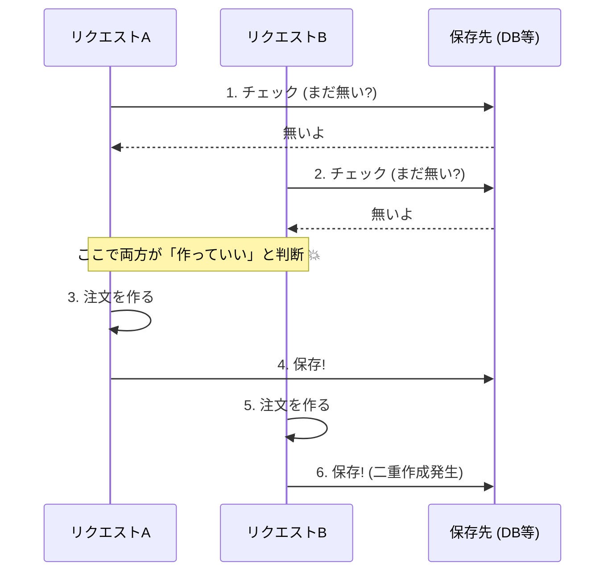

# 第17章：並行実行の地獄①（レースを理解する）🏎️💥


## この章でできるようになること 🎯✨

* 「同じリクエストが**ほぼ同時**に2つ来ると、なぜ壊れるのか」を説明できる🧠💡
* “レース（競合）”を**わざと再現**して、目で見て納得できる👀🔁
* 「チェックしてから作る（if ない→作る）」が危険な理由を体感できる⚠️

---

# 1) まず結論：並行は “普通” に起きる 😇📶

Web API は、リクエストを **1個ずつ順番に処理**してくれるとは限りません🙅‍♀️
むしろ、同時に複数来たら **同時に走る**のが基本です🏃‍♀️🏃‍♀️💨

そしてここで事故るパターンがこれ👇

> **if（まだ処理してない）→作る**
> が、同時に2回走る💥

ちなみに、いまの公式サポートの “最新世代” は .NET 10（LTS）で、2026年1月の時点でもアクティブサポート中です📌 ([Microsoft][1])
Visual Studio 2026 も 2026年1月に Stable 更新が出ています🧩 ([Microsoft Learn][2])

---

# 2) レース条件ってなに？（図でわかるやつ）🖼️🔁


たとえば「冪等キー（同じキーなら1回だけ作りたい）」のつもりで、こう書いたとします👇

* ① DB/保存先を見る（このキーもう来てる？）
* ② 来てないなら注文作る
* ③ 結果を保存する

これ、同時に2つ来るとこうなる😵‍💫



つまり、

* Aが「無い！」って判断した直後
* Bも「無い！」って判断できてしまう

この “スキマ” が **レース** です🏁💥
（専門っぽく言うと **Time Of Check / Time Of Use** の事故だよ〜、くらいでOK🙆‍♀️✨）

---

# 3) ハンズオン：レースを “わざと” 起こしてみる 🧪🔥

ここからは、**再現できる**ミニAPIを作って、事故を目で見ます👀✨
ポイントは「本来は一瞬のスキマ」を、`Task.Delay` で **広げる**こと⏳（再現しやすくするためね）

## 作るもの 🛠️

* `POST /orders`：注文作成（冪等キーっぽい処理をするけど、実は危ない）
* `GET /debug/stats`：いま何件できたか見る（事故確認用）

---

# 4) ミニAPI実装（わざと危ない版）😈🔁

`Program.cs` をこの内容にします👇（最小構成）

```csharp
using System.Collections.Concurrent;

var builder = WebApplication.CreateBuilder(args);
var app = builder.Build();

// デモなので固定URLにしておく（必要なら変更OK）
app.Urls.Add("http://localhost:5017");

// --- デモ用の “保存先” ---
// どっちもスレッドセーフな入れ物だけど、
// 「チェック → 追加」が原子的(atomic)じゃないのでレースが起きる！
var orders = new ConcurrentBag<Order>();
var idempotency = new ConcurrentBag<IdempotencyEntry>();

int orderSeq = 0;

app.MapPost("/orders", async (HttpRequest request, CreateOrderRequest body) =>
{
    // 冪等キー（ヘッダー）を受け取る
    if (!request.Headers.TryGetValue("X-Idempotency-Key", out var values))
        return Results.BadRequest(new { message = "X-Idempotency-Key header is required" });

    var key = values.ToString().Trim();
    if (string.IsNullOrWhiteSpace(key))
        return Results.BadRequest(new { message = "X-Idempotency-Key must not be empty" });

    // ① すでに処理済みかチェック
    var existing = idempotency.FirstOrDefault(x => x.Key == key);
    if (existing is not null)
    {
        // すでに処理済みなら “同じ結果” を返すつもり
        return Results.Ok(existing.Response);
    }

    // ★ わざとスキマを作る（本物の世界だとDB待ちや外部API待ちで起きる）
    await Task.Delay(200);

    // ② 注文を作る（本来はここが1回であってほしいのに…）
    var orderId = Interlocked.Increment(ref orderSeq);
    var order = new Order(
        OrderId: orderId,
        CustomerId: body.CustomerId,
        Amount: body.Amount,
        CreatedAt: DateTimeOffset.UtcNow
    );
    orders.Add(order);

    var response = new OrderResponse(
        OrderId: order.OrderId,
        Message: "Order created ✅"
    );

    // ③ 結果を保存（でもレースだと同じキーが複数入る…）
    idempotency.Add(new IdempotencyEntry(key, response));

    return Results.Created($"/orders/{order.OrderId}", response);
});

app.MapGet("/debug/stats", () =>
{
    var orderList = orders.ToArray();
    var idemList = idempotency.ToArray();

    var stats = new
    {
        OrdersCount = orderList.Length,
        IdempotencyEntriesCount = idemList.Length,
        DistinctIdempotencyKeys = idemList.Select(x => x.Key).Distinct().Count(),
        DuplicatedKeys = idemList
            .GroupBy(x => x.Key)
            .Where(g => g.Count() >= 2)
            .Select(g => new { Key = g.Key, Count = g.Count() })
            .ToArray()
    };

    return Results.Ok(stats);
});

app.Run();

record CreateOrderRequest(string CustomerId, int Amount);

record Order(int OrderId, string CustomerId, int Amount, DateTimeOffset CreatedAt);

record OrderResponse(int OrderId, string Message);

record IdempotencyEntry(string Key, OrderResponse Response);
```

---

# 5) 動かして “事故確認” 🔍💥

## 5.1 まずAPIを起動 ▶️

実行すると `http://localhost:5017` で待ち受けます🚀

## 5.2 同時リクエストを投げる「クライアント」を作る 🧨

別プロジェクト（コンソール）でOK！
同じソリューションに Console App を追加して、`Program.cs` をこう👇

```csharp
using System.Net.Http.Json;

var baseUrl = args.Length > 0 ? args[0] : "http://localhost:5017";

using var client = new HttpClient { BaseAddress = new Uri(baseUrl) };

var key = "demo-key-123"; // わざと同じキーを使う
var body = new { CustomerId = "C-001", Amount = 1200 };

// なるべく同時スタートさせるためのゲート🚪
var start = new TaskCompletionSource();

int parallel = 30; // 30回同時に投げる（多いほど事故りやすい）
var tasks = Enumerable.Range(0, parallel).Select(async i =>
{
    await start.Task;

    using var req = new HttpRequestMessage(HttpMethod.Post, "/orders");
    req.Headers.Add("X-Idempotency-Key", key);
    req.Content = JsonContent.Create(body);

    var res = await client.SendAsync(req);
    var text = await res.Content.ReadAsStringAsync();

    Console.WriteLine($"[{i:00}] {(int)res.StatusCode} {res.StatusCode} {text}");
}).ToArray();

// 一斉スタート！📣
start.SetResult();

await Task.WhenAll(tasks);

// 最後に統計を見る
var stats = await client.GetStringAsync("/debug/stats");
Console.WriteLine("\n=== /debug/stats ===");
Console.WriteLine(stats);
```

## 5.3 期待される “ヤバい結果” 😵‍💫

`/debug/stats` がこうなったら成功（＝事故再現できた）🎉💥

* `DistinctIdempotencyKeys` は **1**（キーは1種類のはず）
* でも…

  * `OrdersCount` が **2以上** 😱（注文が複数できてる）
  * `IdempotencyEntriesCount` も **2以上** 😱（同じキーの記録が複数入ってる）

---

# 6) なんでこうなるの？（やさしく分解）🧩✨

## 原因①：「チェック」と「作成」が一体化してない🔁⚠️

この2つ👇が **別行動** だからです。

* “存在チェック” をする
* その後に “作る”

この間に別リクエストが割り込める😇

## 原因②：`await` は “順番を保証しない” ⏳🌀

`await` 自体が悪者じゃないけど、待ってる間に別の処理が進むので、
「スキマ」が表面化しやすいの🥺

---

# 7) よくある勘違い（ここでハマる）🧠💣

## ❌「アプリ側で if してるから大丈夫でしょ？」

だめ🙅‍♀️
**同時に来たら if は2回通る**ことがあるから😵‍💫

## ❌「ConcurrentDictionary 使えば解決？」

入れ物が安全でも、
`ContainsKey` → `Add` が別なら、レースは残るよ⚠️
（“1手でやる” 仕組みが必要）

## ❌「ローカルで再現しない＝本番でも起きない」

本番はアクセスが集中しやすいし、複数台にもなるし、
ネットワーク遅延もあるので、起きやすさ爆上がり🔥

---

# 8) ちょい豆知識：並行って “外側” でも “内側” でもある 🌀✨

* **外側の並行**：別リクエスト同士が同時に来る（今回の話）🏎️
* **内側の並行**：1リクエスト内で `Task.WhenAll` とかで並列処理する🏃‍♀️🏃‍♀️

ASP.NET Core 公式でも、並列処理するときはリクエストデータを先にコピーしよう、みたいな注意があります📌（共有状態は危ないからね） ([Microsoft Learn][3])

---

# 9) ミニ演習（手を動かすやつ）📝✨

## 演習①：レースを “もっと起こしやすく” してみよう 😈

* `Task.Delay(200)` を `Task.Delay(800)` にして、`parallel` を 60 にしてみる
* `OrdersCount` はどうなる？📈💥

## 演習②：レースを “起こしにくく” してみよう 😇

* `Task.Delay(200)` を消してみる
* 事故は減る？（でもゼロになるとは限らない）🌀

---

# 10) 小テスト（答えはすぐ下）🎓💖

1. レース条件とは何？（一言で）✍️
2. `if (無い) → 作る` が危険なのはなぜ？⚠️
3. “スレッドセーフな入れ物” でも事故る理由は？🧺
4. ローカルで再現しないことがあるのはなぜ？🧪
5. 「この章でわかった、次に必要なもの」は何？🛡️

## 解答 ✅

1. **同時に動く処理の順番がズレて、意図しない結果になること**🏁
2. **チェックと作成が分かれていて、間に割り込めるから**🔁
3. **入れ物が安全でも、複数ステップが原子的じゃないとレースが残るから**⚠️
4. **同時性・遅延・負荷が本番ほど強くないから**🌧️
5. **“1回だけ”を強制できる強い守り（DB側の仕組みなど）**🛡️✨

（次章で「DBでガチガチに守る」方向へ進むよ〜！🚀）

---

# 11) AI活用プロンプト集 🤖✨

* 「同時に30回POSTしてレースを再現するC# Consoleコードを書いて。ヘッダーにX-Idempotency-Keyを付けて」🧪
* 「このAPIの“チェック→作成→保存”のどこがTOCTOUになるか、図解っぽく説明して」🖼️
* 「初心者向けに“入れ物がスレッドセーフでも事故る理由”をたとえ話で」🍩📦

---

## 参考（最新の公式情報）📌

* .NET 10 は LTS としてサポート表に載っていて、2026年1月時点でアクティブです ([Microsoft][1])
* Visual Studio 2026 の release history（2026年1月のStable更新） ([Microsoft Learn][2])
* ASP.NET Core の並行処理まわりのベストプラクティス ([Microsoft Learn][3])
* EF Core の並行更新（コンカレンシー）概念 ([Microsoft Learn][4])

[1]: https://dotnet.microsoft.com/en-us/platform/support/policy/dotnet-core?utm_source=chatgpt.com "NET and .NET Core official support policy"
[2]: https://learn.microsoft.com/en-us/visualstudio/releases/2026/release-history?utm_source=chatgpt.com "Visual Studio Release History"
[3]: https://learn.microsoft.com/en-us/aspnet/core/fundamentals/best-practices?view=aspnetcore-10.0&utm_source=chatgpt.com "ASP.NET Core Best Practices"
[4]: https://learn.microsoft.com/en-us/ef/core/saving/concurrency?utm_source=chatgpt.com "Handling Concurrency Conflicts - EF Core"
