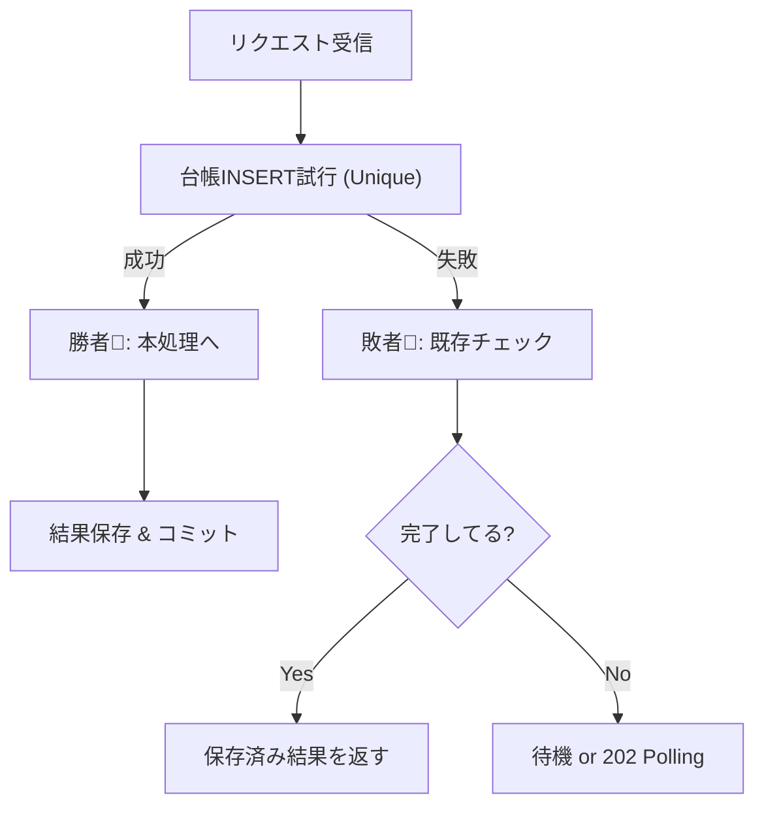

# 第18章：並行実行の地獄②（DBで守る：一意制約＋トランザクション）🛡️🗃️


## この章のゴール🎯

* **同じリクエストが“ほぼ同時に2回”来ても、DB上は1件に収束**させる✅
* そのために使う武器はこの2つ✨

  1. **一意制約（ユニーク）**＝「同じキーは1回だけ！」をDBに言わせる🔒
  2. **トランザクション**＝「途中まで反映」をゼロにする🧯

> ちなみに本日時点では、.NET 10 が LTS で、EF Core 10 も LTS です（どっちも 2025/11 リリース）。([Microsoft][1])

---

# 18.1 まず、何が“地獄”なの？😵‍💫🏎️

同じ Idempotency-Key（冪等キー）で、ほぼ同時に2リクエストが来ると…

* リクエストA：「まだ登録ないね！じゃあ作る！」
* リクエストB：「まだ登録ないね！じゃあ作る！」
* どっちも作成に成功 → **二重注文**😇💥

これが **レースコンディション（競争状態）** だよ〜⚔️

---

# 18.2 解決の基本方針🧠✨「アプリで頑張らない、DBに判定させる」


## ✅ 一意制約（Unique）ってなに？🔒

「この列（または列の組み合わせ）は、**同じ値を2個入れちゃダメ**」というDBのルールだよ🎓
EF Core でも `.IsUnique()` で作れるし、ユニークに違反したら例外が投げられるよ、って公式にも書いてあるよ。([Microsoft Learn][2])

## ✅ トランザクションってなに？🧯

「AもBもCも全部成功したら反映。どれか失敗したら全部なかったことにする」っていう**まとめ買いレシート**みたいな仕組み🧾✨
EF Core は `BeginTransaction()` で使えるし、SaveChanges の中での挙動（セーブポイント等）も公式に説明があるよ。([Microsoft Learn][3])

---

# 18.3 目標の完成形イメージ（図解）🗺️✨

同じキーで並行実行が来たらこうする👇

1. まず **IdempotencyRequests に「このキーは処理中！」をINSERT**（ユニークで守る）
2. INSERTできた人だけが「注文作成」へ進む
3. 成功したら **結果（レスポンス）を保存して COMMIT**
4. 後から来た人は INSERT がユニーク違反で落ちる → **DBにある結果を読んで同じレスポンスを返す**

---

# 18.4 テーブル設計（最低限）🧾🛠️


## IdempotencyRequests（冪等キーの台帳）📒

* `ClientId`（誰のリクエスト？アプリが単一なら固定でもOK）
* `Key`（Idempotency-Key）
* `Status`（InProgress / Completed / Failed）
* `ResponseBody`（成功したときのレスポンスJSON文字列）
* `CreatedAt` / `CompletedAt`
* **ユニーク制約： (ClientId, Key)** ← ここが心臓🫀

## Orders（注文）🛒

* `OrderId`（Guid）
* `UserId`
* `Total`
* `CreatedAt`

---

# 18.5 EF Core でユニーク制約を貼る（コード）🔧✨

```csharp
using Microsoft.EntityFrameworkCore;

public sealed class AppDbContext : DbContext
{
    public DbSet<Order> Orders => Set<Order>();
    public DbSet<IdempotencyRequest> IdempotencyRequests => Set<IdempotencyRequest>();

    public AppDbContext(DbContextOptions<AppDbContext> options) : base(options) { }

    protected override void OnModelCreating(ModelBuilder modelBuilder)
    {
        modelBuilder.Entity<IdempotencyRequest>()
            .HasIndex(x => new { x.ClientId, x.Key })
            .IsUnique(); // ← これで「同じキーは1件だけ」🔒

        base.OnModelCreating(modelBuilder);
    }
}

public sealed class Order
{
    public Guid OrderId { get; set; } = Guid.NewGuid();
    public string UserId { get; set; } = "";
    public int Total { get; set; }
    public DateTimeOffset CreatedAt { get; set; } = DateTimeOffset.UtcNow;
}

public sealed class IdempotencyRequest
{
    public long Id { get; set; }
    public string ClientId { get; set; } = "default";
    public string Key { get; set; } = "";
    public string Status { get; set; } = "InProgress";
    public string? ResponseBody { get; set; }
    public DateTimeOffset CreatedAt { get; set; } = DateTimeOffset.UtcNow;
    public DateTimeOffset? CompletedAt { get; set; }
}
```

> 「ユニークにすると、同じ値を2回INSERTしようとしたら例外になるよ」って公式も明言してるよ。([Microsoft Learn][2])

---

# 18.6 実装の本体：ユニーク違反で“勝敗”を決める🏁✨

やりたいことはこれ👇

* 1つ目の並行リクエストだけが INSERT に成功 → **勝者**👑
* 2つ目以降はユニーク違反 → **敗者**（でも結果を返す役）🙂




---
```csharp
using System.Data.Common;
using Microsoft.Data.SqlClient;
using Microsoft.EntityFrameworkCore;

public sealed class OrderService
{
    private readonly AppDbContext _db;

    public OrderService(AppDbContext db) => _db = db;

    public async Task<(int statusCode, object body)> CreateOrderIdempotentAsync(
        string clientId,
        string idempotencyKey,
        string userId,
        int total,
        CancellationToken ct)
    {
        // ここから全部まとめて「成功したら反映、失敗したらゼロ」にする🧯
        await using var tx = await _db.Database.BeginTransactionAsync(ct);

        try
        {
            // ① まず冪等台帳に「処理中」を登録（ユニークで並行を裁く）🔒
            var ticket = new IdempotencyRequest
            {
                ClientId = clientId,
                Key = idempotencyKey,
                Status = "InProgress",
                CreatedAt = DateTimeOffset.UtcNow
            };

            _db.IdempotencyRequests.Add(ticket);
            await _db.SaveChangesAsync(ct); // ← ここで並行だとユニーク違反が起きる！

            // ② 勝者だけが注文作成に進む👑
            var order = new Order { UserId = userId, Total = total };
            _db.Orders.Add(order);
            await _db.SaveChangesAsync(ct);

            // ③ 成功結果を台帳に保存（次のリトライに同じ結果を返すため）📮
            var response = new { orderId = order.OrderId, userId, total };

            ticket.Status = "Completed";
            ticket.ResponseBody = System.Text.Json.JsonSerializer.Serialize(response);
            ticket.CompletedAt = DateTimeOffset.UtcNow;

            await _db.SaveChangesAsync(ct);

            // ④ ここまで全部成功したらコミット✅
            await tx.CommitAsync(ct);

            return (200, response);
        }
        catch (DbUpdateException ex) when (IsUniqueViolation(ex))
        {
            // ユニーク違反＝「先に誰かが同じキーを登録した」って意味✨
            await tx.RollbackAsync(ct);

            var existing = await _db.IdempotencyRequests
                .AsNoTracking()
                .SingleAsync(x => x.ClientId == clientId && x.Key == idempotencyKey, ct);

            if (existing.Status == "Completed" && existing.ResponseBody is { Length: > 0 })
            {
                var body = System.Text.Json.JsonSerializer.Deserialize<object>(existing.ResponseBody)!;
                return (200, body); // ✅ “同じキーなら同じ成功レスポンス”
            }

            // まだ処理中だった場合（相手がコミット前とか）🌀
            // → 202 で「後で取りに来てね」でも、409 で「今は無理」でもOK
            return (202, new { message = "processing", idempotencyKey });
        }
    }

    private static bool IsUniqueViolation(DbUpdateException ex)
    {
        // SQL Server のユニーク系は代表的に 2601（unique index）と 2627（unique constraint）📌
        // ※DBが違うとコードも変わるよ
        var sqlEx = ex.InnerException as SqlException
                    ?? ex.GetBaseException() as SqlException;

        return sqlEx is not null && (sqlEx.Number == 2601 || sqlEx.Number == 2627);
    }
}
```

## 2601 と 2627 って何？🔢

* **2601**：ユニークインデックス違反（Cannot insert duplicate key row…）([Microsoft Learn][4])
* **2627**：ユニーク制約/主キー等の違反（Violation of … constraint… Cannot insert duplicate key…）([Microsoft Learn][5])

---

# 18.7 ここが超大事ポイント3つ🧠🧡


## ① 「先に台帳INSERT」→「本処理」→「結果保存」 の順番🪄

この順番にすると、並行の勝敗が最初の INSERT で確定するのが強い💪

## ② “結果”を保存するから、敗者も正しく返せる📮

「同じキー → 同じ結果」が成立する✨
（レスポンス保存のサイズ・個人情報には注意⚠️）

## ③ トランザクションで「中途半端」を消す🧯

途中で落ちたら全部ロールバックして、変な状態を残さない✅

---

# 18.8 例外まわりの注意（EF Coreの豆知識）🫘

EF Core は、トランザクション中に `SaveChanges` が呼ばれると、状況によってセーブポイントを作ったりするよ。([Microsoft Learn][3])
ただし SQL Server の MARS（Multiple Active Result Sets）が有効だと、セーブポイント周りが相性悪くて「トランザクション状態が不明になる可能性」がある、って注意もあるよ⚠️([Microsoft Learn][3])

（ふつうのWeb APIなら MARS をわざわざONにしないことが多いよ🙂）

---

# 18.9 “並行でも1件”を確認するミニ演習🧪🔁


## ✅ やること

* 同じ `Idempotency-Key` を付けて、同時に10〜50回 POST する
* 結果：

  * `Orders` は **1件だけ** ✅
  * 返ってくるレスポンスの `orderId` が **全部同じ** ✅

## PowerShell で雑に並列POST（例）⚡

```powershell
$uri = "http://localhost:5000/orders"
$key = "demo-key-123"

1..20 | ForEach-Object {
  Start-Job -ScriptBlock {
    param($uri, $key)
    curl -s -X POST $uri `
      -H "Content-Type: application/json" `
      -H "Idempotency-Key: $key" `
      -d '{"userId":"u1","total":1200}'
  } -ArgumentList $uri, $key
} | Out-Null

Get-Job | Wait-Job | Receive-Job
```

---

# 18.10 よくある失敗あるある😇💥（回避策つき）


* **ユニーク制約が無い**
  → “同時に2回”で普通に2件入る。まず貼ろう🔒

* **ユニーク違反を 500 で返す**
  → 実は正常系（「先に誰かが処理した」）なので、**既存結果を返す**のが優しい😊

* **台帳のINSERTより先に注文を作る**
  → 競争が“注文側”で起きて事故りやすい💥
  → まず台帳で勝敗を決めよう🏁

* **台帳が InProgress のまま残る**
  → タイムアウト/例外で取り残し。
  → 次章（TTLやお掃除）でちゃんと片付ける🧹⏳

---

# 18.11 AI活用（Copilot / Codex）🤖✨

## そのまま投げてOKプロンプト例💬

* 「EF Core で (ClientId, IdempotencyKey) に一意インデックスを貼る Entity と Fluent API を作って」
* 「DbUpdateException から SQL Server の 2601/2627 を検出するヘルパーを書いて」
* 「同じ Idempotency-Key が並列で来たとき、成功レスポンスを再利用して返す設計に直して」

## AIの出力をチェックする観点🔍

* “勝者だけが本処理”になってる？
* “敗者が結果を返す”導線がある？
* トランザクション境界が雑に広すぎない？（無駄にロックが伸びる）

---

# 18.12 小テスト（3問）📝✨

1. 並行実行で二重作成が起きる一番の理由は？🏎️
2. 一意制約＋トランザクションの役割を1行ずつで言ってみて🙂
3. ユニーク違反（2601/2627）が起きたとき、500を返すより良い返し方は？📮

---

# まとめ🎀

* **並行実行の冪等性は「DBが審判」**が最強🛡️
* **一意制約で“同じキーは1件”を保証**し、**トランザクションで中途半端を消す**🧯
* ユニーク違反は“異常”じゃなくて、**並行の自然な結果**。既存結果を返してあげよう😊

[1]: https://dotnet.microsoft.com/en-us/platform/support/policy/dotnet-core ".NET and .NET Core official support policy | .NET"
[2]: https://learn.microsoft.com/en-us/ef/core/modeling/indexes "Indexes - EF Core | Microsoft Learn"
[3]: https://learn.microsoft.com/en-us/ef/core/saving/transactions "Transactions - EF Core | Microsoft Learn"
[4]: https://learn.microsoft.com/en-us/sql/relational-databases/replication/mssql-eng002601?view=sql-server-ver17 "MSSQL_ENG002601 - SQL Server | Microsoft Learn"
[5]: https://learn.microsoft.com/en-us/sql/relational-databases/replication/mssql-eng002627?view=sql-server-ver17 "MSSQL_ENG002627 - SQL Server | Microsoft Learn"
