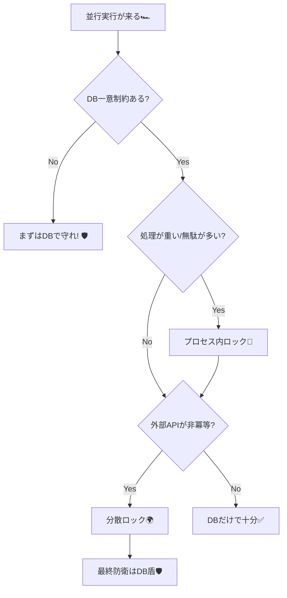

# 第19章：並行実行の地獄③（アプリ側のロックと判断基準）🔒


## この章のゴール🎯✨

この章を読み終えると…

* 「アプリ側ロックって何のため？」が説明できる😊
* 「プロセス内ロックはどこまで有効？」が判断できる🧠
* 「分散ロックが必要な条件」を言語化できる✅
* C#で **“キー単位のロック”** を実装して、事故を減らせる🔑🔒

---

# 19-1. まず前提：ロックは“冪等性の主役”じゃない🧯😇

並行実行の事故（同時に2回走る・二重作成など）を止めたくなると、つい「ロックしたら全部解決では？」と思いがちです🤔

でも実務ではこう考えるのが安全です👇

* ロック＝**事故を減らすための“交通整理”** 🚦
* 冪等性（DB一意制約・冪等キー保存など）＝**最後の砦** 🛡️

特に分散環境（APIが複数台）では、ロックは“簡単そうで難しい”ジャンルです🌀
Redisの分散ロック（Redlockなど）も公式に紹介されていますが、「安全性の議論が難しい」として批判・注意点も広く知られています。([Redis][1])

---

# 19-2. ロックは2種類あるよ🔒（プロセス内 / 分散）


## A) プロセス内ロック（アプリ1台の中だけ）🧩

* `lock` / `SemaphoreSlim` / `.NET 9+ の System.Threading.Lock` など
* **1台の中では超強い**💪
* でも **アプリが2台以上になると効かない**😵（別マシンのスレッドは止められない）

`.NET 9/10` には `System.Threading.Lock` が追加されています。([Microsoft Learn][2])
また、`.NET 10` は 2025-11-11 に開始（LTS）として扱われます。([Microsoft Learn][3])

## B) 分散ロック（アプリが複数台でも効かせたい）🌍

* DBを使う（SQL Serverのアプリロック / PostgreSQLのアドバイザリロックなど）🗃️
* Redisを使う（SET NX PX、Redlockなど）⚡

---

# 19-3. いつ「アプリ側ロック」を使うの？判断の型🧠✨

## ✅ ロックが“効く”場面（おすすめ）👍

**ロックで「無駄な並行」を減らすと嬉しいケース**です。

* 同じユーザーの同じ操作が短時間に集中する（連打・リトライ）🔁📶
* “同じキーの処理”が重い（画像生成、請求計算、在庫引当など）🐘
* 外部APIが非冪等で、**同時に2回叩くと致命傷**になりやすい（決済・発送など）💳🚚

> ただし！
# > ロックで守っても、最後は **DB一意制約＋冪等キー保存** で止める（第18章の守り）を残すのが安全🛡️✨

## ❌ ロックに寄せすぎると危ない場面（注意）⚠️

* ロックが取れないと処理が詰まって全体が遅くなる（スループット低下）🐌
* ロック解放漏れ・タイムアウトの設計ミスで“詰み”が起きる😱
* 分散ロックに強い保証を期待しすぎる（現実は難しい）🌀([マーチン・クレップマンのウェブサイト][4])

---

## 19-4. まずは「プロセス内ロック」から（1台なら最強）🧩🔒


### 19-4-1. “キー単位ロック”が一番使う💡

「注文IDごと」「ユーザーIDごと」「冪等キーごと」にロックを分けると、全体が詰まりません😊

イメージ👇

* ✅ 同じ `IdempotencyKey` 同士だけ止める
* ✅ 違うキーは並行でOK（速い）⚡

---

## 19-5. ハンズオン①：C#で “IdempotencyKeyごと” にロックする🔑🔒🧪


### 例：`IdempotencyKey` ごとに `SemaphoreSlim` を使う（定番）✨

```csharp
using System.Collections.Concurrent;

public sealed class KeyedLocker
{
    private readonly ConcurrentDictionary<string, SemaphoreSlim> _locks = new();

    public async Task<IDisposable> LockAsync(string key, CancellationToken ct)
    {
        // 1キーにつき1つのセマフォを作る
        var sem = _locks.GetOrAdd(key, _ => new SemaphoreSlim(1, 1));

        await sem.WaitAsync(ct);

        return new Releaser(key, sem, _locks);
    }

    private sealed class Releaser : IDisposable
    {
        private readonly string _key;
        private readonly SemaphoreSlim _sem;
        private readonly ConcurrentDictionary<string, SemaphoreSlim> _dict;
        private int _disposed;

        public Releaser(string key, SemaphoreSlim sem, ConcurrentDictionary<string, SemaphoreSlim> dict)
        {
            _key = key;
            _sem = sem;
            _dict = dict;
        }

        public void Dispose()
        {
            if (Interlocked.Exchange(ref _disposed, 1) == 1) return;

            _sem.Release();

            // ⚠️ ずっと増え続けるのを防ぐための“掃除”
            // ただし、取り方を雑にすると競合するので慎重に！
            if (_sem.CurrentCount == 1)
            {
                _dict.TryRemove(_key, out _);
            }
        }
    }
}
```

### Web API側の使い方（疑似コード）🌸

```csharp
public async Task<IResult> CreateOrderAsync(
    CreateOrderRequest req,
    [FromHeader(Name = "Idempotency-Key")] string idemKey,
    KeyedLocker locker,
    CancellationToken ct)
{
    // ✅ 同じIdempotency-Keyが同時に来たら、ここで1本にする
    await using var _ = await locker.LockAsync(idemKey, ct);

    // ここから先は第18章の「DB一意制約＋結果再利用」で最終防衛🛡️
    // 例: IdempotencyRequests テーブルで "INSERT" → 失敗なら既存結果返す
    ...
}
```

### ここが大事ポイント💎

* `await using var _ = ...` の形にして **例外でも確実に解放** ✅
* ロックは **“同時に来た2本を整列させる”だけ** 🚦
* 本当に守るのは **DB**（一意制約・トランザクション）🛡️

---

## 19-6. でも…アプリが複数台なら？（プロセス内ロックの限界）😵‍💫

ロードバランサ配下で API が2台以上だと…

* サーバーAのロックは、サーバーBには届かない🙅‍♀️
* 結果：**同じキーがAとBで同時に走る**💥

なので分散環境では基本方針はこれ👇

### ✅ まずDBで収束させる（第18章の守り）🗃️🛡️

* 一意制約（`IdempotencyKey` など）
* トランザクション
* 例外が出たら「既存結果を返す」

### ✅ それでも必要なら “分散ロック” を足す🔒🌍

（外部APIが非冪等で、同時二重実行が本当に危険、など）

---

## 19-7. 分散ロックの代表：DBの“アプリロック”系🗃️🔒

### 19-7-1. SQL Server：`sp_getapplock`（超定番）🧱

SQL Serverには、アプリが任意の名前でロックできる仕組みがあります。([Microsoft Learn][5])

* ロック名（例：`"idem:xxxx"`）を指定して取得
* DBセッション（またはトランザクション）に紐づく
* **複数台でも効く**（DBが共有だから）✨

👉 ざっくりの使い方（考え方）

1. トランザクション開始
2. `sp_getapplock` で `"idem:{key}"` をロック
3. 重要処理
4. commit（または解放）

※ 実コードは使うDBドライバ/EF Core構成で変わるので、ここでは“型”を覚えるのが目的だよ😊

### 19-7-2. PostgreSQL：アドバイザリロック（`pg_advisory_lock`）🧩

PostgreSQLには “アプリ側で使うロック” があり、セッションレベル/トランザクションレベルが存在します。([PostgreSQL][6])

* セッションレベル：解放忘れが怖い😱（セッション切れるまで残る）
* トランザクションレベル：commit/rollbackで自然に解放されやすい✅（扱いやすい）

---

## 19-8. 分散ロックの代表：Redis系（便利だけど注意点多め）⚡🧠


Redis公式は分散ロック（Redlock含む）を紹介しています。([Redis][1])
一方で、分散ロックの安全性・失敗時の振る舞いは難しく、注意喚起も有名です。([マーチン・クレップマンのウェブサイト][4])

### Redisロックで“最低限”押さえること📝

* TTL（有効期限）を必ず付ける⏳
* ロック解除は **自分のトークン一致** でやる（他人のロックを消さない）🪪
* TTLが短すぎると「処理中に期限切れ→別インスタンスが入る」事故💥
* 長すぎると「詰まり」が長引く🐌

結論としては👇

* Redisロックは“便利枠”だけど、**安全の本命にしない**
* 本当に守るのは **冪等キー保存＋DB制約** 🛡️✨

---

## 19-9. 判断基準まとめ：これだけ覚えれば勝てる🏆🔒

### ✅ 判断フローチャート（超実務）🧭




### ✅ 判断フローチャート（超実務）🧭

1. **最終的にDBで一意に収束できる？**

   * YES → まずDB（第18章）🛡️
   * NO → 外部API/ファイル/メール送信などが絡む？次へ

2. **同時二重実行が“致命傷”になる？**（決済・発送・返金など）💳🚚

   * YES → 分散ロック検討🔒🌍
   * NO → ロックは“最適化”として必要なら（詰まり注意）🚦

3. 分散ロックを入れるならどれ？

   * **DBが中心のシステム** → DBロック（SQL Server `sp_getapplock` / Postgres advisory）🗃️
   * **キャッシュ/Redisが中核** → Redisロック（設計と運用をちゃんと）⚡

---

## 19-10. よくある事故パターン集（ここ試験出る📛）😇


* ロック粒度がデカすぎて、全部が順番待ち🐌（例：全注文で1ロック）
* ロック順序がバラバラでデッドロック🔁💥
* 例外時に解放されずロックが残る😱（`finally` / `using` が命）
* 分散ロックのTTL設計ミスで二重侵入💥
* 「ロックしたから安心！」でDB一意制約を外す（最悪）🧨

---

## 19-11. ミニ演習📝✨（手を動かす）

### 演習1：キー単位ロックを入れてみよう🔑🔒

* `Idempotency-Key` が同じリクエストを **同時に10本** 投げるテストを書いてみよう🧪
* 期待：DBへの「作成」が1回だけになる✅

ヒント：`Task.WhenAll()` で同時実行すると再現しやすいよ🏎️💨

### 演習2：ロック粒度を調整してみよう⚙️

* ユーザーID単位ロック
* 注文ID単位ロック
* 冪等キー単位ロック
  それぞれのメリデメを1行でまとめよう📝

---

## 19-12. 小テスト（サクッと確認）🧠✅

1. プロセス内ロックが複数台で効かない理由は？
2. ロックが“最終防衛”になりにくい理由は？
3. 「ロックは交通整理、最後の砦はDB」と言えるのはなぜ？
4. キー単位ロックが全体ロックより良いことが多いのはなぜ？
5. `using` / `finally` がロックで重要な理由は？
6. 分散ロックを入れる判断の第一問は何？
7. SQL Serverの `sp_getapplock` は何をロックする？([Microsoft Learn][7])
8. PostgreSQLのアドバイザリロックにセッション/トランザクションの違いがあるのはなぜ注意？([PostgreSQL][6])
9. RedisロックでTTLが短すぎると何が起きる？
10. 「ロックを入れたからDB一意制約を外してOK」…これがダメな理由は？

---

## 19-13. AI活用🤖💡（時短のコツ）

* 「キー単位ロックを `SemaphoreSlim` で実装して。例外でも解放される形で」
* 「このコード、デッドロックの可能性ある？ロック順序の観点でレビューして」
* 「負荷テスト（同時10/100）をC#で書いて。期待値も」
* 「分散ロックが必要かどうか、判断質問リストを作って（Yes/No形式）」

---

[1]: https://redis.io/docs/latest/develop/clients/patterns/distributed-locks/?utm_source=chatgpt.com "Distributed Locks with Redis | Docs"
[2]: https://learn.microsoft.com/en-us/dotnet/api/system.threading.lock?view=net-10.0&utm_source=chatgpt.com "Lock Class (System.Threading)"
[3]: https://learn.microsoft.com/ja-jp/lifecycle/products/microsoft-net-and-net-core?utm_source=chatgpt.com "Microsoft .NET および .NET Core - Microsoft Lifecycle"
[4]: https://martin.kleppmann.com/2016/02/08/how-to-do-distributed-locking.html?utm_source=chatgpt.com "How to do distributed locking"
[5]: https://learn.microsoft.com/ja-jp/sql/relational-databases/system-stored-procedures/sp-getapplock-transact-sql?view=sql-server-ver17&utm_source=chatgpt.com "sp_getapplock(Transact-SQL) - SQL Server"
[6]: https://www.postgresql.org/docs/current/explicit-locking.html?utm_source=chatgpt.com "Documentation: 18: 13.3. Explicit Locking"
[7]: https://learn.microsoft.com/en-us/sql/relational-databases/system-stored-procedures/sp-getapplock-transact-sql?view=sql-server-ver17&utm_source=chatgpt.com "sp_getapplock (Transact-SQL) - SQL Server"
