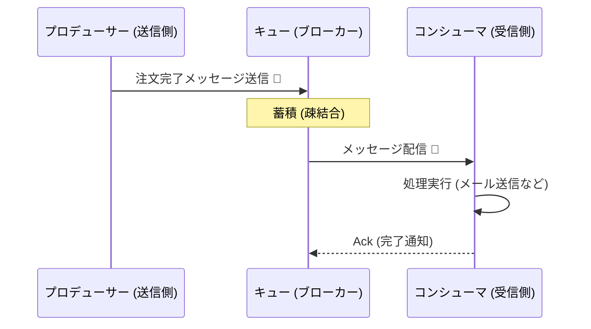
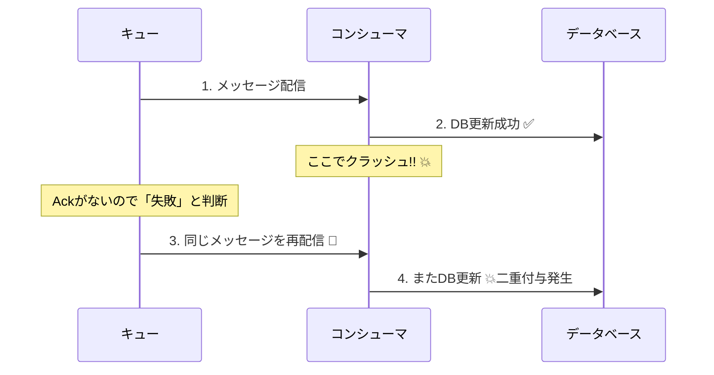

# 第20章：非同期の冪等性①（キューは重複が普通）📬🌧️


## この章でできるようになること✅✨

* 非同期（キュー/メッセージング）で **「重複が起きるのが普通」** を説明できるようになる📩🔁
* **At-least-once / At-most-once /（実質）Exactly-once** の違いをざっくり掴む🧠
* 「重複して届いても壊れない」コンシューマ側の考え方（冪等設計の方向性）を持てる🛡️
* 重複・順序入れ替わり・遅延が起きる前提で、事故を予防する観点を身につける👀✨

---

## 20.1 非同期ってなに？（同期との違い）⏳📨

* ワーカー（コンシューマ） → 空いたタイミングで拾って処理する👷‍♀️



この仕組みの良いところは、混雑しても落ちにくい・疎結合になること🎉
でも注意点がひとつ…

👉 **キューは便利だけど「1回だけ届く」とは限らない** 😇
Azure Service Bus みたいな代表的なメッセージブローカーでも、信頼性の仕組みとして **at-least-once（少なくとも1回）** を前提にするよ、という説明があるよ📬🛡️ ([Microsoft Learn][1])

---

## 20.2 まず覚える3つの前提（非同期の世界の常識）🌪️📦

### 前提①：重複は起きる（At-least-once）🔁

「少なくとも1回」＝ **2回以上届くこともある** って意味💡
たとえば Amazon SQS の Standard Queue は、**少なくとも1回配信**で、状況によっては **重複する**ので冪等に作ってね、とはっきり書いてあるよ📌 ([AWS ドキュメント][2])

RabbitMQ でも、Ack（確認応答）を使うと **at-least-once** になるよ、という説明があるよ🐰📩 ([RabbitMQ][3])

### 前提②：順番はズレる（入れ替わり）🧵↔️

* 再配信（redelivery）が入ると順番が変わることがある
  RabbitMQ のドキュメントでも、redelivery で順序が変わり得る説明があるよ🔀 ([RabbitMQ][4])

### 前提③：遅れて届く（遅延）🐢

* 一時的な障害・リトライ・ロック待ちで、あとから出てくることがある
  「え、今さら！？」が普通に起きる😂

---

## 20.3 なぜ重複が起きるの？（あるある3パターン）😵‍💫🔁


### パターンA：処理は成功したのに、Ack前に落ちた💥

1. メッセージ受け取る
2. DB更新や外部送信まで完了✅
3. Ack（完了通知）を返す前にプロセスが落ちる💀
4. ブローカー「完了通知ない＝失敗かも！再配信するね」🔁

これが **「成功したのに再実行」** の代表例🌀

### パターンB：ロック（可視性タイムアウト）が切れた🔒⏳

Azure Service Bus みたいに **Peek-Lock** 系の仕組みでは、受け取ったメッセージにロックがかかるよね。
でも処理が長引いたり、止まったりすると…ロックが切れて **別の受信者に再び配られる** ことがある📨💦
「クライアントが止まると、ロック期限後に再び利用可能になる」みたいな説明があるよ📌 ([Microsoft Learn][5])

### パターンC：ネットワークや一時障害で「届いたか分からない」📶❓

* 受け取る側：受信できたか不明 → 再取得
  結果、**同じ内容が複数回流れる** 😇



---

## 20.4 「キューは信頼していい」けど「1回しか来ない」は信じない🙅‍♀️📬

ここ、超大事ポイント🎯

* キューは「落とさないように頑張る」ために **再配信**する
* だからこそ、コンシューマ側は
  ✅ **同じメッセージが2回来てもOK**
  ✅ **順番が変でも破綻しない**
  この設計が必要になるよ🛡️✨

---

## 20.5 事故例：冪等じゃないとこうなる💥😱

### 例1：メール二重送信📧📧

「注文完了メール送信」メッセージが重複配信
→ お客さんに同じメールが2通
→ 信頼が削れる🥲

### 例2：ポイント二重付与🎁🎁

`AddPoint(+100)` が2回走る
→ 100ptのつもりが200pt
→ 経理が泣く😭

### 例3：外部決済を二重で叩く💳💥

決済APIが2回呼ばれる
→ 二重課金（最悪）😇

---

## 20.6 冪等にする場所は基本「受け手（コンシューマ）」✅👷‍♀️

非同期では、**メッセージが重複するのは自然現象**。
だから設計の基本はこう👇

* 送信側で完璧に重複ゼロにするのは難しい（できても限界がある）
* 受信側（コンシューマ）が **「重複前提で安全」** にするのが王道🔁🛡️

---

## 20.7 コンシューマ冪等の作り方（この章の地図🗺️✨）

この章では「方向性」を掴むよ（実装の完成は次章でガッツリ）📘➡️📗

### 方式①：自然冪等（“指定状態にする”）✍️

* ❌ `AddPoint(+100)`
* ✅ `SetPoint(現在のポイント=1000)` みたいに
  「増やす」より「この状態にする」へ

### 方式②：処理済み記録（Inbox / Processed）🧾✅

* MessageId（または業務キー）を保存
* すでに処理済みなら **何もしない** or **同じ結果を返す**

### 方式③：副作用は「一意に」扱う（外部送信を守る）📤🛡️

* メール送信・外部API呼び出しは
  「送ったこと」を保存して、二度目はスキップ
* DBの **一意制約** が効くと最強💪

---

## 20.8 実装イメージ（C#）🧩🔁

### 🎯ゴール（最低ライン）

**同じ MessageId が2回来ても、DBや外部送信が2回起きない** ✅

まずは「概念を掴む用」に、インメモリ版で雰囲気を見るよ（DB版は次章で強化）🌱

```csharp
public record MessageEnvelope(
    string MessageId,     // これが「重複判定の鍵」🔑
    string MessageType,
    string Body,
    DateTimeOffset EnqueuedAt,
    string? CorrelationId
);

public interface IProcessedStore
{
    // 初めて見たMessageIdならtrue、すでに処理済みならfalse
    bool TryMarkProcessed(string messageId);
}

// 学習用：インメモリ（本番はDB推奨！）
public class InMemoryProcessedStore : IProcessedStore
{
    private readonly System.Collections.Concurrent.ConcurrentDictionary<string, byte> _done = new();

    public bool TryMarkProcessed(string messageId)
        => _done.TryAdd(messageId, 1);
}

public class OrderEmailConsumer
{
    private readonly IProcessedStore _processed;

    public OrderEmailConsumer(IProcessedStore processed)
        => _processed = processed;

    public async Task HandleAsync(MessageEnvelope msg, CancellationToken ct)
    {
        // ✅ ここが「重複に勝つ」コア！
        if (!_processed.TryMarkProcessed(msg.MessageId))
        {
            // すでに処理済みならスキップ（＝冪等）🎉
            return;
        }

        // ここから先は「1回だけ通したい副作用」👇
        // 例：メール送信、DB更新、外部API呼び出しなど
        await SendEmailAsync(msg.Body, ct);
    }

    private static Task SendEmailAsync(string body, CancellationToken ct)
    {
        // ここはダミー（実務ではSMTP/外部通知など）
        Console.WriteLine($"Send Email: {body}");
        return Task.CompletedTask;
    }
}
```

⚠️これは“学習用の最低ライン”。本番では、プロセス再起動で消えるから **DBで処理済み記録**にするのが基本だよ🗃️✨（次章でやるよ）

---

## 20.9 「順序」もズレるよ（入れ替わり対策の考え方）🧵🌀

### 1) 「順番が大事」な業務は、順序が崩れる前提で守る🛡️

たとえば

* 「支払い確定 → メール送信」の順番が崩れると事故る💥

Azure Service Bus でも、パーティションなどの都合で **順序保証に制約がある**（特定の範囲での保証）という説明があるよ📌 ([Microsoft Learn][1])

順序を守りたいなら「セッション」みたいな仕組みを使う設計もあるよ（Service Bus Sessions）📬🧩 ([Microsoft Learn][6])

### 2) FIFOキューでも「コンシューマが落ちたら再処理」は起きる😇

SQS の FIFO は重複を避ける仕組みが強めで、**重複排除（dedup）** によって「重複が入りにくい」設計ができるよ📌 ([AWS ドキュメント][7])
ただし “処理” が1回になるかは別問題（処理側が落ちたら再実行は起こり得る）なので、結局 **冪等は必要** になることが多いよ🔁

---

## 20.10 キュー側の「重複排除機能」ってどうなの？🧯✨

便利！でも “万能ではない” って理解が大事😊

### Azure Service Bus：Duplicate Detection 🔍

Service Bus には **重複検出（Duplicate Detection）** があって、同じ MessageId を一定期間の履歴で弾く仕組みがあるよ🛡️ ([Microsoft Learn][8])

ただしこれも

* 期間（保持ウィンドウ）がある
* MessageId設計が前提
  なので、アプリ側の冪等設計とセットで考えるのが安心だよ🔁

---

## 20.11 “わざと重複” させるテストアイデア🧪🔁

現場で強いのは「事故を再現できる人」💪✨

### テスト案A：同じMessageIdを2回流す📩📩

* まったく同じ MessageId を2回 enqueue
* コンシューマが1回分しか副作用を起こさないか確認✅

### テスト案B：処理中にコンシューマを落とす💀

* 途中でプロセス停止（デバッグで強制終了でもOK）
* 再起動後に “同じ仕事がもう1回” 走っても壊れないか確認🔁

### テスト案C：順序を入れ替えて投げる🔀

* 「後のイベント」を先に流す
* 状態遷移ガード（第18〜19章の考え方）が効くかを見る🚦

---

## 20.12 ミニ演習📝🌸

1. 非同期で起きがちな事故を3つ書いてみよう💥
   （例：二重メール、二重課金、ポイント二重付与…）

2. “冪等にしやすい形” に言い換えてみよう✍️

* `AddXxx` を `SetXxx` に寄せられない？

3. 学習用コードでOKなので、同じ MessageId を2回呼んでも
   `SendEmailAsync` が1回しか動かないようにしてみよう✅

---

## 20.13 AI活用🤖✨（コピペで使える）

* 「メッセージキューで重複が起きる原因を、タイムライン図で3パターン説明して」📈
* 「この処理を“自然冪等”に寄せる設計案を2つ出して」🧠
* 「MessageId設計の落とし穴を初心者向けに5つ」🕳️
* 「重複・順序入れ替わり・遅延を再現するテストケースを10個考えて」🧪

---

## 20.14 小テスト🎓🧠

### Q1：At-least-onceって何？🔁

A. 絶対に1回だけ届く
B. 1回は届くが、2回以上届くこともある
C. 届かないことがある

### Q2：重複が起きる代表原因はどれ？（複数OK）💥

A. Ack前にコンシューマが落ちる
B. ロック（可視性タイムアウト）が切れる
C. キューは必ずExactly-onceだから起きない

### Q3：冪等設計の基本方針として一番安全なのは？🛡️

A. 送信側だけで重複ゼロにする
B. 受信側（コンシューマ）を重複前提で安全にする
C. 祈る🙏

---

### 解答✅✨

* Q1：B
* Q2：AとB
* Q3：B

---

## まとめ🧾✨

* 非同期（キュー）の世界は **重複・順序ズレ・遅延が普通** 📬🌧️
* ブローカーが **at-least-once** を採用するのは「落とさないため」🛡️ ([Microsoft Learn][1])
* だからコンシューマは **同じメッセージ2回でも壊れない** 形にするのが王道🔁✅
* 実装の核は「処理済み記録」や「指定状態にする」などで、副作用を1回に収束させること🎯

[1]: https://learn.microsoft.com/en-us/azure/reliability/reliability-service-bus "Reliability in Azure Service Bus | Microsoft Learn"
[2]: https://docs.aws.amazon.com/AWSSimpleQueueService/latest/SQSDeveloperGuide/sqs-queue-types.html?utm_source=chatgpt.com "Amazon SQS queue types - Amazon Simple Queue Service"
[3]: https://www.rabbitmq.com/docs/reliability?utm_source=chatgpt.com "Reliability Guide"
[4]: https://www.rabbitmq.com/docs/queues?utm_source=chatgpt.com "Queues"
[5]: https://learn.microsoft.com/en-us/azure/service-bus-messaging/message-transfers-locks-settlement?utm_source=chatgpt.com "Message transfers, locks, and settlement - Azure Service Bus"
[6]: https://learn.microsoft.com/en-us/azure/service-bus-messaging/message-sessions?utm_source=chatgpt.com "Azure Service Bus message sessions"
[7]: https://docs.aws.amazon.com/AWSSimpleQueueService/latest/SQSDeveloperGuide/FIFO-queues-exactly-once-processing.html?utm_source=chatgpt.com "Exactly-once processing in Amazon SQS"
[8]: https://learn.microsoft.com/en-us/azure/service-bus-messaging/duplicate-detection?utm_source=chatgpt.com "Azure Service Bus duplicate message detection"
