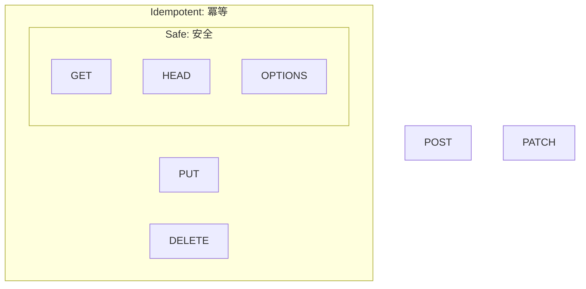

# 第06章：部：非同期・イベント・Outbox（21〜22章）📮🌀📤

## 6.0 この章のゴール🎯✨

* 「Safe（安全）」と「Idempotent（冪等）」を**言葉で説明**できる🙂🗣️
* HTTPメソッド（GET/POST/PUT/DELETE…）を見て、**だいたい分類**できるようになる🗂️✅
* 「えっ、GETって絶対に副作用ないの？」「冪等なら毎回同じレスポンス？」みたいな**勘違いポイント**を潰す💣🧯


---

## 6.1 まず結論：Safe と Idempotent は“別モノ”だよ🧠🔁

### ✅ Safe（安全）とは？

「**読み取り専用っぽい**」こと。
クライアントが**サーバー状態の変更をお願いしてない**操作。
HTTP仕様では「クライアントが状態変化を要求も期待もしない」＝Safe、と説明されるよ📘✨ ([rfc-editor.org][1])

### ✅ Idempotent（冪等）とは？

「**同じリクエストを何回やっても、サーバーへの“意図した効果”が1回と同じ**」こと。
HTTP仕様でも “intended effect（意図した効果）” を基準に定義されてるよ📘🔁 ([rfc-editor.org][1])

---

## 6.2 Safe（安全）をもう少し丁寧に🍀👀

Safe のポイントはこれ👇

### ✅ Safe = 「状態変更をお願いしてない」📩🚫

* Safeメソッドは**基本的にread-only（読み取り）**の意味論
* つまり「サーバーの状態変えてね」って依頼してない操作なんだよね📘 ([rfc-editor.org][1])

### ✅ でも…ログは増えるよね？😇📝

ここが超大事！
Safeでも、サーバーは**ログを書いたり統計を取ったり**は普通にするよ📊
ただしそれは「クライアントが頼んだ変更じゃない」って扱いになるよ、って整理👍 ([MDNウェブドキュメント][2])

### ✅ Safe だと何が嬉しいの？🎁

* ブラウザが**先読み（prefetch）**しても事故りにくい🚀
* クローラー（検索エンジン）も安心して巡回できる🕷️
  こういう“安心して触れる”性質が超強いよ💪 ([MDNウェブドキュメント][2])

---

## 6.3 Idempotent（冪等）をもう少し丁寧に🔁🧩

冪等のポイントはこれ👇

### ✅ Idempotent = 「同じのを繰り返しても、意図した効果が同じ」🎯

* 例：DELETEは「消す」が意図
  1回目で消える → 2回目以降も「消した状態」だから、効果は同じ扱い🔁
* ただし**レスポンスが毎回同じとは限らない**（1回目200、以降404とか）📨💡 ([MDNウェブドキュメント][3])

### ✅ Idempotent だと何が嬉しいの？🎁

通信が怪しいときに、クライアントが**自動リトライ**しやすい！
HTTP仕様でも「通信失敗で応答が読めないとき、冪等メソッドは繰り返せる理由になる」って説明されてるよ🔁📘 ([rfc-editor.org][1])

---

## 6.4 Safe と Idempotent の関係まとめ🧠✨

* **Safe ⊂ Idempotent**（Safeは全部Idempotentでもある）
* でも **Idempotent ⊄ Safe**（PUT/DELETEは冪等だけど安全ではない）
  この関係はMDNでもはっきり書かれてるよ📚✨ ([MDNウェブドキュメント][2])



---

## 6.5 HTTPメソッドを分類してみよう🗂️🚦

まずは“公式っぽい表”で感覚を作ろう👇（Safe/Idempotent/Cacheable）

| Method  | Safe | Idempotent | Cacheable |
| ------- | ---: | ---------: | --------: |
| GET     |    ✅ |          ✅ |         ✅ |
| HEAD    |    ✅ |          ✅ |         ✅ |
| OPTIONS |    ✅ |          ✅ |         ❌ |
| TRACE   |    ✅ |          ✅ |         ❌ |
| PUT     |    ❌ |          ✅ |         ❌ |
| DELETE  |    ❌ |          ✅ |         ❌ |
| POST    |    ❌ |          ❌ |      条件つき |
| PATCH   |    ❌ |          ❌ |      条件つき |
| CONNECT |    ❌ |          ❌ |         ❌ |

この分類は MDN の一覧がわかりやすいよ📘✨ ([MDNウェブドキュメント][4])

> 💡「POST と PATCH が“条件つきでキャッシュ可能”」みたいな細かい話もあるよ（レスポンス側が明示した場合など）📦 ([MDNウェブドキュメント][4])

---

## 6.6 “ミニ注文API”に当てはめる🍰🧾

ここからが楽しいやつ😆🎉
「注文っぽい世界」を想像して、操作を分類してみよ〜！

### 例：API案（ざっくり）

* `GET /orders/:id` → 注文を見る👀
* `POST /orders` → 注文を作る🆕
* `PUT /orders/:id` → 注文を“置き換える/確定状態にする”🔁
* `DELETE /orders/:id` → 注文を消す🗑️

### それぞれの性質（感覚）

* `GET` は **Safe & Idempotent**（見るだけ）✅👀
* `POST` は **危険ゾーン**（作成＝増える）😵🆕
* `PUT` は **Idempotentにしやすい**（同じ完成形に“揃える”）🔁🧩
* `DELETE` は **Idempotentにしやすい**（消した状態にする）🗑️🔁

ここでのポイントは「メソッドの性質」と「実装が守ってるか」は別、ってこと！
実装が GET で注文確定とかやっちゃうと、Safeじゃなくなるよ🙅‍♀️💥 ([MDNウェブドキュメント][2])

---

## 6.7 ありがち勘違いベスト4😆⚠️

### ❶ 「Safeなら副作用ゼロでしょ？」🤔

👉 ちがうよ〜！ログや統計は普通に増える📈
ただ「クライアントが頼んだ変更じゃない」って整理だよ📝 ([MDNウェブドキュメント][2])

### ❷ 「冪等ならレスポンスも毎回同じでしょ？」📨

👉 ちがうよ〜！DELETEは1回目200で、次から404でもOK（意図した効果は同じ）💡 ([MDNウェブドキュメント][3])

### ❸ 「GETで状態変更してもバレなければOK？」😈

👉 事故る未来しかない😇
prefetchやクローラーが“勝手に踏む”世界だから、GETで状態変更は地雷💣 ([MDNウェブドキュメント][2])

### ❹ 「HTTPがそう言ってるなら、世の中のAPIも必ず守ってるよね？」🙂

👉 残念ながら、仕様は“強く推奨”でも、現実には守ってないAPIもあるよ…
だからこそ、設計する側が意識して守るのが大事💪 ([MDNウェブドキュメント][3])

---

## 6.8 ミニ演習📝🎮（手を動かすと一気に定着！）

### 演習A：分類しよう🗂️✅

次の操作を **Safe? / Idempotent?** に分けてみよう🙂
（答えは“意図した効果”で考えるよ🎯）

1. `GET /products?keyword=shoes` 👟
2. `POST /orders`（新規注文作成）🆕
3. `PUT /users/123/profile`（プロフィールをこの内容で上書き）👤
4. `DELETE /cart/items/999`（カートから商品を削除）🛒
5. `POST /login`（ログイン）🔐

💡ヒント：

* 「作成して増える」はだいたい非冪等になりやすい😵
* 「この状態に揃える」「消した状態にする」は冪等に寄せやすい🔁

### 演習B：“危険なGET”を見抜こう💣👀

次のAPI、何がヤバい？どう直す？😆

* `GET /orders/123/confirm`（注文確定）

（Safeの定義に照らすと、どこがアウトか言語化してみてね📘） ([rfc-editor.org][1])

---

## 6.9 AI活用（この章用）🤖✨

### ① 分類クイズを自動生成🎮🗂️

```text
あなたはHTTP設計の先生です。
Safe と Idempotent の理解チェック用に、10問のクイズを作ってください。
各問は「操作の説明」と「HTTPメソッド」を含め、回答は Safe/Idempotent の2軸で○×を付け、理由を1〜2文で説明してください。
難易度はやさしめ→ふつう→ちょいむずの順でお願いします。
```

### ② “意図した効果”で考える練習🎯🔁

```text
次のAPI操作について「意図した効果」を1文で書き、Idempotentかどうかを判定し、判定理由を説明してください。
操作: （ここに自分のAPI案を書く）
```

### ③ “危険なGET”を安全に直す提案を出させる🧯🛠️

```text
以下のGET APIが状態変更してしまう設計になっています。
Safe/Idempotentの観点で何が問題かを説明し、よりよいHTTPメソッドとURL設計案を3つ提案してください。
API: GET /orders/123/confirm
```

---

## 6.10 おまけ：最近の動き（Safeだけどボディを送りたい問題）📦🔎

「検索条件がデカすぎてURLに載せられない…でも本質は読み取り（Safe）なんだよね🥺」
こういう悩みが昔からあって、IETF では **Safeでボディを送れる**ための `QUERY` メソッド案が議論されてるよ📄✨ ([IETF][5])

> 💡現場では「検索だけどPOSTにしてる」APIも見かけるけど、Safe/Cacheの性質がズレやすいから、設計意図を言語化できると強いよ💪🧠

---

## まとめ🌸✅

* **Safe**：読み取り（状態変更をお願いしてない）👀 ([rfc-editor.org][1])
* **Idempotent**：同じリクエストを繰り返しても“意図した効果”が同じ🔁 ([rfc-editor.org][1])
* Safe は全部 Idempotent だけど、Idempotent が全部 Safe ではない（PUT/DELETE）🧩 ([MDNウェブドキュメント][2])
* 冪等メソッドは「通信が怪しいときのリトライ」に強い💪📨 ([rfc-editor.org][1])

[1]: https://www.rfc-editor.org/rfc/rfc9110.html "RFC 9110: HTTP Semantics"
[2]: https://developer.mozilla.org/en-US/docs/Glossary/Safe/HTTP "Safe (HTTP Methods) - Glossary | MDN"
[3]: https://developer.mozilla.org/en-US/docs/Glossary/Idempotent "Idempotent - Glossary | MDN"
[4]: https://developer.mozilla.org/en-US/docs/Web/HTTP/Reference/Methods "HTTP request methods - HTTP | MDN"
[5]: https://www.ietf.org/archive/id/draft-ietf-httpbis-safe-method-w-body-14.html?utm_source=chatgpt.com "The HTTP QUERY Method"

