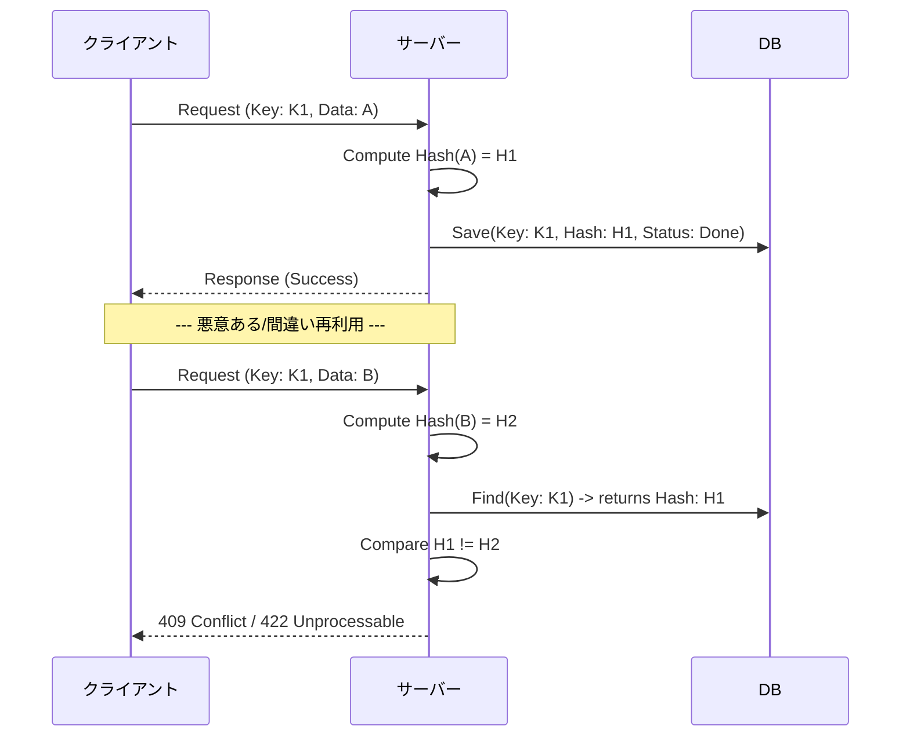

# 第12章：冪等キー設計のルール（スコープ/TTL/再利用禁止）⏳🧷

## この章のゴール🎯✨

* 冪等キーを「どこまで同じ扱いにするか（スコープ）」を決められる👤🔑
* 冪等キーを「いつまで覚えておくか（TTL）」を決められる🕒🧠
* 冪等キーの「再利用禁止ルール」を作れて、事故（別内容なのに同じキー）を防げる🚫💥
* そのままDBテーブル設計（たたき台）を書ける🗃️✍️


---

## まず結論：冪等キー設計の“三大ルール”🔑🔁📌

### ① スコープ：キーは「誰の」「どの操作の」キー？👤➡️🧾

同じ冪等キーでも、**誰が**使ったかで意味が変わるよね？
だから「冪等キーだけ」をユニークにするのは危険⚠️

**基本はこの形が強い💪**

* （ユーザー識別子 など）＋（API操作の種類 など）＋（冪等キー）

例：

* userId 単位でユニーク（同じ userId の中で key が重複しない）
* さらに「注文作成」などの操作単位も混ぜる（別エンドポイントでの事故を減らす）

---

### ② TTL：いつまで“同じ結果を返す”の？🕒🔁

冪等キーはずーっと保存しない🙅‍♀️
保存しっぱなしだと、コストも増えるし、運用も重くなる📦💸

でも短すぎると、**時間がたってからのリトライで二重作成**が起きる😱
なので「リトライが起きうる期間」を想像して決めるのがコツ🧠✨

実例として、Stripeはキーを最大255文字まで扱えて、少なくとも24時間後に自動削除できる（古いキーは削除され、削除後に同じキーを使うと新規扱いになる）という運用を案内してるよ📌 ([Stripeドキュメント][1])
Adyenはキーが最低7日間有効（company account単位でユニーク）という運用を案内してるよ📌 ([docs.adyen.com][2])

---

### ③ 再利用禁止：同じキーは「同じ内容」にしか使っちゃダメ🚫🧾

ここが一番事故るポイント💥
同じキーで、内容が違うリクエストを送っちゃうと…

* サーバーは「同じ処理だよね？」って思って前の結果を返す
* でもクライアントは「別の注文のつもり」
  → ぐちゃぐちゃ😵‍💫

だから王道はこれ👇

* **同じキーで来たリクエストは、パラメータ（内容）が同一かチェック**
* 違ったらエラーにする（Stripeも「元のリクエストと同じパラメータか比較して、違えばエラーにする」と説明してるよ） ([Stripeドキュメント][1])

さらに、IETFのIdempotency-Keyヘッダーの標準化ドラフトでも、POST/PATCHなどを安全にリトライ可能にするためのヘッダーとして整理されてるよ📌 ([IETF Datatracker][3])

---

## 12.1 スコープ設計：何を「同じ操作」とみなす？🧩🔍

### スコープ候補（強さ順）💪✨

#### A. 「userId + idempotencyKey」方式（よくある王道）👤🔑

* 同一ユーザーの中ではキー重複禁止
* 別ユーザーなら同じキーでもOK
* マルチテナントなら tenantId も混ぜるのが鉄板🏢

**メリット**：シンプルで強い😊
**注意**：同一ユーザーが別エンドポイントで同じキーを使う事故がありえる

---

#### B. 「userId + endpoint(または operation) + idempotencyKey」方式（事故りにくい）👤🧾🔑

* 「注文作成」と「支払い確定」で同じキーを使っても衝突しにくい👍

**おすすめ**：教材のミニ注文APIではこれが扱いやすい✨

---

#### C. 「グローバルで idempotencyKey をユニーク」（非推奨寄り）🌍⚠️

* “世界で一意なキー生成”が前提になって、運用が重い
* 事故ったときの影響範囲も広い😵

---

### スコープ設計のチェック質問✅📝

* 同じユーザーが、別の操作で同じキーを使う可能性ある？🤔
* モバイル/ブラウザ/バッチなど複数クライアントがある？📱💻
* 「会社単位でユニーク」みたいな境界が必要？🏢
  （例：Adyenは会社アカウント単位でユニークにする運用） ([docs.adyen.com][2])

---

## 12.2 TTL設計：どれくらい覚えておく？🕒📦

### TTLを決める“考え方”🧠✨

TTLは「適当に1日！」じゃなくて、だいたいこの材料で決めると安全✅

1. クライアントのリトライ期間（どれくらい粘る？）🔁
2. タイムアウトや通信不安定が起きる現実（数分〜数時間ありえる）🌧️
3. 非同期処理が混ざるなら、完了までの最長時間も考える⏳
4. 監査・問い合わせ対応（「あの注文どうなった？」）の都合も少し入れる📞

### 有名どころの“目安”感📌

* Stripe：キーは少なくとも24時間後に自動削除でき、削除後に同じキーを使うと新規扱いになる（また、同じキーでパラメータが違うとエラー） ([Stripeドキュメント][1])
* Adyen：キーは最低7日有効 ([docs.adyen.com][2])
* PayPal：リクエストIDを一定期間保持し、その間はリトライ可能として説明 ([developer.paypal.com][4])

### 教材ミニAPIのおすすめTTL（迷ったら）🍰✨

* 同期処理メイン：**24時間**（扱いやすい＆現実に強い）🕛
* 非同期が混ざる：**完了想定時間 + 余裕**（例：最大2時間なら 24時間でOK、最大2日なら 3〜7日も検討）📮
* 超重要（決済級）で問い合わせも多い：**7日**も現実的（ただし保存コスト↑）💳📈

---

## 12.3 再利用禁止：同じキーは“同じ内容”だけ！🚫🧾

### どうやって防ぐ？（超おすすめのやり方）🔒✨

**リクエストの内容をハッシュ化して保存**しておくのが王道👍


* 初回：

  * （userId, operation, key）でレコード作る
  * requestHash も保存する
* 2回目以降：

  * 同じ（userId, operation, key）を発見
  * requestHash が同じなら “リプレイ”（同じ結果を返す）🔁
  * requestHash が違うなら “不正再利用”（エラー）💥

Stripeも「最初のリクエストと同じパラメータか比較し、違えばエラーにする」運用を説明してるよ📌 ([Stripeドキュメント][1])



---

## 12.4 DBテーブル案（たたき台）🗃️✍️

ここでは「後で第13章の“結果保存”につながる形」で作るよ📦📤

### 最低限ほしい列（ミニマム）✅

* scope用：userId（＋必要ならtenantId）
* operation（例：createOrder）
* idempotencyKey
* requestHash（再利用禁止チェック用）
* status（processing/succeeded/failed）
* createdAt / expiresAt

### 実務寄りにするなら（結果リプレイ用）✨

* responseStatus
* responseBody（JSON）
* responseHeaders（JSON）
* updatedAt

---

### SQL例（PostgreSQL想定）🐘

```sql
CREATE TABLE idempotency_records (
  id BIGSERIAL PRIMARY KEY,

  tenant_id TEXT NULL,                 -- 必要なら（マルチテナント用）
  user_id TEXT NOT NULL,               -- スコープ
  operation TEXT NOT NULL,             -- 例: "createOrder"
  idem_key TEXT NOT NULL,              -- Idempotency-Key

  request_hash TEXT NOT NULL,          -- 再利用禁止チェック用

  status TEXT NOT NULL,                -- "processing" | "succeeded" | "failed"
  response_status INT NULL,
  response_body JSONB NULL,
  response_headers JSONB NULL,

  created_at TIMESTAMPTZ NOT NULL DEFAULT now(),
  updated_at TIMESTAMPTZ NOT NULL DEFAULT now(),
  expires_at TIMESTAMPTZ NOT NULL
);

-- スコープ＋キーの一意制約（超重要！）
CREATE UNIQUE INDEX ux_idem_scope_key
ON idempotency_records (COALESCE(tenant_id, ''), user_id, operation, idem_key);

-- 掃除用（TTL）
CREATE INDEX ix_idem_expires_at
ON idempotency_records (expires_at);
```

---

## 12.5 TypeScriptでの“設計イメージ”（超ミニ）🧠💻

### リクエスト内容のハッシュ化（例）🔐

```ts
import crypto from "node:crypto";

type CreateOrderBody = {
  productId: string;
  quantity: number;
};

function stableStringify(obj: unknown): string {
  // 教材用の簡易版：キー順を安定させる（実務はライブラリ利用もアリ）
  return JSON.stringify(obj, Object.keys(obj as any).sort());
}

function hashRequest(body: CreateOrderBody): string {
  const s = stableStringify(body);
  return crypto.createHash("sha256").update(s, "utf8").digest("hex");
}
```

### 再利用禁止チェックの流れ（擬似コード）🔁✅

```ts
type IdemStatus = "processing" | "succeeded" | "failed";

type IdemRecord = {
  userId: string;
  operation: string;
  idemKey: string;
  requestHash: string;
  status: IdemStatus;
  responseStatus?: number;
  responseBody?: unknown;
  expiresAt: Date;
};

async function handleCreateOrder(userId: string, idemKey: string, body: CreateOrderBody) {
  const operation = "createOrder";
  const requestHash = hashRequest(body);

  const existing = await findIdemRecord(userId, operation, idemKey);

  if (!existing) {
    // 初回：先にレコード作成（同時実行にも強くなる）
    await insertIdemRecord({
      userId,
      operation,
      idemKey,
      requestHash,
      status: "processing",
      expiresAt: new Date(Date.now() + 24 * 60 * 60 * 1000),
    });

    const result = await actuallyCreateOrder(body);

    await markSucceeded(userId, operation, idemKey, {
      responseStatus: 201,
      responseBody: result,
    });

    return { status: 201, body: result };
  }

  // 2回目以降：同じ内容かチェック
  if (existing.requestHash !== requestHash) {
    // “同じキーで別内容” → 事故防止で弾く
    return { status: 409, body: { message: "Idempotency key reused with different request." } };
  }

  // 同じ内容なら結果を返す（第13章で本格化）
  if (existing.status === "succeeded") {
    return { status: existing.responseStatus ?? 200, body: existing.responseBody };
  }

  // processing中なら「処理中」と返す設計もアリ（第20章で詳しく）
  return { status: 202, body: { message: "Processing. Retry with the same Idempotency-Key." } };
}

// ↓ ここはDBアクセス層（今回は形だけ）
declare function findIdemRecord(userId: string, operation: string, idemKey: string): Promise<IdemRecord | null>;
declare function insertIdemRecord(rec: IdemRecord): Promise<void>;
declare function markSucceeded(
  userId: string,
  operation: string,
  idemKey: string,
  data: { responseStatus: number; responseBody: unknown }
): Promise<void>;
declare function actuallyCreateOrder(body: CreateOrderBody): Promise<unknown>;
```

ポイント💡

* 先に「processing」で確保する（同時実行に強くなる）🔒
* requestHash を比べて「別内容」を拒否する🚫
* 成功済みなら結果を返す（レスポンスキャッシュ型）📦
* TTL掃除のため expiresAt を入れる🧹🕒

---

## 12.6 よくある事故パターン集😱➡️✅

### 事故①：スコープが弱くて別ユーザー同士が衝突💥

* 「idempotencyKeyだけユニーク」にしてると起きがち
  ✅ userId（＋tenantId）を混ぜる👤🏢

### 事故②：TTLが短すぎて“翌日リトライ”で二重作成😵

✅ リトライ期間＋運用実態から決める
（例：Stripeは少なくとも24時間後に削除できる運用を案内） ([Stripeドキュメント][1])

### 事故③：同じキーを別内容に使って、意図しない結果が返る🌀

✅ requestHash（またはパラメータ比較）で弾く
（Stripeはパラメータ比較して不一致ならエラーにする運用を説明） ([Stripeドキュメント][1])

### 事故④：キーに個人情報を入れてしまう🫣

* 例：メールアドレス、氏名など
  ✅ UUIDみたいなランダム文字列にする🔑✨
  （Stripeもキー生成はUUID v4などランダムを推奨し、長さ上限も示してる） ([Stripeドキュメント][1])

---

## 12.7 ミニ演習📝✨（この章の手を動かすやつ！）

### 演習1：あなたの「スコープ」を決めよう👤🔑

次を埋めてね✍️

* スコープの単位： userId / tenantId / operation をどう使う？
* ユニーク制約： （　　　　, 　　　　, 　　　　, idemKey ）

### 演習2：TTLを決めよう🕒

* 想定する最大リトライ時間：＿＿＿時間
* TTL：＿＿＿時間（または＿＿＿日）
* その理由：＿＿＿＿＿＿＿＿＿＿＿＿＿＿

ヒント：

* Stripeは少なくとも24時間後に削除できる運用を案内 ([Stripeドキュメント][1])
* Adyenは最低7日有効の運用を案内 ([docs.adyen.com][2])

### 演習3：再利用禁止ルールを書こう🚫🧾

仕様文（日本語でOK）を1〜2文で✍️
例の形：

* 「同じ冪等キーは同一内容のリトライにのみ使用できる。内容が異なる場合は 409 を返す。」

---

## 12.8 AI活用🤖✨（この章で使うと強い！）

### ① スコープ設計レビュー🔍

AIへの投げ方例💬

* 「このAPIの冪等キーのスコープ案を3つ出して。事故りやすさと運用コストも比較して」

### ② TTLの妥当性チェック🕒✅

* 「最大リトライが○時間、非同期が最大○時間。TTLの候補を3つ出して、メリデメを書いて」

### ③ テーブル案レビュー🗃️

* 「このテーブル設計で“同一キー別内容”を防げる？足りない列やインデックスを指摘して」

（注意⚠️）
AIはときどき「キー永続保存でOK！」みたいな雑回答をすることがあるから、**リトライ期間と保存コストのトレードオフ**は必ず自分でも確認ね🧠✨

---

## まとめ🎀

* スコープは「ユーザー＋操作＋キー」が基本で事故りにくい👤🧾🔑
* TTLは「リトライ期間」と「非同期の最長」を材料に決める🕒
* 再利用禁止は requestHash（またはパラメータ比較）で守る🚫🧾
* テーブルは「ユニーク制約」と「expiresAt」が生命線🗃️❤️

[1]: https://docs.stripe.com/api/idempotent_requests?utm_source=chatgpt.com "Idempotent requests | Stripe API Reference"
[2]: https://docs.adyen.com/development-resources/api-idempotency?utm_source=chatgpt.com "API idempotency"
[3]: https://datatracker.ietf.org/doc/draft-ietf-httpapi-idempotency-key-header/?utm_source=chatgpt.com "The Idempotency-Key HTTP Header Field"
[4]: https://developer.paypal.com/reference/guidelines/idempotency/?utm_source=chatgpt.com "Idempotency"

