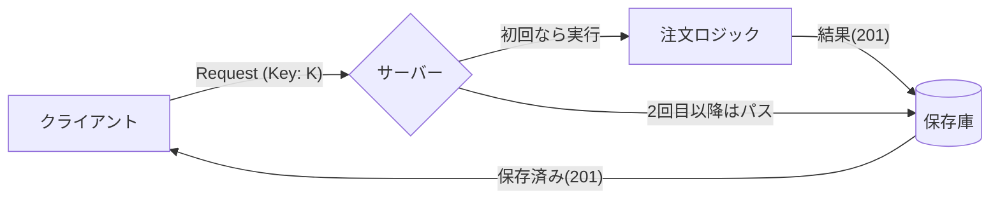

# 第13章：結果を保存して返す（レスポンスキャッシュ型冪等）📦📤

## 13.1 この章のゴール 🎯✨

この章が終わると、こんなことができるようになります😊🌸

* 「同じ Idempotency-Key なら、**前回のレスポンスをそのまま返す**」仕組みが説明できる🔁
* 保存すべき項目（status/body/createdAt など）を自分で決められる🧾
* 「処理中」と「完了」を分けて扱える⏳✅
* TypeScriptでミニ実装できる（まずはメモリ保存版）🧑‍💻💕


---

## 13.2 レスポンスキャッシュ型ってなに？🧠🔑

「レスポンスキャッシュ型冪等」は一言でいうと…

**同じキーで来た“同じ依頼”には、同じ返事を返す**方式です📦📤🔁

* 1回目：普通に処理する → **返したレスポンスを保存**する✅
* 2回目以降：処理しない → **保存したレスポンスをそのまま返す**🔁✨

この方式は実務でも超王道で、たとえば Stripe は「最初のリクエストの **ステータスコードとボディを保存して**、同じキーの再送には **同じ結果を返す**」と説明しています（成功でも失敗でも）📌💳 ([Stripeドキュメント][1])

さらに「Idempotency-Key というHTTPヘッダーで、POST/PATCHみたいな“本来は冪等じゃない操作”を再送に強くできる」という方向性は、IETFのドラフトでも扱われています🌐📜 ([IETF Datatracker][2])

---

## 13.3 なぜ“結果を保存”が強いの？💪🔥

冪等キー方式って、目標はこれでしたよね👇
「リトライや連打があっても、二重作成・二重決済を起こさない」😇💥

でも現実はこうなりがち👇

* サーバーは成功した✅
* でも返事が届かなかった（タイムアウト）⏱️😢
* クライアントが再送する🔁
* すると“もう一回処理”されて二重実行😱

ここで「結果を保存して返す」だと、再送が来ても **同じ返事を返すだけ**なので、二重実行が止まります🛑✨
つまり、**“入口で止める”のではなく“出口（返事）を固定する”**感じです📤🔒



---

## 13.4 何を保存する？（最小セットと実務セット）🧾✨

### ✅ 最小セット（まずはこれでOK）🍙

* `statusCode`（例：201）📨
* `body`（JSON）📦
* `createdAt`（いつ作った？）🕒
* `expiresAt`（いつ捨てる？TTL）⏳

### ✅ 実務セット（強くなるやつ）🛡️✨

* `scope`（例：userId単位）👤
* `requestHash`（同じキーで別内容が来たのを検知）🧨
* `responseHeaders`（Locationなど必要なら）🏷️
* `state`（`processing / succeeded / failed`）🔁
* `updatedAt`（監視しやすい）👀

💡ポイント：
**「同じキー = 同じ内容」**の約束が崩れると事故るので、`requestHash` があると一気に安全になります🔒✨

---

## 13.5 いちばん危ない罠：「同じキーだけど中身が違う」😱🧨

例えばこう👇

* 1回目：`{ itemId: "A", qty: 1 }` で注文
* 2回目：間違って `qty: 2` にして **同じキー**で送っちゃった

このとき、レスポンスキャッシュ型は「同じ返事」を返しちゃうので、
**クライアントは“qty:2で通った”と勘違い**する可能性が出ます😵💦

✅ 対策：**requestHash（リクエスト指紋）**

* 1回目の `requestHash` を保存
* 同じキーで来たら `requestHash` を比較
* 違ったら **409 Conflict** などで止める🛑📨

---

## 13.6 もう一つの山場：「処理中（processing）」の扱い⏳🌀

同じキーが“ほぼ同時”に2回届いたらどうする？⚔️

よくある方針はこの3つ👇

1. **待たせる**（1回目が終わるまで2回目を待機）⌛
2. **202 Accepted** で「処理中だよ」と返す📨⏳
3. **短時間だけ待って**、ダメなら202にする（現実的）👌

この章のミニ実装では、③の「ちょい待ち→ダメなら202」も入れてみます😊✨

---

## 13.7 ミニ実装（TypeScript）：メモリ保存版 Map で作る🧑‍💻🍰

ここからは「注文作成API」っぽいやつでやります📦🧾

* `POST /orders`
* ヘッダー `Idempotency-Key` 必須🔑
* `X-User-Id` は簡易的にスコープ用👤（本当は認証から取る想定）

### 13.7.1 データ構造（保存レコード）🧱

```ts
type CachedResponse = {
  statusCode: number;
  headers?: Record<string, string>;
  body: unknown;
};

type RecordState = "processing" | "succeeded" | "failed";

type IdempotencyRecord = {
  key: string;              // userId + ":" + idempotencyKey
  requestHash: string;      // “同じキーで同じ内容？”チェック用
  state: RecordState;

  response?: CachedResponse;

  createdAt: number;
  expiresAt: number;

  // 同時リクエストが来たときの “待機者”
  waiters: Array<(resp: CachedResponse) => void>;
};
```

### 13.7.2 実装（Express v5でOK）🚀

※ Express v5 はすでにリリースされています📌 ([expressjs.com][3])

```ts
import express from "express";
import crypto from "node:crypto";

const app = express();
app.use(express.json());

const store = new Map<string, IdempotencyRecord>();

const TTL_MS = 1000 * 60 * 10; // 10分（例）
const WAIT_MS = 1500;          // “ちょい待ち” 1.5秒（例）

function sha256(text: string): string {
  return crypto.createHash("sha256").update(text).digest("hex");
}

function stableJson(value: unknown): string {
  // 超簡易：順序が変わるとhashが変わるので、実務では“安定化”が必要
  // ここではミニ実装として割り切るよ🙏
  return JSON.stringify(value);
}

function now(): number {
  return Date.now();
}

function cleanupExpired() {
  const t = now();
  for (const [k, rec] of store) {
    if (rec.expiresAt <= t) store.delete(k);
  }
}
setInterval(cleanupExpired, 30_000).unref();

app.post("/orders", async (req, res) => {
  const idemKey = req.header("Idempotency-Key");
  const userId = req.header("X-User-Id") ?? "guest";

  if (!idemKey) {
    return res.status(400).json({ message: "Idempotency-Key is required" });
  }

  const scopedKey = `${userId}:${idemKey}`;
  const requestHash = sha256(stableJson(req.body));

  const existing = store.get(scopedKey);

  // ① すでにレコードがある場合（= 再送 or 同時到着）
  if (existing) {
    // キー再利用（別内容）検知
    if (existing.requestHash !== requestHash) {
      return res.status(409).json({
        message: "Idempotency-Key was already used with a different request body",
      });
    }

    // 完了済み → キャッシュを返す
    if (existing.state === "succeeded" && existing.response) {
      res.setHeader("Idempotent-Replayed", "true");
      if (existing.response.headers) {
        for (const [k, v] of Object.entries(existing.response.headers)) {
          res.setHeader(k, v);
        }
      }
      return res.status(existing.response.statusCode).json(existing.response.body);
    }

    // 処理中 → ちょい待ち（終わったら同じレスポンスを返す）
    if (existing.state === "processing") {
      const waited = await new Promise<CachedResponse | null>((resolve) => {
        const timer = setTimeout(() => resolve(null), WAIT_MS);
        existing.waiters.push((resp) => {
          clearTimeout(timer);
          resolve(resp);
        });
      });

      if (!waited) {
        // 間に合わなかった → “処理中だよ”で返す（方針の一例）
        return res.status(202).json({ message: "Processing. Please retry with the same Idempotency-Key." });
      }

      res.setHeader("Idempotent-Replayed", "true");
      if (waited.headers) {
        for (const [k, v] of Object.entries(waited.headers)) {
          res.setHeader(k, v);
        }
      }
      return res.status(waited.statusCode).json(waited.body);
    }
  }

  // ② 初回：processing レコードを作る
  const record: IdempotencyRecord = {
    key: scopedKey,
    requestHash,
    state: "processing",
    createdAt: now(),
    expiresAt: now() + TTL_MS,
    waiters: [],
  };
  store.set(scopedKey, record);

  try {
    // ③ ここが “本来の処理” のつもり（例：注文作成）
    // 例なので軽くね🍰
    const orderId = crypto.randomUUID();
    const result = {
      orderId,
      status: "confirmed",
      received: req.body,
    };

    const cached: CachedResponse = {
      statusCode: 201,
      headers: { "Content-Type": "application/json" },
      body: result,
    };

    // ④ 成功レスポンスを保存して、待機者に配る
    record.state = "succeeded";
    record.response = cached;

    const waiters = record.waiters.splice(0);
    waiters.forEach((fn) => fn(cached));

    return res.status(cached.statusCode).json(cached.body);
  } catch (e) {
    // この章では “成功レスポンス保存” がメイン！
    // 失敗保存は第19章でガッツリやるよ🧯✨
    record.state = "failed";
    return res.status(500).json({ message: "Internal error" });
  }
});

app.listen(3000, () => {
  console.log("http://localhost:3000");
});
```

---

## 13.8 動作チェック（PowerShellで“同じキーを2回”）🪟🔁

同じ `Idempotency-Key` で2回叩いて、**orderId が同じ**なら成功🎉✨

```powershell
$key = [guid]::NewGuid().ToString()

## 1回目
curl.exe -X POST "http://localhost:3000/orders" `
  -H "Content-Type: application/json" `
  -H "X-User-Id: u-1" `
  -H "Idempotency-Key: $key" `
  -d "{""itemId"":""A"",""qty"":1}"

## 2回目（同じキー）
curl.exe -X POST "http://localhost:3000/orders" `
  -H "Content-Type: application/json" `
  -H "X-User-Id: u-1" `
  -H "Idempotency-Key: $key" `
  -d "{""itemId"":""A"",""qty"":1}"
```

✅ 期待する観察ポイント👀

* 1回目と2回目で `orderId` が同じ🎯
* 2回目のレスポンスに `Idempotent-Replayed: true` が付く🏷️✨

---

## 13.9 DB/Redisにするときの考え方（設計だけ先に）🗄️⚡

メモリ版は学習には最高だけど、実務は落ちると消えます😇💥
永続化するなら、だいたいこんな列が欲しくなります👇

* `user_id`（スコープ）👤
* `idempotency_key` 🔑
* `request_hash` 🧬
* `state`（processing/succeeded/failed）🔁
* `response_status` 📬
* `response_body`（JSON）📦
* `response_headers`（必要なら）🏷️
* `created_at / expires_at` ⏳

「同じキーを“物理的に1件だけ”にしたい」なら、(user_id, idempotency_key) にユニーク制約を貼るのが強いです🛡️（この話は第16章でド本命）✨

---

## 13.10 つまずきポイント集（ここが沼）⚠️🌀

* **レスポンスにランダム値や現在時刻を入れる**
  → 2回目の返事が“変わる”と、クライアントが混乱😵
* **キー再利用（別内容）を止めない**
  → 409で止めるの大事🛑
* **TTLが短すぎる**
  → クライアントが再送したいのに、記録が消えて二重実行😱
* **大きすぎるレスポンスを丸ごと保存**
  → DBが肥える🐷💦（必要部分だけ保存/圧縮/参照方式など検討）

---

## 13.11 ミニ演習 ✍️🌸

1. `stableJson()` を“キー順で並べ替える版”にして、requestHash が安定するようにしてみよう🧠✨
2. `processing` のとき、**202 + Retry-After** を付けてみよう📨⏳
3. キャッシュ返却時に、**同じ statusCode / 同じ body** になってるかテストを書こう🧪✅

---

## 13.12 AI活用（この章向け）🤖💡

### ✅ 使えるお願いの例（コピペOK）📋✨

* 「このExpressのコードに、requestHash を“キー順ソートJSON”で作る関数を足して」🧠
* 「Idempotency-Key の再利用（別ボディ）で 409 を返すテストケースを3つ作って」🧪
* 「processing中の再送は 202 にして、Retry-After と再試行ガイド文を整えて」📨⏳

### ✅ AIの答えをチェックする観点（超大事）👀✅

* “同じキーで別ボディ”をちゃんと弾いてる？🧨
* “2回目は処理を走らせてない”って言い切れる？🔁
* TTL切れのときの挙動は想定どおり？⏳

---

### 📌 おまけ：最近のTypeScript/Nodeの状況（軽く）✨

* TypeScript は 5.9 系が安定版として案内されています📌（npmのlatestも 5.9.3） ([typescriptlang.org][4])
* Node.js は 24.x がActive LTSとして扱われています🟩（例：24.13.0） ([Node.js][5])

次章（第14章）は「どこに保存する？」問題で、メモリ/DB/Redis をちゃんと選べるようにします🧰⚡

[1]: https://docs.stripe.com/api/idempotent_requests?utm_source=chatgpt.com "Idempotent requests | Stripe API Reference"
[2]: https://datatracker.ietf.org/doc/draft-ietf-httpapi-idempotency-key-header/?utm_source=chatgpt.com "The Idempotency-Key HTTP Header Field - Datatracker - IETF"
[3]: https://expressjs.com/2024/10/15/v5-release.html?utm_source=chatgpt.com "Introducing Express v5: A New Era for the Node. ..."
[4]: https://www.typescriptlang.org/download/?utm_source=chatgpt.com "How to set up TypeScript"
[5]: https://nodejs.org/en/about/previous-releases?utm_source=chatgpt.com "Node.js Releases"

