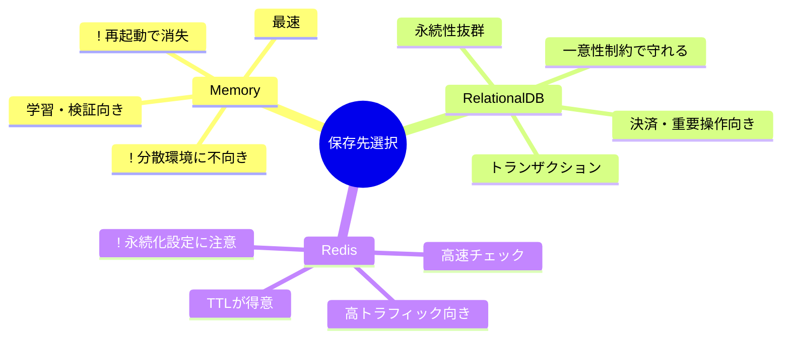

# 第14章：保存先の選択（メモリ/DB/Redis）🧰✨

## 🎯この章のゴール

* 「冪等キー（Idempotency-Key）の記録」を **どこに保存すべきか** を、要件から選べるようになるよ😊🔑
* メモリ / DB / Redis それぞれの **強み・弱み・事故りポイント** がわかるよ⚠️
* TypeScriptで「保存先を差し替えられる形」に設計できるよ🧩✨


---

## 🧩まず“何を保存するの？”を1枚で整理しよ📌

冪等キー方式で保存したいのは、ざっくり **「このキーのリクエスト、もう処理した？」の証拠** だよ🔎✨
よくある保存レコードはこんな感じ👇

* `idempotencyKey` 🔑（同じキーは同じ処理として扱う）
* `scope` 👤（例：`userId` とセット。**ユーザーまたぎで同じキーを使えない**ように）
* `requestHash` 🧾（“同じキーなのに中身違う”事故を検知するため）
* `status` 🚦（`processing` / `succeeded` / `failed`）
* `response` 📦（成功ならステータスやボディを保存して、2回目はそれを返す）
* `expiresAt` ⏳（TTL。いつまで保存する？）

---

## 🧰保存先の候補はこの3つ！それぞれ“向いてる世界”が違うよ🌍✨


### ① メモリ（アプリのMap）🧠⚡

**いいところ😊**

* 実装が超シンプル！`Map` でOK🗺️✨
* 速い（プロセス内だから最速）⚡

**弱いところ😇**

* アプリが落ちたら消える（再起動で全忘れ）💥
* サーバーを2台以上に増やすと、**台ごとに記録が分断**されて事故りやすい🧨

**向いてる場面🍰**

* 学習・ローカル・単体サーバーでの小さな検証
* 「落ちたらやり直しでOK」な軽い操作

---

### ② DB（例：PostgreSQL / MySQL）🗄️🛡️

**いいところ😊**

* 落ちても残る（永続化）💾✨
* **ユニーク制約**で「二重登録を物理的に禁止」できる（第16章につながる）🔒
  PostgreSQLはユニーク制約/主キーでユニークインデックスが作られて、一意性を強制できるよ📌 ([PostgreSQL][1])
* トランザクションで「注文作成＋冪等記録」を同じ一貫性で扱いやすい🤝

**弱いところ😵**

* Redisよりは遅いことが多い（I/Oが絡む）🐢
* 高トラフィックだとDBが冪等チェックで詰まりがち（設計で回避できるけど）🚧

**向いてる場面🏢**

* 決済・注文など「絶対に二重が許されない」
* 監査ログや追跡が必要（いつ誰がどのキーで何した？）👀

---

### ③ Redis（インメモリDB）🚀🧠

**いいところ😊**

* とにかく速い⚡（冪等チェックのホットパスに強い）
* TTLが超得意！キーに有効期限を持たせやすい⏳
  Redisは `TTL` で残り時間が取れて、`EXPIRE` で期限を設定できるよ🕒 ([Redis][2])
* `SET` に `NX`（存在しない時だけ作成）などのオプションがある✨ ([Redis][3])

**弱いところ😇**

* Redis自体は“メモリ中心”なので、**永続化をどうするか**をちゃんと考える必要あり💭
  Redisには RDBスナップショット / AOFログ などの永続化方式があるよ📌 ([Redis][4])
* ネットワーク越しなので、Redis障害・接続エラー時の動きも設計に入れる必要あり🌩️

**向いてる場面🎯**
Redis向き🎯
* 中〜大規模で「冪等チェックが高頻度」「レスポンスを速くしたい」
* 期限付きの冪等レコードを大量に扱う（TTLで自動掃除したい）🧹✨



---

## 🔥“落ちたらどうなる？”で覚えると一気に強くなるよ💪😆

### ✅メモリの落とし穴（超重要）🧨


* アプリ再起動 → 冪等記録が消える → **同じキーでも“未処理扱い”になって二重実行**😱
* スケールアウト（2台） → Aサーバーに1回目、Bサーバーに2回目 → **別物扱い**😇

👉 だからメモリは「落ちてもOK」「単体運用」の世界で強いよ🍀

### ✅Redisの落とし穴（設計で勝てる）⚠️


* TTLを付け忘れる → 永遠に残って増え続ける♾️📈
* Redis障害時にどうする？

  * “安全側（処理しない）”に倒す？🛑
  * “DBにフォールバック”する？🧯
    ここはサービス性質で決めるよ（決済系は慎重！）💳

### ✅DBの落とし穴（性能で勝負）🐢


* 何でもDBで冪等チェック → 高負荷時にDBがボトルネックになりやすい🚧
  👉 対策：Redis併用、レコード設計、インデックス設計、TTL/削除戦略✨

---

## 🗺️選び方：規模別の“早見表”だよ📝✨


| 規模/状況           | おすすめ         | 理由                                 |
| --------------- | ------------ | ---------------------------------- |
| 学習・ローカル・単体サーバー  | メモリ🧠        | 最速で理解できる・実装が簡単                     |
| 小規模でも「二重が絶対NG」  | DB🗄️        | 再起動しても残る・一意性で守れる ([PostgreSQL][1]) |
| 中規模〜大規模で高速に捌きたい | Redis🚀      | TTL + 高速チェックが強い ([Redis][3])       |
| 最強に堅くしたい        | Redis + DB🤝 | Redisで高速、DBで永続・監査（ハイブリッド）          |

---

## 🧑‍💻TypeScript実装：保存先を“差し替え可能”にしよ🧩✨


### ① まずは共通インターフェイスを作る🔧

ポイントはこれ👇

* アプリ本体は「保存先が何か」を知らなくてOK🙆‍♀️
* 後で Redis→DB みたいに差し替えできる✨

```ts
export type IdempotencyStatus = "processing" | "succeeded" | "failed";

export type IdempotencyRecord = {
  scope: string;              // 例: userId
  key: string;                // Idempotency-Key
  requestHash: string;        // 入力のハッシュ（内容違い検知）
  status: IdempotencyStatus;
  responseStatus?: number;
  responseBodyJson?: string;  // JSON文字列で保存すると扱いやすい
  createdAt: number;          // epoch ms
  expiresAt: number;          // epoch ms
};

export interface IdempotencyStore {
  /**
   * まだ無ければ processing で作る（先着1名だけOKにしたい）
   * 既にあれば、そのレコードを返す
   */
  getOrCreateProcessing(record: Omit<IdempotencyRecord, "status">): Promise<IdempotencyRecord>;

  markSucceeded(scope: string, key: string, responseStatus: number, responseBodyJson: string): Promise<void>;
  markFailed(scope: string, key: string, responseStatus: number, responseBodyJson: string): Promise<void>;

  get(scope: string, key: string): Promise<IdempotencyRecord | null>;
}
```

---

### ② メモリ実装（まずはここから）🧠✨

```ts
export class MemoryIdempotencyStore implements IdempotencyStore {
  private map = new Map<string, IdempotencyRecord>();

  private makeKey(scope: string, key: string) {
    return `${scope}:${key}`;
  }

  async getOrCreateProcessing(input: Omit<IdempotencyRecord, "status">): Promise<IdempotencyRecord> {
    const k = this.makeKey(input.scope, input.key);
    const now = Date.now();

    const existing = this.map.get(k);
    if (existing) return existing;

    const created: IdempotencyRecord = { ...input, status: "processing", createdAt: now };
    this.map.set(k, created);
    return created;
  }

  async markSucceeded(scope: string, key: string, responseStatus: number, responseBodyJson: string) {
    const k = this.makeKey(scope, key);
    const cur = this.map.get(k);
    if (!cur) return;

    this.map.set(k, { ...cur, status: "succeeded", responseStatus, responseBodyJson });
  }

  async markFailed(scope: string, key: string, responseStatus: number, responseBodyJson: string) {
    const k = this.makeKey(scope, key);
    const cur = this.map.get(k);
    if (!cur) return;

    this.map.set(k, { ...cur, status: "failed", responseStatus, responseBodyJson });
  }

  async get(scope: string, key: string) {
    return this.map.get(this.makeKey(scope, key)) ?? null;
  }
}
```

✅ これで「同じキーなら同じ結果」を作る練習ができるよ😊
⚠️ でも再起動で消えるのは忘れないでね💥

---

### ③ Redis実装のコア：`SET ... NX ... EX` が超便利🔑⚡

Redisは `SET` に `NX`（なければ作る）や、有効期限オプションがあるよ✨ ([Redis][3])
そして古い `SETNX` は “今から書く新規コードなら `SET ... NX` に置き換え推奨” って扱いだよ📌 ([Redis][5])

node-redis（`redis` パッケージ）だと、こんな感じで書けるよ👇 ([npm][6])

```ts
import { createClient } from "redis";

export class RedisIdempotencyStore implements IdempotencyStore {
  constructor(private client = createClient()) {}

  private makeKey(scope: string, key: string) {
    return `idem:${scope}:${key}`;
  }

  async getOrCreateProcessing(input: Omit<IdempotencyRecord, "status">): Promise<IdempotencyRecord> {
    const redisKey = this.makeKey(input.scope, input.key);
    const ttlSeconds = Math.max(1, Math.floor((input.expiresAt - Date.now()) / 1000));

    const processing: IdempotencyRecord = {
      ...input,
      status: "processing",
      createdAt: Date.now(),
    };

    // まだ無ければ作る（先着1名だけOK）
    const ok = await this.client.set(redisKey, JSON.stringify(processing), { EX: ttlSeconds, NX: true });
    if (ok === "OK") return processing;

    // 既にあるならそれを返す
    const existingJson = await this.client.get(redisKey);
    if (!existingJson) return processing; // まれに消えてた時の保険
    return JSON.parse(existingJson) as IdempotencyRecord;
  }

  async markSucceeded(scope: string, key: string, responseStatus: number, responseBodyJson: string) {
    const redisKey = this.makeKey(scope, key);
    const curJson = await this.client.get(redisKey);
    if (!curJson) return;

    const cur = JSON.parse(curJson) as IdempotencyRecord;
    const next: IdempotencyRecord = { ...cur, status: "succeeded", responseStatus, responseBodyJson };

    // TTLを維持したいなら、更新時にも期限を考える（ここではシンプルに据え置き）
    await this.client.set(redisKey, JSON.stringify(next));
  }

  async markFailed(scope: string, key: string, responseStatus: number, responseBodyJson: string) {
    const redisKey = this.makeKey(scope, key);
    const curJson = await this.client.get(redisKey);
    if (!curJson) return;

    const cur = JSON.parse(curJson) as IdempotencyRecord;
    const next: IdempotencyRecord = { ...cur, status: "failed", responseStatus, responseBodyJson };

    await this.client.set(redisKey, JSON.stringify(next));
  }

  async get(scope: string, key: string) {
    const redisKey = this.makeKey(scope, key);
    const json = await this.client.get(redisKey);
    return json ? (JSON.parse(json) as IdempotencyRecord) : null;
  }
}
```

📝TTLの考え方

* 期限を付けるなら `EXPIRE` / `TTL` とセットで理解すると強いよ⏳✨ ([Redis][2])
* Redisのキー削除は「アクセス時に消える」＋「定期的に掃除する」仕組みがあるよ🧹 ([Redis][7])

---

### ④ DB実装のイメージ：ユニーク制約で“1個しか作れない”を保証🗄️🔒

DBでよくやる形はこれ👇

* テーブルに `(scope, idempotency_key)` のユニーク制約（またはユニークインデックス）を貼る
* 1回目：INSERTできた人だけが処理する
* 2回目以降：SELECTして、保存済みレスポンスを返す

PostgreSQLのユニーク制約は一意性を保証してくれるよ📌 ([PostgreSQL][1])

**テーブル例（イメージ）**

```sql
CREATE TABLE idempotency_records (
  scope TEXT NOT NULL,
  idempotency_key TEXT NOT NULL,
  request_hash TEXT NOT NULL,
  status TEXT NOT NULL,
  response_status INT NULL,
  response_body_json TEXT NULL,
  created_at TIMESTAMPTZ NOT NULL,
  expires_at TIMESTAMPTZ NOT NULL,
  PRIMARY KEY (scope, idempotency_key)
);
```

---

## 🧠“結局どれ選ぶ？”の判断ルール（超実務っぽいやつ）✨

### ルール①：落ちたら困る？😇➡️🛡️

* 困る（決済/注文/ポイント） → **DB or Redis(永続化/運用込み)**
* 困らない（軽い通知/学習） → メモリでもOK

Redisは永続化の仕組みとして RDB/AOF があるから、運用込みで選ぶ感じになるよ📌 ([Redis][4])

### ルール②：サーバーは1台？複数台？🖥️🖥️

* 1台固定 → メモリでも成立しやすい
* 複数台/オートスケール → **共有できる保存先（Redis/DB）**が必要

### ルール③：TTLで勝ちたい？⏳✨

* 「一定時間だけ冪等でOK」ならRedisのTTLが気持ちいい😊
  Redisの `TTL` / `EXPIRE` はまさにそのための機能だよ📌 ([Redis][2])

---

## 📝ミニ演習（3段階）✍️🌸

### 演習1：3つの操作を分類しよ🏷️

次の操作を「メモリでもOK / DB必須 / Redis向き」に分けて、理由も1行で書いてみてね😊

* 注文確定🧾
* メール通知📩
* クーポン適用🎫

### 演習2：TTLを決めよ⏳

「注文作成API」の冪等記録、TTLは何分/何時間にする？

* 理由は「ユーザーが再送しそうな時間」を想像して書くと◎🧠✨

### 演習3：ハイブリッド案を書いてみよ🤝

* Redisに冪等レコード（高速）
* DBに注文の最終結果（永続＆監査）
  この構成で「Redisが落ちた時どうする？」を2パターン書いてみてね🧯🌩️

---

## 🤖AI活用（そのままコピペでOK）✨

### ① 自分のサービス条件から“保存先”を選ばせる🔍

* 「リクエスト数は1日○件、注文は○件、二重が絶対NGなのは○○、サーバーはオートスケールあり。冪等キーの保存先を、メモリ/DB/Redisから選んで理由と注意点を箇条書きで出して」

### ② TTLとレコード項目をレビューさせる🧾

* 「この冪等レコード設計（scope/key/requestHash/status/response/expiresAt）で足りない項目ある？ログ追跡や事故対応の観点で指摘して」

### ③ 実装の“差し替え”設計を綺麗にする🧩

* 「IdempotencyStoreのインターフェイス設計を、テストしやすさ優先で改善案を出して。依存性注入（DI）っぽく使う例も」

---

## ✅まとめチェックリスト（これだけ押さえたら勝ち！）🏆✨

* [ ] 冪等記録に **scope（例：userId）** を入れてる？👤
* [ ] “同じキーで内容違い”を弾くために **requestHash** を持ってる？🧾
* [ ] **TTL（expiresAt）** を決めた？⏳
* [ ] メモリを使うなら「再起動で消える」「複数台で分断」を許容できる？😇
* [ ] Redisを使うなら **`SET ... NX` とTTL** を理解してる？🔑⚡ ([Redis][3])
* [ ] DBを使うなら **ユニーク制約**で二重登録を物理的に止められる？🗄️🛡️ ([PostgreSQL][1])

---

### 📎（おまけ）2026年の“バージョン感”メモ🗓️✨

* Node.js は v24 が Active LTS、v25 が Current になってるよ📌 ([Node.js][8])
* TypeScript は 5.9 系のリリースノートが公開されていて、`--module node20` みたいな安定オプションも増えてるよ🧩 ([typescriptlang.org][9])

[1]: https://www.postgresql.org/docs/current/indexes-unique.html?utm_source=chatgpt.com "Unique Indexes"
[2]: https://redis.io/docs/latest/commands/ttl/?utm_source=chatgpt.com "TTL | Docs"
[3]: https://redis.io/docs/latest/commands/set/?utm_source=chatgpt.com "SET | Docs"
[4]: https://redis.io/docs/latest/operate/oss_and_stack/management/persistence/?utm_source=chatgpt.com "Redis persistence | Docs"
[5]: https://redis.io/docs/latest/commands/setnx/?utm_source=chatgpt.com "SETNX | Docs"
[6]: https://www.npmjs.com/package/redis?utm_source=chatgpt.com "Node-Redis"
[7]: https://redis.io/docs/latest/commands/expire/?utm_source=chatgpt.com "EXPIRE | Docs"
[8]: https://nodejs.org/en/about/previous-releases?utm_source=chatgpt.com "Node.js Releases"
[9]: https://www.typescriptlang.org/docs/handbook/release-notes/typescript-5-9.html?utm_source=chatgpt.com "Documentation - TypeScript 5.9"

