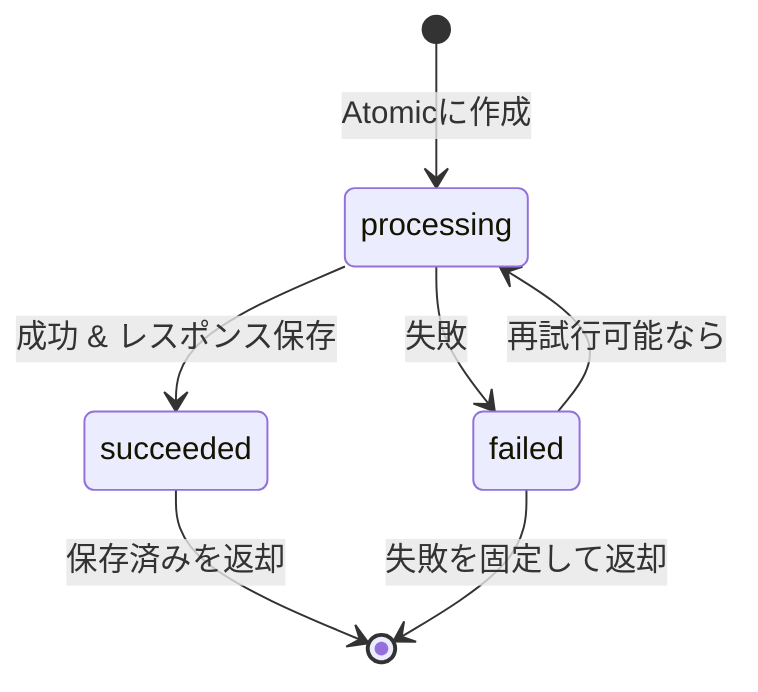

# 第17章：止め方② ロック/原子的操作（Atomic）で“同時を捌く”🔒⚡

## 17.1 この章のゴール🎯✨

* 「ロック🔒」と「原子的操作⚡（Atomic）」が**何のためにあるか**を説明できる🙂
* **同じIdempotency-Keyが“同時に”飛んできても**、処理が二重実行されない設計がわかる🔁
* `processing / succeeded / failed` の**状態遷移**で、先着1リクエストだけ実行できる✌️


---

## 17.2 まず結論（超大事）📌💡

冪等性の“最難関”はここ👇
**「同じキーのリクエストが同時に2つ来た」**ときに、両方が処理を進めちゃう事故😵‍💫💥

だから、実務の王道はこれ👇

1. **先着1名だけ「processing」を取る**（Atomicに）⚡
2. 先着じゃない人は

   * すでに `succeeded` なら **保存済みレスポンスを返す**📦
   * まだ `processing` なら **“処理中”として返す**（例：202）⏳
   * `failed` なら **失敗を返す／再試行可にする**（方針次第）🧯

---

## 17.3 “同時”ってどういうこと？（Node/TSあるある）🧵😇

「JavaScriptって1スレッドでしょ？ 同時って起きるの？」って思うよね🙂
でも、**awaitをまたぐ**とこうなる👇

* リクエストAが途中で `await payment()` で止まる
* その間に、リクエストBが同じキーで入ってくる
* AもBも「まだレコード無いじゃん！」って判断しちゃうと…
  **二重決済💳💳 / 二重注文🧾🧾** が起きる😱

この“同時”をさばくのが
**ロック🔒** と **Atomic⚡** だよ〜！

---

## 17.4 ロック🔒とAtomic⚡のざっくり定義

### ロック🔒

* 「今このデータ触ってるの私だから、他の人はちょい待ってね🙅‍♀️」ってする仕組み
* 例：Mutex（ミューテックス）、DBの行ロック、Redisロック など

### Atomic（原子的操作）⚡

* 「確認して→更新する」を**1回の動作として絶対に割り込まれない**ようにすること✨
* 例：

  * DBで `UPDATE ... WHERE status='new'` みたいに **条件付き更新で先着を決める**
  * Redisで `SET key value NX PX ...` みたいに **“無ければ作る”を一撃でやる**（NX）([Redis][1])

---

## 17.5 今日の周辺知識（なるべく新しめ）🆕📚

* Node.js は **v24がActive LTS**、v25がCurrent という位置づけ（2026-01頃の情報）([Node.js][2])
* TypeScript は公式リリースノートで **5.9** の項目が公開され、`tsc --init` のデフォルトなどが更新されてるよ🛠️([typescriptlang.org][3])

  * 公式GitHub Releasesには 5.8.x 系の安定版タグも確認できるよ📦([GitHub][4])

> ※章の主役は「同時実行をどう安全に止めるか」なので、フレームワーク差より“設計”を優先していくよ🙂🔒⚡

---

## 17.6 状態遷移を決めよう（processing/succeeded/failed）🔁📋
 


まずは“脳内ルール”を固定するのが勝ち🏆✨
おすすめの状態はこの3つ👇

* `processing`：今まさに処理中⏳
* `succeeded`：成功してレスポンス保存済み✅📦
* `failed`：失敗した（方針により保存）❌🧯

### 状態遷移（王道パターン）🧠✨

| いまの状態      | 同じキーが来たら               | 返すもの                 |
| ---------- | ---------------------- | -------------------- |
| レコードなし     | **先着が processing を作る** | 先着：処理続行🚀            |
| processing | **二人目以降は待ち**           | 202（処理中）や、短いポーリング案内⏳ |
| succeeded  | **保存済みレスポンスを返す**       | 200 + 同じ結果📦         |
| failed     | 方針次第（失敗も固定で返す／再試行）     | 4xx/5xx など🧯         |



---


---

## 17.7 実装パターン3段階（小→大）🪜✨

同時実行対策はスケールに合わせて変わるよ🙂

### ① 1プロセス内だけ守れればOK：SingleFlight（同一キーの同時実行を1回にまとめる）🛫🔁

* 同じキーが同時に来たら、**最初のPromiseをみんなで共有**しちゃう作戦✨
* 単体のNodeプロセスで動くミニアプリなら超便利！

```ts
type Key = string;

export class SingleFlight<T> {
  private inFlight = new Map<Key, Promise<T>>();

  async do(key: Key, fn: () => Promise<T>): Promise<T> {
    const existing = this.inFlight.get(key);
    if (existing) return existing;

    const p = (async () => {
      try {
        return await fn();
      } finally {
        // 成功でも失敗でも必ず消す（超大事）🧹
        this.inFlight.delete(key);
      }
    })();

    this.inFlight.set(key, p);
    return p;
  }
}
```

✅いいところ

* 実装が軽い✨
* “同時に20回”来ても処理は1回にできる🔁

⚠️注意

* **サーバーが複数台**になると、各台で別々に走っちゃう😵‍💫
  → 複数台なら②③へ！

---

### ② 1プロセス内で“排他”したい：Mutex（async-mutex等）🔒🧵

「同じ注文IDを触る処理は、必ず1個ずつにしたい！」みたいな時に便利🙂
`async-mutex` は “asyncの作業をmutexで守る” 目的のライブラリだよ([GitHub][5])

```ts
import { Mutex } from "async-mutex";

const locks = new Map<string, Mutex>();

function getMutex(name: string): Mutex {
  const existing = locks.get(name);
  if (existing) return existing;

  const m = new Mutex();
  locks.set(name, m);
  return m;
}

export async function withOrderLock<T>(orderId: string, fn: () => Promise<T>): Promise<T> {
  const mutex = getMutex(orderId);
  return mutex.runExclusive(async () => {
    return await fn();
  });
}
```

✅コツ

* `runExclusive` の中は **短く**✂️（ロック時間が長いと渋滞🚗🚗🚗）
* `finally` 相当で必ず解放される形にする（上の例はOK）🙆‍♀️

⚠️注意

* これも**複数台**だと効かない（メモリが別）😇

---

### ③ 複数台でも守りたい：DBのAtomic更新 or Redisロック🌍🔒⚡

ここからが“実務感”✨
**同時に来た2つのリクエストのうち、先着1名だけが通る**仕組みを、DB/Redisの力で作るよ💪

#### ③-A DBで先着を決める（条件付きUPDATEが強い）🗄️⚡

考え方はこれ👇

* `status='new'` の時だけ `processing` に変更する
* 変更できた人が先着🏁
* 変更できなかった人は「誰かが先に取ったな」とわかる🙂

（SQLの雰囲気）

```sql
UPDATE idempotency_requests
SET status = 'processing', locked_at = NOW()
WHERE key = $1 AND status = 'new';
-- 更新件数が 1 なら先着、0 なら負け！
```

さらにガチにやるなら、トランザクション＋行ロックもあるよ🔒
`SELECT ... FOR UPDATE` は「選んだ行を更新されないようにロック」できる（PostgreSQLの公式ドキュメント）([PostgreSQL][6])

#### ③-B Redisでロック（SET NX PX）🧰⚡

Redisなら「キーが無い時だけ作る」NXが使えるよ✨
`SET key value NX` は “無いなら取る” を一撃でできる！([Redis][1])

例（雰囲気）

```ts
// ロック取得（成功したら true みたいな感じ）
SET lockKey token NX PX 10000
```

⚠️超大事：分散ロックは“難しい世界”😵‍💫

* Redis公式は Redlock を紹介してる([Redis][7])
* 一方で「安全性に注意が必要」という有名な批判もある（fencing token等の話）([martin.kleppmann.com][8])

なので入門の結論はこれ👇

* **まずDBのAtomic更新（③-A）**が扱いやすくておすすめ🗄️⚡
* Redisロックは、仕組みと落とし穴を理解してから使う🔒🧠

---

## 17.8 ミニ注文APIに落とす（“先着1名だけ実行”をやってみる）🍰🧾💳

ここでは「同じIdempotency-Keyの注文確定」をイメージするよ🙂

### データ（保存したいもの）📦

* `key`（例：userId + idempotencyKey）🔑
* `status`（processing/succeeded/failed）🔁
* `response`（成功時のレスポンス）📦
* `error`（失敗も固定で返すなら）🧯
* `createdAt / updatedAt / lockedAt`（タイムアウト救出に使う）⏱️

### ざっくり処理フロー（擬似）🧠✨

1. 受け取ったキーでレコードを見る👀
2. なければ **processing を取りに行く**（Atomicで！）⚡
3. 取れた人だけ、決済っぽい処理を実行💳
4. 成功したら `succeeded` にしてレスポンス保存📦✅
5. 失敗したら `failed`（保存するかは方針）🧯

---

## 17.9 まずは“メモリ版”で練習（状態＋SingleFlight）🧪✨

「processing を取る」練習として、メモリで雰囲気を作るよ🙂
（本番はDBに置き換えるイメージ🗄️）

```ts
type Status = "processing" | "succeeded" | "failed";

type OrderResult = {
  orderId: string;
  paid: boolean;
};

type IdempotencyRecord =
  | { status: "processing"; startedAt: number }
  | { status: "succeeded"; finishedAt: number; result: OrderResult }
  | { status: "failed"; finishedAt: number; errorCode: string; message: string };

const store = new Map<string, IdempotencyRecord>();

const sleep = (ms: number) => new Promise((r) => setTimeout(r, ms));

export async function confirmPaymentLike(key: string): Promise<OrderResult> {
  const existing = store.get(key);

  if (existing?.status === "succeeded") {
    return existing.result; // ✅同じ結果を返す
  }

  if (existing?.status === "processing") {
    // ⏳本来は 202 を返して「あとで同じキーで再試行してね」でもOK
    // ここでは簡単に「少し待ってからもう一回見る」方式にしてるよ🙂
    await sleep(50);
    const again = store.get(key);
    if (again?.status === "succeeded") return again.result;
    throw new Error("Still processing"); // 教材用
  }

  // ここに来た人が「processing を取る」🏁
  store.set(key, { status: "processing", startedAt: Date.now() });

  try {
    // 💳決済っぽい処理（時間がかかる想定）
    await sleep(200);

    const result: OrderResult = { orderId: "order_" + Math.random().toString(16).slice(2), paid: true };
    store.set(key, { status: "succeeded", finishedAt: Date.now(), result });
    return result;
  } catch (e) {
    store.set(key, { status: "failed", finishedAt: Date.now(), errorCode: "PAYMENT_FAILED", message: "failed" });
    throw e;
  }
}
```

⚠️この実装、同時に2つ入ると「processing取るところ」が危ないことがあるよね😵‍💫
だから本番はここを **Atomicに**（DB/Redis）する！

---

## 17.10 “Atomicでprocessingを取る”ってこういう感覚（DB版のイメージ）🗄️⚡

ここがこの章の核心🧠✨
（SQLは雰囲気、クエリビルダーでも同じ考え方だよ🙂）

### 方式A：条件付きUPDATEで先着決定🏁

* `status='new'` の時だけ `processing` にできる
* 更新件数が 1 → 先着
* 更新件数が 0 → 誰かが先に取った

### 方式B：行ロック（SELECT … FOR UPDATE）で“読んだ瞬間にロック”🔒

* トランザクション内で行をロックしてから判断できる
* PostgreSQLでは `SELECT ... FOR UPDATE` が行レベルロックとして説明されてるよ([PostgreSQL][6])

---

## 17.11 演習📝🌸（手を動かすやつ！）

### 演習1：状態遷移を書こう✍️🔁

次のケースで、**返すHTTPステータス**と**次の状態**を埋めてみてね🙂

1. レコードなし → 先着が処理開始
2. `processing` のときに同じキーが来た
3. `succeeded` のときに同じキーが来た
4. `failed` のときに同じキーが来た（保存する派／しない派の2通りで）

### 演習2：同時に10回叩いても“結果が1つ”になるテスト🧪🔁

Vitestは 4.0 が出てるよ（2025-10頃）([vitest.dev][9])

```ts
import { describe, it, expect } from "vitest";
import { confirmPaymentLike } from "./confirmPaymentLike";

describe("idempotency concurrency", () => {
  it("same key concurrently should produce single success result", async () => {
    const key = "user1:idem-123";

    // 同時に10回！😆
    const results = await Promise.all(
      Array.from({ length: 10 }, async () => {
        try {
          return await confirmPaymentLike(key);
        } catch {
          return null; // 教材用：processing中エラーを無視
        }
      })
    );

    const succeeded = results.filter((x) => x !== null);
    // succeededが複数あっても、最終的に同じ結果になってる設計が理想💡
    // （ここでは簡略化してるので、次の章以降で改善していこう🙂）
    expect(succeeded.length).toBeGreaterThan(0);
  });
});
```

---

## 17.12 AI活用🤖✨（この章で効く使い方）

### ① 状態遷移表を作らせる📋

* 「processing/succeeded/failedの状態遷移を、HTTPステータス込みで表にして」
* その後に自分でチェック✅（“processing中は202にする？”など判断練習！）

### ② DBのAtomic更新案を複数出させる🗄️⚡

* 「条件付きUPDATEで先着を決めるSQL案を3つ」
* 「SELECT FOR UPDATE を使う版も」
* ただし、**トランザクションを長くしない**注意点もセットで聞く👂🔒 ([PostgreSQL][6])

### ③ Redisロックの注意点をまとめさせる🔒🌍

* 「SET NX PXを使うロックのやり方」
* 「なぜ分散ロックは難しいの？」（fencing token も含めて）([Redis][1])

---

## 17.13 この章のチェックリスト✅🔒⚡

* [ ] 同じキーが**同時に2本**来ても、**先着1本だけ**が処理する？🏁
* [ ] `processing` の間、後続は **202/待機/ポーリング**などの方針がある？⏳
* [ ] 成功時は **同じレスポンスを返せる**（保存 or 再計算しない）？📦
* [ ] ロックやトランザクションは **短く**できてる？🚗💨
* [ ] ロックが“取りっぱなし”になる事故に備えて **TTL/救出策**がある？⏱️🧯
* [ ] テストで「2回」「10回」「同時」をやってる？🧪🔁

[1]: https://redis.io/docs/latest/commands/set/?utm_source=chatgpt.com "SET | Docs"
[2]: https://nodejs.org/en/about/previous-releases?utm_source=chatgpt.com "Node.js Releases"
[3]: https://www.typescriptlang.org/docs/handbook/release-notes/typescript-5-9.html "TypeScript: Documentation - TypeScript 5.9"
[4]: https://github.com/microsoft/typescript/releases?utm_source=chatgpt.com "Releases · microsoft/TypeScript"
[5]: https://github.com/DirtyHairy/async-mutex?utm_source=chatgpt.com "A mutex for synchronizing async workflows in Javascript"
[6]: https://www.postgresql.org/docs/current/explicit-locking.html?utm_source=chatgpt.com "Documentation: 18: 13.3. Explicit Locking"
[7]: https://redis.io/docs/latest/develop/clients/patterns/distributed-locks/?utm_source=chatgpt.com "Distributed Locks with Redis | Docs"
[8]: https://martin.kleppmann.com/2016/02/08/how-to-do-distributed-locking.html?utm_source=chatgpt.com "How to do distributed locking"
[9]: https://vitest.dev/blog/vitest-4?utm_source=chatgpt.com "Vitest 4.0 is out!"

