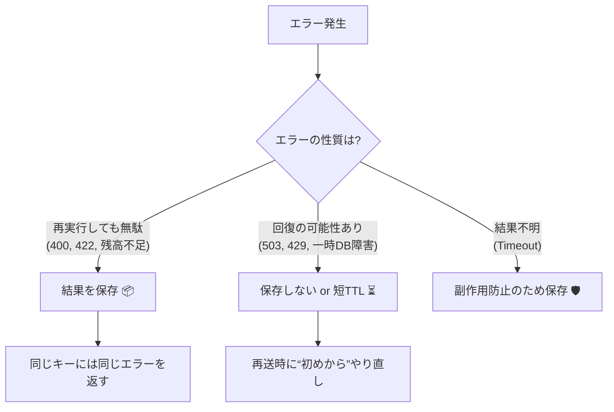

# 第19章：失敗結果も保存する？（冪等 × エラー保存戦略）🧠📦

## 🎯この章のゴール

* 「失敗（エラー）も保存する/しない」を **ケース別に判断**できるようになる✨
* 同じ `Idempotency-Key` で来たときに、**どんなレスポンスを返すのが安全か**説明できるようになる🔁
* ミニ注文APIで「エラー保存」を **TypeScriptで実装**できるようになる🧑‍💻💕


---

## 1) まず結論：エラー保存、するの？しないの？🤔

結論は **「失敗の種類による」** だよ〜！🌸

* ✅ **保存したい失敗**：入力ミス・在庫不足・残高不足など、**同じ入力なら結果が変わらない系**
* ⚠️ **慎重な失敗**：タイムアウト・503・一時的な外部API障害など、**時間が経つと成功しうる系**

でもね、実務では「とにかく同じキーなら同じ結果を返す」設計もよくあるよ。Stripeは **最初の結果（成功/失敗/500含む）を保存して、同じキーなら同じレスポンス**を返す方式を説明してるよ。 ([Stripeドキュメント][1])

---

## 2) 失敗結果を保存するメリット👍✨

### ✅メリットA：二重実行を止められる（副作用が怖い系に強い）💳🧨

決済・注文確定・ポイント付与…みたいな「1回でも副作用が出たら怖い」操作は、
**“失敗っぽく見えても、実は裏で成功してた”** が起きがち😇🌧️
だから **同じキーで再実行させない**のが安全になりやすい！

### ✅メリットB：クライアントが迷わない（同じキー＝同じ結果）🧭

「さっきは400だったのに、同じキーで送ったら201になった」みたいなのは混乱のもと😵‍💫
**同じキーなら同じ結果**は、APIとしてすごく予測しやすい📜✨

### ✅メリットC：ムダな負荷が減る（リトライ嵐を抑える）🌪️➡️🍃

同じ処理を何回も走らせないから、サーバーにも外部APIにも優しい🥹💕

---

## 3) 失敗結果を「保存しない」メリット⚡

### ✅メリットA：一時的な失敗から自然回復できる🌈

たとえば一時的な外部障害で503だったのに、
同じキーで来たら **ずっと503固定**になっちゃうと、ユーザー体験が微妙…🥲

### ✅メリットB：「時間が経てば成功」系に強い🕒

429（レート制限）や一時的タイムアウトは、
“少し待って再試行” が正解のことが多いよね🔁
AWSも「一時的失敗はリトライ、恒久的失敗はリトライしない」方向の考え方を整理してるよ。 ([AWS ドキュメント][2])

---

## 4) 判断の軸（これだけ覚えれば強い）🧠🪄

エラーが来たとき、次の5つで考えると迷いにくいよ✨

1. **同じ入力なら結果は本当に変わらない？**（入力不正・残高不足は変わらないことが多い）🧾
2. **副作用が“起きた可能性”がある？**（決済・注文確定は怖い）💥
3. **クライアントが直すべき？待つべき？**（400は直す、503は待つ）🧑‍🔧🕒
4. **同じキーで“再実行”させたい？それとも“結果照会”にしたい？**🔍
5. **エラー内容に個人情報や内部情報が混ざらない？**（保存するなら要注意）🔒


---

## 5) ざっくり早見表（ミニ注文API想定）📋✨

| エラーの種類    | 例            |     保存おすすめ？ | 理由                        | よくある挙動                                      |
| --------- | ------------ | ----------: | ------------------------- | ------------------------------------------- |
| 入力不正      | 400 / 422    |         ✅保存 | 同じ入力ならずっとNG。再実行されても困る     | 同じキー→同じエラー固定                                |
| 在庫不足/残高不足 | 409 / 402 など | ✅保存（短〜中TTL） | “同じ注文内容の同じ試行”として固定したい     | 新しい試行は新キーで                                  |
| 認証/権限     | 401 / 403    |   ✅保存（短TTL） | 同じ条件なら同じ結果                | トークン更新は別リクエスト/別キー                           |
| レート制限     | 429          |        ⚠️慎重 | 時間で回復する                   | 保存するなら短TTLや再試行設計                            |
| 一時的障害     | 503 / タイムアウト |        ⚠️慎重 | 回復したら成功しうる                | 「処理中」扱い or 再試行OK設計                          |
| サーバー内部エラー | 500          |        方針次第 | “最初の結果固定”に寄せるか、“再実行”に寄せるか | Stripeは同じキー→同じ結果（500含む） ([Stripeドキュメント][1]) |

---

## 6) 実装方針は2択（どっちもアリ）🔁🧩

### 方針A：**最初のレスポンスを保存して固定**（シンプル✨）

* ✅実装が簡単
* ✅「同じキー＝同じ結果」で迷いにくい
* ⚠️一時的障害でも固定される（成功させたいなら新しいキーが必要になりがち）

この考え方はStripeの説明と近いよ（成功/失敗/500含めて、同じキーなら同じ結果を返す）。 ([Stripeドキュメント][1])

### 方針B：**一時的失敗は固定しない（再実行できる余地を残す）**（実務寄り⚙️）

* ✅回復後に同じキーで成功できる可能性
* ⚠️設計が少し難しい（状態管理が要る）



---

## 7) ミニ注文API：エラー保存つき “冪等ストア” 実装（方針A）🧑‍💻📦

### ✅データ構造（成功/失敗どっちも保存）

```ts
type StoredResponse = {
  statusCode: number;
  body: unknown; // 実務では JSON だけに絞ると楽
  headers?: Record<string, string>;
};

type IdempotencyRecord =
  | {
      status: "processing";
      requestHash: string;
      createdAt: number;
      expiresAt: number;
    }
  | {
      status: "completed";
      requestHash: string;
      createdAt: number;
      expiresAt: number;
      response: StoredResponse; // 成功でも失敗でもここに保存
    };
```

### ✅超シンプルなメモリストア（TTLつき）

```ts
import crypto from "node:crypto";

export class InMemoryIdempotencyStore {
  private map = new Map<string, IdempotencyRecord>();

  constructor(private readonly ttlMs: number) {}

  get(key: string): IdempotencyRecord | undefined {
    const rec = this.map.get(key);
    if (!rec) return;
    if (Date.now() > rec.expiresAt) {
      this.map.delete(key);
      return;
    }
    return rec;
  }

  // 先に processing を置けた人が勝ち（同時実行対策の超入門版）
  tryBegin(key: string, requestHash: string): { ok: true } | { ok: false; existing: IdempotencyRecord } {
    const existing = this.get(key);
    if (existing) return { ok: false, existing };

    const now = Date.now();
    this.map.set(key, {
      status: "processing",
      requestHash,
      createdAt: now,
      expiresAt: now + this.ttlMs,
    });
    return { ok: true };
  }

  complete(key: string, requestHash: string, response: StoredResponse): void {
    const now = Date.now();
    this.map.set(key, {
      status: "completed",
      requestHash,
      createdAt: now,
      expiresAt: now + this.ttlMs,
      response,
    });
  }
}

export function sha256Json(value: unknown): string {
  const json = JSON.stringify(value); // 実務は「順序固定」したいけど今回は入門でOK
  return crypto.createHash("sha256").update(json).digest("hex");
}
```

### ✅ハンドラー例（Express想定の雰囲気）

ポイントはこれ👇

* 1回目：`processing` を置いて処理→結果（成功/失敗）を `completed` で保存
* 2回目以降：保存済みレスポンスをそのまま返す🔁

```ts
import type { Request, Response } from "express";
import { InMemoryIdempotencyStore, sha256Json } from "./idempotency-store.js";

const store = new InMemoryIdempotencyStore(24 * 60 * 60 * 1000); // 24h 例
// Stripeは「キーは24時間で期限切れ」と説明しているよ :contentReference[oaicite:4]{index=4}

function getUserId(req: Request): string {
  // 今回は例。認証済みで userId が取れる前提の雰囲気
  return String(req.header("X-User-Id") ?? "anonymous");
}

export async function createOrder(req: Request, res: Response) {
  const idemKey = req.header("Idempotency-Key");
  if (!idemKey) {
    return res.status(400).json({ message: "Idempotency-Key is required" });
  }

  const userId = getUserId(req);
  const storeKey = `${userId}:${idemKey}`;

  const requestHash = sha256Json({
    path: req.path,
    method: req.method,
    body: req.body,
  });

  const started = store.tryBegin(storeKey, requestHash);

  // すでに同じキーがある
  if (!started.ok) {
    const existing = started.existing;

    // キーの使い回し（別内容）を検知したいならここで弾く
    if (existing.requestHash !== requestHash) {
      return res.status(409).json({
        message: "Idempotency-Key was already used with a different request body",
      });
    }

    if (existing.status === "processing") {
      // 「まだ処理中」パターン：202で待ってもらうのが分かりやすい
      return res.status(202).json({ message: "Processing. Please retry later." });
    }

    // completed：成功でも失敗でも保存済みを返す
    const { statusCode, body, headers } = existing.response;
    if (headers) {
      for (const [k, v] of Object.entries(headers)) res.setHeader(k, v);
    }
    return res.status(statusCode).json(body);
  }

  // ここからが「1回目の本処理」
  try {
    // --- 例：注文作成っぽい処理（本物はDBや決済API） ---
    // 入門なので「たまたま失敗する」も作れるよ
    const amount = Number(req.body?.amount ?? 0);
    if (!Number.isFinite(amount) || amount <= 0) {
      const errorBody = { message: "amount must be a positive number" };
      store.complete(storeKey, requestHash, { statusCode: 422, body: errorBody });
      return res.status(422).json(errorBody);
    }

    // 成功レスポンス
    const okBody = { orderId: crypto.randomUUID(), status: "created", amount };
    store.complete(storeKey, requestHash, { statusCode: 201, body: okBody });
    return res.status(201).json(okBody);
  } catch (e) {
    // 500でも「最初の結果」を保存して固定する（方針A）
    const errorBody = { message: "internal error" };
    store.complete(storeKey, requestHash, { statusCode: 500, body: errorBody });
    return res.status(500).json(errorBody);
  }
}
```

---

## 8) 方針Aの注意点（ここだけは押さえてね）⚠️🧷

### ✅「回復したら成功できる」エラーでも固定される可能性

例えば外部APIが一時障害で500になったら、同じキーはずっと500固定になりがち🥲
その代わり **二重実行の危険は減る**。

### ✅TTLは「最大リトライ期間」を見て決める🕒

* Stripeの例では **24時間**の期限が示されてるよ ([Stripeドキュメント][3])
* たとえばOpenAIのWebhookは、失敗時に **最大72時間リトライ**する説明があるよ（指数バックオフ） ([OpenAI Platform][4])
  → もしWebhook受信の冪等をやるなら、TTLは72h以上が安心なこともある📮✨

---

## 9) 📝ミニ演習：保存する？しない？ジャッジ練習🎯

次のケースで「保存する/しない/短TTLで保存」どれにするか決めてみてね✍️💕（理由も1行で！）

1. 422（入力ミス）📛
2. 409（在庫不足）📦
3. 429（レート制限）🚦
4. 503（外部決済が一時停止）💳
5. 500（内部エラー、でも“決済が実は成功してたかも”が怖い）😱

---

## 10) 🤖AI活用：判断力を爆上げするプロンプト集✨

### ケース判定（おすすめ）

* 「次のエラーは **恒久的/一時的/結果不明** のどれ？理由も添えて：…」🧠
* 「冪等キー方式で、**失敗レスポンスを保存するべきケース**を具体例つきで10個出して」🔁

### テスト生成（めちゃ便利）

* 「このAPIの冪等性テストケースを、**同一キー2回/10回/同時実行/別ボディ同一キー**で列挙して」🧪
* 「“処理中(202)”のときクライアントはどう振る舞うべき？疑似コードで」⏳

---

## ✅まとめ（この章の覚えどころ）🌸

* エラー保存は **「同じキー＝同じ結果」** を作れて強い🔁✨
* ただし **一時的エラー（429/503/タイムアウト）** は固定すると辛いこともある⚠️
* 迷ったら、まずは **方針A（最初の結果を保存して固定）** で安全側に倒すのが入門としてはおすすめ（Stripeもこの思想を説明） ([Stripeドキュメント][1])
* TTLは **システムの最大リトライ期間** を見て決める（Webhook系は長めになりがち）📮🕒 ([OpenAI Platform][4])

[1]: https://docs.stripe.com/api/idempotent_requests?utm_source=chatgpt.com "Idempotent requests | Stripe API Reference"
[2]: https://docs.aws.amazon.com/lambda/latest/dg/durable-best-practices.html?utm_source=chatgpt.com "Best practices for Lambda durable functions"
[3]: https://docs.stripe.com/error-low-level?utm_source=chatgpt.com "Advanced error handling - Stripe API"
[4]: https://platform.openai.com/docs/guides/webhooks?utm_source=chatgpt.com "Webhooks | OpenAI API"

