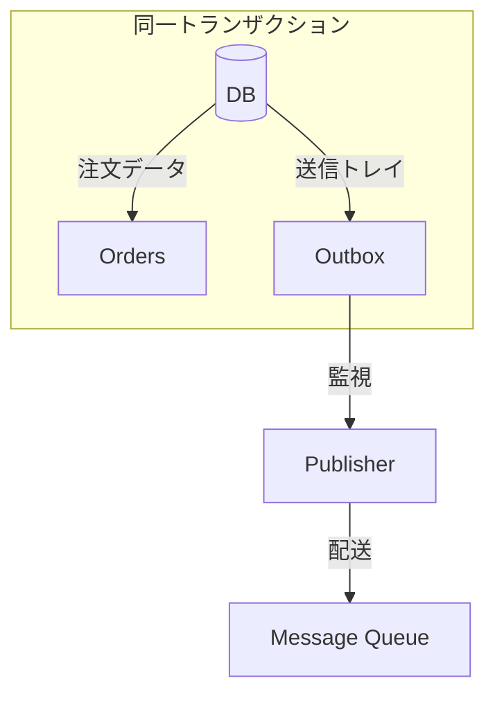

# 第22章：Outboxと冪等性（取りこぼし/二重送信を減らす）🤝🗃️

## 🎯この章のゴール

* 「DB更新」と「イベント送信」を**ズラさず**に、事故（取りこぼし・二重送信）を減らす考え方がわかる🧠✨
* **Outbox（送信トレイ）**の基本構造（テーブル設計・処理フロー）が説明できる🗃️📮
* TypeScriptで「ミニ注文API」に **Outboxを足す実装イメージ**が持てる🧑‍💻🔁


---

## 1. まず結論：Outboxは「二重書き（dual write）の事故」を減らす仕組み🧯

サービスの中で、こんなことしたいよね👇

* DBに注文を保存する🗄️
* 同時に「注文作成イベント」を他の仕組みへ通知する📣（キュー/イベントバス/他サービスへ）

でも、**DB保存とイベント送信は別物**。ここで事故る😭

### 😱事故パターンA：DBは成功、イベント送信が失敗（取りこぼし）

1. DBに注文INSERT✅
2. イベント送信しようとしたらタイムアウト/落ちた💥
   → **DBにはあるのに通知されない**（他サービスが気づけない）😵

### 😱事故パターンB：イベント送信は成功、DBがロールバック（ウソ通知）

1. イベント送信しちゃった📣
2. DBのトランザクションが失敗してロールバック💥
   → **存在しない注文の通知が飛ぶ**😇

こういう「二重書き（dual write）」問題を避ける定番が **Transactional Outbox** だよ💡 ([AWS ドキュメント][1])

---

## 2. Outboxってなに？（超やさしく）📮

**Outbox = “送るべきイベント”をDBにいったん保管する箱**🗃️✨

ポイントはこれ👇

✅ **業務データの更新（orders等）**
✅ **Outboxテーブルへのイベント記録（outbox等）**
この2つを **同じDBトランザクションで一緒にコミット**する🔒

Debeziumの説明でも、Outboxは「内部状態（DB）とイベントの不整合を避ける」ための方法として説明されてるよ📚 ([Debezium][2])



---


---

## 3. 全体像：Outbox方式の“王道フロー”🧩

### 🧠登場人物

* **API（注文作成）**：DB更新＋Outbox記録を同時に行う
* **Publisher（中継屋さん）**：Outboxを読んでメッセージを送る（別プロセス/別スレッドでもOK）
* **Consumer（受け取り側）**：重複が来る前提で冪等に処理する（ここ超大事）🔁

### 🗺️図にするとこんな感じ

* API：

  * ordersにINSERT 🧾
  * outboxにINSERT 🗃️
  * COMMIT ✅
* Publisher：

  * outboxから未送信を取得👀
  * メッセージ送信📨
  * 送信済みに更新✅


**メッセージングは “少なくとも1回配送（at-least-once）” が普通**で、重複が起きうるよ〜って話はイベント駆動の定番📮📨 ([event-driven.io][3])
だから **Outbox（送る側の堅牢化）＋受け取り側の冪等** がセットで効くの💪

---

## 4. ここが本題：Outboxと「冪等性」がどう繋がるの？🔁🤝

Outboxを入れると…

* ✅ **取りこぼし**はかなり減る（DBにイベントが残るから再送できる）🧯
* でも！
* ❗ **二重送信（重複配送）**は普通に起こりうる（Publisherのリトライ、ブローカー仕様など）📨📨

なので、**冪等性は“受け取り側”でも必要**🔥
「同じイベントを2回処理しても、業務的には1回分の効果になる」状態を作る✌️

---

## 5. Outboxテーブル設計（まずはこれだけ押さえよ）🗃️🔑

最小でも欲しい項目はこんな感じ👇

* `id`：イベントID（UUID）🆔
* `eventType`：何のイベント？（OrderCreatedなど）🏷️
* `aggregateId`：対象ID（orderIdなど）🧾
* `payload`：送る中身（JSON）📦
* `status`：未送信/処理中/送信済み/失敗 など🚦
* `attempts`：リトライ回数🔁
* `nextAttemptAt`：次いつ再送する？⏰
* `createdAt` / `publishedAt`：監査ログ的に便利🕵️‍♀️

---

## 6. 実装イメージ（PostgreSQL + TypeScript）🧑‍💻🪟

### 6.1 SQL（orders と outbox）

```sql
CREATE TABLE orders (
  id           uuid PRIMARY KEY,
  user_id      uuid NOT NULL,
  amount       integer NOT NULL,
  status       text NOT NULL,
  created_at   timestamptz NOT NULL DEFAULT now()
);

CREATE TABLE outbox (
  id              uuid PRIMARY KEY,
  event_type      text NOT NULL,
  aggregate_id    uuid NOT NULL,
  payload         jsonb NOT NULL,
  status          text NOT NULL DEFAULT 'PENDING', -- PENDING / PROCESSING / PUBLISHED / FAILED
  attempts        integer NOT NULL DEFAULT 0,
  next_attempt_at timestamptz NOT NULL DEFAULT now(),
  created_at      timestamptz NOT NULL DEFAULT now(),
  published_at    timestamptz
);

CREATE INDEX outbox_pending_idx
  ON outbox(status, next_attempt_at, created_at);
```

### 6.2 「注文作成」＝DB更新＋Outbox記録を同一トランザクションで✅

```ts
import { Pool } from "pg";
import { randomUUID } from "crypto";

const pool = new Pool({ connectionString: process.env.DATABASE_URL });

type OrderCreatedPayload = {
  orderId: string;
  userId: string;
  amount: number;
  occurredAt: string;
};

export async function createOrder(userId: string, amount: number) {
  const orderId = randomUUID();
  const outboxId = randomUUID();

  const payload: OrderCreatedPayload = {
    orderId,
    userId,
    amount,
    occurredAt: new Date().toISOString(),
  };

  const client = await pool.connect();
  try {
    await client.query("BEGIN");

    await client.query(
      `INSERT INTO orders (id, user_id, amount, status)
       VALUES ($1, $2, $3, $4)`,
      [orderId, userId, amount, "CREATED"]
    );

    await client.query(
      `INSERT INTO outbox (id, event_type, aggregate_id, payload)
       VALUES ($1, $2, $3, $4::jsonb)`,
      [outboxId, "OrderCreated", orderId, JSON.stringify(payload)]
    );

    await client.query("COMMIT");
    return { orderId };
  } catch (e) {
    await client.query("ROLLBACK");
    throw e;
  } finally {
    client.release();
  }
}
```

ここが Outbox のキモ👇
**「ordersのINSERT」と「outboxのINSERT」が同じCOMMITに乗ってる**から、ズレ事故を減らせる🧷 ([AWS ドキュメント][1])

---

## 7. Publisher（Outbox中継）を作ろう📮➡️📨

Publisherは「未送信を拾って送る係」だよ💌
複数台で動かすときは、同じ行を奪い合わない工夫が必要！

### 7.1 競合に強い取り方：`FOR UPDATE SKIP LOCKED` 🔒

PostgreSQLならこれが超定番✨
ロックされてる行は飛ばして取れるから、複数ワーカーで回しても詰まりにくいよ👍 ([milanjovanovic.tech][4])

```ts
type OutboxRow = {
  id: string;
  event_type: string;
  aggregate_id: string;
  payload: any;
};

async function publishToBus(row: OutboxRow) {
  // ここは本来 Kafka / RabbitMQ / SQS / PubSub などに送る
  // 今回は「送ったことにする」だけ😇
  console.log("PUBLISH", row.event_type, row.aggregate_id, row.id);
}

export async function runOutboxPublisherOnce(batchSize = 20) {
  const client = await pool.connect();

  // ① まずDB内で「送信対象の確保」だけやる（短いトランザクション）
  let rows: OutboxRow[] = [];
  try {
    await client.query("BEGIN");

    const res = await client.query(
      `
      SELECT id, event_type, aggregate_id, payload
      FROM outbox
      WHERE status = 'PENDING'
        AND next_attempt_at <= now()
      ORDER BY created_at
      FOR UPDATE SKIP LOCKED
      LIMIT $1
      `,
      [batchSize]
    );

    rows = res.rows;

    if (rows.length > 0) {
      const ids = rows.map(r => r.id);
      await client.query(
        `UPDATE outbox SET status = 'PROCESSING' WHERE id = ANY($1::uuid[])`,
        [ids]
      );
    }

    await client.query("COMMIT");
  } catch (e) {
    await client.query("ROLLBACK");
    throw e;
  } finally {
    client.release();
  }

  // ② ネットワーク送信はDBロック外でやる（ここ大事）📨
  for (const row of rows) {
    try {
      await publishToBus(row);

      await pool.query(
        `UPDATE outbox
         SET status = 'PUBLISHED', published_at = now()
         WHERE id = $1`,
        [row.id]
      );
    } catch (e) {
      // 失敗したらリトライ予約（雑に指数バックオフ例）
      await pool.query(
        `
        UPDATE outbox
        SET status = 'PENDING',
            attempts = attempts + 1,
            next_attempt_at = now() + (interval '1 second' * LEAST(60, 2 ^ attempts))
        WHERE id = $1
        `,
        [row.id]
      );
    }
  }
}
```

✅ポイントまとめ

* **ロックは短く**（取得→PROCESSING更新→コミット）
* 送信処理はロック外で📨
* 失敗したら `nextAttemptAt` で再送予約⏰

---

## 8. でも重複は起きる！だから「受け取り側冪等」が必須🔁💥

Outboxを入れると「取りこぼし」は減るけど、**重複配送は残る**よ📨📨
at-least-once配送の世界では普通だからね😇 ([event-driven.io][3])

### ✅受け取り側でやること（最小）

* イベントID（`outbox.id`）を **processedテーブルに保存**
* `eventId` が **すでに処理済みならスキップ**する

（これがいわゆる Inbox / Idempotent Receiver 方向の発想だよ🧠）

---

## 9. よくある落とし穴（ここ踏むと泣く😭）🕳️

### 落とし穴①：Outbox送信を「同じトランザクションで外部送信」しようとする

DBトランザクション中に外部送信し始めると、

* 遅い
* ロック長い
* 最悪、DB詰まる
  になりがち😵

### 落とし穴②：Publisherが1台前提で設計しちゃう

後からスケールすると地獄👹
最初から `SKIP LOCKED` とか、競合前提で作るのが安全🛡️ ([milanjovanovic.tech][4])

### 落とし穴③：payloadが巨大・個人情報モリモリ

Outboxはログっぽく残るので、

* payload最小化📦
* 個人情報は入れすぎない🔒
  を意識しよ〜

---

## 10. ちょい発展：CDC（Debezium）でOutboxを“監視して流す”🕵️‍♀️📤

PublisherがDBをポーリングする代わりに、**CDCツールがoutboxテーブルの変更を拾ってイベント化**する方式もあるよ✨
Debeziumには Outbox Event Router の仕組みが用意されてる📮 ([Debezium][2])

「自前Publisherを作る」か「CDCで流す」かは、運用規模とチームの得意分野で決める感じだね🤝

---

## 11. 📝ミニ演習（手を動かすやつ！）💪✨

### 演習1：Outboxに保存する項目を決めよう🧾

あなたのミニ注文APIで、次の項目を決めて書いてみてね👇

* `event_type` は何種類？（OrderCreated / PaymentConfirmed など）🏷️
* `aggregate_id` は何？（orderId？ paymentId？）🧾
* `payload` に最低限入れる情報は？📦
* `status` の状態は何種類にする？🚦

### 演習2：Outboxレコードの型定義を作ろう🧱

```ts
export type OutboxStatus = "PENDING" | "PROCESSING" | "PUBLISHED" | "FAILED";

export type OutboxRecord<TPayload = unknown> = {
  id: string;
  eventType: string;
  aggregateId: string;
  payload: TPayload;
  status: OutboxStatus;
  attempts: number;
  nextAttemptAt: string;
  createdAt: string;
  publishedAt?: string;
};
```

### 演習3：失敗をわざと起こしてみよう😈

* `publishToBus()` をわざと例外投げるようにして、`attempts` と `nextAttemptAt` が増えるか確認🔁⏰
* `runOutboxPublisherOnce()` を2回連続で呼んで、同じイベントがどう扱われるか確認👀

---

## 12. 🤖AI活用（この章向けテンプレ）✨

### そのままコピペOKな指示💬

* 「Outboxテーブルに必要なカラムを、運用観点（監査・再送・デバッグ）で不足がないかレビューして」🔍
* 「このOutbox Publisher実装で起きうるレース条件を洗い出して、対策案を3つ出して」⚔️
* 「受信側の冪等（processedテーブル）設計を、ユニーク制約込みで提案して」🛡️

---

## 13. まとめ（ここだけ覚えて帰ろう👜✨）

* Outboxは「DB更新」と「イベント通知」のズレ事故（取りこぼし/ウソ通知）を減らす定番🗃️📮 ([AWS ドキュメント][1])
* でも配送はだいたい **at-least-once** で、重複は起こりうる📨📨 ([event-driven.io][3])
* だから **Outbox（送る側）＋冪等（受け取り側）** が最強コンビ🤝🔁
* 複数Publisherで回すなら `FOR UPDATE SKIP LOCKED` が便利🔒⚡ ([milanjovanovic.tech][4])

[1]: https://docs.aws.amazon.com/prescriptive-guidance/latest/cloud-design-patterns/transactional-outbox.html?utm_source=chatgpt.com "Transactional outbox pattern - AWS Prescriptive Guidance"
[2]: https://debezium.io/documentation/reference/stable/transformations/outbox-event-router.html?utm_source=chatgpt.com "Outbox Event Router"
[3]: https://event-driven.io/en/outbox_inbox_patterns_and_delivery_guarantees_explained/?utm_source=chatgpt.com "Outbox, Inbox patterns and delivery guarantees explained"
[4]: https://www.milanjovanovic.tech/blog/scaling-the-outbox-pattern?utm_source=chatgpt.com "Scaling the Outbox Pattern (2B+ messages per day)"

