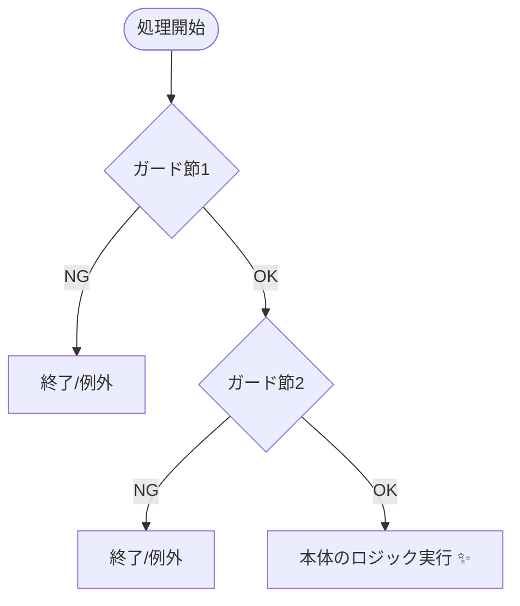
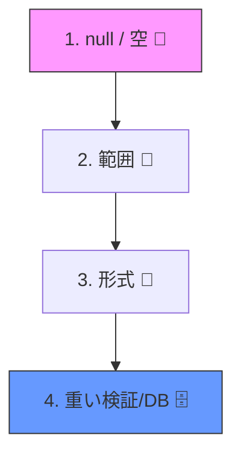

# 第04章：まずは入口を守る：ガード節（Guard Clauses）🛡️

## この章のゴール🎯


* 「入口で弾く」コードをスッと書ける🙂🚪
* **ネスト地獄（ifの入れ子）**をやめて、処理の本体が読みやすくなる📖✨
* 入力チェックが散らばってるコードを、**入口1か所**に寄せられる🧹🧱

---

## 1) ガード節ってなに？🤔🛡️

**ガード節 =「条件がダメなら、最初に弾いて終わる」書き方**だよ🙂
やることは超シンプル👇

* ✅ 期待する形じゃない入力が来たら
* ✅ **すぐ return / throw** して
* ✅ それ以上、処理を進めない

これだけで、コードが一気に見やすくなるの🎀✨

---

## 2) なぜ“入口”で守るの？🚪🧱

入口で守ると、良いことがいっぱいあるよ😊💕

* **事故が小さくなる**💥➡️🩹（変な値が奥まで入らない）
* **責務がハッキリする**📌（「ここで検証する！」って決められる）
* **本体の処理が読みやすい**📖✨（ビジネスロジックが見える）
* **同じチェックの重複が減る**✂️（コピペifが減る）

---

## 3) ダメな例：ifの入れ子で“迷子”😵‍💫🌀


たとえば「会員登録」っぽい処理で、こうなりがち👇

```csharp
public async Task RegisterAsync(string email, string userName, int planId)
{
    if (email != null)
    {
        email = email.Trim();
        if (email.Length > 0)
        {
            if (userName != null)
            {
                userName = userName.Trim();
                if (userName.Length > 0)
                {
                    if (planId > 0)
                    {
                        // ここから本体…のはずが、まだチェックが続く😇
                        var exists = await _userRepo.ExistsByEmailAsync(email);
                        if (!exists)
                        {
                            await _userRepo.CreateAsync(email, userName, planId);
                        }
                        else
                        {
                            throw new InvalidOperationException("すでに登録済みです");
                        }
                    }
                    else
                    {
                        throw new ArgumentException("planIdが不正");
                    }
                }
                else
                {
                    throw new ArgumentException("userNameが空");
                }
            }
            else
            {
                throw new ArgumentNullException(nameof(userName));
            }
        }
        else
        {
            throw new ArgumentException("emailが空");
        }
    }
    else
    {
        throw new ArgumentNullException(nameof(email));
    }
}
```

## これのつらさポイント🥺

* ネストで右にずれて、読むのがしんどい📉
* 「本体どこ？？」ってなる😇
* エラーメッセージや例外の種類がバラバラになりやすい💣

---

## 4) 良い例：ガード節で“入口で弾く”🌟🛡️

同じ処理を、ガード節で整理するとこう👇

```csharp
public async Task RegisterAsync(string email, string userName, int planId)
{
    // ✅ 入口で弾く（ここがガード節）
    ArgumentException.ThrowIfNullOrWhiteSpace(email);
    ArgumentException.ThrowIfNullOrWhiteSpace(userName);
    if (planId <= 0) throw new ArgumentOutOfRangeException(nameof(planId), "planIdは正の値にしてね🙂");

    email = email.Trim();
    userName = userName.Trim();

    // ✅ ここから “本体”
    var exists = await _userRepo.ExistsByEmailAsync(email);
    if (exists) throw new InvalidOperationException("このメールはすでに登録済みだよ📧💦");

    await _userRepo.CreateAsync(email, userName, planId);
}
```

* **上に「ダメなら終了」がまとまってる**から、読む人が安心する😊🫶
* 「本体」がちゃんと見える✨

`ArgumentException.ThrowIfNullOrWhiteSpace` は **null/空/空白だけ**をまとめて弾ける便利なやつだよ🧼🛡️ ([Microsoft Learn][1])



---

## 5) ガード節の“よくある型”3つ🧩✨

## ① null/空文字チェック🧼

* `ArgumentNullException.ThrowIfNull(obj)`：nullだけ弾く🚫

  * `paramName`は基本渡さなくてOK（引数名を推論してくれる設計になってる）🪄 ([Microsoft Learn][2])
* `ArgumentException.ThrowIfNullOrWhiteSpace(str)`：null/空/空白だけを弾く🧼 ([Microsoft Learn][1])

## ② 範囲チェック🔢

* `if (x < min || x > max) throw ...;`
* `ArgumentOutOfRangeException` を使うと意図が伝わりやすい🙂📌

## ③ 組み合わせチェック🧠

「単体ではOKだけど、組み合わせるとNG」みたいなやつ！

* 例：`StartDate <= EndDate` じゃないとダメ📅💥
* 例：`planId = 0` はダメ、でも `planId = 1..N` だけOK🎫

---

## 6) チェックの並べ方のコツ🍰✨（読みやすさ最優先！）

おすすめはこの順番だよ🙂👇

1. **null / 空**（一番ありがち＆先に落とすと安全）🚫
2. **範囲**（数字・長さなど）🔢
3. **形式**（メール形式など。やりすぎ注意）📧
4. **外部アクセスが必要な検証**（DB重複チェック等）🌐🗄️

「安く落とせるもの」から先にね💰➡️🧠✨



---

## 7) “入口を1か所に寄せる”リファクタ🧹🛠️

## よくある散らばりパターン😇

* Controllerで少しチェック
* Serviceでもチェック
* Repoでもチェック
* あちこちで同じifがコピペ…😵‍💫

## まずはこの形に寄せよう🎀

* **入口（境界）に Validate を置く**
* 本体は「前提が満たされてる」状態で書く✍️✨

```csharp
public static class RegisterGuards
{
    public static void Validate(string email, string userName, int planId)
    {
        ArgumentException.ThrowIfNullOrWhiteSpace(email);
        ArgumentException.ThrowIfNullOrWhiteSpace(userName);
        if (planId <= 0) throw new ArgumentOutOfRangeException(nameof(planId));
    }
}
```

```csharp
public async Task RegisterAsync(string email, string userName, int planId)
{
    RegisterGuards.Validate(email, userName, planId);

    email = email.Trim();
    userName = userName.Trim();

    var exists = await _userRepo.ExistsByEmailAsync(email);
    if (exists) throw new InvalidOperationException("登録済み📧💦");

    await _userRepo.CreateAsync(email, userName, planId);
}
```

これだけでも「入口がここ！」ってはっきりするよ😊🛡️

---

## 8) 演習①：散ってるチェックを“入口1か所”へ寄せよう🧪✨

## お題コード（わざと散らかしてあるよ😈）

```csharp
public async Task ChangePlanAsync(int userId, int newPlanId, string reason)
{
    if (userId <= 0) throw new ArgumentOutOfRangeException(nameof(userId));

    var user = await _userRepo.FindAsync(userId);
    if (user == null) throw new InvalidOperationException("ユーザーがいないよ😢");

    if (newPlanId <= 0) throw new ArgumentOutOfRangeException(nameof(newPlanId));
    if (reason == null) throw new ArgumentNullException(nameof(reason));
    if (reason.Trim().Length == 0) throw new ArgumentException("reasonが空だよ");

    if (user.IsBanned)
        throw new InvalidOperationException("BAN中は変更できないよ🚫");

    await _userRepo.ChangePlanAsync(userId, newPlanId, reason.Trim());
}
```

## やること💪

1. `ChangePlanGuards.Validate(...)` を作って、入口チェックをまとめる🧹
2. “本体”をスッキリ見えるようにする✨
3. チェック順も整える（null→範囲→重い検証）🍰

---

## 9) 演習②：メッセージを「人に優しく」する💬🎀

ガード節は「弾く」だけじゃなくて、**メッセージ**が大事🙂

* 開発者が原因を特定できる🔍
* ユーザーに見せても怖くない（境界で変換するのは後の章でやるよ）✨

例👇

* ❌「error」
* ✅「planIdは1以上にしてね🙂（受け取った値: 0）」

---

## 10) AI活用プロンプト例🤖✨（そのままコピペOK）

## ガード節に整理してもらう🛡️

* 「このメソッドの入力チェックを**ガード節**に整理して、**本体が読みやすくなる**ようにリファクタして。例外型も整えて。」

## チェック順を最適化してもらう🍰

* 「チェックを **null/空 → 範囲 → 外部アクセス** の順に並べ替えて。理由も短く添えて。」

## 責務を分けてもらう🧱

* 「Validate部分を `Guards` クラスに抽出して、メソッド本体はビジネスロジック中心にして。」

---

## 11) 2026ミニ情報🗞️✨（今の“前提”の確認）

* **C# 14** は拡張メンバー（extension members）などの新しい構文が追加されてるよ📌 ([Microsoft Learn][3])
* **Visual Studio 2026** はIDEの見た目や使い勝手の改善（Fluent UI系の刷新など）がリリースノートに載ってるよ🎨✨ ([Microsoft Learn][4])
* ガード節そのものは“新機能じゃなく設計の型”だから、今も昔も強い💪🛡️（その上で `ThrowIf...` 系がどんどん使いやすくなってる感じだよ） ([Microsoft Learn][2])

---

## まとめ🎉🛡️

* ガード節は「入口で弾いて、本体を守る」スタイル🚪🛡️
* **ネストを減らして、読みやすくする魔法**✨
* まずは「入口チェックを1か所に寄せる」だけで一気に改善するよ😊🫶

次の章（第5章）は、この検証ルールを「仕様書みたいに読める形」にしていくよ📜✨

[1]: https://learn.microsoft.com/en-us/dotnet/api/system.argumentexception.throwifnullorwhitespace?view=net-10.0&utm_source=chatgpt.com "ArgumentException.ThrowIfNullOrWhiteSpace(String ..."
[2]: https://learn.microsoft.com/en-us/dotnet/api/system.argumentnullexception.throwifnull?view=net-10.0&utm_source=chatgpt.com "ArgumentNullException.ThrowIfNull Method (System)"
[3]: https://learn.microsoft.com/en-us/dotnet/csharp/whats-new/csharp-14?utm_source=chatgpt.com "What's new in C# 14"
[4]: https://learn.microsoft.com/en-us/visualstudio/releases/2026/release-notes?utm_source=chatgpt.com "Visual Studio 2026 Release Notes"
