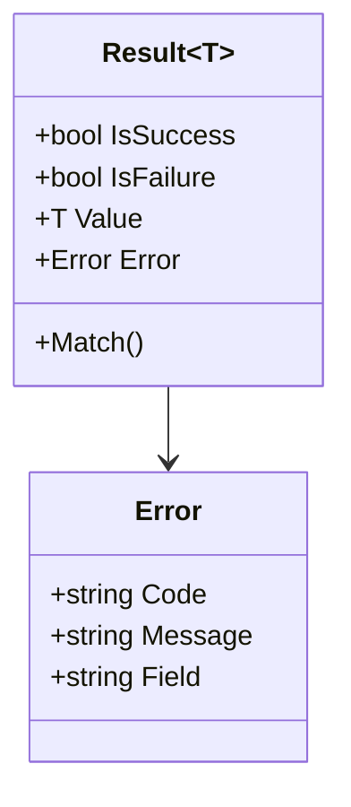
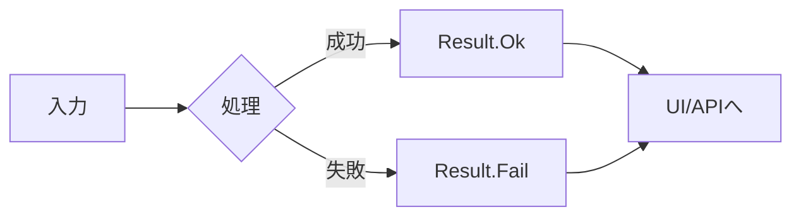
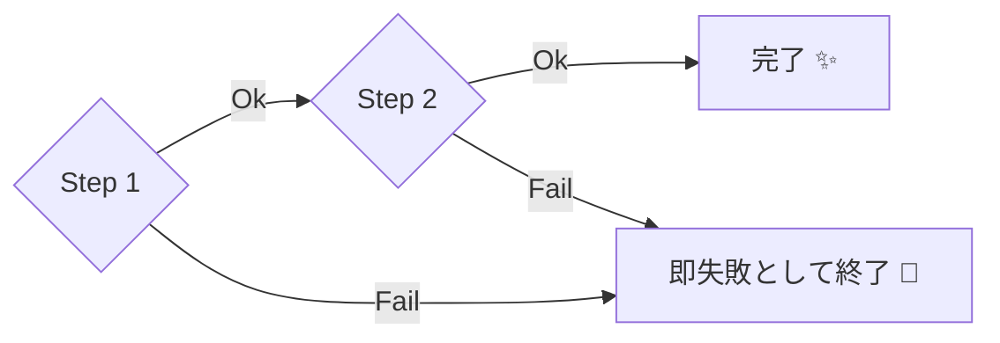

# 第07章：失敗の表現②：Result/戻り値で失敗を返す🧾🙂

この章はね、**「ユーザー入力みたいな“想定内の失敗”を、例外じゃなくて Result で安全に返す」**っていう考え方を、C#でちゃんと手で作って体に入れる回だよ〜🎀✨

---

## 1 まず結論 例外と Result のざっくり使い分け⚖️🙂

### ✅ Result が向いてる失敗

* ユーザー入力ミス（メール形式NG、必須が空、桁数不足など）✍️
* ビジネスルール違反（在庫が足りない、期限切れなど）🧾
* 「起きるのが普通にありえる」失敗（＝分岐で扱いたい）🔁

### ✅ 例外が向いてる失敗

* 通信が落ちた、DBが死んだ、ファイルが壊れてる💥
* そもそもコードの前提が崩壊（null参照、バグ）😵‍💫
* 「めったに起きない」「回復が難しい」タイプ⚡

.NET の例外ガイドでも、**“まれで本当に例外的なときに例外を使う”**という方向性がはっきり書かれてるよ🧠✨ ([Microsoft Learn][1])
一方で、フレームワーク設計のガイドラインだと「エラーコード返すな」って強めに言ってたりもするのね（※これは“汎用ライブラリ設計”の話が主）📚 ([Microsoft Learn][2])

だからこの教材ではこうするよ👇
**アプリの中では「想定内の失敗＝Result」「想定外＝例外」**で住み分けしようね🙂🛡️

---

## 2 今日作る Result はこれ 失敗を型で表す📦✨


### 目標🎯

* メソッドが「成功 or 失敗」を **型で必ず返す**
* 呼び出し側が **catch じゃなくて if / switch で分岐**できる
* 失敗理由（コード・表示文・どの項目か）を持てる🧾



---

## 3 最小 Result 実装 自作で OK🏗️✨

まずはシンプルで十分！「成功は値あり」「失敗はエラーあり」を守る作りにするよ🛡️

```csharp
using System;

public sealed record Error(string Code, string Message, string? Field = null);

public readonly record struct Result
{
    public bool IsSuccess { get; }
    public bool IsFailure => !IsSuccess;
    public Error? Error { get; }

    private Result(bool isSuccess, Error? error)
    {
        IsSuccess = isSuccess;
        Error = error;
    }

    public static Result Ok() => new(true, null);

    public static Result Fail(Error error)
        => new(false, error ?? throw new ArgumentNullException(nameof(error)));

    public T Match<T>(Func<T> onSuccess, Func<Error, T> onFailure)
        => IsSuccess ? onSuccess() : onFailure(Error!);
}

public readonly record struct Result<T> where T : notnull
{
    public bool IsSuccess { get; }
    public bool IsFailure => !IsSuccess;
    public T? Value { get; }
    public Error? Error { get; }

    private Result(bool isSuccess, T? value, Error? error)
    {
        IsSuccess = isSuccess;
        Value = value;
        Error = error;
    }

    public static Result<T> Ok(T value)
        => new(true, value ?? throw new ArgumentNullException(nameof(value)), null);

    public static Result<T> Fail(Error error)
        => new(false, default, error ?? throw new ArgumentNullException(nameof(error)));

    public TOut Match<TOut>(Func<T, TOut> onSuccess, Func<Error, TOut> onFailure)
        => IsSuccess ? onSuccess(Value!) : onFailure(Error!);
}
```

ポイントはここだよ👇🙂

* `Ok(...)` / `Fail(...)` 以外で作れない（＝変な状態を作りにくい）🔒
* 呼び出し側は `Match` で読みやすく分岐できる✨
* `Error` に `Field` を入れたので UI に返すのが楽🎀



---

## 4 例外版あるある から Result 版へリファクタ🧯➡️🧾

題材は「会員登録の入力チェック」ね👩‍💻✨

### 4-1 例外でバリデーションしちゃう版⚡

```csharp
public static Guid Register(string email, string password)
{
    if (string.IsNullOrWhiteSpace(email))
        throw new ArgumentException("email is empty", nameof(email));

    if (!email.Contains("@"))
        throw new ArgumentException("email is invalid", nameof(email));

    if (password is null || password.Length < 8)
        throw new ArgumentException("password too short", nameof(password));

    return Guid.NewGuid();
}
```

これ、呼ぶ側はこうなりがち👇😵‍💫

* どの例外を catch すべきか迷う
* メッセージがそのままUIに出て事故る
* “入力ミス”が例外ログとして溢れて監視が壊れる💥

---

### 4-2 Result で返す版🧾🙂

```csharp
public static Result<Guid> Register(string email, string password)
{
    if (string.IsNullOrWhiteSpace(email))
        return Result<Guid>.Fail(new Error(
            Code: "email.empty",
            Message: "メールが空だよ〜🥺",
            Field: "email"));

    if (!email.Contains("@"))
        return Result<Guid>.Fail(new Error(
            Code: "email.invalid",
            Message: "メールの形がちょっと変かも！📧",
            Field: "email"));

    if (password is null || password.Length < 8)
        return Result<Guid>.Fail(new Error(
            Code: "password.short",
            Message: "パスワードは8文字以上にしてね🔐",
            Field: "password"));

    return Result<Guid>.Ok(Guid.NewGuid());
}
```

呼ぶ側はこう！スッキリ！✨

```csharp
var result = Register(email, password);

var message = result.Match(
    onSuccess: id => $"登録できたよ〜🎉 id={id}",
    onFailure: err => $"失敗😢 {err.Message}（field={err.Field}, code={err.Code}）");

Console.WriteLine(message);
```

---

## 5 Result で「失敗理由」を育てるコツ🌱🧾

### ✅ Error の持ち方おすすめ

* `Code`：機械向け（ログ・翻訳・分岐）🤖
* `Message`：人向け（表示文）🙂
* `Field`：UIで該当欄を赤くする用🎯

将来「APIで返す」になっても、`Code` があるとめちゃ強いよ💪✨
（.NET 10 の ASP.NET Core も OpenAPI/最小API強化が進んでて、エラーを“ちゃんと形にして返す”流れがより自然になってるよ） ([Microsoft Learn][3])

---

## 6 ちょい応用 つなげたいときのミニ道具🔗✨

Result が増えてくると「成功なら次へ、失敗ならそこで止めたい」ってなるよね🙂
そのときは `Bind`（別名 `FlatMap`）を1個だけ足すと超便利！

```csharp
public static class ResultExtensions
{
    public static Result<TOut> Bind<TIn, TOut>(
        this Result<TIn> result,
        Func<TIn, Result<TOut>> next)
        where TIn : notnull
        where TOut : notnull
    {
        return result.IsSuccess
            ? next(result.Value!)
            : Result<TOut>.Fail(result.Error!);
    }
}
```

使い方👇

```csharp
var idResult =
    ValidateEmail(email)
        .Bind(validEmail => ValidatePassword(password)
        .Bind(_ => CreateUser(validEmail)));
```

※ ここは「便利だけど無理に今全部やらなくてOK」だよ〜🙂🎀



---

## 7 実践演習 3ステップで完成🏁🎉

### 演習A Result を作ってみよう🏗️

1. さっきの `Error / Result / Result<T>` をプロジェクトに追加
2. `Ok` と `Fail` を呼ぶだけの小テストコードを書いて動かす
   ✅ チェック：**失敗のとき `Value` を触らない**運用になってる？

---

### 演習B 例外バリデーションを Result に置換しよう🔁

対象メソッド（何でもOK！）を1つ選んで👇

* 入力ミスを `Result.Fail(Error)` に変える
* 呼び出し側は `try/catch` を消して `Match` にする

✅ チェック：例外ログが減って、分岐が読みやすくなった？👀✨

---

### 演習C テストで安心を足そう🧪🧸

xUnitでこんなテストを書いてみてね👇

```csharp
using Xunit;

public class RegisterTests
{
    [Fact]
    public void Email_empty_should_fail()
    {
        var r = Program.Register("", "password123");

        Assert.True(r.IsFailure);
        Assert.Equal("email.empty", r.Error!.Code);
        Assert.Equal("email", r.Error!.Field);
    }

    [Fact]
    public void Valid_input_should_succeed()
    {
        var r = Program.Register("a@b.com", "password123");

        Assert.True(r.IsSuccess);
        Assert.NotEqual(Guid.Empty, r.Value);
    }
}
```

---

## 8 AI活用コーナー ここはAIに任せてOK🤖✨

### 🪄 便利プロンプト例

* 「このメソッドの入力失敗を Result パターンに置き換えて。Errorは Code/Message/Field を持つ形で」
* 「Result を返す設計にしたい。想定内失敗と想定外例外の線引きをレビューして」
* 「このバリデーションからテストケースを境界値込みで10個作って🧪」

Visual Studio 2026 は AI の統合がより深くなってるので、こういう“定型変換”は特に相性いいよ🤖🛠️ ([Microsoft Learn][4])

---

## 9 よくある落とし穴 ここだけ注意してね⚠️🙂

* ✅ **Result を返したのにチェックしない**（成功前提で `Value!` を触る）💥
* ✅ 「全部Result」にしちゃって、通信エラーまで握りつぶす😵‍💫
* ✅ `Message` を技術文のままUIに出す（ユーザーが泣く）🥺
* ✅ 失敗が1種類しかないのに `string` だけで済ませて、後で詰む（Codeが欲しくなる）🧱

---

## 10 参考 既存ライブラリを使う選択肢📦✨


自作でもぜんぜんOKなんだけど、現場だと有名どころもあるよ🙂

* **Ardalis.Result**：APIレスポンスへマッピングしやすい設計がウリ🧾🌐 ([GitHub][5])
* **FluentResults**：軽量で “成功/失敗オブジェクト” を扱える感じ✨ ([GitHub][6])

（教材の演習は自作で進めるのが理解に効くよ🧠💪）

---

## まとめ 今日の持ち帰り🎁🎀

* **想定内の失敗は Result で返す**と、呼び出し側が安全に分岐できる🙂🛡️
* Result には **Code/Message/Field** を持たせると実用度が跳ね上がる📈
* 例外は「想定外」に残しておくと、監視・ログが健康になる🌿✨

---

次の第8章は、この Result を **境界で“外向け表現”に変換する**（画面表示・HTTPレスポンスにする）をやって、さらに実戦っぽくするよ〜🚪🔁🌐

[1]: https://learn.microsoft.com/en-us/dotnet/standard/exceptions/best-practices-for-exceptions?utm_source=chatgpt.com "Best practices for exceptions - .NET"
[2]: https://learn.microsoft.com/en-us/dotnet/standard/design-guidelines/exception-throwing?utm_source=chatgpt.com "Exception Throwing - Framework Design Guidelines"
[3]: https://learn.microsoft.com/en-us/dotnet/core/whats-new/dotnet-10/overview?utm_source=chatgpt.com "What's new in .NET 10"
[4]: https://learn.microsoft.com/en-us/visualstudio/releases/2026/release-notes?utm_source=chatgpt.com "Visual Studio 2026 Release Notes"
[5]: https://github.com/ardalis/Result?utm_source=chatgpt.com "ardalis/Result: A result abstraction that can be mapped to ..."
[6]: https://github.com/altmann/FluentResults?utm_source=chatgpt.com "GitHub - altmann/FluentResults: A generalised Result ..."
