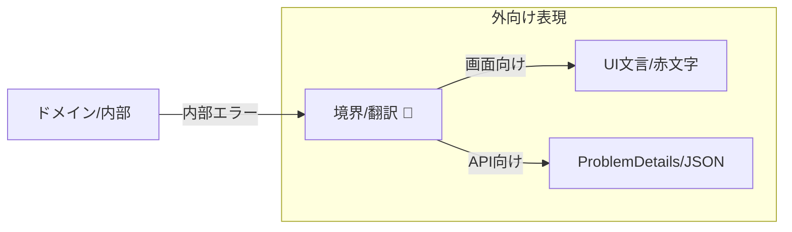
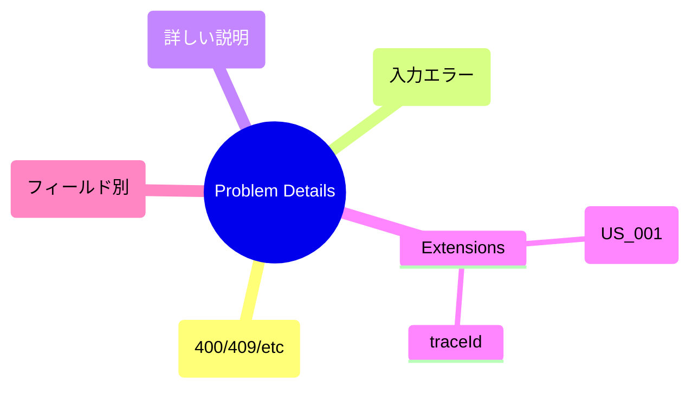

# 第08章：失敗の表現③：境界で“変換”する🚪🔁


この章は「**内部の失敗（ドメインの失敗）**」を、そのまま外に出さずに、**UI / API向けの失敗表現に“翻訳”する**練習だよ〜🙂✨
（第6章：例外／第7章：Result に続いて、**“最後に外へ出す形”を整える**ところ！）

---

## 8.1 この章のゴール🎯💖

* **ドメインの失敗**と**外向けの失敗**を分けて考えられる🙂
* “変換”を **境界（UI/Controller/Endpoint）に置ける**🧱🚪
* 内部エラー → **画面表示 / HTTPレスポンス（ProblemDetails）**に変換できる🪄✨
  ※ HTTPの標準的なエラー形式として Problem Details（RFC 7807。現在は RFC 9457 が更新版）も使えるよ📦🌐 ([IETF Datatracker][1])

---

## 8.2 そもそも「変換」ってなに？🤔🔁

### ✅ “内部”の失敗（ドメイン）

* 例）`EmailAlreadyUsed` / `InvalidEmailFormat` / `PasswordTooWeak`
* 特徴：**ビジネスの言葉**で、**原因がはっきり**してる
* でも…これをそのまま外に出すと👇

  * ユーザーには難しすぎる😵‍💫
  * 内部事情や実装が漏れる危険🫣
  * UI/APIが変わるたびにドメイン側が振り回される🌀

### ✅ “外向け”の失敗（UI/API）

* UI：エラー文・入力欄ごとの赤文字・ダイアログ表示💬🎀
* API：HTTPステータス + JSONエラー（ProblemDetailsなど）📡🧾 ([Microsoft Learn][2])

➡️ **境界で「内部→外向け」に翻訳**するのが“変換”だよ🚪🔁

---

## 8.3 境界ってどこ？ここに置くよ🚪🧱

* 画面アプリなら：クリックイベント／ViewModel／Presenter みたいな入口🎮🖱️
* Web APIなら：Controller／Minimal API の endpoint（`MapPost` など）🌐🧩
* 外部I/Oなら：外部API呼び出しの手前・直後（Adapter）🧼🔌

**合言葉：ドメインは外の都合（HTTP/画面）を知らない**🙂✨
外の都合は **境界が引き受ける**💪🚪



---

## 8.4 まずは“エラーの辞書”を作ろう📚✨（超大事！）

変換がラクになる最強アイテムはこれ👇

### ① 内部エラーに「コード」を付ける🏷️

* 例）`USR_EMAIL_TAKEN` / `USR_EMAIL_INVALID`
* UI文言が変わっても、コードは変えない（＝安定する）🧱✨

### ② 外向けは「安全な情報」だけにする🛡️

* 例）「そのメールアドレスは既に使われています」🙂
* DB名やSQL、例外スタックは出さない🙅‍♀️🔥

---

## 8.5 実装の型（Result → 境界で変換）📦🔁

ここでは第7章の流れに合わせて、**Resultで返して境界で変換**する形にするね🙂

## ドメイン側：失敗を“種類”で表す🧠💎

```csharp
// ドメイン側：外の都合（HTTPや画面）を一切知らない！

public abstract record RegisterUserError(string Code);

public sealed record InvalidEmail(string Raw)
    : RegisterUserError("USR_EMAIL_INVALID");

public sealed record EmailAlreadyUsed(string Email)
    : RegisterUserError("USR_EMAIL_TAKEN");

public sealed record PasswordTooWeak()
    : RegisterUserError("USR_PASSWORD_WEAK");

public readonly record struct UserId(Guid Value);
```

（この時点では “見せ方” を決めないのがポイント！🧘‍♀️✨）

---

## 8.6 境界側：HTTP向けに変換する🌐🧾

### ProblemDetailsを使う理由📦

Problem Details は「HTTP APIのエラー表現の標準形」だよ〜！
RFCとして定義されていて、ASP.NET Coreも扱いやすい🫶 ([IETF Datatracker][1])
（今は RFC 9457 が RFC 7807 を更新した版だよ） ([RFC エディタ][3])

### ASP.NET Core側の“最近の流れ”🌱

* `AddProblemDetails()` で ProblemDetails 生成を支える仕組みが用意されてるよ🧩 ([Microsoft Learn][2])
* Minimal API では `TypedResults` を使うと、テスト性や OpenAPI のメタ情報が良くなるよ📈✨ ([Microsoft Learn][4])
* `TypedResults.Problem(...)` で ProblemDetails を返せるよ🧾 ([Microsoft Learn][5])

### 変換関数：内部エラー → HTTPレスポンス🚪🔁

```csharp
using Microsoft.AspNetCore.Http;
using Microsoft.AspNetCore.Http.HttpResults;

public static class RegisterUserErrorToHttp
{
    public static IResult ToResult(RegisterUserError error)
        => error switch
        {
            InvalidEmail e => TypedResults.ValidationProblem(
                errors: new Dictionary<string, string[]>
                {
                    ["email"] = new[] { "メールアドレスの形式が正しくないよ🙂" }
                },
                title: "入力エラーだよ",
                type: "https://example.com/problems/validation"
            ),

            EmailAlreadyUsed e => TypedResults.Problem(
                title: "登録できないよ",
                detail: "そのメールアドレスは既に使われています🙂",
                statusCode: StatusCodes.Status409Conflict,
                type: "https://example.com/problems/email-taken",
                extensions: new Dictionary<string, object?>
                {
                    ["code"] = e.Code
                }
            ),

            PasswordTooWeak e => TypedResults.ValidationProblem(
                errors: new Dictionary<string, string[]>
                {
                    ["password"] = new[] { "パスワードが弱いかも…もう少し強くしてね🥺" }
                },
                title: "入力エラーだよ",
                type: "https://example.com/problems/validation"
            ),

            _ => TypedResults.Problem(
                title: "サーバー側のエラーだよ",
                detail: "ごめんね、時間を置いてもう一回試してね🙏",
                statusCode: StatusCodes.Status500InternalServerError,
                type: "https://example.com/problems/unexpected"
            )
        };
}
```

> * `code` を extensions に入れると、フロントが分岐しやすい🧠✨



---

## 8.7 Minimal API でつなぐ例🧩🌐

```csharp
public readonly record struct Result<T, E>(T? Value, E? Error)
{
    public bool IsOk => Error is null;
    public static Result<T, E> Ok(T value) => new(value, default);
    public static Result<T, E> Fail(E error) => new(default, error);

    public R Match<R>(Func<T, R> ok, Func<E, R> fail)
        => IsOk ? ok(Value!) : fail(Error!);
}

// 例：UseCaseが返す（内部はドメイン言葉）
public static Result<UserId, RegisterUserError> Register(string email, string password)
{
    if (string.IsNullOrWhiteSpace(email) || !email.Contains('@'))
        return Result<UserId, RegisterUserError>.Fail(new InvalidEmail(email));

    if (email.EndsWith("@taken.test"))
        return Result<UserId, RegisterUserError>.Fail(new EmailAlreadyUsed(email));

    if (password.Length < 8)
        return Result<UserId, RegisterUserError>.Fail(new PasswordTooWeak());

    return Result<UserId, RegisterUserError>.Ok(new UserId(Guid.NewGuid()));
}

// 境界：HTTPに変換して返す
app.MapPost("/users", (string email, string password) =>
{
    var result = Register(email, password);

    return result.Match<IResult>(
        ok => TypedResults.Created($"/users/{ok.Value}", new { id = ok.Value }),
        err => RegisterUserErrorToHttp.ToResult(err)
    );
});
```

これで **「内部の失敗」→「外向けの失敗」** が、きれいに分離できたね〜！🎉💕

---

## 8.8 UI向けに変換する例（画面アプリ）🖥️🎀

UIだと、だいたいこういう形が便利👇

* **画面表示用のエラー**（Message + FieldErrors）
* 内部エラーから変換する関数（境界）を用意

```csharp
public sealed record UiError(
    string Message,
    IReadOnlyDictionary<string, string[]> FieldErrors,
    string Code
);

public static class RegisterUserErrorToUi
{
    public static UiError ToUi(RegisterUserError error)
        => error switch
        {
            InvalidEmail e => new UiError(
                Message: "メールアドレスを確認してね🙂",
                FieldErrors: new Dictionary<string, string[]> { ["email"] = new[] { "形式が違うよ" } },
                Code: e.Code
            ),

            EmailAlreadyUsed e => new UiError(
                Message: "そのメールはもう使われてるみたい🥺",
                FieldErrors: new Dictionary<string, string[]> { ["email"] = new[] { "別のメールにしてね" } },
                Code: e.Code
            ),

            PasswordTooWeak e => new UiError(
                Message: "パスワードをもう少し強くしよ💪",
                FieldErrors: new Dictionary<string, string[]> { ["password"] = new[] { "8文字以上がおすすめ" } },
                Code: e.Code
            ),

            _ => new UiError(
                Message: "ごめんね、もう一回試してね🙏",
                FieldErrors: new Dictionary<string, string[]>(),
                Code: "UNEXPECTED"
            )
        };
}
```

UIはこの `UiError` だけ見て、赤文字を出したり、ダイアログ出したりできるよ🎀✨

---

## 8.9 よくある事故ポイント🚧😵‍💫

1. **ドメインエラーのMessageをそのまま返す**
   → 後で文言変更できなくなる＆漏洩リスク🫣

2. **HTTPステータスを適当に500にする**
   → 入力ミスなのにサーバーエラー扱いになる😇

3. **変換が散らばる（あちこちでswitch）**
   → 変換ルールは「1か所」に寄せるのが勝ち🏆✨

---

## 8.10 演習📝🎀（手を動かすやつ！）

### 演習1：変換表を作る📋✨

次の内部エラーを、UI向け / API向けに変換する表を作ってね🙂

* `InvalidEmail`
* `EmailAlreadyUsed`
* `PasswordTooWeak`

（ステータスコード案も書く：400/409 など）

### 演習2：変換関数を“1か所”にまとめる🧱

* `RegisterUserErrorToHttp`
* `RegisterUserErrorToUi`
  をそれぞれ1ファイルにして、呼び出し側から分岐を消す✂️✨

### 演習3：変換のテストを書く🧪

* `EmailAlreadyUsed` → 409 になる？
* `InvalidEmail` → emailフィールドにエラーが入る？

---

## 8.11 AIの使いどころ🤖💡（この章めっちゃ相性いい！）

そのままコピペで使えるプロンプト例だよ〜🎀✨

* 「このドメインエラー一覧を、UI向けとAPI向けに変換する“対応表”を作って。ステータスコード案も。」🤖📋
* 「ProblemDetails（type/title/detail/status/extensions）設計を、クライアント実装しやすい形で3案出して」🤖⚖️
* 「変換関数のswitchが肥大化しない設計案（責務分割）を提案して」🤖🧱
* 「境界で返すエラーメッセージが“漏洩してないか”レビューして」🤖🛡️

---

## まとめ🏁💖

* **内部の失敗**はビジネスの言葉（ドメイン）でOK🧠
* **外向けの失敗**はUI/APIの都合でOK🎀🌐
* そして両者をつなぐのが **境界の“変換（翻訳）”** 🚪🔁
* ProblemDetails（RFC 7807 / 9457）を使うとAPIの失敗表現が整うよ🧾✨ ([IETF Datatracker][1])
* ASP.NET Core では `AddProblemDetails` や `TypedResults` も活用できるよ🧩📈 ([Microsoft Learn][2])

---

次の章（第9章）は「型で守る」入門に入るから、ここで作ったエラー変換があると **型の失敗（VOのCreate失敗）**も同じノリで扱えて、めちゃ気持ちよく進めるよ〜🥰🎀

[1]: https://datatracker.ietf.org/doc/html/rfc7807?utm_source=chatgpt.com "RFC 7807 - Problem Details for HTTP APIs - Datatracker - IETF"
[2]: https://learn.microsoft.com/en-us/aspnet/core/fundamentals/error-handling-api?view=aspnetcore-10.0 "Handle errors in ASP.NET Core APIs | Microsoft Learn"
[3]: https://www.rfc-editor.org/rfc/rfc9457.html?utm_source=chatgpt.com "RFC 9457: Problem Details for HTTP APIs"
[4]: https://learn.microsoft.com/en-us/aspnet/core/tutorials/min-web-api?view=aspnetcore-10.0 "Tutorial: Create a Minimal API with ASP.NET Core | Microsoft Learn"
[5]: https://learn.microsoft.com/en-us/dotnet/api/microsoft.aspnetcore.http.typedresults.problem?view=aspnetcore-10.0&utm_source=chatgpt.com "TypedResults.Problem Method (Microsoft.AspNetCore.Http)"
