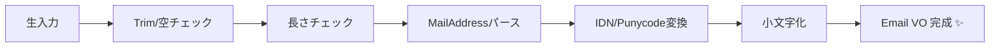

# 第12章：値オブジェクト②：Email/文字列VOを作る📧💎


この章のテーマはシンプル！
**「Emailをただの`string`で持つのをやめて、型で守る」**だよ〜🥰🛡️

---

## 1. なんでEmailをVOにするの？😵‍💫➡️🙂


`string email`のままだと、こういう事故が起きがち💥

* `" a@b.com "`（前後スペース）で同一判定が崩れる😇
* `"A@EXAMPLE.COM"` と `"a@example.com"` が別物扱いになる😇
* `"Bob <bob@example.com>"` みたいな“表示名つき”が混入してログイン不能😇
* DBや他画面で、都度チェックが増えて **if地獄**😱

だから、**「正しいEmailだけが存在できる型」**にしちゃうのがVOの気持ちよさ💎✨

---

## 2. “正規表現で完璧”は目指さない（KISS）🙂🧯

メールアドレスの仕様（RFC）はとても広くて、全部を正規表現で“完璧に”やろうとすると沼りやすいの…🌀
RFCの世界ではEmailの形式もかなり幅広いし（メッセージ形式 RFC 5322）、国際化Email（EAI）もあるよ〜📚🌍 ([IETF Datatracker][1])

なのでこの章は方針をこうするね👇✨

* **厳密RFC準拠の完全判定は狙わない**（コスト爆増する💣）
* 代わりに、


  ✅ **VO化して以降は“安全”を前提にできる**
  を狙うよ〜🙂💎



---

## 3. まず「仕様」を決めよう📜✨（この章の採用ルール）


ここが超だいじ！Emailは世界が広いので、**あなたのサービスの都合**で決めてOK🙆‍♀️🎀

この章では、会員登録のEmailを想定して、こう決めます👇

## ✅ 受け入れるもの

* `local@domain` の形（表示名つきはNG）📧
* 前後の空白はトリムして吸収🧼
* ドメインは **IDN（日本語ドメイン等）をPunycodeに変換**して正規化🌍
  （`.NET`の`IdnMapping`でできるよ） ([Microsoft Learn][2])
* 全体の長さは **254文字以内**（実務の安全ラインとしてよく使われる）📏
  RFC 3696のinline errataでも “通常の上限” として 254 が言及されてるよ ([RFCエディタ][3])

## ✅ 正規化（Normalization）方針

* `Trim()`する🧼
* **小文字化**して統一（ログインID用途想定）🔤
  ※RFC的にはローカル部が大小区別されうるけど、現実の運用では大小区別しない前提が多いので、この教材では割り切るよ🙂

---

## 4. .NETの“味方”：MailAddressを軽く使う📦🙂

`.NET`にはメールアドレスのパース用に `MailAddress` があるよ📮
（`user@host` や `"display name" <user@host>` 形式も扱える） ([Microsoft Learn][4])

ただし！今回の会員Emailは **表示名つき入力を許したくない**ので、
「パースできても、入力が`addr-spec`そのものじゃなければ弾く」方針にします🛡️✨

---

## 5. 実装：Email 値オブジェクトを作る💎📧


ポイントはこれ👇

* `new Email(...)` を外からできない（不正Emailを作れない）🔒
* `Create(...)` でだけ作る🏭
* `Create`が「検証 + 正規化」ぜんぶ担当する🧼🛡️

```csharp
using System;
using System.Globalization;
using System.Net.Mail;

public enum EmailError
{
    Empty,
    TooLong,
    InvalidFormat,
    NotAddrSpec
}

public readonly record struct Result<T, TError>(T? Value, TError? Error)
    where TError : struct
{
    public bool IsSuccess => Error is null;

    public static Result<T, TError> Ok(T value) => new(value, null);
    public static Result<T, TError> Fail(TError error) => new(default, error);
}

public sealed record Email
{
    public string Value { get; }

    private Email(string value) => Value = value;

    public override string ToString() => Value;

    public static Result<Email, EmailError> Create(string? input)
    {
        if (string.IsNullOrWhiteSpace(input))
            return Result<Email, EmailError>.Fail(EmailError.Empty);

        var trimmed = input.Trim();

        // 実務の安全ライン（RFC 3696 inline errata で “normally” として 254 が言及される）
        if (trimmed.Length > 254)
            return Result<Email, EmailError>.Fail(EmailError.TooLong);

        MailAddress parsed;
        try
        {
            parsed = new MailAddress(trimmed);
        }
        catch (FormatException)
        {
            return Result<Email, EmailError>.Fail(EmailError.InvalidFormat);
        }

        // "display name <addr>" を拒否：入力が addr-spec そのものじゃないならNG
        // MailAddress は表示名つきも受けうるので、Address と一致するかで弾く
        if (!string.Equals(parsed.Address, trimmed, StringComparison.OrdinalIgnoreCase))
            return Result<Email, EmailError>.Fail(EmailError.NotAddrSpec);

        var at = trimmed.IndexOf('@');
        if (at <= 0 || at != trimmed.LastIndexOf('@') || at == trimmed.Length - 1)
            return Result<Email, EmailError>.Fail(EmailError.InvalidFormat);

        var local = trimmed[..at];
        var domain = trimmed[(at + 1)..];

        // ドメインのIDN正規化（例：例え.テスト → xn--...）
        string asciiDomain;
        try
        {
            asciiDomain = new IdnMapping().GetAscii(domain);
        }
        catch (ArgumentException)
        {
            return Result<Email, EmailError>.Fail(EmailError.InvalidFormat);
        }

        // ログインID用途想定：大小区別しない形で統一
        var normalized = $"{local.ToLowerInvariant()}@{asciiDomain.ToLowerInvariant()}";

        return Result<Email, EmailError>.Ok(new Email(normalized));
    }
}
```

---

## 6. 使い方：境界（DTO）でVOへ変換する🚪➡️💎


入力（UI/API）はゆるくてOK。中に入れる前にVOへ変換するよ🙂🛡️

```csharp
public sealed record RegisterRequest(string? Email, string? Password);

public static class Registration
{
    public static string Register(RegisterRequest req)
    {
        var emailResult = Email.Create(req.Email);

        if (!emailResult.IsSuccess)
        {
            return emailResult.Error switch
            {
                EmailError.Empty => "メールアドレスを入力してね🙂",
                EmailError.TooLong => "メールアドレスが長すぎるよ🥺",
                EmailError.NotAddrSpec => "メールアドレスだけを入力してね（名前つきはNG）🙂",
                _ => "メールアドレスの形式が変かも🥺"
            };
        }

        var email = emailResult.Value!; // ここから先は安全✨
        return $"登録OK！ Email={email.Value}";
    }
}
```

この状態になると最高で、**以降のロジックは「Emailは必ず正しい」前提で書ける**よ〜🥰💎
ifチェックが消えて、設計がスッキリする✨✨

---

## 7. DataAnnotationsは“入口の補助”として使うのはアリ🙂📌


`[EmailAddress]` で入口チェックするのも便利！
ただしこれは **「入口のバリデーション」**であって、**ドメイン内部の安全はVOで担保**するのがキレイ✨
（`EmailAddressAttribute` 自体も用意されてるよ） ([Microsoft Learn][5])

---

## 8. テストして“仕様”を固めよう🧪✨


おすすめテストケース（まずはこれで十分！）👇

* `" Alice@Example.COM "` → `alice@example.com` に正規化される🧼
* `"bob@example.com"` → OK🙂
* `"Bob <bob@example.com>"` → `NotAddrSpec` になる🛡️
* `"alice@例え.テスト"` → ドメインがPunycode化されてOK（環境次第で例外もあるのでテストで確認）🌍
* `""` / `"   "` → `Empty`🚫
* 255文字以上 → `TooLong`📏

---

## 9. AIの使い方（この章は相性バツグン）🤖💘

そのままコピペで使えるプロンプト置いとくね🎀

* **境界値テスト増やして**

  * 「この `Email.Create` の仕様で、追加すべき境界値テストを20個出して。各テストは input と期待結果（成功/失敗理由）で。」

* **正規化ルール案を比較して**

  * 「Emailの正規化ルール（Trim, Lowercase, IDN, etc）を3案出して。ログインID用途でのメリデメも。」

* **セキュリティ目線レビュー**

  * 「このEmail VOの実装をレビューして。攻撃や運用事故につながる点があれば指摘して。」

---

## 10. “最新メモ”🆕📌（2026/01/20時点）

* C# 14 の最新情報（2025/11/19更新） ([Microsoft Learn][6])
* .NET 10 の “What’s new”（2025/11/07更新） ([Microsoft Learn][7])
* .NET / .NET Framework の 2026年1月サービシング更新（2026/01/09） ([Microsoft for Developers][8])

※この章のコード自体は新機能に依存しないけど、**SDK/ランタイムは最新更新を追う**のが安心だよ🛡️✨

---

## まとめ🏁🎉

* Emailは`string`のままだと事故りやすい😇
* **VO（Email型）にして、生成を`Create`に集中**させる🏭🔒
* 検証は“ほどほど”でOK（KISS）🙂
* **正規化（Trim/小文字/IDN）**で“同一判定”が安定する🧼🌍

---

次の章（第13章：期間DateRange📅💎）に進む前に、もしよければこの章の演習を“積み上げ式”にするために👇を作ろう😊🎀

* `UserName`（第17章の先取りでもOK）を同じパターンでVO化🔤💎
* `RegisterRequest` → `Email`/`UserName` へ境界変換を統一🚪✨

[1]: https://datatracker.ietf.org/doc/html/rfc5322?utm_source=chatgpt.com "RFC 5322 - Internet Message Format - Datatracker - IETF"
[2]: https://learn.microsoft.com/en-us/dotnet/api/system.globalization.idnmapping?view=net-10.0&utm_source=chatgpt.com "IdnMapping Class (System.Globalization)"
[3]: https://www.rfc-editor.org/rfc/inline-errata/rfc3696.html?utm_source=chatgpt.com "rfc3696"
[4]: https://learn.microsoft.com/en-us/dotnet/api/system.net.mail.mailaddress?view=net-10.0&utm_source=chatgpt.com "MailAddress Class (System.Net.Mail)"
[5]: https://learn.microsoft.com/en-us/dotnet/api/system.componentmodel.dataannotations.emailaddressattribute?view=net-10.0&utm_source=chatgpt.com "EmailAddressAttribute Class (System.ComponentModel. ..."
[6]: https://learn.microsoft.com/en-us/dotnet/csharp/whats-new/csharp-14?utm_source=chatgpt.com "What's new in C# 14"
[7]: https://learn.microsoft.com/en-us/dotnet/core/whats-new/dotnet-10/overview?utm_source=chatgpt.com "What's new in .NET 10"
[8]: https://devblogs.microsoft.com/dotnet/dotnet-and-dotnet-framework-january-2026-servicing-updates/?utm_source=chatgpt.com ".NET and .NET Framework January 2026 servicing ..."
