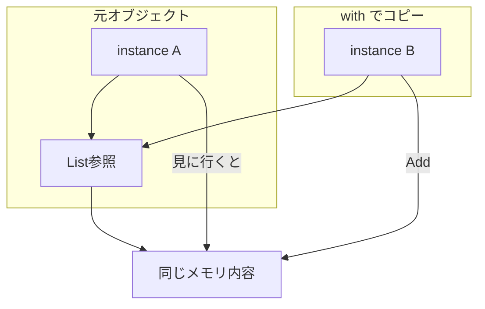

# 第14章：record / immutable を味方にする❄️🧊


この章は「**途中で壊れないデータ**」を増やして、不変条件を守るのをラクにする回だよ〜😊🛡️
（※record / init / with / immutable collections あたりを“道具箱”に入れる感じ✨）

---

## 0. この章のゴール🎯✨

ここまでで「不正な値を作らせないVO（Email / Money / DateRange）」を作ってきた前提で、次はコレ👇

* **不変なデータ構造（immutable）**を増やせる❄️
* 「変更したいときは **新しいインスタンス** を作る」発想に慣れる🔁
* **mutable DTO（外から来るデータ）→ immutable ドメイン（中の安全地帯）** に変換できる🚪➡️🏛️
* **List などの“穴あき”ポイント**を見抜ける👀💣

---

## 1. なんで immutable が“不変条件”に効くの？🧠💡


不変条件って「守りたい約束」だよね🙂🛡️
でも、オブジェクトが**後からいくらでも書き換え可能**だと…

* どこで壊れたか追えない😵‍💫
* 途中状態（半分だけ更新）みたいな事故が起きる💥
* 変更経路が多すぎて、チェックが散らばる🌀

そこで **immutable** だとこうなる👇

* 作った瞬間に「安全な状態で固定」できる❄️🔒
* 変更は「更新メソッド」や「with」で**意図が見える**✅
* “壊れる入口”を **境界（DTO変換）に集約**できる🚪🧱

---

## 2. record って何がうれしいの？📦💎


### 2.1 record の性格（ざっくり）🙂

record は「データ中心の型」を書きやすくして、**値ベースの等価**などが最初から整ってるタイプだよ✨
Microsoft の公式にも「record は value-based equality を持つ」って説明があるよ🧾 ([Microsoft Learn][1])

### 2.2 record class と record struct（超ざっくり）📌

* `record class`：参照型（クラス）🧩
* `record struct`：値型（struct）🪙（仕様でも“value type”って明言されてるよ） ([Microsoft Learn][2])

初心者のうちは、まずは **record class** をメインでOK🙂
VO（小さくて軽い値）だけ `record struct` を検討、くらいで十分だよ〜✨

---

## 3. immutable の基本武器①：`init` 🧷✨


`init` は「**初期化のときだけ代入OK**」にできる仕組みだよ❄️
公式にも「init-only setter はオブジェクト構築中だけ代入できて、その後は変更できない＝不変性を強制」って書いてあるよ🧊 ([Microsoft Learn][3])

たとえば👇

```csharp
public sealed record MemberProfile
{
    public required string DisplayName { get; init; }  // 初期化時だけセットできる
    public required string Email { get; init; }        // ここは後でVOに置き換える想定
}
```

* `init` だから、作った後に `profile.DisplayName = ...` はできない（コンパイルで止まる）🛑✨
* ただし！`string Email` のままだと不変条件は弱いから、ここは前章までの `Email` VO を使うのが本筋だよね😉🛡️

---

## 4. immutable の基本武器②：`with`（非破壊的変更）🔁✨


record には「変更したいけど壊したくない」時に便利な `with` があるよ😊
`with` は **コピーを作って、指定部分だけ差し替える**やつ！ ([Microsoft Learn][4])

```csharp
var a = new MemberProfile { DisplayName = "こみやんま", Email = "a@example.com" };
var b = a with { DisplayName = "こみやんま(改)" }; // aはそのまま、bが新しい✨
```

* コピー元とコピー先が **同じ List を共有**しちゃう事故が起きる😱🌀



---

## 5. “浅いコピー事故”を体験してみよ👀💣（超だいじ）


### 5.1 やらかし例（List を持つ record）😵‍💫

```csharp
public sealed record Cart
{
    public required List<string> Items { get; init; }
}

var c1 = new Cart { Items = new List<string> { "Apple" } };
var c2 = c1 with { };           // 見た目コピーっぽいけど…
c2.Items.Add("Banana");         // c2だけ増やしたつもり

Console.WriteLine(string.Join(",", c1.Items)); // Apple,Banana ← えっ😱
```

### 5.2 対策：コレクションも immutable にする🧺❄️

そこで `System.Collections.Immutable` の出番！
この名前空間は「変更できないコレクション」を提供していて、NuGet パッケージとして案内されてるよ📦 ([Microsoft Learn][6])

```csharp
using System.Collections.Immutable;

public sealed record Cart
{
    public required ImmutableList<string> Items { get; init; }
}

var c1 = new Cart { Items = ImmutableList.Create("Apple") };
var c2 = c1 with { Items = c1.Items.Add("Banana") };

Console.WriteLine(string.Join(",", c1.Items)); // Apple
Console.WriteLine(string.Join(",", c2.Items)); // Apple,Banana
```

### 5.3 たくさん追加するなら Builder が便利🏗️✨

`ImmutableList<T>.Builder` は「メモリ割り当てがほとんどなく変更できて、効率よく immutable を組み立てられる」って説明されてるよ⚡ ([Microsoft Learn][7])

```csharp
var builder = ImmutableList.CreateBuilder<string>();
builder.Add("Apple");
builder.Add("Banana");
var items = builder.ToImmutable(); // 最後に固める❄️
```

---

## 6. “入れ忘れ”を殺す：`required` 🧷🔒


`required` は「そのプロパティは **初期化時に必ず入れてね**」をコンパイルで強制できるよ✅
公式の提案仕様でも「初期化時に必須セットを強制する仕組み」って説明されてるよ🧾 ([Microsoft Learn][8])

```csharp
public sealed record RegisterCommand
{
    public required string Email { get; init; }
    public required int MonthlyFeeYen { get; init; }
}
```

`required` を付けると「作ったけど Email を入れ忘れた！」みたいな事故が**早い段階で止まる**🛑✨
（不変条件の“入口”を強くできるやつ！）

---

## 7. 章のメイン演習：mutable DTO → immutable ドメイン変換🚪➡️🏛️


ここが本題だよ〜！🎀
外から来るデータ（DTO）はどうしても **文字列だらけ・nullあり・ゆるい**。
だから **境界で変換して、中はカチカチにする**🧱✨

### 7.1 外から来る DTO（ゆるい・mutable）📨

```csharp
public sealed class SubscribeRequestDto
{
    public string? Email { get; set; }
    public int? MonthlyFeeYen { get; set; }
    public DateOnly? Start { get; set; }
    public DateOnly? End { get; set; }
}
```

### 7.2 中で使うドメイン（immutable）🏛️❄️

ここは前章までの VO がある想定で、型で固めるよ🛡️
（`Email` / `Money` / `DateRange` は既に作ってある前提でOKだよ🙂）

```csharp
public sealed record SubscribeCommand
{
    public required Email Email { get; init; }
    public required Money MonthlyFee { get; init; }
    public required DateRange ContractPeriod { get; init; }
}
```

### 7.3 変換関数（境界の仕事）🔁🧱

DTO → VO 変換は失敗する可能性があるから、Result 方式（第7章）を使うとキレイ✨

```csharp
public static Result<SubscribeCommand> ToCommand(SubscribeRequestDto dto)
{
    if (dto.Email is null) return Result.Fail("Email is required");
    if (dto.MonthlyFeeYen is null) return Result.Fail("MonthlyFeeYen is required");
    if (dto.Start is null || dto.End is null) return Result.Fail("Start/End is required");

    var emailResult = Email.Create(dto.Email);
    if (emailResult.IsFailure) return Result.Fail(emailResult.Error);

    var moneyResult = Money.CreateYen(dto.MonthlyFeeYen.Value);
    if (moneyResult.IsFailure) return Result.Fail(moneyResult.Error);

    var rangeResult = DateRange.Create(dto.Start.Value, dto.End.Value);
    if (rangeResult.IsFailure) return Result.Fail(rangeResult.Error);

    return Result.Ok(new SubscribeCommand
    {
        Email = emailResult.Value,
        MonthlyFee = moneyResult.Value,
        ContractPeriod = rangeResult.Value
    });
}
```

ポイントはこれ👇✨

* DTO は「受け取るための箱」📦（壊れてても来る）
* `ToCommand` で **VO に変換して不変条件を通す**🛡️
* 中は `SubscribeCommand` の時点で **壊せない**❄️🔒

---

## 8. よくある落とし穴まとめ⚠️🧨

### 8.1 `record` にしただけで安心しちゃう😇

* record でも `set;` が生えてたら普通に壊れるよ🌀
* `init` / get-only / private set のどれかで固めよう🧊

### 8.2 record の中に `List<T>` を入れる🛑

* `with` は浅いコピーなので共有事故が起きる（公式に明記） ([Microsoft Learn][5])
* `ImmutableList<T>` などにしよう❄️ ([Microsoft Learn][6])

### 8.3 “計算結果プロパティ”を固定値で持つ問題🧮

`with` を使うと「コピー前の値」から計算されたままになってズレることがあるので、公式も「計算プロパティはアクセス時に計算がおすすめ」って注意してるよ⚠️ ([Microsoft Learn][4])

---

## 9. ミニ課題（手を動かすやつ）🧪✨

### 課題A：DTO→ドメイン変換を完成させよう🛠️

* DTO に `UserName`（string?）を追加
* ドメイン側は `UserName` VO にする
* 変換で trim と空文字チェックを入れる

### 課題B：List事故を潰そう🧯

* `Cart` record の Items を `List<string>` で作って事故確認
* `ImmutableList<string>` に直して事故が消えるのを確認

### 課題C：`required` で入れ忘れを止めよう🧷

* `SubscribeCommand` のプロパティに `required` を付ける
* “入れ忘れコード”をわざと書いてコンパイルで止まるのを確認

---

## 10. AI（Copilot/Codex）に頼むと気持ちいいやつ🤖💖

そのままコピペで使えるプロンプト例だよ〜✨

* 「この DTO を immutable ドメインモデルに変換する関数を作って。失敗は Result で返して」🤖🧾
* 「この record に List が入ってて shallow copy の危険がある？危険なら Immutable 系に直して」🤖🧊
* 「required / init を使って、入れ忘れと後から変更を防ぐ設計にリファクタして」🤖🔒
* 「この ‘合計金額’ プロパティ、with で更新したときズレる可能性ある？ computed にすべき？」🤖🧮 ([Microsoft Learn][4])

---

## 11. おまけ：2026の“今どき”のC#ちょい話🍰✨

本日時点の公式ドキュメントでは **C# 14** が案内されていて、拡張メンバー（拡張プロパティなど）が追加されてるよ🆕 ([Microsoft Learn][9])
（この章の主役ではないけど、「データを汚さず便利さだけ足す」方向で相性は良い👍✨）

---

## 12. 章のまとめチェックリスト✅🎀

* [ ] “中のモデル”は **作った後に壊せない**（init / get-only / private set）❄️
* [ ] 変更は **with か更新メソッド**で表現できる🔁
* [ ] record の中に **mutable な参照（Listなど）**を入れてない🧨
* [ ] コレクションは `System.Collections.Immutable` を検討できる🧺❄️ ([Microsoft Learn][6])
* [ ] DTO→ドメイン変換で **不変条件チェックを集約**できた🚪🧱

---

次の章（Nullable参照型でnull事故を減らす🚫null🧷）に行くと、今日作った「境界を入口にする」流れがさらに気持ちよくなるよ〜😊✨

[1]: https://learn.microsoft.com/en-us/dotnet/csharp/fundamentals/object-oriented/?utm_source=chatgpt.com "Classes, structs, and records - C#"
[2]: https://learn.microsoft.com/en-us/dotnet/csharp/language-reference/proposals/csharp-10.0/record-structs?utm_source=chatgpt.com "Record structs - C# feature specifications"
[3]: https://learn.microsoft.com/en-us/dotnet/csharp/language-reference/keywords/init?utm_source=chatgpt.com "The init keyword - init only properties - C# reference"
[4]: https://learn.microsoft.com/en-us/dotnet/csharp/language-reference/operators/with-expression?utm_source=chatgpt.com "The with expression - create new objects that are modified ..."
[5]: https://learn.microsoft.com/en-us/dotnet/csharp/language-reference/builtin-types/record?utm_source=chatgpt.com "Records - C# reference"
[6]: https://learn.microsoft.com/en-us/dotnet/api/system.collections.immutable?view=net-10.0&utm_source=chatgpt.com "System.Collections.Immutable Namespace"
[7]: https://learn.microsoft.com/ja-jp/dotnet/api/system.collections.immutable.immutablelist-1.builder?view=net-8.0&utm_source=chatgpt.com "ImmutableList<T>.Builder クラス"
[8]: https://learn.microsoft.com/en-us/dotnet/csharp/language-reference/proposals/csharp-11.0/required-members?utm_source=chatgpt.com "Required members - C# feature specifications"
[9]: https://learn.microsoft.com/en-us/dotnet/csharp/whats-new/csharp-14?utm_source=chatgpt.com "What's new in C# 14"
