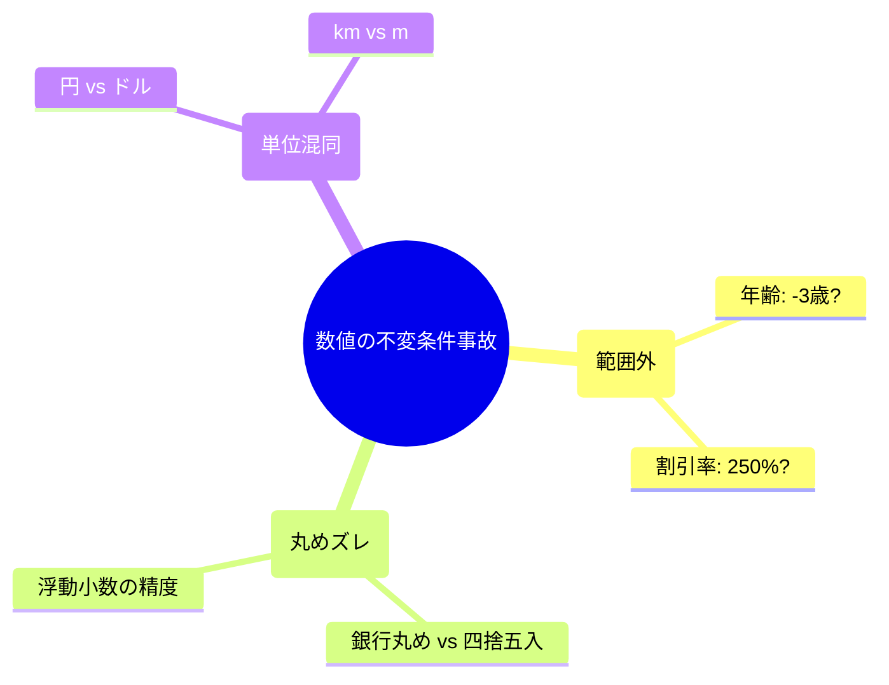
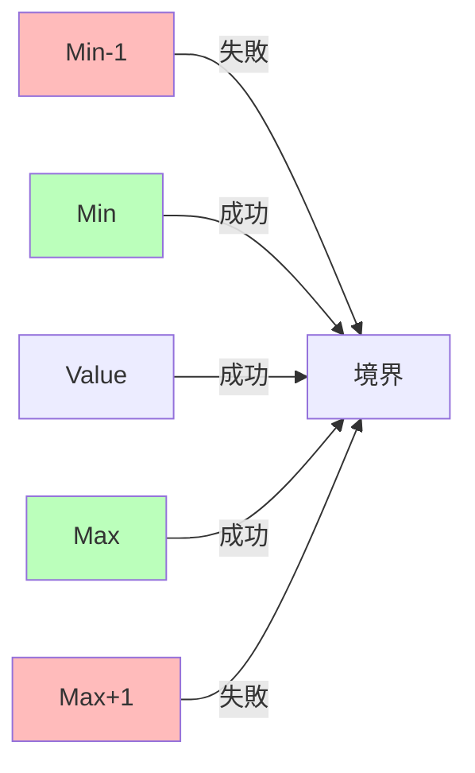

# 第16章：不変条件パターン①：数値（範囲・丸め・単位）🔢📌


この章は「数値まわりの事故」をまとめて減らす章だよ〜！😊✨
数値って一見シンプルだけど、実はバグの温床になりがち…！💥（範囲外・丸め・単位ミス）

---

## 0) この章のゴール🏁✨

* 「範囲（最小〜最大）」を毎回同じ形で守れる🛡️
* 「丸め（四捨五入ルール）」をブレずに統一できる🎯
* 「単位（円/ドル、m/km、%/倍率）」の混在事故を型で止められる🚫💸
* そして…テストもサクッと増やせる🧪✨

ちなみに最新のC# 14 は .NET 10 上で動いて、Visual Studio 2026 や .NET 10 SDK で試せるよ〜！🧡 ([Microsoft Learn][1])

---

## 1) 数値事故はだいたいこの3種🧨


### A. 範囲外（Range）😇➡️😱

* 年齢が -3 とか 999 とか
* 在庫が -1（返品処理のつもりが…）
* 割引率が 250%（えっ…）

### B. 丸め（Rounding）🤏📏

* 1.005 を小数2桁に丸めたつもりが 1.00 になったり…😵‍💫
* “四捨五入”のつもりが “銀行丸め” だったり…💦
  ※ .NET の Math.Round は既定で「偶数丸め（ToEven）」だよ ([Microsoft Learn][2])

### C. 単位ミス（Unit）🧯

* 円とドルを足しちゃう💸💸
* km を m として扱う🧭
* パーセント（0〜100）と倍率（0〜1）を混ぜる📉

この3つを「型＋生成ルール」でまとめて止めるのが、今日の主役だよ〜🛡️✨



---

## 2) パターン①：範囲つき数値を “型” にする（最重要）🛡️🔢


まずはテンプレ👇
「作る入口（Create）」でしか生成できないようにして、範囲を固定しちゃう！

```csharp
public readonly record struct Result<T>(bool IsOk, T? Value, string? Error)
{
    public static Result<T> Ok(T value) => new(true, value, null);
    public static Result<T> Fail(string error) => new(false, default, error);
}

public readonly record struct Age
{
    public int Value { get; }
    private Age(int value) => Value = value;

    public const int Min = 0;
    public const int Max = 130;

    public static Result<Age> Create(int value)
    {
        if (value < Min) return Result<Age>.Fail($"年齢は {Min} 以上だよ🫶");
        if (value > Max) return Result<Age>.Fail($"年齢は {Max} 以下だよ🫶");
        return Result<Age>.Ok(new Age(value));
    }

    public override string ToString() => Value.ToString();
}
```

### ここがポイント💡

* “年齢” を int のまま持たない（意味が乗らない）🙅‍♀️
* Age 型にすると「年齢っぽい数字」しか中に入らない🎀
* 以後、ドメイン内部では Age 型だけを使う（int 禁止ゾーン）🚧✨

---

## 3) パターン②：丸めルールは “明示して固定” 🎯🧾


丸めは「言葉のズレ」がめちゃ起きる…！💦
しかも Math.Round は既定で MidpointRounding.ToEven（偶数丸め）なんだよね。 ([Microsoft Learn][2])
だから、**アプリのルールとして明示**しよっ✅

### 3-1) まず知っておく2つの代表ルール🍡

* ToEven（偶数丸め）…偏りが減る（金融で使われること多め）
* AwayFromZero（0から遠ざける）…学校の四捨五入っぽい感覚

MidpointRounding には他にも選択肢があるよ（ToZero など）。 ([Microsoft Learn][3])

### 3-2) 例：Percent（0〜100）を小数2桁に固定する📏✨

「入力はブレるけど、中では統一！」ができると強いよ〜🎀

```csharp
public readonly record struct Percent
{
    public decimal Value { get; }
    private Percent(decimal value) => Value = value;

    public const decimal Min = 0m;
    public const decimal Max = 100m;

    private const int Scale = 2;
    private const MidpointRounding Rounding = MidpointRounding.AwayFromZero;

    public static Result<Percent> Create(decimal raw)
    {
        // まず丸めて “表現” を固定
        var rounded = Math.Round(raw, Scale, Rounding);

        if (rounded < Min) return Result<Percent>.Fail("割合は 0〜100 の範囲だよ🙂");
        if (rounded > Max) return Result<Percent>.Fail("割合は 0〜100 の範囲だよ🙂");

        return Result<Percent>.Ok(new Percent(rounded));
    }

    public decimal ToRatio() => Value / 100m; // 0〜1 の倍率に変換
    public override string ToString() => $"{Value}%";
}
```

💡丸めの注意：浮動小数（double）だと、2進数表現の都合で「思った通りにならない」ことがあるよ〜😵‍💫（.NETのドキュメントでも注意されてる） ([Microsoft Learn][2])
なので、金額や割合は decimal を選ぶのが無難な場面が多いよ🧡

---

## 4) パターン③：単位を “別の型” にして混ぜない🚫🧪


単位ミスって、レビューでも見落としがち…！😱
だから **型で混ぜられない** ようにするのが最強🛡️

### 4-1) 距離の例：Meters と Kilometers を分ける🧭✨


```csharp
public readonly record struct Meters
{
    public int Value { get; }
    private Meters(int value) => Value = value;

    public const int Min = 0;
    public const int Max = 1_000_000;

    public static Result<Meters> Create(int value)
    {
        if (value < Min) return Result<Meters>.Fail("距離は 0 以上だよ🙂");
        if (value > Max) return Result<Meters>.Fail("距離が大きすぎるよ🙂");
        return Result<Meters>.Ok(new Meters(value));
    }

    public Kilometers ToKilometers()
        => new Kilometers(Value / 1000m);
}

public readonly record struct Kilometers
{
    public decimal Value { get; }
    public Kilometers(decimal value) => Value = value;

    public Meters ToMeters()
        => new Meters((int)Math.Round(Value * 1000m, 0, MidpointRounding.AwayFromZero));
}
```

こうすると、

* “km を m として扱う” みたいな事故が起きにくくなる🧯
* 変換ポイントも一箇所に集まる（ここ超大事）📌✨

---

## 5) 境界（UI/API）では “文字列→型” の変換をまとめる🚪🔁


フォームやAPI入力って、だいたい文字列だよね🙂
そこで「変換係」を作るとスッキリするよ〜🎀

```csharp
public static class NumericParsers
{
    public static Result<Age> ParseAge(string text)
    {
        if (!int.TryParse(text, out var v))
            return Result<Age>.Fail("年齢は数字で入れてね🙂");

        return Age.Create(v);
    }

    public static Result<Percent> ParsePercent(string text)
    {
        if (!decimal.TryParse(text, out var v))
            return Result<Percent>.Fail("割合は数字で入れてね🙂");

        return Percent.Create(v);
    }
}
```

✅ ドメイン内部に “string” を持ち込まない
✅ 入口で変換して、失敗は入口で回収する
これが「境界で守る」の気持ちよさだよ〜🛡️✨

---

## 6) テストは “境界値セット” で一気に固める🧪🔥


範囲チェックは、だいたいこの並びで勝てるよ✌️✨

* Min-1（落ちる）
* Min（通る）
* Max（通る）
* Max+1（落ちる）



```csharp
using Xunit;

public class AgeTests
{
    [Theory]
    [InlineData(-1)]
    [InlineData(131)]
    public void Create_Fails_When_OutOfRange(int v)
    {
        var r = Age.Create(v);
        Assert.False(r.IsOk);
        Assert.NotNull(r.Error);
    }

    [Theory]
    [InlineData(0)]
    [InlineData(130)]
    public void Create_Ok_When_InRange(int v)
    {
        var r = Age.Create(v);
        Assert.True(r.IsOk);
        Assert.Equal(v, r.Value!.Value);
    }
}
```

丸めのテストは「境界＋ちょうど中間（x.5）」を入れると安心だよ〜🎯

---

## 7) 演習（この章のメイン）🎀💪

題材は「ポイント」「在庫」「年齢」あたりがやりやすいよ😊✨

### 演習A：在庫数 StockCount を作ろう📦


* 範囲：0〜10,000
* マイナス禁止
* 加算・減算メソッドを用意（直接 set しない）🛡️

### 演習B：ポイント Point を作ろう⭐

* 範囲：0〜1,000,000
* 加算はOK
* 減算でマイナスになるなら失敗（Resultで返す）🙂

### 演習C：Percent を使って割引を計算しよう🏷️

* 割引後金額 = 元値 × (1 - 割合)
* 丸めルールを1つに統一（例：小数0桁、AwayFromZero）🎯

---

## 8) AIの使いどころ🤖🧪✨（この章めっちゃ相性いい！）

### 8-1) 境界値テストを量産してもらう🧁

AIへのお願い例👇

* 「Age は 0〜130。境界値テストケースを xUnit の InlineData で作って」
* 「Percent は 0〜100、小数2桁、AwayFromZero。中間値（…5）も含めたテストを出して」

### 8-2) 単位混在バグを探してもらう🕵️‍♀️

* 「この計算で km と m が混ざる可能性ある？型で止める設計案ちょうだい」

### 8-3) “丸めルールの仕様文” を作ってもらう📜

* 「割引計算の丸め仕様を、ユーザー向けに一文で説明して」

---

## 9) まとめ：数値の不変条件チェックリスト✅💖

* 範囲は決めた？（Min/Max）🔢
* 生成入口は1つ？（Create/TryCreate）🏭
* 丸めルールは明示？（桁数・MidpointRounding）🎯 ([Microsoft Learn][2])
* 単位は型で分けた？（円/ドル、m/km、%/倍率）🧪
* テストは境界値で固めた？（Min-1, Min, Max, Max+1）🧪✨

---

次の第17章は「文字列」だから、数値の次にめちゃ気持ちよく進めるよ〜🔤💎
もしよければ、演習の題材を「ポイント」「在庫」「年齢」のどれで統一するかだけ決めちゃおう😊🎀

[1]: https://learn.microsoft.com/en-us/dotnet/csharp/whats-new/csharp-14 "What's new in C# 14 | Microsoft Learn"
[2]: https://learn.microsoft.com/en-us/dotnet/api/system.math.round?view=net-10.0 "Math.Round Method (System) | Microsoft Learn"
[3]: https://learn.microsoft.com/ja-jp/dotnet/api/system.midpointrounding?view=net-8.0&utm_source=chatgpt.com "MidpointRounding 列挙型 (System)"
