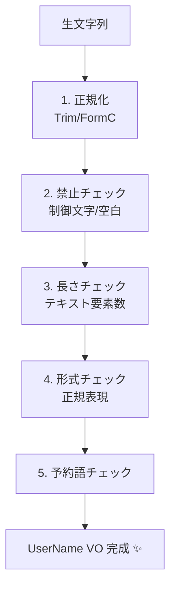

# 第17章：不変条件パターン②：文字列（長さ・禁止文字・形式）🔤📌


この章は「文字列って自由すぎて事故る😵」を、**型（VO）＋境界**で“事故らない状態”にしていく回だよ〜！🎀🛡️
（ちなみに現行のC#は **C# 14（2025/11公開）**だよ〜🆕 ([Microsoft Learn][1]) / .NETは **.NET 10（LTS, 2025/11/11公開）** ([Microsoft for Developers][2])）

---

## 1) 今日のゴール🏁✨

* 「文字列の不変条件テンプレ（考える順番）」が使える🙂✅
* `UserName` を **値オブジェクト（VO）**にして、**不正な文字列を“作れない”**状態にできる🔒💎
* **Trim / 正規化 / 長さ / 禁止文字 / 形式**を「どこでやる？」が判断できる🚪🧱

---

## 2) 文字列が事故りやすい理由💥😇

文字列って、見た目は同じでも中身が違ったり、余計な空白が混じったり、変な文字が紛れたりしがち…！🌀

よくある事故あるある👇

* `" Alice "` と `"Alice"` が別扱いになって重複登録😱🧊
* 改行や制御文字が混ざってログが壊れる🧨
* 全角/半角のゆらぎで検索できない🔍💦
* 「文字数制限」を `Length` でやったら絵文字でズレる😂（後でやるよ！）

---

## 3) 文字列不変条件テンプレ🧾✨（考える順番）

文字列は、まず **“その文字列は何者？”** を決めるのが超大事💡

## A. 3タイプに分けるとラクだよ🙂

1. **ID系（識別子）**：UserName / Code / Key

   * 比較はだいたい **Ordinal / OrdinalIgnoreCase** が向いてる（文化依存しない）🧊 ([Microsoft Learn][3])
2. **表示名系（表示テキスト）**：ニックネーム / 商品名

   * 許容が広め。空白や記号も“仕様で”決める🙂
3. **秘密系（機密）**：パスワード / トークン

   * ログに出さない、取り扱い注意⚠️（`SecureString` は制限もあるよ）([Microsoft Learn][4])

## B. ルールはこの順で決めると迷いにくい🗺️

1. **必須？任意？**（null/空/空白だけOK？）
2. **正規化**（Trimする？Unicode正規化する？大小文字は？）🧼
3. **長さ**（何を“1文字”と数える？）📏
4. **禁止**（改行・制御文字・ゼロ幅文字・絵文字…など）🚫
5. **形式**（許可文字セット / 正規表現 / 先頭だけ条件…）🧩
6. **予約語**（admin など）🧙‍♀️



---

## 4) 「長さ」の落とし穴：`Length` は“文字数”じゃない😵‍💫📏

`string.Length` は **UTF-16のコード単位数**なので、絵文字や結合文字でズレやすいよ〜！
UIの「◯文字以内」みたいな仕様は、**“見た目の1文字（テキスト要素）”**で数えるのが安全🙂✨
.NETにはそのための `StringInfo` があるよ ([Microsoft Learn][5])

```csharp
using System.Globalization;

static int TextLength(string s)
    => new StringInfo(s).LengthInTextElements;

Console.WriteLine("A".Length);                  // 1
Console.WriteLine(TextLength("A"));             // 1

var emoji = "👍🏽"; // 見た目は1文字っぽい
Console.WriteLine(emoji.Length);                // 環境により 2〜4 などになり得る
Console.WriteLine(TextLength(emoji));           // 1（“見た目”に寄せた数え方）
```

> まとめ：**表示系の長さ制限は `LengthInTextElements`** を検討すると事故りにくいよ〜🙂💕

---

## 5) 正規化：Trim + Unicode Normalize 🧼✨

## ✅ まずは「Trimする？」を仕様にしよう

* **ID系**：基本は `Trim()` して“正規形”として保存しちゃうのがラク🙂
* **表示名系**：前後はTrimするけど、途中の空白は許す…などが多い🎀

## ✅ Unicode正規化（Normalize）って何？

同じ見た目でも別コードになるのを揃えたりするやつだよ🧼
`.Normalize()` は **正規形C（Form C）**にできるよ ([Microsoft Learn][6])

```csharp
using System.Text;

static string NormalizeForId(string s)
    => s.Trim().Normalize(NormalizationForm.FormC);
```

> 注意⚠️：正規化は便利だけど、やりすぎると“別物が同じ扱い”になる場合もあるから、**どのフォームを使うかは仕様で固定**が安心だよ🙂

---

## 6) 禁止文字の定番セット🚫🧯

まず “これは禁止！” を決めると守りが固くなるよ🛡️✨

* **制御文字**（ログ/画面/通信で事故りがち）
* **改行**（1行入力のはずが複数行になる）
* **空白**（ID系は特に。表示名はOKにする場合も多い）
* **ゼロ幅系**（見えないのに入ってるやつ）
* （必要なら）絵文字、記号 など

初心者向けの実務テンプレとしては👇がまず強い💪

* `char.IsControl(c)` を禁止
* `\r \n \t` を禁止 or 方針決め
* ID系なら `char.IsWhiteSpace(c)` を禁止

---

## 7) 形式チェックは正規表現でOK🙂🧪（ただし速さと安全も意識）

正規表現は便利だけど、**使い方を雑にすると遅くなったり**するよ〜！😵
.NETは `GeneratedRegex`（ソース生成）を推してるので、基本はそれが安心💎 ([Microsoft Learn][7])
（.NET 10 でも Regex は性能改善が続いてるよ ([Microsoft for Developers][8])）

---

## 8) 実装：`UserName` 値オブジェクト（VO）を作ろう💎🔒

ここでは例として、こんな仕様にするね👇（**ID系**の想定）

* 必須
* 正規化：Trim + FormC
* 長さ：3〜20（**テキスト要素**で数える）
* 空白・制御文字は禁止
* 許可：文字（あらゆる言語OK）・数字・`_`・`-`
* 予約語：admin / root / system（例）

## 8-1) ミニResult型（章7でやったやつの簡易版）🧾✨

```csharp
public readonly record struct Result<T>(T? Value, string? Error)
{
    public bool IsSuccess => Error is null;

    public static Result<T> Ok(T value) => new(value, null);
    public static Result<T> Fail(string error) => new(default, error);
}
```

## 8-2) `UserName` VO 本体💎🛡️

```csharp
using System.Globalization;
using System.Text;
using System.Text.RegularExpressions;

public readonly record struct UserName
{
    public string Value { get; }

    private UserName(string value) => Value = value;

    public static Result<UserName> Create(string? raw)
    {
        if (string.IsNullOrWhiteSpace(raw))
            return Result<UserName>.Fail("ユーザー名は必須だよ🙂");

        // ✅ 正規化（仕様で固定！）
        var v = raw.Trim().Normalize(NormalizationForm.FormC);

        // ✅ 禁止：制御文字・改行・空白（ID系なので）
        foreach (var c in v)
        {
            if (char.IsControl(c))
                return Result<UserName>.Fail("使えない文字が入ってるよ（制御文字）🙅‍♀️");
            if (char.IsWhiteSpace(c))
                return Result<UserName>.Fail("空白は使えないよ🙅‍♀️");
        }

        // ✅ 長さ：見た目の文字数でカウント
        var len = new StringInfo(v).LengthInTextElements;
        if (len < 3 || len > 20)
            return Result<UserName>.Fail("ユーザー名は3〜20文字だよ🙂");

        // ✅ 形式：許可文字だけ
        if (!UserNameRegex().IsMatch(v))
            return Result<UserName>.Fail("使えるのは「文字・数字・_・-」だけだよ🙂");

        // ✅ 予約語
        if (IsReserved(v))
            return Result<UserName>.Fail("その名前は使えないよ🙇‍♀️");

        return Result<UserName>.Ok(new UserName(v));
    }

    private static bool IsReserved(string v)
        => v.Equals("admin", StringComparison.OrdinalIgnoreCase)
        || v.Equals("root", StringComparison.OrdinalIgnoreCase)
        || v.Equals("system", StringComparison.OrdinalIgnoreCase);

    // ✅ GeneratedRegex 推奨（ソース生成で速くて安心）
    [GeneratedRegex(@"^[\p{L}\p{Nd}_-]+$")]
    private static partial Regex UserNameRegex();
}
```

## ちょい補足🙂

* 予約語の比較は **OrdinalIgnoreCase** が「ID比較」に向いてるよ 🧊 ([Microsoft Learn][3])
* 「例外で弾く」流派なら、引数チェックに `ArgumentException.ThrowIfNullOrWhiteSpace` も便利（.NET 10のAPI）だよ⚡ ([Microsoft Learn][9])
  （ただしこの教材は“入力不正はResultで返す”寄りだから、今は参考程度でOK🙂）

---

## 9) 境界での変換：DTO → VO 🚪➡️💎

境界（Controller/API/UI）は **ゆるい入力**が来る場所。
だからここで `UserName.Create(dto.UserName)` して、**失敗を外向けに変換**するよ〜🙂✨

```csharp
public sealed class CreateUserRequest
{
    public string? UserName { get; init; }
}

public static object CreateUser(CreateUserRequest dto)
{
    var userName = UserName.Create(dto.UserName);
    if (!userName.IsSuccess)
        return new { ok = false, error = userName.Error }; // ここをHTTP 400などに変換🎀

    // 内部は “堅い世界” 🏛️
    var name = userName.Value!.Value;
    return new { ok = true, userName = name };
}
```

---

## 10) テスト：境界値を押さえる🧪✨

## 最低限そろえたいテスト観点🎯

* null / `""` / `"   "`
* `" abc "`（Trimの確認）
* 2文字・3文字・20文字・21文字
* 空白入り `"a b"`
* 改行入り `"a\nb"`
* 予約語 `"admin"`（大小や空白込みも）
* 全角/半角の混在（仕様に合わせて）
* 結合文字・絵文字（長さカウント事故の予防）

```csharp
using Xunit;

public class UserNameTests
{
    [Theory]
    [InlineData(null, false)]
    [InlineData("", false)]
    [InlineData("   ", false)]
    [InlineData("ab", false)]
    [InlineData("abc", true)]
    [InlineData(" abc ", true)]       // Trimして通す仕様
    [InlineData("a b", false)]
    [InlineData("admin", false)]
    [InlineData("山田太郎", true)]
    [InlineData("👍🏽👍🏽👍🏽", false)] // 絵文字は形式で弾く仕様
    public void Create_Works(string? input, bool ok)
    {
        var r = UserName.Create(input);
        Assert.Equal(ok, r.IsSuccess);
    }
}
```

---

## 11) AIの使いどころ🤖💕（めっちゃ相性いい！）

## ✅ 抜け漏れチェック役にする👀

コピペ用プロンプト👇

* 「UserNameの仕様はこれ。抜けがちな入力パターンを20個、理由つきで出して」
* 「Unicodeの罠（空白/ゼロ幅/結合文字/正規化）で、この実装が漏れてる点ある？」

## ✅ テストケース大量生成🧪

* 「xUnitのInlineDataを50個作って。通る/落ちるも付けて」
* 「“長さ”の境界値を中心に、落ちるケースを多めで」

## ✅ エラーメッセージ改善📣✨

* 「このエラーメッセージ、ユーザーに優しく短くして（原因がわかるように）」

---

## 12) 仕上げ演習📝🎀

## 演習1：DisplayName を作ろう🙂✨

* 途中の空白はOK（ただし改行はNG）
* 長さは 1〜30（テキスト要素）
* 制御文字NG
* “前後Trimするけど、途中の連続空白は1つにする” なども追加してみてね🧼

## 演習2：Slug（URL用）を作ろう🌐✨

* `a-z0-9-` のみ
* 先頭末尾 `-` 禁止
* 連続 `--` 禁止
* すべて小文字に正規化（`ToLowerInvariant` 推奨）([Microsoft Learn][3])

---

## 13) まとめ🎉🛡️

* 文字列は事故りやすいから、**仕様→正規化→禁止→長さ→形式**の順で固める🙂🔒
* “何を1文字と数える？” は超重要。表示系は `StringInfo` が助けになるよ📏✨ ([Microsoft Learn][5])
* 正規表現は `GeneratedRegex` で安全＆速くしやすい🧪💎 ([Microsoft Learn][7])
* VOにすると「作れない」が作れる＝不変条件が守れる🎀🛡️

次の第18章は **日付/時刻（期限・営業日・TZ）**で、文字列と同じくらい事故りやすい世界だよ〜⏰💥

[1]: https://learn.microsoft.com/en-us/dotnet/csharp/whats-new/csharp-version-history?utm_source=chatgpt.com "The history of C# | Microsoft Learn"
[2]: https://devblogs.microsoft.com/dotnet/announcing-dotnet-10/?utm_source=chatgpt.com "Announcing .NET 10"
[3]: https://learn.microsoft.com/ja-jp/dotnet/standard/base-types/best-practices-strings?utm_source=chatgpt.com ".NET での文字列の比較に関するベスト プラクティス"
[4]: https://learn.microsoft.com/en-us/dotnet/fundamentals/runtime-libraries/system-security-securestring?utm_source=chatgpt.com "System.Security.SecureString class - .NET"
[5]: https://learn.microsoft.com/ja-jp/dotnet/api/system.globalization.stringinfo?view=net-8.0&utm_source=chatgpt.com "StringInfo クラス (System.Globalization)"
[6]: https://learn.microsoft.com/en-us/dotnet/api/system.string.normalize?view=net-10.0&utm_source=chatgpt.com "String.Normalize Method (System)"
[7]: https://learn.microsoft.com/ja-jp/dotnet/standard/base-types/best-practices-regex?utm_source=chatgpt.com ".NET での正規表現のベスト プラクティス"
[8]: https://devblogs.microsoft.com/dotnet/performance-improvements-in-net-10/?utm_source=chatgpt.com "Performance Improvements in .NET 10"
[9]: https://learn.microsoft.com/en-us/dotnet/api/system.argumentexception.throwifnullorwhitespace?view=net-10.0&utm_source=chatgpt.com "ArgumentException.ThrowIfNullOrWhiteSpace(String ..."
