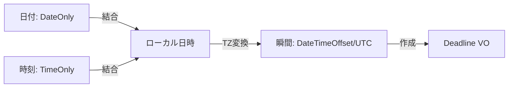

# 第18章：不変条件パターン③：日付/時刻（期限・営業日・TZ）⏰📌

## 今日のゴール🎯✨

* 「これって **“いつ” を表してる？（瞬間？日付？時刻？期間？）**」を見分けられる👀
* 期限（Deadline）を **VO（値オブジェクト）** にして、**過去期限・TZ混乱・営業日ズレ** を防げる🛡️
* テストで時間がブレないように **TimeProvider** を使える🤖🧪 ([Microsoft Learn][1])

---

## 0. まず大前提：日付/時刻は「4種類」あるよ🧠💡

ここを混ぜると事故りがち…！なので最初に分ける🙂✨

1. **瞬間（ある一点の時刻）**

* 例：決済が完了した瞬間、ログの時刻、DBに保存する「発生時刻」
* おすすめ：`DateTimeOffset`（UTCと関係づくので “一点” を表しやすい）([Microsoft Learn][2])

2. **日付（カレンダー上の日だけ）**

* 例：誕生日、締日、営業日判定の対象日
* おすすめ：`DateOnly` ([Microsoft Learn][3])

3. **時刻（時刻だけ）**

* 例：営業時間 9:00〜18:00、締切は18:00
* おすすめ：`TimeOnly` ([Microsoft Learn][3])

4. **期間（長さ）**

* 例：3日以内、30分、2週間
* おすすめ：`TimeSpan`（これは定番👍）

👉 **この章は主に「期限」＝(日付/時刻/TZ) → 最終的に “瞬間” に落とす** を扱うよ⏳✨



---

## 1. 日付/時刻の地雷あるある💣😭（チェックリスト化しよ✅）


### よくある事故トップたち🥲

* **UTCとローカルの混同**（JSTのつもりがUTC扱いで9時間ズレ😇）
* **“締切は当日23:59” の解釈が人によって違う**（inclusive/exclusive問題）
* **タイムゾーンが欠けた文字列**（`"2026-01-20 18:00"` ← どこの18:00？）
* **夏時間（DST）**：存在しない時刻／同じ時刻が2回ある（海外ユーザーで爆発しがち）
* **DB型が `datetime` でオフセットが消える**（“その瞬間” が復元できない）

  * SQL Serverなら `datetimeoffset` 型があるよ🗄️✨ ([Microsoft Learn][4])

---

## 2. 期限（Deadline）って何？を“仕様”で固定する📜✨

期限はアプリによって意味が違うから、まず **言葉を決める** のが大事🙂🫶

### 期限のよくある3パターン🧩

A) **瞬間としての期限**（おすすめ・迷いが少ない）

* 例：「2026-02-01 18:00（JST）を過ぎたら失効」
* 内部表現：**`DateTimeOffset`（UTCで保存）** ([Microsoft Learn][2])

B) **“日付”としての期限**（その日中OK）

* 例：「2026-02-01 の間ならOK」
* 内部表現：`DateOnly`（表示も扱いやすい）([Microsoft Learn][3])

C) **営業日ルール付き期限**（さらに事故りやすいけど実務で多い）

* 例：「3営業日後の18:00まで」
* 内部表現：`DateOnly` + `TimeOnly` + **カレンダー**（休日表）

この章では、実務で強い **A + C** を作るよ💪🎀

---

## 3. パターン①：Deadline（瞬間）VOを作る⏰🛡️（過去期限禁止つき）

### 不変条件（Invariants）例🧷

* ✅ `DueAtUtc` は **UTC（offset=0）** として保持する
* ✅ 作成時点で **過去の期限は禁止**（必要ならルール化）
* ✅ “今” は `TimeProvider` から取る（テストが安定）([Microsoft Learn][1])

```csharp
using System;

public readonly record struct Deadline
{
    public DateTimeOffset DueAtUtc { get; }

    private Deadline(DateTimeOffset dueAtUtc)
        => DueAtUtc = dueAtUtc;

    // 失敗は例外でもResultでもOKだけど、ここでは超シンプルに例外版🙂
    public static Deadline CreateUtc(DateTimeOffset dueAtUtc, TimeProvider clock)
    {
        if (dueAtUtc.Offset != TimeSpan.Zero)
            throw new ArgumentException("dueAtUtc must be UTC (offset=0).");

        var nowUtc = clock.GetUtcNow();
        if (dueAtUtc <= nowUtc)
            throw new ArgumentException("Deadline must be in the future.");

        return new Deadline(dueAtUtc);
    }

    public bool IsExpired(TimeProvider clock)
        => clock.GetUtcNow() >= DueAtUtc;

    public TimeSpan Remaining(TimeProvider clock)
        => DueAtUtc - clock.GetUtcNow();
}
```

### ここがポイント🧠✨

* `DateTimeOffset` は **“ある一点の時刻”** を表しやすい（オフセット付き）([Microsoft Learn][2])
* `TimeProvider` は **時間の抽象化**（テストで「今」を固定できる）([Microsoft Learn][1])

---

## 4. パターン②：タイムゾーン変換は「境界」でやる🌐🚪（中に持ち込まない🧼）

内部（ドメイン）では「UTCの瞬間」で持つのがラク✨
でも現実は「JSTの18:00」みたいに **ローカルで入力**されるよね🙂

そこで：

* **境界**：`(DateOnly + TimeOnly + TimeZoneId)` → `DateTimeOffset(UTC)` に変換
* **内部**：`Deadline`（UTC）だけを信じる🛡️

### Windowsでのタイムゾーン🪟🌍

`TimeZoneInfo` を使うよ（Windowsは “WindowsのTZ ID” が基本）([Microsoft Learn][5])

さらに、IANA ↔ Windows のID変換メソッドもある（外部APIがIANAを返す時に便利）([Microsoft Learn][6])

```csharp
using System;

public static class TimeZoneBoundary
{
    // 例：日本時間（Windows TZ ID）
    private const string TokyoTzId = "Tokyo Standard Time";

    public static DateTimeOffset ToUtcInstant(DateOnly date, TimeOnly time)
    {
        var tz = TimeZoneInfo.FindSystemTimeZoneById(TokyoTzId);

        // DateOnly + TimeOnly -> DateTime(kind=Unspecified)
        var local = date.ToDateTime(time, DateTimeKind.Unspecified);

        // Unspecified を「このTZのローカル」として UTC に変換
        var utcDateTime = TimeZoneInfo.ConvertTimeToUtc(local, tz);

        return new DateTimeOffset(utcDateTime, TimeSpan.Zero);
    }
}
```

> ※DSTがある地域だと「存在しない時刻」や「2回ある時刻」が出るから、プロダクト要件に応じて
>
> * その場合はエラーにする
> * 近い有効時刻に丸める
>   のどっちかを決めてね🙂（ここは仕様！）

---

## 5. パターン③：営業日カレンダー（まずは週末だけ版）📅🏢✨

営業日ルールを **“散らさない”** のが勝ち🏆
「営業日計算」はカレンダーに閉じ込めちゃおう🧺

```csharp
using System;
using System.Collections.Generic;

public sealed class BusinessCalendar
{
    private readonly HashSet<DateOnly> _holidays;

    public BusinessCalendar(IEnumerable<DateOnly>? holidays = null)
        => _holidays = holidays is null ? new HashSet<DateOnly>() : new HashSet<DateOnly>(holidays);

    public bool IsBusinessDay(DateOnly date)
    {
        var dow = date.DayOfWeek;
        if (dow is DayOfWeek.Saturday or DayOfWeek.Sunday) return false;
        if (_holidays.Contains(date)) return false;
        return true;
    }

    public DateOnly NextBusinessDay(DateOnly date)
    {
        var d = date;
        while (!IsBusinessDay(d)) d = d.AddDays(1);
        return d;
    }

    public DateOnly AddBusinessDays(DateOnly start, int businessDays)
    {
        if (businessDays < 0) throw new ArgumentOutOfRangeException(nameof(businessDays));

        var d = start;
        var added = 0;

        while (added < businessDays)
        {
            d = d.AddDays(1);
            if (IsBusinessDay(d)) added++;
        }
        return d;
    }
}
```

`DateOnly` は「日付だけ」を表すから、営業日判定がめっちゃ自然だよ😊✨ ([Microsoft Learn][3])

---

## 6. ミニ題材：サブスク請求の「3営業日後 18:00（JST）まで」💳⏳

### 仕様（不変条件）📜

* 請求発行 `IssuedAtUtc`（UTCの瞬間）
* 支払期限 `Deadline` は **発行日（JST換算）から3営業日後の18:00（JST）**
* 期限は **必ず未来**（発行より後）

```csharp
using System;

public static class BillingDeadlinePolicy
{
    private static readonly TimeOnly Cutoff = new(18, 0);

    public static Deadline BuildPaymentDeadline(
        DateTimeOffset issuedAtUtc,
        BusinessCalendar calendar,
        TimeProvider clock)
    {
        if (issuedAtUtc.Offset != TimeSpan.Zero)
            throw new ArgumentException("issuedAtUtc must be UTC (offset=0).");

        // 発行瞬間(UTC)をJSTローカルにして「発行日」を決める
        var tz = TimeZoneInfo.FindSystemTimeZoneById("Tokyo Standard Time");
        var issuedLocal = TimeZoneInfo.ConvertTime(issuedAtUtc, tz);
        var issuedDateLocal = DateOnly.FromDateTime(issuedLocal.DateTime);

        // 3営業日後の「日付」
        var dueDate = calendar.AddBusinessDays(issuedDateLocal, 3);
        dueDate = calendar.NextBusinessDay(dueDate);

        // 18:00(JST) を UTCの瞬間へ
        var dueAtUtc = TimeZoneBoundary.ToUtcInstant(dueDate, Cutoff);

        // VOで最終チェック（未来期限など）
        return Deadline.CreateUtc(dueAtUtc, clock);
    }
}
```

* `TimeZoneInfo` でタイムゾーン変換できるよ🌐 ([Microsoft Learn][7])
* “一点の時刻”は `DateTimeOffset` が扱いやすいよ⏰ ([Microsoft Learn][2])

---

## 7. テストが安定する！TimeProviderで「今」を固定🧪🧊✨

`DateTime.Now` 直呼びだとテストが不安定になりがち🥲
`TimeProvider` を使うと “今” を差し替えできるよ👍 ([Microsoft Learn][1])

さらに `.NET 10` 系だと `FakeTimeProvider` を提供するテスト用パッケージもあるよ🧪✨ ([NuGet][8])

```csharp
using System;
using Microsoft.Extensions.TimeProvider.Testing;
using Xunit;

public class DeadlineTests
{
    [Fact]
    public void Deadline_is_not_expired_before_due()
    {
        var fake = new FakeTimeProvider(new DateTimeOffset(2026, 1, 20, 0, 0, 0, TimeSpan.Zero));
        var due = new DateTimeOffset(2026, 1, 21, 0, 0, 0, TimeSpan.Zero);

        var deadline = Deadline.CreateUtc(due, fake);

        Assert.False(deadline.IsExpired(fake));

        fake.Advance(TimeSpan.FromDays(2));
        Assert.True(deadline.IsExpired(fake));
    }
}
```

---

## 8. 演習（手を動かすやつ）📝💕 + AI活用🤖✨

### 演習1：期限仕様を日本語で固定しよ📜

次の文章を **曖昧さゼロ** に書き換えてみてね🙂

* 「支払い期限は3日後まで」
  （例：3営業日？ 72時間？ 当日中？ JST？ UTC？）

🤖AIプロンプト例

* 「この期限仕様の曖昧ポイントを列挙して、質問リストにして」
* 「“仕様として一意” になる書き方を3案出して」

---

### 演習2：BusinessCalendarに祝日を足す🎌📅

* `HashSet<DateOnly>` に祝日を入れて、営業日計算が変わるのを確認✅
* 祝日データの持ち方（DB/設定ファイル/コード直書き）を考えてみよう🙂

🤖AIプロンプト例

* 「祝日データの管理方法を、規模別にメリデメで3案」
* 「AddBusinessDaysの境界値テストを20個ちょうだい」

---

### 演習3：境界での入力→内部変換を作る🚪✨

* 画面入力：`"2026-02-01"` と `"18:00"` を受け取って
* 境界で `DateOnly/TimeOnly` に変換 → `Deadline` を生成
* 失敗時は “ユーザー向けエラー” にする（内部例外をそのまま見せない）🙂🧼

🤖AIプロンプト例

* 「入力の失敗パターンを網羅して、ユーザー向け文言案も付けて」
* 「境界変換の責務分割（どこで何をする）を提案して」

---

## 9. まとめ🎀🏁

* 日付/時刻は **“何を表すか”** を最初に分類すると事故が激減💡
* 期限は最終的に **UTCの瞬間（DateTimeOffset）** に落とすと強い⏰ ([Microsoft Learn][2])
* 営業日計算は **BusinessCalendarに隔離**🧺
* “今” は `TimeProvider` で差し替えて **テスト安定**🧪✨ ([Microsoft Learn][1])

---

次の章（第19章）は「集合の不変条件（重複禁止・上限・順序）」で、**カートや明細**がめちゃ題材に合うよ🛒💖

[1]: https://learn.microsoft.com/en-us/dotnet/standard/datetime/timeprovider-overview?utm_source=chatgpt.com "What is the TimeProvider class - .NET"
[2]: https://learn.microsoft.com/en-us/dotnet/standard/datetime/?utm_source=chatgpt.com "Dates, times, and time zones - .NET"
[3]: https://learn.microsoft.com/en-us/dotnet/standard/datetime/how-to-use-dateonly-timeonly?utm_source=chatgpt.com "How to use DateOnly and TimeOnly - .NET"
[4]: https://learn.microsoft.com/en-us/sql/t-sql/data-types/datetimeoffset-transact-sql?view=sql-server-ver17&utm_source=chatgpt.com "datetimeoffset (Transact-SQL) - SQL Server"
[5]: https://learn.microsoft.com/en-us/dotnet/api/system.timezoneinfo?view=net-10.0&utm_source=chatgpt.com "TimeZoneInfo Class (System)"
[6]: https://learn.microsoft.com/en-us/dotnet/api/system.timezoneinfo.tryconvertwindowsidtoianaid?view=net-10.0&utm_source=chatgpt.com "TimeZoneInfo.TryConvertWindowsIdToIanaId Method"
[7]: https://learn.microsoft.com/en-us/dotnet/standard/datetime/converting-between-time-zones?utm_source=chatgpt.com "Converting times between time zones - .NET"
[8]: https://www.nuget.org/packages/Microsoft.Extensions.TimeProvider.Testing/10.0.0?utm_source=chatgpt.com "Microsoft.Extensions.TimeProvider.Testing 10.0.0"
