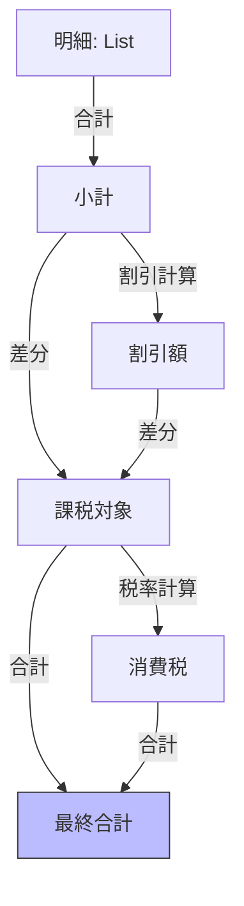
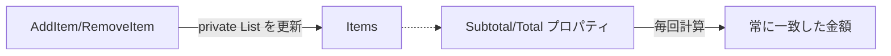

# 第20章：集合の不変条件②：関連の整合性（合計金額など）➕🧾

この章はね、めっちゃ大事な「ズレ」対策だよ〜！🥺💥
**明細（部分）と合計（全体）が、いつでもピッタリ一致する**ように守っていくよ🛡️✨

---

## 1. 今日のゴール🎯💖

できるようになったら勝ち！🏆✨

* ✅ `Cart.Total` が **明細の合計** と常に一致する（割引・税・丸め含む）🧾
* ✅ 「更新のしかた」を限定して、**ズレが起きる道を塞ぐ**🚪🔒
* ✅ 「丸めの順番」まで含めて、**仕様として固定**できる📌🙂

---

## 2. まず“あるある事故”を見よ👀💥

### 事故パターンA：Totalを手で持つ（そして忘れる）😱

* `Items` から1行削除したのに `Total` を更新し忘れる
* 10%割引を2回適用してしまう
* 税の丸めの順がバラバラで、画面とDBとレシートが合わない🌀

### 事故パターンB：「どこでもItemsがいじれる」🤯

* `public List<CartItem> Items { get; set; }` とかで、外から自由に改変できる
* すると…**Totalを守る入口が消える**😇💣

---

## 3. 整合性のコツ（結論）✨🧠


ここが超重要👇🥰

### ✅ 合計は「結果」

### ✅ 明細は「原因」

**原因（明細）だけ更新できる**ようにして、
**結果（合計）は常に原因から再計算**するのが最強だよ🛡️✨



---

## 4. 守り方は大きく2つ（初心者はまず1つ目！）💡

### パターン①：合計は“派生”として毎回計算（おすすめ）🌟

* `Total` は `get` で計算して返すだけ
* **保存しない**（＝ズレる余地がない）👏

### パターン②：合計をキャッシュする（性能が必要なとき）⚡

* `Recalculate()` を**必ず**通す
* 更新メソッドの中でしか `Recalculate()` を呼べないようにする🔒

この章では、まず **パターン①**で“ズレない世界”を作るよ😊✨

---

## 5. 「割引・税・丸め」まで含めて不変条件にする🧾📌

お金の計算は `double` じゃなくて `decimal` が基本だよ💰
金融系や通貨に `decimal` が適してるのは .NET の公式ドキュメントでも明言されてるよ📚✨ ([Microsoft Learn][1])

### この章のルール（例：JPY）🇯🇵

* 小計 = 明細合計
* 割引 = 小計×率 → **円単位で丸め**
* 課税対象 = `max(0, 小計 - 割引)`
* 税 = 課税対象×税率 → **円単位で丸め**
* 合計 = 課税対象 + 税

> 💡ポイント：**丸めの順番も仕様**だよ！
> ここがブレると、同じカートでも合計が変わる😵‍💫

---

## 6. 実装してみよ（ズレないCart）🛒🛡️

下は「明細が原因、合計は結果」を貫く実装例だよ😊✨
（円の丸めは `MidpointRounding.AwayFromZero` を使って“いわゆる四捨五入っぽく”するよ🔢）

```csharp
using System;
using System.Collections.Generic;
using System.Linq;

public readonly struct Money : IEquatable<Money>
{
    public string Currency { get; }
    public decimal Amount { get; }

    private Money(string currency, decimal amount)
    {
        Currency = currency;
        Amount = amount;
    }

    public static Money Create(string currency, decimal amount)
    {
        if (string.IsNullOrWhiteSpace(currency)) throw new ArgumentException("currency is required");
        return new Money(currency.Trim().ToUpperInvariant(), amount);
    }

    public static Money Zero(string currency) => Create(currency, 0m);

    public Money RoundTo(int decimals, MidpointRounding mode)
        => Create(Currency, decimal.Round(Amount, decimals, mode));

    private static void EnsureSameCurrency(Money a, Money b)
    {
        if (!string.Equals(a.Currency, b.Currency, StringComparison.Ordinal))
            throw new InvalidOperationException($"Currency mismatch: {a.Currency} vs {b.Currency}");
    }

    public static Money operator +(Money a, Money b)
    {
        EnsureSameCurrency(a, b);
        return Create(a.Currency, a.Amount + b.Amount);
    }

    public static Money operator -(Money a, Money b)
    {
        EnsureSameCurrency(a, b);
        return Create(a.Currency, a.Amount - b.Amount);
    }

    public static Money operator *(Money a, int n)
        => Create(a.Currency, a.Amount * n);

    public bool Equals(Money other)
        => Currency == other.Currency && Amount == other.Amount;

    public override bool Equals(object? obj)
        => obj is Money other && Equals(other);

    public override int GetHashCode()
        => HashCode.Combine(Currency, Amount);

    public override string ToString() => $"{Amount} {Currency}";
}

public sealed record CartItem(string ProductId, Money UnitPrice, int Quantity)
{
    public Money LineTotal => UnitPrice * Quantity;

    public static CartItem Create(string productId, Money unitPrice, int quantity)
    {
        if (string.IsNullOrWhiteSpace(productId)) throw new ArgumentException("productId is required");
        if (quantity <= 0) throw new ArgumentOutOfRangeException(nameof(quantity));
        return new CartItem(productId.Trim(), unitPrice, quantity);
    }

    public CartItem ChangeQuantity(int quantity) => Create(ProductId, UnitPrice, quantity);
}

public interface IDiscountPolicy
{
    Money Calculate(Money subtotal);
}

public sealed class PercentDiscount : IDiscountPolicy
{
    private readonly decimal _rate; // 0.10m = 10%

    public PercentDiscount(decimal rate)
    {
        if (rate < 0m || rate > 1m) throw new ArgumentOutOfRangeException(nameof(rate));
        _rate = rate;
    }

    public Money Calculate(Money subtotal)
        => Money.Create(subtotal.Currency, subtotal.Amount * _rate)
                .RoundTo(0, MidpointRounding.AwayFromZero);
}

public sealed class TaxPolicy
{
    private readonly decimal _rate;

    public TaxPolicy(decimal rate)
    {
        if (rate < 0m || rate > 1m) throw new ArgumentOutOfRangeException(nameof(rate));
        _rate = rate;
    }

    public Money Calculate(Money taxableAmount)
        => Money.Create(taxableAmount.Currency, taxableAmount.Amount * _rate)
                .RoundTo(0, MidpointRounding.AwayFromZero);
}

public sealed class Cart
{
    private readonly List<CartItem> _items = new();
    private readonly List<IDiscountPolicy> _discounts = new();

    public string Currency { get; }
    public IReadOnlyList<CartItem> Items => _items;

    public Cart(string currency)
    {
        if (string.IsNullOrWhiteSpace(currency)) throw new ArgumentException(nameof(currency));
        Currency = currency.Trim().ToUpperInvariant();
    }

    public void AddItem(string productId, Money unitPrice, int quantity)
    {
        if (unitPrice.Currency != Currency) throw new InvalidOperationException("Currency mismatch");

        var item = CartItem.Create(productId, unitPrice, quantity);

        var i = _items.FindIndex(x => x.ProductId == item.ProductId);
        if (i >= 0)
        {
            var existing = _items[i];
            _items[i] = existing.ChangeQuantity(existing.Quantity + item.Quantity);
        }
        else
        {
            _items.Add(item);
        }
    }

    public void RemoveItem(string productId)
        => _items.RemoveAll(x => x.ProductId == productId);

    public void ChangeQuantity(string productId, int quantity)
    {
        var i = _items.FindIndex(x => x.ProductId == productId);
        if (i < 0) throw new InvalidOperationException("Item not found");
        _items[i] = _items[i].ChangeQuantity(quantity);
    }

    public void AddDiscount(IDiscountPolicy discount) => _discounts.Add(discount);
    public void ClearDiscounts() => _discounts.Clear();

    // ✅ 小計（原因：明細の合計）
    public Money Subtotal
        => _items.Aggregate(Money.Zero(Currency), (acc, x) => acc + x.LineTotal);

    // ✅ 割引（不変条件：小計を超えない）
    public Money DiscountTotal
    {
        get
        {
            var subtotal = Subtotal;
            var discount = _discounts.Aggregate(Money.Zero(Currency), (acc, d) => acc + d.Calculate(subtotal));
            if (discount.Amount > subtotal.Amount) discount = subtotal; // 上限
            return discount;
        }
    }

    // ✅ 課税対象（不変条件：マイナスにしない）
    public Money TaxableAmount
    {
        get
        {
            var taxable = Subtotal - DiscountTotal;
            if (taxable.Amount < 0m) taxable = Money.Zero(Currency);
            return taxable;
        }
    }

    public Money Tax(TaxPolicy taxPolicy) => taxPolicy.Calculate(TaxableAmount);

    // ✅ 合計（結果：原因から毎回導くのでズレない）
    public Money Total(TaxPolicy taxPolicy) => TaxableAmount + Tax(taxPolicy);
}
```

### この実装が“ズレない”理由🛡️✨

* `Total` を保持してない（＝更新忘れが存在しない）🙂
* `Items` は外から差し替えできない（入口が `Cart` のメソッドだけ）🚪🔒
* 割引・税・丸めの順序を `Cart` と `Policy` に固定できる📌



---

## 7. テストで「ズレない」を証明しよ🧪💕

「不変条件」はテストと相性バツグンだよ〜！😊✨
（例：xUnit）

```csharp
using Xunit;

public class CartTests
{
    [Fact]
    public void Total_is_always_consistent()
    {
        var cart = new Cart("JPY");
        var tax = new TaxPolicy(0.10m);

        cart.AddItem("A", Money.Create("JPY", 100m), 2); // 200
        cart.AddItem("B", Money.Create("JPY", 50m), 1);  // +50 => 250
        cart.AddDiscount(new PercentDiscount(0.10m));    // -25 => 225
        // 税: 225 * 0.10 = 22.5 => 23（AwayFromZero）
        var total = cart.Total(tax);

        Assert.Equal(Money.Create("JPY", 250m), cart.Subtotal);
        Assert.Equal(Money.Create("JPY", 25m), cart.DiscountTotal);
        Assert.Equal(Money.Create("JPY", 225m), cart.TaxableAmount);
        Assert.Equal(Money.Create("JPY", 23m), cart.Tax(tax));
        Assert.Equal(Money.Create("JPY", 248m), total);
    }
}
```

---

## 8. 演習（ここが本番💪🎀）

### 演習A：ズレる実装をわざと作って、直す😈➡️😇

1. `Cart` に `public Money TotalSnapshot { get; set; }` を足す
2. 更新のどこかで **Snapshot更新をわざと忘れる**
3. テストが落ちるのを確認
4. Snapshotを消して「派生」に戻す✨

👉 “なぜ派生が強いか”が体でわかるよ🥰

### 演習B：割引が複数あるときの整合性🧾➕

* 10%割引＋500円引き（固定）みたいに複数割引を追加
* 不変条件：

  * 割引合計は小計を超えない
  * 課税対象はマイナスにしない

### 演習C：丸め順で答えが変わる例を作る🔢😵‍💫

* 「明細ごとに税を丸め」 vs 「合計に税をかけて丸め」
* どっちが正しいかは**仕様次第**！
* 仕様を決めたら、そこを不変条件として固定する📌✨

---

## 9. AI（Copilot/Codex等）にやらせると強いお願い🤖💖

コピペで使えるお願い例だよ〜🪄✨

* 「この `Cart` が守るべき不変条件を10個、具体例付きで列挙して」🛡️
* 「丸め順が変わると合計がズレる具体例（数字入り）を3つ作って」🔢
* 「`AddItem/ChangeQuantity/RemoveItem` の更新経路で整合性が壊れる可能性をレビューして」👀
* 「境界値テスト（0件、1件、最大件数、割引過大、税率0/1など）をxUnitで大量に生成して」🧪✨

---

## 10. 2026の“最新寄り”メモ（軽く）📌✨

* C# の最新は **C# 14（2025年11月リリース）**で、拡張メンバーなどが追加されてるよ🧩 ([Microsoft Learn][2])
* .NET 側も **.NET 10** の新機能が整理されてる（ASP.NET Core 10 など）🌐 ([Microsoft Learn][3])
* Visual Studio 2026 もリリースノートやInsidersノートが更新されてるよ🧰✨ ([Microsoft Learn][4])

（でもこの章の核心は、**言語機能より“設計の守り方”**だよ😊🛡️）

---

## まとめ🎀🏁

* ✅ **合計は結果、明細は原因**
* ✅ 原因だけ更新できるように入口を絞る🚪🔒
* ✅ 結果は派生で毎回作る（ズレない）🧾✨
* ✅ 丸め順・割引順も「仕様」として固定📌

---

次は「第21章 setterを減らす✂️🔒」に続く流れが気持ちいいよ〜😊💕
この章のCartを、`public set;` を削ってさらに堅くしていこっか？🛡️✨

[1]: https://learn.microsoft.com/en-us/dotnet/csharp/language-reference/builtin-types/floating-point-numeric-types?utm_source=chatgpt.com "Floating-point numeric types - C# reference"
[2]: https://learn.microsoft.com/en-us/dotnet/csharp/whats-new/csharp-14?utm_source=chatgpt.com "What's new in C# 14"
[3]: https://learn.microsoft.com/en-us/dotnet/core/whats-new/dotnet-10/overview?utm_source=chatgpt.com "What's new in .NET 10"
[4]: https://learn.microsoft.com/en-us/visualstudio/releases/2026/release-notes?utm_source=chatgpt.com "Visual Studio 2026 Release Notes"
