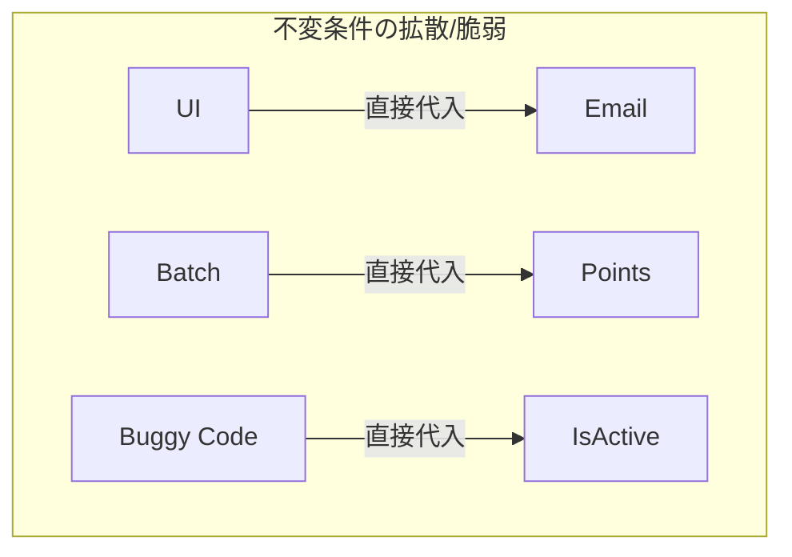
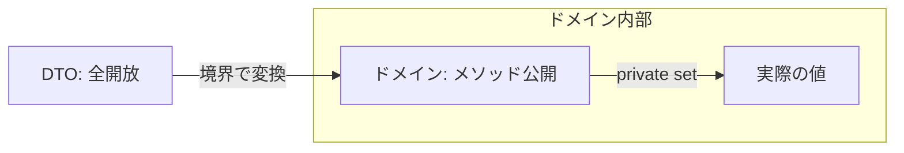

# 第21章：更新で壊れない①：setterを減らす✂️🔒


この章はひとことで言うと、**「勝手に書き換えられる入口（public set）を減らして、不変条件を守れる更新ルートだけ残す」**回だよ〜！😊🎀
C# 14（.NET 10 / Visual Studio 2026）で触れると便利な小ワザも混ぜつつ進めるね✨ ([Microsoft Learn][1])

---

## 0. この章のゴール🏁✨

読み終わったら、次ができるようになるよ😊🛡️

* 「public set;」が危ない理由を説明できる⚠️
* setter を減らして、**更新をメソッド経由**にできる🚪➡️✅
* 「DTOはゆるく」「ドメインはかたく」を分けられる🎀🏛️
* 永続化（DB）や JSON の都合で setter が必要なときの逃げ道も知ってる🧯

---

## 1. なんで public set が危ないの？😱💥

### 1-1. “壊れた状態”を作れる入口が多すぎる🚪🚪🚪


例えばこんなクラスがあったとするね👇

```csharp
public class Member
{
    public string Email { get; set; } = "";
    public int Points { get; set; }
    public bool IsActive { get; set; }
}
```

これ、どこからでもこうできちゃう…💥

```csharp
member.Email = "";       // 空メール
member.Points = -999;    // 負ポイント
member.IsActive = false; // 退会？凍結？よく分からない状態
```

直す場所が分からなくなるし、レビューでも見落ちやすいの🥲



---

## 2. 解決方針はこれだけ！📌✨

### 2-1. 更新の入口を “メソッド” に寄せる🛡️🚪


* プロパティは **基本 “読めるだけ”**（setter を弱める）
* 更新は **意図が分かる名前のメソッド**だけにする
  例：ChangeEmail / AddPoints / Deactivate みたいに🎀

---

## 3. setter削減の基本パターン3つ✂️🔒

### パターンA：public set → private set（王道）👑

```csharp
public class Member
{
    public Email Email { get; private set; }
    public int Points { get; private set; }
    public bool IsActive { get; private set; }

    public Member(Email email)
    {
        Email = email;
        Points = 0;
        IsActive = true;
    }

    public void ChangeEmail(Email newEmail)
    {
        Email = newEmail;
    }

    public void AddPoints(int add)
    {
        if (add <= 0) throw new ArgumentOutOfRangeException(nameof(add));
        Points += add;
    }

    public void Deactivate()
    {
        IsActive = false;
    }
}
```

ポイントはこれ👇😊✨

* **不変条件チェックが “更新メソッドの中” に集まる**🧲
* 呼び出し側は「何をしたいか」で読める📖💕

---

### パターンB：作るときだけ入れてOK（init を使う）🧊✨


「生成後に変えたくない」プロパティは「init」も超便利だよ〜！
init は **生成時だけセットできて、その後は変更できない**仕組みだよ🧷 ([Microsoft Learn][2])

```csharp
public class Profile
{
    public required Email Email { get; init; } // 必須！🎀
    public string DisplayName { get; init; } = "";
}
```

「required」は **初期化必須にできる**機能だよ🧷 ([Microsoft Learn][3])

> ただし！これは “更新モデル” というより「読み取り用」「DTO寄り」で使うと気持ちいいことが多いよ😊

---

### パターンC：C# 14 の field で “楽して安全”🧼✨


C# 14 には「field」っていう **プロパティの裏側フィールドを触れる新機能**があるよ〜！
「トリムしたい」とか「nullは入れたくない」みたいな軽い整形に便利✨ ([Microsoft Learn][4])

例えば「セット時に必ず Trim」したいとき👇

```csharp
public class Person
{
    public string Name
    {
        get;
        private set => field = value.Trim();
    }

    public Person(string name)
    {
        Name = name; // private set なのでここからだけ通す🎀
    }
}
```

「明示的な backing field を書かなくていい」のが嬉しい〜！🥰



---

## 4. “集合”があると setter 地獄が加速する🧺💥


こういうの最悪パターン👇

```csharp
public class Cart
{
    public List<CartItem> Items { get; set; } = new();
    public decimal Total { get; set; }
}
```

呼び出し側が勝手に Items をいじって Total がズレる…😇🧨

### 4-1. 外には IReadOnlyList、中は List（定番）🛒✨

```csharp
public class Cart
{
    private readonly List<CartItem> _items = new();
    public IReadOnlyList<CartItem> Items => _items;

    public Money Total { get; private set; } = Money.Zero("JPY");

    public void AddItem(ProductId productId, int quantity, Money unitPrice)
    {
        if (quantity <= 0) throw new ArgumentOutOfRangeException(nameof(quantity));

        _items.Add(new CartItem(productId, quantity, unitPrice));
        RecalculateTotal();
    }

    public void RemoveItem(ProductId productId)
    {
        _items.RemoveAll(x => x.ProductId == productId);
        RecalculateTotal();
    }

    private void RecalculateTotal()
    {
        Total = _items.Aggregate(Money.Zero("JPY"), (acc, x) => acc + x.Subtotal);
    }
}
```

これで **「更新ルートが Cart の中だけ」**になるから、整合性が守りやすいよ〜！😊🛡️

---

## 5. でも現実：DB/JSONの都合で setter 要る時あるよね？🧯😅

ここは安心してOK！ちゃんと逃げ道あるよ🎀

### 5-1. JSON：private setter でもいけることがある🧩✨


System.Text.Json は **JsonInclude を使うと private/internal setter を使える**説明があるよ📌 ([Microsoft Learn][5])

（例）

```csharp
public class MemberDto
{
    [System.Text.Json.Serialization.JsonInclude]
    public string Email { get; private set; } = "";
}
```

### 5-2. DB（EF Core）：Backing Field という公式ルートがある🗄️🧱

EF Core は「プロパティじゃなくてフィールドに読み書きさせる」設計ができるよ〜！
カプセル化したいときに超大事な仕組み✨ ([Microsoft Learn][6])

---

## 6. 実践リファクタ演習🧪✨（setter削減の型を体に覚えよう💪🎀）

### 演習1：public set 地獄を救う✂️😇

次のクラスを「壊れない」ように直してね👇

```csharp
public class Member
{
    public string Email { get; set; } = "";
    public int Points { get; set; }
    public bool IsActive { get; set; }
}
```

#### お題✅

1. Email は「Email VO」に置き換える（Create で検証済みのやつ）📧💎
2. 「Points は負にならない」
3. 「Deactivate したら points を加算できない」
4. setter を消して、更新メソッドに寄せる✂️

#### 仕上がりイメージ（例）✨

```csharp
public class Member
{
    public Email Email { get; private set; }
    public int Points { get; private set; }
    public bool IsActive { get; private set; }

    public Member(Email email)
    {
        Email = email;
        Points = 0;
        IsActive = true;
    }

    public void ChangeEmail(Email newEmail) => Email = newEmail;

    public void AddPoints(int add)
    {
        if (!IsActive) throw new InvalidOperationException("Inactive member can't earn points.");
        if (add <= 0) throw new ArgumentOutOfRangeException(nameof(add));
        Points += add;
    }

    public void Deactivate() => IsActive = false;
}
```

---

### 演習2：コレクションを “外から壊せない” にする🧺🔒

「Items を外に List のまま出さない」へ変更してね🛒✨
（Items は IReadOnlyList、更新は Add/Remove メソッドだけ）

---

### 演習3：テストで “壊れない” を確認🧪🛡️

xUnit でサクッと確認しよう🎀

```csharp
using Xunit;

public class MemberTests
{
    [Fact]
    public void AddPoints_InactiveMember_Throws()
    {
        var email = Email.Create("a@b.com").Value; // Result想定
        var member = new Member(email);
        member.Deactivate();

        Assert.Throws<InvalidOperationException>(() => member.AddPoints(10));
    }
}
```

---

## 7. AI活用プロンプト集🤖✨（そのままコピペOK🎀）

### 7-1. setter削減の設計案を出させる🛠️

* 「このC#クラスのpublic setを減らして、不変条件が守れる設計に直して。更新は意図が分かるメソッドに寄せて。必要ならprivate setやbacking fieldを使って。」

### 7-2. “壊れ方” を洗い出させる💥🔍

* 「このモデルで不変条件が壊れる更新パターンを20個列挙して。特にpublic setやListの直接操作で起きるものを多めに。」

### 7-3. テストケース大量生成🧪✨

* 「このクラスの不変条件を満たす/破る境界値テストをxUnitで10〜20個提案して。」

※ Visual Studio では Copilot が統合されて使える案内もあるよ（無料で一部機能、という説明あり）。([Visual Studio][7])

---

## 8. チェックリスト✅🎀（レビューで超使える！）

* public set が残ってる理由は説明できる？（“必要だから”じゃなくて）🙂
* 更新は「意図が分かる名前のメソッド」経由になってる？🛡️
* コレクションを List のまま外に晒してない？🧺🚫
* 「更新したら整合性がズレる」値（Total 等）が外から触れない？🧾🔒
* 永続化/JSON の事情があるなら、Backing Field / JsonInclude など “公式ルート” を使ってる？🗄️🧩 ([Microsoft Learn][6])

---

## 9. 次章へのつながり🔁✨

この章で「更新の入口」を絞れたから、次はさらに一段強い守り💪🎀
**第22章：更新メソッドそのものを “入口（境界）” として設計して、検証→適用の順番を型にする**…って流れがめちゃ気持ちいいよ〜！😊🛡️

必要なら、今まで作った題材（Cart/Member/Subscriptionなど）に合わせて、第21章の演習コードを「あなたの題材」に寄せた完全版も作るよ🎀✨

[1]: https://learn.microsoft.com/ja-jp/dotnet/csharp/whats-new/csharp-14?utm_source=chatgpt.com "C# 14 の新機能"
[2]: https://learn.microsoft.com/en-us/dotnet/csharp/language-reference/keywords/init?utm_source=chatgpt.com "The init keyword - init only properties - C# reference"
[3]: https://learn.microsoft.com/en-us/dotnet/csharp/language-reference/proposals/csharp-11.0/required-members?utm_source=chatgpt.com "Required members - C# feature specifications"
[4]: https://learn.microsoft.com/en-us/dotnet/csharp/language-reference/keywords/field?utm_source=chatgpt.com "The `field` contextual keyword - C# reference"
[5]: https://learn.microsoft.com/en-us/dotnet/standard/serialization/system-text-json/migrate-from-newtonsoft?utm_source=chatgpt.com "Migrate from Newtonsoft.Json to System.Text.Json - .NET"
[6]: https://learn.microsoft.com/en-us/ef/core/modeling/backing-field?utm_source=chatgpt.com "Backing Fields - EF Core"
[7]: https://visualstudio.microsoft.com/github-copilot/?utm_source=chatgpt.com "Visual Studio With GitHub Copilot - AI Pair Programming"
