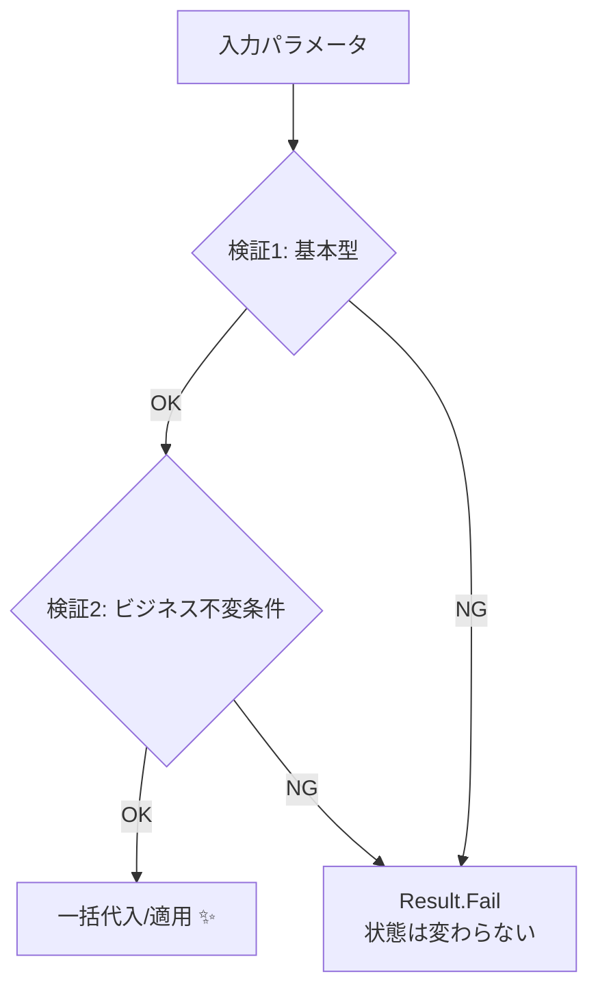

# 第22章：更新で壊れない②：メソッドが“入口”になる🛡️🚪

この章は一言でいうと——
**「更新はプロパティに直接代入じゃなくて、“更新メソッド”だけから入れる」**っていう話だよ〜😊✨
これができると、不変条件が**更新の途中で壊れない**し、壊そうとしても**壊せない設計**になるよ🧱💎

---

## 0. 今日のゴール🎯✨

* ✅ `public set;` を減らして、更新をメソッドに集約できる✂️🔒
* ✅ 更新メソッドの中で **「検証→適用」** の順番を徹底できる✅➡️🧩
* ✅ 失敗してもオブジェクトが **壊れた状態のまま残らない** ようにできる🧯✨

---

## 1. なんで「代入で更新」が危ないの？😱💥

たとえばこんなの👇

```csharp
public class Member
{
    public string Email { get; set; } = "";
}
```

これ、どこからでもこうできちゃうよね👇

```csharp
member.Email = "   ";          // 空っぽ扱いのゴミ
member.Email = "abc";          // 形式不正
member.Email = null!;          // 事故（nullable無視）
member.Email = "a@b.com";      // 正しそうに見えるけど正規化されてない…とか
```

つまり…
**「Emailはちゃんとした形式である」**みたいな不変条件を、守る場所がなくなるの🥲🌀

---

## 2. 発想チェンジ💡「更新メソッド＝入口（境界）」になる🚪✨


第3章で「入力の入口＝境界」ってやったよね🙂
それと同じで、

> オブジェクトの中でも、**更新の入口は“メソッド”にする**

って考えるのが第22章だよ🛡️🚪

---

## 3. これだけ覚えればOK！3つのルール📌✨

### ルール①：外からは読めるだけ👀（勝手に書けない）

* `public set;` をやめて `private set;` や getter only にする

### ルール②：更新はメソッドに一本化🧵

* `ChangeEmail(...)` みたいに「更新の入り口」を作る

### ルール③：メソッドの中は「検証→適用」✅➡️🎁

* 先に全部チェックして、OKなら最後にまとめて反映する
* 途中でフィールドを書き換えない（**半端な状態を残さない**）🧯



---

## 4. 実例：`ChangeEmail` を“入口”にする📧🚪

### 4.1 まずは土台：Result（第7章の復習）🧾🙂

```csharp
public sealed record Error(string Code, string Message);

public sealed class Result
{
    public bool IsSuccess { get; }
    public Error? Error { get; }

    private Result(bool isSuccess, Error? error)
        => (IsSuccess, Error) = (isSuccess, error);

    public static Result Success() => new(true, null);
    public static Result Fail(string code, string message) => new(false, new Error(code, message));
}
```

### 4.2 Email VO（第12章の復習・簡易版）💎

```csharp
using System.Text.RegularExpressions;

public sealed record Email
{
    private static readonly Regex Pattern =
        new(@"^[^@\s]+@[^@\s]+\.[^@\s]+$", RegexOptions.Compiled);

    public string Value { get; }

    private Email(string value) => Value = value;

    public static Result<Email> TryCreate(string? raw)
    {
        if (string.IsNullOrWhiteSpace(raw))
            return Result<Email>.Fail("Email.Empty", "メールアドレスが空っぽだよ🥲");

        var normalized = raw.Trim().ToLowerInvariant();

        if (!Pattern.IsMatch(normalized))
            return Result<Email>.Fail("Email.InvalidFormat", "メールアドレスの形が変だよ🥲");

        return Result<Email>.Success(new Email(normalized));
    }
}

public sealed class Result<T>
{
    public bool IsSuccess { get; }
    public T? Value { get; }
    public Error? Error { get; }

    private Result(bool isSuccess, T? value, Error? error)
        => (IsSuccess, Value, Error) = (isSuccess, value, error);

    public static Result<T> Success(T value) => new(true, value, null);
    public static Result<T> Fail(string code, string message) => new(false, default, new Error(code, message));
}
```

### 4.3 そして本題：更新はメソッドだけ🛡️🚪

```csharp
public sealed class Member
{
    public Email Email { get; private set; }

    private Member(Email email) => Email = email;

    public static Result<Member> Register(string rawEmail)
    {
        var emailResult = Email.TryCreate(rawEmail);
        if (!emailResult.IsSuccess)
            return Result<Member>.Fail(emailResult.Error!.Code, emailResult.Error!.Message);

        return Result<Member>.Success(new Member(emailResult.Value!));
    }

    // ⭐ 更新の入口！
    public Result ChangeEmail(string rawEmail)
    {
        // 1) 検証（まだ Email は書き換えない）
        var emailResult = Email.TryCreate(rawEmail);
        if (!emailResult.IsSuccess)
            return Result.Fail(emailResult.Error!.Code, emailResult.Error!.Message);

        var newEmail = emailResult.Value!;

        // 2) 追加の不変条件（例：同じなら更新しない）
        if (newEmail == Email)
            return Result.Fail("Email.Same", "同じメールアドレスだよ🙂");

        // 3) 適用（最後に一発で反映）
        Email = newEmail;
        return Result.Success();
    }
}
```

### ✅ここが超重要ポイント💎

* **失敗したら `Email` は絶対に変わらない**
* だからオブジェクトが「壊れた状態」で残らない🧯✨

---

## 5. “複数項目更新”はどうする？👥🧺

プロフィール更新みたいに「名前・誕生日・住所…」って複数あると、途中更新が怖いよね😱
コツはこれ👇

> **全部いったんローカル変数で作って、最後にまとめて反映**🧠✅

```csharp
public Result ChangeProfile(string rawEmail, string rawDisplayName)
{
    var emailResult = Email.TryCreate(rawEmail);
    if (!emailResult.IsSuccess)
        return Result.Fail(emailResult.Error!.Code, emailResult.Error!.Message);

    var nameResult = DisplayName.TryCreate(rawDisplayName);
    if (!nameResult.IsSuccess)
        return Result.Fail(nameResult.Error!.Code, nameResult.Error!.Message);

    // ✅ ここまで来たら全部OKなので、最後に反映！
    Email = emailResult.Value!;
    DisplayName = nameResult.Value!;
    return Result.Success();
}
```

こうすると、**片方だけ更新されちゃった💥**みたいなのが消えるよ😊✨

---

## 6. ありがちな落とし穴あるある⚠️😵‍💫

### ❌落とし穴①：検証より先に代入しちゃう

```csharp
Email = new Email(rawEmail); // ← 先に壊れる可能性😱
```

### ❌落とし穴②：戻り値が `bool` だけ

* 失敗理由が消える → UIで困る🥲
* Resultで「コード＋メッセージ」を返すと強い🧾✨

### ❌落とし穴③：更新メソッドが “何でも屋” になる

* `UpdateEverything(...)` は肥大化しやすい🍔
* 「ユースケースの塊」で分けよう

  * `ChangeEmail` / `ChangeAddress` / `StartSubscription` みたいにね🙂✨

---

## 7. ミニテスト（更新しても壊れない確認）🧪✨

```csharp
using Xunit;

public class MemberTests
{
    [Fact]
    public void ChangeEmail_InvalidEmail_DoesNotChange()
    {
        var member = Member.Register("a@b.com").Value!;
        var oldEmail = member.Email;

        var result = member.ChangeEmail("xxx");

        Assert.False(result.IsSuccess);
        Assert.Equal(oldEmail, member.Email); // ✅変わってない！
    }
}
```

---

## 8. 演習（手を動かすやつ）💪🎀

### 演習A：setterを消して、更新メソッドに寄せよう✂️🔒

題材：`CartItem`（カートの1行）🛒

* 不変条件例：

  * 数量は 1〜99
  * 同じ商品は同一行（第19章の復習）
* やること：

  1. `public set;` を消す
  2. `ChangeQuantity(int qty)` を作る
  3. 「検証→適用」順で書く

### 演習B：更新時の“不変条件”を箇条書きにする📝✨

題材：`Order`（注文）📦

* `Cancel()` / `Pay()` / `Ship()` を作る前に

  * 「この更新で守るべき条件は何？」を5個書く🙂

---

## 9. AIの使いどころ（この章、めちゃ相性いい）🤖💖

### 9.1 不変条件の洗い出し（超おすすめ）🔍

Copilot / Codex にこう聞く👇

* 「`ChangeEmail` に関係する不変条件を列挙して」
* 「失敗ケースのテストを20個出して」
* 「“検証→適用”になってない箇所を指摘して」

### 9.2 リファクタ案を出させる🛠️

* 「setterを消してメソッド経由に直して」
* 「エラーコード体系を提案して」

---

## 10. 最新トピックちょい足し🍓（2026-01-20時点）

* .NET は **.NET 10 が LTS**として提供されていて、**2025-11-11 リリース**、**2026-01-13 に 10.0.2**が出てるよ📦✨（学習も実務もこれ基準でOK）([Microsoft][1])
* C# 14 では **拡張メンバー（extension members）**が追加されて、拡張プロパティなども扱える方向になってるよ（設計の“外付け拡張”がやりやすくなる系）🧩✨([Microsoft Learn][2])
* Visual Studio 2026 のリリースノートも更新され続けてるから、IDE側の改善も追いやすいよ🧠✨([Microsoft Learn][3])

---

## まとめ🏁🎉

* 更新を **プロパティ代入でやると、不変条件が逃げる**😱
* 更新の入口は **メソッドに一本化**🛡️🚪
* メソッドの中は **検証→適用**（失敗しても壊れない）✅➡️✨

---

次の第23章は「状態（State）って何？」で、
`Cancel()` とか `Pay()` が“いつでも呼べちゃう事故”を防ぐ方向に入っていくよ🎭📦✨

[1]: https://dotnet.microsoft.com/en-us/platform/support/policy/dotnet-core?utm_source=chatgpt.com "NET and .NET Core official support policy"
[2]: https://learn.microsoft.com/en-us/dotnet/csharp/whats-new/csharp-14?utm_source=chatgpt.com "What's new in C# 14"
[3]: https://learn.microsoft.com/en-us/visualstudio/releases/2026/release-notes?utm_source=chatgpt.com "Visual Studio 2026 Release Notes"
