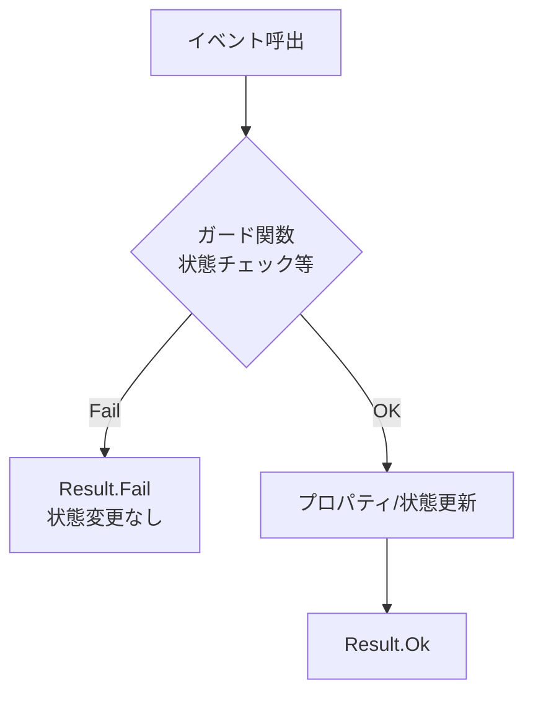

# 第25章：状態と不変条件③：遷移時チェックを実装✅🔁

この章は「**状態が変わる“瞬間”に、不変条件が壊れないようにする**」回だよ〜！💪✨
状態遷移って、**いちばん事故が起きやすいポイント**なの。だから「遷移メソッドの中で守る」を体に覚えようね🛡️😊

（ちなみに今の最新だと、**.NET 10 が LTS**で、**C# 14 は .NET 10 と一緒に来てる**よ〜📦✨ ([Microsoft for Developers][1])）

---

## 25.1 この章のゴール🎯✨

できるようになること👇😊

* 状態遷移メソッド（`Pay()` / `Ship()` など）に **ガード条件（遷移前チェック）** を入れられる✅
* 「許可される遷移」を **遷移表→コード** に落とせる📋➡️💻
* 失敗を **Result（戻り値）** で返して、呼び出し側が安全に扱える🙂🧾
* テストで「禁止遷移が禁止のまま」なのを守れる🧪🛡️

---

## 25.2 題材：注文（Order）の状態を作ろう📦✨

ここでは、わかりやすくこの4状態でいくね👇

* `Draft`（下書き）📝
* `Paid`（支払い済み）💳
* `Shipped`（出荷済み）🚚
* `Cancelled`（キャンセル）🧯

### 状態遷移表（前章のおさらい）📋🖊️

```text
Draft     -> Paid, Cancelled
Paid      -> Shipped, Cancelled
Shipped   -> (なし)
Cancelled -> (なし)
```

この「表」が、**実装の正解地図**だよ🗺️✨

---

## 25.3 遷移時チェックの“3点セット”🛡️✅✅✅


遷移メソッドの中で、基本これを順にやると強いよ〜💪

1. **状態が合ってる？**（例：`Paid`じゃないのに`Ship()`してない？）
2. **必要データそろってる？**（例：配送先がないのに出荷しない）
3. **遷移を適用する**（状態変更＋必要な属性セット）

ポイントはここ👇
**「チェックが全部通るまで、状態を書き換えない」**💡✨
（途中で書き換えると“壊れかけ状態”ができて事故る😵‍💫💥）

---

## 25.4 実装：Result（成功/失敗）を用意しよう🧾🙂

まずは超シンプルな Result を作るよ〜（自作でOK）🎀

```csharp
public readonly record struct Result(bool IsSuccess, string? Error)
{
    public static Result Ok() => new(true, null);
    public static Result Fail(string error) => new(false, error);
}
```

---

## 25.5 実装：Order と遷移メソッドを作ろう📦🛡️


### ルール（不変条件）を決めるよ✅✨

この章では例として👇にするね（シンプル優先！）🙂

* `Ship()` は **Paid のときだけ**
* `Ship()` の前に **ShippingAddress が必須**
* `Pay()` は **Draft のときだけ**
* `Cancel()` は **Draft / Paid のときだけ**（Shipped後は不可）

### コード例💻✨

```csharp
public enum OrderState
{
    Draft,
    Paid,
    Shipped,
    Cancelled
}

public sealed class Order
{
    public OrderState State { get; private set; } = OrderState.Draft;

    public string? PaymentId { get; private set; }
    public DateTimeOffset? PaidAt { get; private set; }

    public string? ShippingAddress { get; private set; }
    public DateTimeOffset? ShippedAt { get; private set; }

    public string? CancelReason { get; private set; }

    // “更新の入口”はメソッドに寄せる（setter地獄回避✨）
    public Result SetShippingAddress(string address)
    {
        if (State is OrderState.Shipped or OrderState.Cancelled)
            return Result.Fail("この注文は配送先を変更できません。");

        if (string.IsNullOrWhiteSpace(address))
            return Result.Fail("配送先が空です。");

        ShippingAddress = address.Trim();
        return Result.Ok();
    }

    public Result Pay(string paymentId, DateTimeOffset paidAt)
    {
        // ① ガード（遷移前チェック）
        var guard = GuardPay(paymentId);
        if (!guard.IsSuccess) return guard;

        // ② 適用（ここで初めて書き換える）
        PaymentId = paymentId.Trim();
        PaidAt = paidAt;
        State = OrderState.Paid;

        return Result.Ok();
    }

    private Result GuardPay(string paymentId)
    {
        if (State != OrderState.Draft)
            return Result.Fail("支払いできません：注文が下書き状態ではありません。");

        if (string.IsNullOrWhiteSpace(paymentId))
            return Result.Fail("支払いできません：PaymentId が空です。");

        return Result.Ok();
    }

    public Result Ship(DateTimeOffset shippedAt)
    {
        var guard = GuardShip();
        if (!guard.IsSuccess) return guard;

        ShippedAt = shippedAt;
        State = OrderState.Shipped;

        return Result.Ok();
    }

    private Result GuardShip()
    {
        if (State != OrderState.Paid)
            return Result.Fail("出荷できません：支払い済みではありません。");

        if (string.IsNullOrWhiteSpace(ShippingAddress))
            return Result.Fail("出荷できません：配送先が未設定です。");

        return Result.Ok();
    }

    public Result Cancel(string reason)
    {
        var guard = GuardCancel(reason);
        if (!guard.IsSuccess) return guard;

        CancelReason = reason.Trim();
        State = OrderState.Cancelled;
        return Result.Ok();
    }

    private Result GuardCancel(string reason)
    {
        if (State is OrderState.Shipped or OrderState.Cancelled)
            return Result.Fail("キャンセルできません：すでに出荷済み、またはキャンセル済みです。");

        if (string.IsNullOrWhiteSpace(reason))
            return Result.Fail("キャンセル理由が空です。");

        return Result.Ok();
    }
}
```

* 失敗が `Result` で返るから、UI/API境界で扱いやすい🙂




---

## 25.6 遷移表→コード：禁止遷移を“表現”する✍️📋


上の実装でも十分だけど、状態が増えてくると
「そもそも遷移として許される？」をまとめたくなるよね😊

こんな感じで **表をコード化**できるよ👇

```csharp
public static class OrderTransitions
{
    public static bool IsAllowed(OrderState from, OrderState to) => (from, to) switch
    {
        (OrderState.Draft, OrderState.Paid) => true,
        (OrderState.Draft, OrderState.Cancelled) => true,
        (OrderState.Paid, OrderState.Shipped) => true,
        (OrderState.Paid, OrderState.Cancelled) => true,
        _ => false
    };
}
```

この `IsAllowed` を `GuardPay/GuardShip` の中で使うと、さらに「表っぽさ」が出て読みやすいよ〜📋✨

---

## 25.7 テスト：禁止遷移を守り切る🧪🛡️


状態遷移は、**テストがあると安心感が爆上がり**するよ💖

最近は **MSTest v4 が stable** として案内されてるよ〜🧪✨ ([Microsoft Learn][2])
（xUnit v3 も NuGet にあって、.NET 8+ 対応だよ〜 ([NuGet][3])）

ここでは MSTest 例でいくね👇

```csharp
using Microsoft.VisualStudio.TestTools.UnitTesting;

[TestClass]
public class OrderTests
{
    [TestMethod]
    public void Draft_can_pay()
    {
        var order = new Order();

        var result = order.Pay("pay_001", DateTimeOffset.Now);

        Assert.IsTrue(result.IsSuccess);
        Assert.AreEqual(OrderState.Paid, order.State);
    }

    [TestMethod]
    public void Draft_cannot_ship()
    {
        var order = new Order();

        var result = order.Ship(DateTimeOffset.Now);

        Assert.IsFalse(result.IsSuccess);
        Assert.AreEqual(OrderState.Draft, order.State); // 壊れてないことが大事✨
    }

    [TestMethod]
    public void Paid_can_ship_if_address_is_set()
    {
        var order = new Order();
        order.Pay("pay_001", DateTimeOffset.Now);
        order.SetShippingAddress("東京都〇〇区1-2-3");

        var result = order.Ship(DateTimeOffset.Now);

        Assert.IsTrue(result.IsSuccess);
        Assert.AreEqual(OrderState.Shipped, order.State);
    }
}
```

テストのキモはここ👇💡

* **失敗したときに状態が変わってない**のを確認する✅
  （「失敗したのに状態だけ進んだ😱」が最悪事故パターン）

---

## 25.8 AI活用（Copilot / Codex）で爆速にする🤖⚡


AIはこの章だと **「漏れ発見」と「テスト大量生成」**が強いよ〜🧠✨

### ① ガード条件の漏れチェック🤖🔍

プロンプト例👇

* 「この状態遷移表に基づいて、`Pay/Ship/Cancel` のガード条件を列挙して。ドメイン不変条件の観点で不足も指摘して」

### ② 禁止遷移テストの自動提案🤖🧪

* 「この OrderState と遷移ルールに対して、禁止遷移のテストケースを網羅的に出して（Given/When/Then 形式で）」

### ③ メッセージ整形🤖🗣️

* 「Result の Error 文言を、ユーザー向け（やさしい）とログ向け（詳しい）で2種類に分けたい。設計案を出して」

Visual Studio 2026 は UI/体験も更新が入ってるし、AI系の流れも前提にしやすいよ〜✨ ([Microsoft Learn][4])

---

## 25.9 よくある事故パターン集🚨😵‍💫（先回り！）

* **UIで二重クリック** → `Pay()` が2回呼ばれる
  → ガードで「Draft以外はPay不可」にして防ぐ✅
* **“チェック後に外部が変わる”**（決済が取り消された等）
  → 外部I/Oは次章以降の「境界で変換・隔離」で守る🧱🧼
* **状態と付随データがズレる**
  例：`State=Paid` なのに `PaymentId=null`
  → 「遷移適用」部分で必ずセットする（順番大事！）✨

---

## 25.10 演習（ちゃんと身につくやつ🥰📝）

### 演習A：`Refund()` を追加しよう💸↩️

ルール例👇

* `Paid` のときだけ返金OK
* `Shipped` になったら返金不可（今回はそう決める！）

👉 やること：

1. 遷移表に `Paid -> Draft`（または `Refunded` を追加）どっちにするか決める
2. `Refund()` と `GuardRefund()` を実装
3. 禁止遷移テストを追加🧪

### 演習B：エラー設計を1段階きれいに🎀

今は `string` エラーだけど、
`ErrorCode`（例：`Order.NotPaid`）を入れると UI/API で扱いやすくなるよ📦✨

---

## 25.11 おまけ：C# 14 の「拡張メンバー」でガードを読みやすく（任意）✨🧙‍♀️


C# 14 では **extension members** が追加されて、拡張プロパティとかが書けるよ〜！ ([Microsoft Learn][5])
（「読みやすくする小技」なので、まずは普通の実装ができればOK🥰）

例：`OrderState` に「出荷可能？」を生やすイメージ👇

```csharp
public static class OrderStateExtensions
{
    extension(OrderState state)
    {
        public bool CanShip => state == OrderState.Paid;
        public bool CanPay  => state == OrderState.Draft;
    }
}
```

これで `if (!State.CanShip) ...` みたいに読めて、かわいくなる💖（読みやすい＝正義！）

---

## まとめ🏁🎉

この章の結論はこれ👇😊

* **状態遷移メソッドが“不変条件の門番”**🛡️
* **ガード→適用** の順番を守る（途中で書き換えない）✅
* **遷移表をコード化**すると、増えても破綻しにくい📋✨
* テストで「禁止が禁止のまま」を守る🧪💖

---

次の第26章は「UI入力→内部モデルへ」だよね🎀➡️🏛️
この Order をそのまま使って、フォーム入力（文字列）を VO / コマンドに変換していく流れにすると、めちゃ気持ちよく積み上がるよ〜😊✨

[1]: https://devblogs.microsoft.com/dotnet/announcing-dotnet-10/ "Announcing .NET 10 - .NET Blog"
[2]: https://learn.microsoft.com/en-us/dotnet/core/testing/unit-testing-mstest-migration-v3-v4 "MSTest migration from v3 to v4 - .NET | Microsoft Learn"
[3]: https://www.nuget.org/packages/xunit.v3 "
        NuGet Gallery
        \| xunit.v3 3.2.2
    "
[4]: https://learn.microsoft.com/en-us/visualstudio/releases/2026/release-notes "Visual Studio 2026 Release Notes | Microsoft Learn"
[5]: https://learn.microsoft.com/ja-jp/dotnet/csharp/whats-new/csharp-14 "C# 14 の新機能 | Microsoft Learn"
