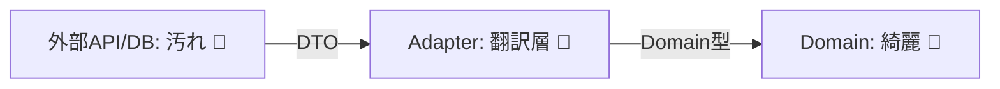

# 第28章：境界で守る③：外部API/DBの“汚れ”を中に入れない🧼🧱

## この章のゴール🏁✨

* 外部APIやDBの“クセ”を **ドメイン（内部モデル）に持ち込まない** 仕組みが作れるようになる😊
* 「翻訳（変換）専用レイヤー＝Adapter / Anti-Corruption Layer」を、**迷わず置ける** ようになる🛡️
* 外部が変わっても、内部は壊れにくい（修正が局所で済む）状態にできる🔧✨

---

## 1) そもそも“汚れ”って何？😵‍💫🫧

外部API/DBって、だいたいこういう“汚れ”を持ってきます👇

* **型が弱い**：数値が `"1000"`（文字列）で来る、true/false が `"0"/"1"` で来る😇
* **null・欠損が普通にある**：必須っぽいのに無い、空文字の意味が不明🤷‍♀️
* **日付が地獄**：UTCなの？ローカルなの？フォーマット複数あるの？⏰🌀
* **Enumが増える/変わる**：知らないステータスが突然来る（追加は絶対ある）📦💥
* **丸め/通貨/単位が曖昧**：税・小数・単位の混在💸
* **仕様が“静かに変わる”**：プロパティ追加・削除・意味変更（バージョン差）🫠
* **エラー表現が雑**：200でエラー返す、codeだけで意味不明、メッセージ揺れる😵‍💫

👉 だから結論：**外部の形のまま内部に入れたら負け**です🧱🧼

---

## 2) 今日の最重要ルール（覚えたら勝ち）🛡️💖


### ルールA：ドメインに “外部DTO” を入れない🚫📦

* 外部APIのレスポンスDTO、DBのEntityを、ドメインの中で使い回さない🙅‍♀️
* **ドメインは自分たちの言葉（VO/Entity）だけ**で喋る🏛️✨

### ルールB：“翻訳（変換）” は1か所に集める🧱➡️🏛️

* 「どこでも変換」すると、修正が地獄に散らばる😇
* 変換担当を **Adapter（翻訳係）** に固定する📌

### ルールC：外部の失敗は “外部エラー” として持ち帰る⚠️

* 外部障害・仕様違い・タイムアウトを、内部の意味に **勝手に混ぜない**
* 境界で「外向けの失敗」→「内部で扱える失敗」に整理する🧾✨

---

## 3) ミニ題材：サブスク課金の外部決済API💳✨

* 外部：Payment Provider API

  * `amount` が **文字列** `"1200"` で返る
  * `currency` が `"JPY"` だけど、たまに小文字 `"jpy"` が混ざる
  * `status` に知らない値が増える
* 内部：ドメインは **Money / PaymentStatus / SubscriptionId** みたいに型で守る💎

---

## 4) こう分けると強い💪✨（おすすめ構成）

* **External（外部）**：HTTPクライアント + 外部DTO
* **Adapter（翻訳層）**：外部DTO → ドメイン型（VO/Entity）へ変換
* **Domain（中）**：不変条件つきの型だけ（外部都合ゼロ）



イメージ：
外部JSON 📦 → 外部DTO 📦 → **Adapter🧼** → ドメイン🏛️

---

## 5) 実装してみよう（外部APIの汚れを隔離）🧼🌐

### 5-1. 外部DTO（これは汚れてOK😌）

外部の形をそのまま受け止める箱です📦
（ここで頑張って“綺麗にしない”のがコツ！変換はAdapterで✨）

```csharp
using System.Text.Json.Serialization;

public sealed record PaymentApiResponseDto(
    [property: JsonPropertyName("id")] string? Id,
    [property: JsonPropertyName("amount")] string? Amount,
    [property: JsonPropertyName("currency")] string? Currency,
    [property: JsonPropertyName("status")] string? Status,
    [property: JsonPropertyName("customer_email")] string? CustomerEmail
);
```

---

### 5-2. ドメイン側（ここは絶対に綺麗✨🏛️）

※第11〜13章で作ったVOがある前提で、雰囲気だけ載せるね💎

```csharp
public sealed record Money(decimal Amount, string Currency)
{
    public static Result<Money> Create(decimal amount, string currency)
    {
        if (amount < 0) return Result.Fail("Amount must be >= 0");
        if (string.IsNullOrWhiteSpace(currency)) return Result.Fail("Currency required");
        var c = currency.Trim().ToUpperInvariant();
        return Result.Ok(new Money(amount, c));
    }
}

public enum PaymentStatus
{
    Succeeded,
    Failed,
    Pending,
    Unknown // ←外部は増えるので“逃げ道”を用意🛟
}

public sealed record PaymentReceipt(string PaymentId, Money Money, PaymentStatus Status, Email? CustomerEmail);
```

---

### 5-3. Adapter（ここが主役🧼🧱）

外部DTOの“汚れ”を吸収して、ドメインに渡します✨

ポイントは👇

* null/空文字を吸収
* 文字列数値を安全にParse
* statusの未知値は Unknownへ
* エラーは「外部由来」と分かる形で返す

```csharp
public sealed class PaymentApiAdapter
{
    public Result<PaymentReceipt> ToDomain(PaymentApiResponseDto dto)
    {
        // 1) 必須項目の欠損を吸収（外部由来エラーとして）
        if (string.IsNullOrWhiteSpace(dto.Id))
            return Result.Fail("External API: id is missing");

        if (string.IsNullOrWhiteSpace(dto.Amount))
            return Result.Fail("External API: amount is missing");

        if (!decimal.TryParse(dto.Amount, out var amount))
            return Result.Fail("External API: amount is invalid");

        var currency = (dto.Currency ?? "").Trim();
        var moneyResult = Money.Create(amount, currency);
        if (!moneyResult.IsSuccess)
            return Result.Fail("External API: money is invalid");

        // 2) status翻訳（知らない値が来る前提！）
        var status = ParseStatus(dto.Status);

        // 3) Emailは“任意”にして吸収（無ければnullでOK）
        Email? email = null;
        if (!string.IsNullOrWhiteSpace(dto.CustomerEmail))
        {
            var emailResult = Email.Create(dto.CustomerEmail);
            if (emailResult.IsSuccess) email = emailResult.Value;
        }

        return Result.Ok(new PaymentReceipt(
            PaymentId: dto.Id.Trim(),
            Money: moneyResult.Value,
            Status: status,
            CustomerEmail: email
        ));
    }

    private static PaymentStatus ParseStatus(string? raw)
        => (raw ?? "").Trim().ToLowerInvariant() switch
        {
            "succeeded" => PaymentStatus.Succeeded,
            "failed"    => PaymentStatus.Failed,
            "pending"   => PaymentStatus.Pending,
            _           => PaymentStatus.Unknown
        };
}
```

---

## 6) 外部APIは落ちる前提：HTTPの回復性（Resilience）も境界で🛟🌩️

外部APIは「一時的に落ちる」「遅い」「たまに失敗」が普通です😇
.NET では **Microsoft.Extensions.Http.Resilience** を使った “標準レジリエンス” の組み込みが案内されています。([Microsoft Learn][1])

例：HttpClientに標準レジリエンスを追加（リトライ等の戦略が束ねて入るイメージ）🛡️

```csharp
using Microsoft.Extensions.DependencyInjection;

var services = new ServiceCollection();

services.AddHttpClient<PaymentApiClient>()
        .AddStandardResilienceHandler(); // 標準の回復性ハンドラー
```

`AddStandardResilienceHandler` は .NET のドキュメント上でも “標準の回復性戦略” として説明されています。([Microsoft Learn][1])

---

## 7) DBの“汚れ”も同じ：Entityをドメインに直で入れない🗄️🧼

DB側も、実は同じ問題が出ます💥

* 旧仕様の列が残ってる
* null許容が広い
* statusが数値で意味不明
* 文字列の正規化がされてない

だからおすすめは👇

* **DB Entity（永続化モデル）** と **Domain** を分ける
* Repository/Adapter で相互変換する

```csharp
// DB Entity（汚れてOK）
public sealed class SubscriptionEntity
{
    public string Id { get; set; } = "";
    public int Status { get; set; }          // 0/1/2...
    public string? CustomerEmail { get; set; } // nullあり得る
}

// Domain（綺麗）
public enum SubscriptionStatus { Active, Canceled, Unknown }

public sealed record Subscription(SubscriptionId Id, SubscriptionStatus Status, Email? Email);
```

変換はここ👇（Repository内でも、専用MapperでもOK）

```csharp
public static class SubscriptionMapper
{
    public static Result<Subscription> ToDomain(SubscriptionEntity e)
    {
        if (string.IsNullOrWhiteSpace(e.Id))
            return Result.Fail("DB: id is missing");

        var id = SubscriptionId.From(e.Id);

        var status = e.Status switch
        {
            1 => SubscriptionStatus.Active,
            2 => SubscriptionStatus.Canceled,
            _ => SubscriptionStatus.Unknown
        };

        Email? email = null;
        if (!string.IsNullOrWhiteSpace(e.CustomerEmail))
        {
            var r = Email.Create(e.CustomerEmail);
            if (r.IsSuccess) email = r.Value;
        }

        return Result.Ok(new Subscription(id, status, email));
    }
}
```

---

## 8) テストがめちゃ効く！Adapterは“仕様の盾”🛡️🧪

Adapterは **壊れやすい境界** なので、テストがコスパ最強です💖

* ✅ 外部DTOのサンプルJSON（成功/失敗/欠損/未知status）を用意
* ✅ Adapterが「期待通りのドメイン」or「期待通りの外部エラー」を返すか確認
* ✅ 外部が変わったら、ここだけ落ちて気づける👀✨

超ミニ例：

```csharp
[TestMethod]
public void UnknownStatus_Becomes_Unknown()
{
    var dto = new PaymentApiResponseDto("p_1", "1200", "jpy", "new_status", null);
    var adapter = new PaymentApiAdapter();

    var result = adapter.ToDomain(dto);

    Assert.IsTrue(result.IsSuccess);
    Assert.AreEqual(PaymentStatus.Unknown, result.Value.Status);
    Assert.AreEqual("JPY", result.Value.Money.Currency);
}
```

---

## 9) AIの使いどころ（超実用）🤖✨

AI導入済み前提なら、ここはめっちゃ相性いいです💕

* 外部DTOを貼って「**汚れパターン**を列挙して」🧼
* サンプルJSONを貼って「**変換テストケース**を20個出して」🧪
* Adapterのコードを貼って「**境界値や欠損に弱い所**をレビューして」👀
* status一覧を貼って「Unknownに落とすべき値はどれ？」って相談🛟

おすすめプロンプト例👇

* 「この外部レスポンスDTOをドメインに入れない設計にしたい。Adapterの責務と分割案を3つ出して」
* 「このAdapterに必要なテストケースを、欠損/型不正/未知Enum/空白揺れの観点で列挙して」

---

## 10) まとめ🎀✨（この章の勝ち筋）

* 外部API/DBの“汚れ”は **Adapterで吸収**🧼🧱
* ドメインは **自分たちの型（VO/Entity）だけ**で守る🏛️💎
* レジリエンス（リトライ等）も **境界に置く**🛟([Microsoft Learn][1])
* Adapterはテストが刺さる🧪💖

次の第29章は「DB制約は最後の砦🏰🗄️」で、**アプリ + DB の二重防御**に進むよ〜！😊✨

---

### （おまけ：2026の言語/ランタイムの前提メモ📌）

* C# 14 は 2025年11月リリースとして整理されています。([Microsoft Learn][2])
* .NET 10 は 2025年11月リリースとして案内されています。([Microsoft Learn][3])
* Visual Studio 2026 のリリースノートも公開されています。([Microsoft Learn][4])

[1]: https://learn.microsoft.com/en-us/dotnet/core/resilience/http-resilience?utm_source=chatgpt.com "Build resilient HTTP apps: Key development patterns - .NET"
[2]: https://learn.microsoft.com/en-us/dotnet/csharp/whats-new/csharp-14?utm_source=chatgpt.com "What's new in C# 14"
[3]: https://learn.microsoft.com/en-us/dotnet/core/whats-new/dotnet-10/overview?utm_source=chatgpt.com "What's new in .NET 10"
[4]: https://learn.microsoft.com/en-us/visualstudio/releases/2026/release-notes?utm_source=chatgpt.com "Visual Studio 2026 Release Notes"
