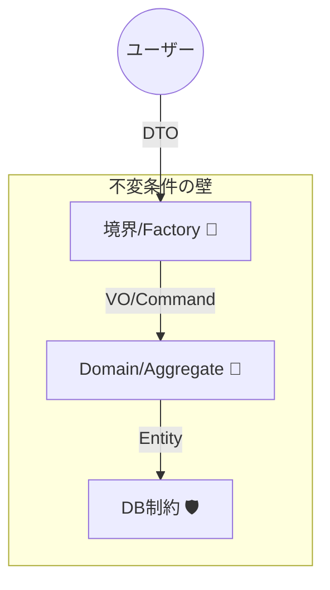

# 第30章：仕上げ総合演習：不変条件の壁を完成🏁🎉


この章は「入口（境界）→ 型（VO）→ 更新 → 状態 → DB → テスト」まで、**ぜんぶを一本につなげる最終回**だよ〜！🥳✨
題材はミニでOK。ここでは **「会員登録＋サブスク課金」** で作っていくね💳👤🎀

ちなみに “2026年のC#まわり” は、**C# 14（2025年11月リリース）** や **.NET 10** を前提に進めるよ〜🧡（C# 14の新機能一覧はMS公式にまとまってるよ） ([Microsoft Learn][1])
EFも **EF Core 10** 前提でOK✨ ([Microsoft Learn][2])
Visual Studio 2026 のリリースノートも最新をベースにするね🧰✨ ([Microsoft Learn][3])

---

## 0) 今日つくるミニアプリの仕様（小さくても“本物”）🧁✨

### 画面（やること）

* 課金実行（請求日になったら課金）📅💸
* 解約（次回以降の課金を止める）🧯🧊



### “絶対守る約束”＝不変条件（例）🛡️

* メールは正規化済みで、形式が正しい📧🧼
* 金額は 0以上、通貨コードは決めたものだけ💰🌍
* サブスクは「状態」によってできる操作が変わる（例：解約後に課金しない）🚫💸
* 次回請求日は「過去にしない」＆「状態がActiveのときだけ意味がある」⏰✅
* 会員メールはDBでも重複禁止（最後の砦）🏰🗄️

---

## 1) 成果物（この章の“提出物”）📦🎀

この章のゴールは「動くもの」＋「守れるもの」✨
最終的に、最低これが揃えば合格だよ〜💮😊

* 不変条件一覧（箇条書きでOK）📝
* VO（Email / Money / PlanId など）💎
* Subscription（状態つき）＋遷移メソッド（Pay / Cancel など）🔁
* 境界変換（DTO → VO）🚪➡️💎
* テスト（VOと状態遷移は必須）🧪
* DB制約（Unique/NotNull/Check など）🗄️🧱

---

## 2) プロジェクト構成（“分ける”けど分けすぎない）🧩🙂

おすすめの最小セット👇（これで「境界」が自然にできるよ🚪✨）

* Domain（VO・Entity・状態・不変条件）🏛️
* Application（ユースケース：登録/開始/課金/解約）🧠
* Infrastructure（DB/外部サービス）🧰
* Api（HTTPの入口：DTO受けて、結果返す）🌐

「分けた理由」を難しく考えなくてOK！
**Domainに“壊れないルール”を集める**、ただそれだけで強くなるよ🛡️😊

---

## 3) まずは不変条件一覧を作る（ここが最強の設計）📝🔥

### 3-1. 不変条件を “カテゴリ” に分けよう🧺✨

* 値（単体）: Email / Money / DisplayName 📧💰🧑
* 組み合わせ: nextBillingAt は Active のときだけ必須 ⏰✅
* 状態: Canceled のとき Pay() 禁止 🚫💸
* 集合/一意: email 重複禁止（アプリ＋DB）👯‍♀️🚫
* 永続化: DB制約で最後に守る🏰

### 3-2. AIの使い方（この時点が超効く！）🤖✨

Copilot / Codex にこう投げると強いよ👇

* 「この仕様の不変条件を20個出して。値/状態/DBに分類もして」
* 「漏れがちな“組み合わせ不整合”を重点的に追加して」
* 「不変条件からテスト観点を箇条書きで作って」

---

## 4) VOを作る（壊れない箱を先に作る）💎🛡️

ここでは **Resultで失敗を返す** 形にするよ🙂（入力不正は“想定内”だからね）

### 4-1. Result（最小）🧾✨

```csharp
namespace MyApp.Domain;

public readonly record struct Error(string Code, string Message);

public readonly struct Result<T>
{
    public bool IsSuccess { get; }
    public T? Value { get; }
    public Error? Error { get; }

    private Result(bool ok, T? value, Error? error)
        => (IsSuccess, Value, Error) = (ok, value, error);

    public static Result<T> Ok(T value) => new(true, value, null);
    public static Result<T> Fail(string code, string message) => new(false, default, new Error(code, message));
}
```

### 4-2. Email（正規化＋形式）📧🧼

```csharp
using System.Text.RegularExpressions;

namespace MyApp.Domain;

public sealed record Email
{
    private static readonly Regex Pattern =
        new(@"^[^@\s]+@[^@\s]+\.[^@\s]+$", RegexOptions.Compiled);

    public string Value { get; }

    private Email(string value) => Value = value;

    public static Result<Email> Create(string? raw)
    {
        if (string.IsNullOrWhiteSpace(raw))
            return Result<Email>.Fail("email.empty", "メールが空だよ🥺");

        var normalized = raw.Trim().ToLowerInvariant();

        if (normalized.Length > 254)
            return Result<Email>.Fail("email.too_long", "メールが長すぎるよ🥺");

        if (!Pattern.IsMatch(normalized))
            return Result<Email>.Fail("email.invalid", "メールの形が変だよ🥺");

        return Result<Email>.Ok(new Email(normalized));
    }
}
```

### 4-3. Money（0以上＋通貨）💰🌍

```csharp
namespace MyApp.Domain;

public sealed record Money
{
    public decimal Amount { get; }
    public string Currency { get; }

    private Money(decimal amount, string currency)
        => (Amount, Currency) = (amount, currency);

    public static Result<Money> Create(decimal amount, string? currency)
    {
        if (amount < 0)
            return Result<Money>.Fail("money.negative", "金額がマイナスだよ🥺");

        if (string.IsNullOrWhiteSpace(currency))
            return Result<Money>.Fail("money.currency.empty", "通貨が空だよ🥺");

        var cur = currency.Trim().ToUpperInvariant();
        if (cur is not ("JPY" or "USD"))
            return Result<Money>.Fail("money.currency.unsupported", "通貨が未対応だよ🥺");

        return Result<Money>.Ok(new Money(amount, cur));
    }
}
```

💡ここまでで「不正な値を作らせない」壁ができたよ〜🧱💖

---

## 5) 状態つきSubscription（遷移で壊れない）🎭🔁🛡️

### 5-1. 状態を定義する🎀

* Trial（お試し）
* Active（課金OK）
* PastDue（未払い：支払い更新待ち）
* Canceled（解約：課金禁止）

### 5-2. “遷移メソッド” にガードを置く✅

```csharp
namespace MyApp.Domain;

public enum SubscriptionStatus { Trial, Active, PastDue, Canceled }

public sealed class Subscription
{
    public Guid Id { get; } = Guid.NewGuid();
    public SubscriptionStatus Status { get; private set; } = SubscriptionStatus.Trial;
    public Guid MemberId { get; }
    public string PlanCode { get; private set; }
    public DateTimeOffset? NextBillingAt { get; private set; }
    public Money Price { get; private set; }

    public Subscription(Guid memberId, string planCode, Money price, DateTimeOffset firstBillingAt)
    {
        if (memberId == Guid.Empty) throw new ArgumentException("memberId empty");
        if (string.IsNullOrWhiteSpace(planCode)) throw new ArgumentException("planCode empty");

        MemberId = memberId;
        PlanCode = planCode.Trim();
        Price = price;
        NextBillingAt = firstBillingAt;
        Status = SubscriptionStatus.Active; // ここは仕様で Trial にしてもOK🙂
    }

    public Result<Unit> Pay(DateTimeOffset now)
    {
        if (Status is SubscriptionStatus.Canceled)
            return Result<Unit>.Fail("sub.canceled", "解約済みは課金できないよ🚫💸");

        if (Status is not (SubscriptionStatus.Active or SubscriptionStatus.PastDue))
            return Result<Unit>.Fail("sub.not_payable", "今の状態では課金できないよ🥺");

        if (NextBillingAt is null)
            return Result<Unit>.Fail("sub.next_billing.missing", "次回請求日がないよ🥺");

        if (NextBillingAt.Value > now)
            return Result<Unit>.Fail("sub.too_early", "まだ請求日じゃないよ⏰");

        // 課金成功した想定：次回請求日を更新（例：1か月後）
        NextBillingAt = NextBillingAt.Value.AddMonths(1);
        Status = SubscriptionStatus.Active;
        return Result<Unit>.Ok(Unit.Value);
    }

    public Result<Unit> MarkPastDue()
    {
        if (Status is SubscriptionStatus.Canceled)
            return Result<Unit>.Fail("sub.canceled", "解約済みに未払いは付けないよ🚫");

        Status = SubscriptionStatus.PastDue;
        return Result<Unit>.Ok(Unit.Value);
    }

    public Result<Unit> Cancel()
    {
        if (Status is SubscriptionStatus.Canceled)
            return Result<Unit>.Ok(Unit.Value); // 冪等にしとくと楽🙂✨

        Status = SubscriptionStatus.Canceled;
        NextBillingAt = null; // 解約後は意味がない
        return Result<Unit>.Ok(Unit.Value);
    }
}

public readonly struct Unit { public static Unit Value => default; }
```

ポイントだよ👇🥰

* 状態を直接いじれないようにして、**必ずメソッド経由**にする✂️🔒
* 解約は **冪等**（2回押してもOK）にすると運用が楽〜✨

---

## 6) 境界（API）で DTO → VO に変換する🚪🌐➡️💎

ASP.NET Core 10 の最新情報はMS公式にまとまってるよ（最小APIなども強化されてる） ([Microsoft Learn][4])
ここでは “薄いAPI” の形にするね🙂✨

### 6-1. リクエストDTO

```csharp
public sealed record RegisterRequest(string Email, string DisplayName);
public sealed record StartSubscriptionRequest(string PlanCode, decimal Amount, string Currency, DateTimeOffset FirstBillingAt);
```

### 6-2. 入口で変換して、失敗は外向けに返す📣

```csharp
using Microsoft.AspNetCore.Mvc;
using MyApp.Domain;

var builder = WebApplication.CreateBuilder(args);
var app = builder.Build();

app.MapPost("/members/register", ([FromBody] RegisterRequest req) =>
{
    var email = Email.Create(req.Email);
    if (!email.IsSuccess) return Results.BadRequest(new { error = email.Error });

    // DisplayName も本当は VO にしてOKだよ🙂（今日は省略でもOK）
    if (string.IsNullOrWhiteSpace(req.DisplayName))
        return Results.BadRequest(new { error = new Error("name.empty", "表示名が空だよ🥺") });

    // ここで Application に渡す（今日は簡略）
    var memberId = Guid.NewGuid();

    return Results.Ok(new { memberId, email = email.Value!.Value });
});

app.Run();
```

---

## 7) DBは“最後の砦”（EF Core 10で二重防御）🏰🗄️🧱

EF Core 10 の新機能・破壊的変更はMS公式で整理されてるよ（アップデート時の注意にもなる） ([Microsoft Learn][2])

ここは “不変条件のうち、DBで守れるもの” を落とすだけでOK🙂✨

### 7-1. 例：会員テーブルの制約

* Email：NOT NULL
* Email：UNIQUE（重複禁止）
* Status：CHECK（定義外の値が入らない）

EFでの雰囲気👇

```csharp
using Microsoft.EntityFrameworkCore;

public sealed class AppDbContext : DbContext
{
    public DbSet<MemberRow> Members => Set<MemberRow>();
    public DbSet<SubscriptionRow> Subscriptions => Set<SubscriptionRow>();

    protected override void OnModelCreating(ModelBuilder modelBuilder)
    {
        modelBuilder.Entity<MemberRow>(b =>
        {
            b.HasKey(x => x.Id);
            b.Property(x => x.Email).IsRequired().HasMaxLength(254);
            b.HasIndex(x => x.Email).IsUnique();
        });

        modelBuilder.Entity<SubscriptionRow>(b =>
        {
            b.HasKey(x => x.Id);
            b.Property(x => x.Status).IsRequired();
            // CHECK制約はプロバイダで書き方が変わるので、使うDBに合わせて追加🙂
        });
    }
}

public sealed class MemberRow
{
    public Guid Id { get; set; }
    public string Email { get; set; } = "";
    public string DisplayName { get; set; } = "";
}

public sealed class SubscriptionRow
{
    public Guid Id { get; set; }
    public Guid MemberId { get; set; }
    public int Status { get; set; }
    public DateTimeOffset? NextBillingAt { get; set; }
    public decimal Amount { get; set; }
    public string Currency { get; set; } = "";
}
```

---

## 8) テストで“壊れない”を証明する🧪🎀

ここは **VOテスト** と **状態遷移テスト** を最優先にしよ〜💯✨
（APIテストは余裕があればでOK🙂）

### 8-1. VOのテスト（例：Email）

```csharp
using MyApp.Domain;
using Xunit;

public class EmailTests
{
    [Fact]
    public void Create_Normalizes_ToLower_And_Trim()
    {
        var r = Email.Create("  TEST@EXAMPLE.COM ");
        Assert.True(r.IsSuccess);
        Assert.Equal("test@example.com", r.Value!.Value);
    }

    [Fact]
    public void Create_Fails_On_Invalid()
    {
        var r = Email.Create("no-at-mark");
        Assert.False(r.IsSuccess);
        Assert.Equal("email.invalid", r.Error!.Value.Code);
    }
}
```

### 8-2. 状態遷移のテスト（例：Canceledは課金不可）

```csharp
using MyApp.Domain;
using Xunit;

public class SubscriptionTests
{
    [Fact]
    public void Pay_Fails_When_Canceled()
    {
        var price = Money.Create(1000, "JPY").Value!;
        var sub = new Subscription(Guid.NewGuid(), "basic", price, DateTimeOffset.UtcNow.AddDays(-1));

        sub.Cancel();

        var r = sub.Pay(DateTimeOffset.UtcNow);
        Assert.False(r.IsSuccess);
        Assert.Equal("sub.canceled", r.Error!.Value.Code);
    }
}
```

---

## 9) ここでAIが“最強の相棒”になる使い方🤖💞

### 9-1. 案出し係（設計をラクにする）

* 「このドメインで必要なVO候補を10個。責務も一言ずつ」
* 「状態遷移表を作って。禁止遷移も含めて」
* 「境界で変換すべき項目一覧を、DTO→VOで並べて」

### 9-2. テスト大量生成係（漏れを減らす）

* 「Emailの境界値テストを20個、入力と期待結果で」
* 「Moneyの不変条件テスト観点を列挙して」
* 「Subscriptionの遷移テストを表にして（前状態/操作/期待）」

### 9-3. レビュー係（事故りポイント検出）

* 「このコード、外部入力がDomainに漏れてない？」
* 「public setが残ってない？」
* 「不変条件が“どこで”守られてるか図にして」

---

## 10) 最終チェックリスト（ここまでできたら完成🏁🎉）✅💖

* 不変条件が箇条書きで20個前後ある📝
* Domainで「不正な値が生成できない」💎🛡️
* 状態が直接いじれず、遷移メソッド経由になってる🔁🔒
* APIはDTOを受け、VOに変換して、失敗を外向けに返してる🚪🌐
* DBに Unique/NotNull などが入ってる🏰
* VOと状態遷移のテストが通る🧪✨

---

## よくある失敗あるある（回避しよ〜😂🧯）

* 「DTOのstringをDomainまで持ち込んじゃう」→ 境界でVO化しよ🚪➡️💎
* 「setterで状態が変えられる」→ 遷移メソッドに寄せよ✂️🔒
* 「DBだけに頼る」→ アプリ側でも守って、DBは最後の砦に🏰
* 「テストがUI寄りになってしんどい」→ VOと状態を先にテスト🧪💕

---

## おまけ：今どきの“新しめポイント”だけチラ見👀✨

* C# 14 は新機能が追加されていて、言語機能の進化は続いてるよ（一覧で把握しやすい） ([Microsoft Learn][1])
* .NET 10 の全体像もMS公式の「新機能」ページで追えるよ🧭 ([Microsoft Learn][4])
* EF Core 10 も機能追加があり、アップデート時は破壊的変更ページを見るクセが超大事🧯 ([Microsoft Learn][2])
* Visual Studio 2026 の変更点もリリースノートで追えるよ🧰 ([Microsoft Learn][3])

---

必要なら、この最終演習を **“教材として気持ちいい積み上げ”** にするために、
「第10〜第13（VO連続）」で作ったVOたちを、そのまま第30章プロジェクトへ“輸入”できる形に整えるテンプレも作れるよ〜📦💖

[1]: https://learn.microsoft.com/en-us/dotnet/csharp/whats-new/csharp-version-history?utm_source=chatgpt.com "The history of C# | Microsoft Learn"
[2]: https://learn.microsoft.com/ja-jp/ef/core/what-is-new/ef-core-10.0/whatsnew?utm_source=chatgpt.com "EF Core 10 の新機能"
[3]: https://learn.microsoft.com/ja-jp/visualstudio/releases/2026/release-notes?utm_source=chatgpt.com "Visual Studio 2026 リリース ノート"
[4]: https://learn.microsoft.com/ja-jp/dotnet/core/whats-new/dotnet-10/overview?utm_source=chatgpt.com "NET 10 の新機能"
