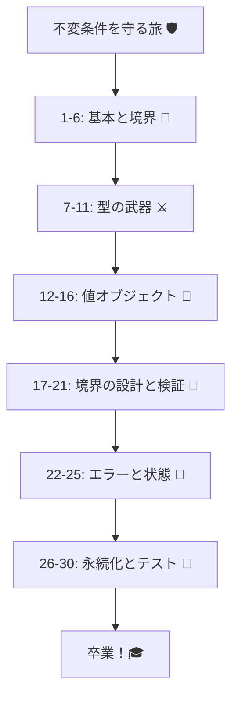

# 不変条件（Invariants）を「型＋境界」で守る：30章アウトライン 🛡️💎

## 第1章　この教材でできるようになること🎯✨

* 不変条件って何？どこで守る？を言葉にできる🙂
* 「無効な状態を作れない」設計の感覚をつかむ💎
* ざっくり完成イメージ（入口→検証→ドメイン型→更新）を見せる👀✨
* ミニ課題：自分の題材（アプリ/機能）を1つ決める🎲😊

## 第2章　不変条件ってなに？（超やさしく）💎😊

* 不変条件＝「絶対に壊れちゃダメなルール」🧠
* 例：金額はマイナス不可💰、メール形式✉️、在庫は0未満にならない📦
* ミニ課題：不変条件を3〜10個書き出す📝✨

## 第3章　なぜバグる？チェックが散ると事故る😱🌀

* ifが増える→漏れる→修正が怖い…の流れ😵‍💫
* 入口で一回だけ保証する発想🚪🛡️
* “途中で検証”を減らすメリット（DRYにもなる）🧼✨

## 第4章　境界（Boundary）を見つけよう🚧📍

* 境界＝外部入力が入ってくる場所（UI/API/DB/外部API）🌍➡️🏰
* 「境界で検証して変換」→「中は信じる」方針🙂
* ミニ課題：自分の題材の境界を3つ以上列挙🗺️✨

## 第5章　開発環境（Windows＋VS Code＋AI）を整える🪟💻🤖

* VS CodeでTypeScript開発の基本セットを作る🧰
* AI（Copilot/Codex等）の使い方ルール：

  * 生成しても鵜呑みにしない🙅‍♀️
  * 不変条件が守られてるかをレビューする視点👀✨
* ミニ課題：テンプレプロジェクト作成（最小構成）📁

## 第6章　「型で守れること」と「実行時に守ること」分けよう🧩✅

* TypeScriptは“コンパイル時”だけチェック🙂
* 外部入力は文字列やunknownで来る＝実行時チェック必須😅
* 二段構えモデル：

  1. 境界で実行時検証🧪
  2. ドメイン内は型で固定🔒

---

## 第7章　プリミティブ地獄（string/numberだらけ）を体験する🧟‍♀️➡️😇

* `userId: string` と `email: string` を混ぜる事故💥
* “意味のある型”を作りたくなる気持ちを作る😆
* ミニ課題：わざと混ぜて事故を再現してみる（学習用）🧨🙂

## 第8章　型の武器①：リテラル型・ユニオン型で選択肢を固定🎫✨

* `type Plan = "Free" | "Pro"` みたいに縛る🙂
* 状態（Status）・種類（Kind）・区分（Category）に強い💪
* ミニ課題：題材から「固定できる選択肢」を3つ探す🔍✨

## 第9章　型の武器②：Discriminated Union（タグ付きユニオン）🏷️🧠

* “型で分岐が安全になる” の感覚🪄
* エラー型・状態型にも使える🙂
* ミニ課題：`Success/Failure` みたいな結果を型で表現してみる🎯✨

## 第10章　型の武器③：Branded/Opaque風の型で「混ぜない」🏷️😎

* `Email` は “ただのstring” じゃない！📩
* “コンパイルで怒られる” を作って事故予防⚡
* ミニ課題：`UserId` と `OrderId` を混ぜられなくする🧪✨

## 第11章　不変に近づく：readonly・イミュータブルの気持ち🧊✨

* 値が勝手に変わると不変条件が壊れる😵
* “外から変更できない” を増やすコツ🙂
* ミニ課題：`readonly` を使って安全にする箇所を探す🔍🧊

---

## 第12章　値オブジェクト入門：ルール込みの値を作る🎁💎

* Value Object＝「検証済みの値」＋「意味」✨
* 例：Money / Email / Quantity / DateRange📦💰📧📆
* ミニ課題：題材からVO候補を2つ選ぶ🎯😊

## 第13章　生成で保証：コンストラクタ隠してcreate/parseで守る🏭🔐

* “無効な状態を作れない” の中心テクニック🔥
* `create()` / `parse()` の役割分担🙂
* ミニ課題：VOを1つ、生成経由にする🔒✨

## 第14章　正規化（Normalization）：検証前に整える🧼✨

* 前後空白トリム、全角半角、大小文字など🧽
* “同じ意味なら同じ形” にするのが大事🙂
* ミニ課題：入力の揺れを3種類想定して吸収する🌀➡️✨

## 第15章　コレクション不変条件：空禁止・重複禁止・上限など📦🚫

* `NonEmptyArray` 的な発想🙂
* “追加/削除メソッド経由”で守る🧰
* ミニ課題：`タグ最大5個` を壊せない設計にする🏷️😆

## 第16章　更新API設計：setterを減らして「意図のある操作」にする🧱✨

* `setStatus()` より `markPaid()` が安全💳🙂
* “更新はメソッドで表現” が不変条件と相性◎
* ミニ課題：危ないsetterを1つ置き換える🔁✨

---

## 第17章　境界の設計①：外部入力はまず unknown で受ける🕵️‍♀️❓

* 「信用しない」が基本方針😤
* unknown → 検証 → ドメイン型へ変換🔄💎
* ミニ課題：境界関数を1つ作って入口を固定する🚪✨

## 第18章　境界の設計②：DTOとドメインを分ける📦↔️🏰

* DTO＝外の都合、ドメイン＝自分の都合🙂
* 変換層があると中心が汚れない🧼🛡️
* ミニ課題：request DTO / domain model を分けてみる🧾✨

## 第19章　実行時バリデーション入門①：スキーマの役割📐✅

* “形” を保証する（必須/型/範囲）🙂
* エラーを集めてユーザーに返す発想🫶
* ミニ課題：スキーマで入力の最低条件を定義する🧱✨

## 第20章　実行時バリデーション入門②：スキーマ→型推論の気持ちよさ😌✨

* “検証したら型が付く” の体験🎉
* unknownが安全な型に変わる安心感🛡️
* ミニ課題：検証後の値を型安全に扱う練習🧠✅

## 第21章　接続が山場：スキーマ→値オブジェクト生成の流れ🏔️🔗

* “検証OK” でも “ドメインOK” とは限らない😅
* スキーマで弾けないルールをVOで弾く💎
* ミニ課題：入力→スキーマ→VO→ドメインの一本線を作る🧵✨

---

## 第22章　エラー設計①：分かりやすいメッセージにする🫶🧯

* 「どこが」「なぜ」ダメかを丁寧に🙂
* UI向け文言と内部ログ向け情報を分ける🗂️
* ミニ課題：初心者が理解できるエラー文言に改善する✍️✨

## 第23章　エラー設計②：Result型で失敗も仕様にする🎯📦

* 例外を乱発しないで “返して扱う” 感覚🙂
* `Ok/Err` 的に成功・失敗を明示する✨
* ミニ課題：VOのcreateをResult型にしてみる🧪✅

## 第24章　境界での変換：エラーを「層に合わせて」変える🔄🧭

* ドメインエラー → APIエラー（HTTP等）に変換する発想🌉
* 内部詳細を外に漏らさない（セキュリティ的にも）🔒
* ミニ課題：境界でエラーをマッピングする🗺️✨

## 第25章　状態による不変条件：できる/できないは状態で決まる🚦🙂

* 状態が違うと許可される操作が変わる🎮
* 超ライト状態機械の考え方（深掘りはしない）🙂
* ミニ課題：`Draft→Paid→Shipped` の禁止遷移を作る📦🚫

---

## 第26章　永続化境界①：DB→ドメイン（読み込み時に守る）🗄️🔄

* DBの値も信用しない（古いデータ/壊れたデータ）😅
* 読み込み時にDTO→ドメインへ変換し直す🧼
* ミニ課題：読み込みの変換関数を用意する🧰✨

## 第27章　永続化境界②：ドメイン→DB（書き込み時に整形）🗄️🧾

* ドメインの値を保存形に落とす（型→プリミティブ）📦
* “保存フォーマット” を外側に閉じ込める🙂
* ミニ課題：書き込みDTOを作って保存処理を薄くする✂️✨

## 第28章　外部API境界（ACLの入門）：外の歪みを中に入れない📡🧼

* 外部レスポンスの欠損・命名・単位ズレを吸収😵‍💫
* 変換層（翻訳層）でドメインを守る🛡️
* ミニ課題：外部DTO→ドメイン変換（防波堤）を作る🌊🏰

## 第29章　テスト設計：不変条件はテストが超やりやすい🧪😍

* VOのテスト（成功/失敗）が書きやすい🎉
* 境界テスト（入力→エラー）を最小で固める🧱
* ミニ課題：VOテスト＋境界テストを各1本ずつ書く🧪✨

## 第30章　卒業制作：小さな題材で「型＋境界」を完成させる🎓🌸

* 例：会員登録／注文／課金など（小さく！）🧁
* チェックリスト：

  * 無効な状態が作れない？🔒
  * チェックが散ってない？🧹
  * 境界でunknown→検証→変換できてる？🚪✅
  * エラーが親切？🫶
* AI活用：

  * テスト観点の追加案を出させる🤖📋
  * “不変条件が破れるルート” のレビューをさせる🤖🔍✨

---

## 各章でのAI活用（共通ルール）🤖✨

* 「コード生成」より「観点出し」「漏れ探し」「テストケース増やし」が強い💪😊
* 毎回AIに聞く質問テンプレ（例）👇

  * 「この不変条件が破れる入力パターンを10個出して」🧠
  * 「境界で検証し忘れがちな項目は？」🔍
  * 「エラーメッセージを初心者向けに改善して」🫶
  * 「テスト観点（成功/失敗/境界値）を列挙して」🧪

