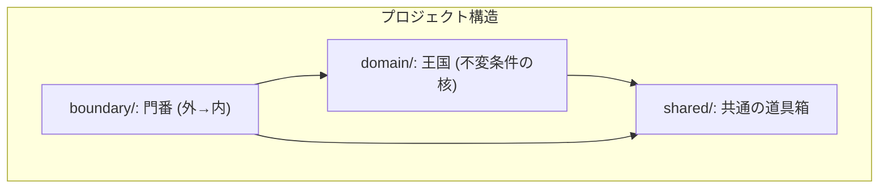

# 第05章：開発環境（Windows＋VS Code＋AI）を整える🪟💻🤖


この章は「あとで不変条件をガッツリ守れるようにするための土台づくり」だよ〜🧱💎
ここで **最小テンプレ（＝練習場）** を作って、以降の章はずっとこれを育てていくイメージ🌱✨

---

## 5-1. 今日のゴール🎯✨

できたら勝ち🏆💕

* TypeScriptのプロジェクトを1つ作れる📁✨
* `dev`（動かす）/ `test`（確認する）/ `lint`（整える）/ `format`（見た目統一） をワンボタンで回せる🔁✅
* AI（Copilot/Codex系）に頼りつつ、**鵜呑みにしないチェック手順**を持てる👀🛡️

---

## 5-2. “2026年1月時点”のおすすめ基準（バージョン感）🧭✨


「迷ったらこれ」基準だけ置いとくね🙂💕

* Node.js は **Active LTS の v24 系**が今いちばん無難👌（例：v24.13.0 が 2026-01-13 に出てる） ([Node.js][1])
* TypeScript は npm の “latest” が **5.9.3** ([NPM][2])
* Vite は npm の “latest” が **7.3.1**（テンプレ作成に使うよ） ([NPM][3])
* VS Code は 2026-01-08 に **1.108** リリース（「December 2025 (version 1.108)」扱い） ([Visual Studio Code][4])
* Copilot は VS Code 拡張として提供されてて、ChatもVS Codeで使えるよ🧠💬 ([GitHub][5])

---

## 5-3. VS Code に入れる拡張（最小セット）🧩✨


まずはこれだけでOK🙆‍♀️💕

1. **GitHub Copilot**（補完）🤖
2. **GitHub Copilot Chat**（チャット）💬（入ってない場合はマーケットから追加）
3. **ESLint**（雑なコードを見つける）🕵️‍♀️
4. **Prettier**（見た目を揃える）🎀 ([Visual Studio Marketplace][6])

> Copilotの概要は VS Code 公式にもまとまってるよ🧠✨ ([Visual Studio Code][7])

---

## 5-4. VS Code の設定（保存したら自動で整うやつ）🪄✨

プロジェクト直下に `.vscode/settings.json` を作って、これ入れとくのがおすすめ💡
（あとでチームでも揉めにくい！😆）

```json
{
  "editor.formatOnSave": true,
  "editor.defaultFormatter": "esbenp.prettier-vscode",

  "editor.codeActionsOnSave": {
    "source.fixAll.eslint": "explicit"
  },

  "eslint.validate": ["javascript", "javascriptreact", "typescript", "typescriptreact"]
}
```

---

## 5-5. 最小テンプレを作る（Viteで一発）⚡📁✨

「環境づくりで詰まってやる気が消える😇」を避けたいので、ここは **Viteのテンプレ**で最短距離いくよ🏃‍♀️💨
（Vite 7 が現行のメジャーだよ） ([vitejs][8])

### ① プロジェクト作成

PowerShell でOK🙆‍♀️

```bash
npm create vite@latest invariant-playground -- --template vanilla-ts
cd invariant-playground
npm install
npm run dev
```

ブラウザが開いて、画面が出たら成功🎉✨

---

## 5-6. “不変条件の教材”っぽいフォルダに整える🏰🧩


この教材では「境界→検証→ドメイン型」って流れを作りたいから、先に箱だけ用意しちゃう📦✨

`src` をこんな感じにしてね👇

* `src/boundary/` 🚪（外から来た入力を受ける場所）
* `src/domain/` 💎（不変条件を守る型・ルールの中心）
* `src/shared/` 🧰（共通関数とか）

例：空フォルダでもOK。まず“置き場所”を固定するのが大事🙂✨



---

## 5-7. テスト（Vitest）を入れて“守りの自動化”🧪🛡️


不変条件は、テストと相性が最高😍
Vitest 4 系が現行の流れだよ〜 ([vitest.dev][9])

### ① 追加インストール

```bash
npm install -D vitest @types/node
```

### ② `package.json` にスクリプト追加

```json
{
  "scripts": {
    "dev": "vite",
    "build": "vite build",
    "preview": "vite preview",
    "test": "vitest",
    "test:run": "vitest run"
  }
}
```

### ③ 動作確認用に超ミニのテストを書く

`src/shared/nonEmpty.ts`

```ts
export function isNonEmpty(s: string): boolean {
  return s.trim().length > 0;
}
```

`src/shared/nonEmpty.test.ts`

```ts
import { describe, it, expect } from "vitest";
import { isNonEmpty } from "./nonEmpty";

describe("isNonEmpty", () => {
  it("空文字はfalse", () => {
    expect(isNonEmpty("")).toBe(false);
  });

  it("空白だけもfalse", () => {
    expect(isNonEmpty("   ")).toBe(false);
  });

  it("文字があればtrue", () => {
    expect(isNonEmpty("abc")).toBe(true);
  });
});
```

実行👇

```bash
npm run test:run
```

通ったら、環境がちゃんと回ってる証拠🎉💕

---

## 5-8. ESLint/Prettier はどうする？（最小の考え方）🧹🎀

* ESLint は **今ちょうど v10 のRCが出てる**（＝破壊的変更が入りやすい時期）ので、最初は無理に最新RCへ突っ込まないのが安全🙆‍♀️ ([eslint.org][10])
* Prettier は 2026-01-14 に 3.8.0 が出てるよ✨ ([prettier.io][11])

この章では「保存時に整う」までできてればOKにして、
ESLintのガチ設定は、もう少し慣れてから（後半で）強化するのがおすすめ🙂🌸

---

## 5-9. AI（Copilot/Codex系）の“使い方ルール”🧠🤖🛡️


AI導入済みなら、ここが超大事！✨
（CopilotはVS Code拡張で使えるよ） ([GitHub][5])

### ✅ ルール1：生成したら「不変条件が壊れるルート」を探す👀💥

AIが出したコードを見たら、まずこれ👇

* 入口（境界）で **未検証の値がドメインに入ってない？** 🚪
* `string` や `number` をそのまま保存してない？（プリミティブ地獄の入口）🧟‍♀️
* 例外やnullで“ごまかして”ない？😅

### ✅ ルール2：AIには「テスト観点」を出させる🧪✨

おすすめプロンプト（そのままコピってOK）👇

* 「この関数が壊れる入力を10個出して。境界値も入れて」🔍
* 「不変条件を満たさないケースを、テストにして」🧪
* 「仕様に沿ったエラーメッセージ案を3パターン出して」🫶

### ✅ ルール3：AIのコードは“通過儀礼”を作る🔁

最低これを通ったら採用！みたいにするのが強い💪✨

* TypeScriptの型チェック ✅
* テスト ✅
* （余裕が出たら）Lint/Format ✅

---

## 5-10. つまずきポイント（Windowsあるある）😵‍💫🪟

* `npm` が古い/壊れてそう → Node を Active LTS で入れ直すのが早いこと多いよ🙂 ([Node.js][1])
* `npm install` が重い/失敗 → いったん `node_modules` と `package-lock.json` 消して再実行が効くことある🧹
* パスが深すぎ問題 → 作業フォルダは `C:\work\` みたいに浅めが安心📁✨

---

## ミニ課題（第5章）🎒✨

今日はこれだけできれば満点💯🌸

1. `invariant-playground` を作る📁
2. `npm run dev` が動く🚀
3. `npm run test:run` が通る🧪
4. `src/boundary/`, `src/domain/`, `src/shared/` の箱を作る📦

できたら次の章から「型で守れるもの／実行時に守るもの」を気持ちよく分けていけるよ〜🧩💎✨

[1]: https://nodejs.org/en/about/previous-releases?utm_source=chatgpt.com "Node.js Releases"
[2]: https://www.npmjs.com/package/typescript?utm_source=chatgpt.com "TypeScript"
[3]: https://www.npmjs.com/package/vite?utm_source=chatgpt.com "vite"
[4]: https://code.visualstudio.com/updates?utm_source=chatgpt.com "December 2025 (version 1.108)"
[5]: https://github.com/features/copilot?utm_source=chatgpt.com "GitHub Copilot · Your AI pair programmer"
[6]: https://marketplace.visualstudio.com/items?itemName=esbenp.prettier-vscode&utm_source=chatgpt.com "Prettier - Code formatter"
[7]: https://code.visualstudio.com/docs/copilot/overview?utm_source=chatgpt.com "GitHub Copilot in VS Code"
[8]: https://vite.dev/blog/announcing-vite7?utm_source=chatgpt.com "Vite 7.0 is out!"
[9]: https://vitest.dev/blog/vitest-4?utm_source=chatgpt.com "Vitest 4.0 is out!"
[10]: https://eslint.org/blog/2026/01/eslint-v10.0.0-rc.0-released/?utm_source=chatgpt.com "ESLint v10.0.0-rc.0 released"
[11]: https://prettier.io/blog/2026/01/14/3.8.0?utm_source=chatgpt.com "Prettier 3.8: Support for Angular v21.1"
