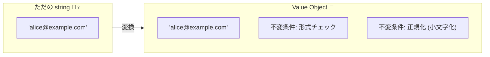

# 第12章：値オブジェクト入門：ルール込みの値を作る🎁💎


この章のゴールはこれっ👇😊✨
**「ただの `string` / `number` を、“意味とルールを持った値”に進化させて、無効な値が入り込めない形をつくる」**ことだよ〜🛡️✨

---

## 0. まず一言：いまのTypeScriptまわり、どうなってる？👀🧠

本日時点だと、`typescript` の **npm上の最新安定版（latest）は 5.9.3** だよ📦✨ ([NPM][1])
そして TypeScript は “次の大きい波（TypeScript 6/7、Goでのネイティブ実装）” に向けて動いてる、って公式が進捗も出してるよ🌊🚀 ([Microsoft for Developers][2])
（でもこの章の「値オブジェクト」は**バージョンが変わってもずっと効く設計の基礎**だから安心してね😊💎）

---

## 1. 値オブジェクト（Value Object）ってなに？🎁✨

一言でいうと👇
**「値そのものに “意味” と “守るべきルール（不変条件）” を抱かせたもの」**だよ💎🛡️

たとえば：

* `Email`：メールの形になってて、余計な空白がなく、正規化も済んでる📧✨
* `Money`：通貨が決まってて、マイナス禁止、端数の扱いも決めてある💰🧾
* `Quantity`：0以上、上限あり、整数のみ📦🔢
* `DateRange`：開始 <= 終了📆✅

つまり…
**「検証済みの値」**を作って、アプリの中核ではそれを信じて扱えるようにする感じだよ〜😊🛡️✨



---

## 2. なんでVOが必要なの？（超リアルな事故）😱💥

`string` と `string` は、TypeScript的には同じ “ただの文字列” だよね？🥲

だからこういう事故が起きる👇💥

* `userId` と `email` を取り違えて渡しても、コンパイルが通っちゃう😱
* いろんな場所で `if (!email.includes("@")) ...` が散らばって漏れる🌀
* “空白入り” や “大文字小文字の揺れ” が原因で、同じ人が別人扱いになる😵‍💫

VOを入れると👇
**「ドメインの中は “検証済みの値だけ” にできる」**から、チェック地獄がスッと減るよ🧹✨

---

## 3. VOの特徴（ここ押さえたら勝ち）🏆💎

### ✅ 3.1 “値で同一性” を見る（Entityと違う）🧠✨

* **Entity（エンティティ）**：IDで同一性（同じ人＝同じID）👤
* **Value Object**：値が同じなら同じ（同じEmail＝同じEmail）📧

### ✅ 3.2 だいたい不変（Immutable寄り）🧊✨

VOは「後から勝手に書き換え」できると不変条件が壊れるから、基本は **作ったら固定** が相性いいよ🔒😊

### ✅ 3.3 正規化（Normalization）しやすい🧼✨

例：Emailなら `trim()` して小文字化する、みたいな「同じ意味なら同じ形」に寄せられる🫧

---

## 4. TypeScriptでVOを作る“定番2パターン”🔧✨

この章では **2つの作り方** を紹介するね😊
（次章で「コンストラクタ隠して create/parse」に進化させるよ〜🏭🔐）

---

### パターンA：Branded（Opaque風）で “ただのプリミティブ” を進化させる🏷️✨

**良いところ**：軽い！速い！JSONにもそのまま載せやすい！🚀
**注意点**：メソッドを生やしにくい（関数で操作する感じ）🧩

```ts
// domain/valueObjects/email.ts

declare const emailBrand: unique symbol;

export type Email = string & { readonly [emailBrand]: "Email" };

export type EmailError =
  | { type: "Empty" }
  | { type: "TooLong" }
  | { type: "InvalidFormat" };

type Result<T, E> =
  | { ok: true; value: T }
  | { ok: false; error: E };

const MAX_EMAIL_LENGTH = 254;

export function createEmail(input: string): Result<Email, EmailError> {
  const normalized = input.trim().toLowerCase();

  if (normalized.length === 0) return { ok: false, error: { type: "Empty" } };
  if (normalized.length > MAX_EMAIL_LENGTH) return { ok: false, error: { type: "TooLong" } };

  // 超ゆるめチェック（本格化は後の章でOKだよ😊）
  const at = normalized.indexOf("@");
  if (at <= 0 || at === normalized.length - 1) {
    return { ok: false, error: { type: "InvalidFormat" } };
  }

  return { ok: true, value: normalized as Email };
}

export function emailToString(email: Email): string {
  return email; // ただのstringとして使えるのが嬉しい✨
}
```

使う側👇

```ts
import { createEmail } from "./domain/valueObjects/email";

const r = createEmail("  ALICe@Example.com  ");
if (!r.ok) {
  console.log("ダメだった😢", r.error.type);
} else {
  const email = r.value; // Email 型になった🎉
  console.log("OK✅", email);
}
```

> メモ📝
> “本格メール仕様（RFC）に完全準拠” は難易度高いので、現場では **「現実的に通す＋確認メールで担保」** みたいに割り切ることも多いよ🙂✨（この教材もその路線で進めるよ〜）

---

### パターンB：classで “ふるまい付きVO” にする🧸✨

**良いところ**：`equals()` とか `format()` とかメソッドを持てる💪
**注意点**：保存・通信のときにプリミティブへ変換する設計が必要📦

```ts
// domain/valueObjects/money.ts

export type Currency = "JPY" | "USD";

export type MoneyError =
  | { type: "Negative" }
  | { type: "NotInteger" };

type Result<T, E> =
  | { ok: true; value: T }
  | { ok: false; error: E };

// ここでは「最小単位」で整数管理（JPYなら1円単位、USDならセント単位）みたいな気持ちでOK😊
export class Money {
  private constructor(
    private readonly amountMinor: number,
    private readonly currency: Currency
  ) {}

  static create(amountMinor: number, currency: Currency): Result<Money, MoneyError> {
    if (!Number.isInteger(amountMinor)) return { ok: false, error: { type: "NotInteger" } };
    if (amountMinor < 0) return { ok: false, error: { type: "Negative" } };
    return { ok: true, value: new Money(amountMinor, currency) };
  }

  add(other: Money): Money {
    if (this.currency !== other.currency) {
      // ここは本当はドメインエラーにしたいけど、今日は簡略版😊
      throw new Error("Currency mismatch");
    }
    return new Money(this.amountMinor + other.amountMinor, this.currency);
  }

  equals(other: Money): boolean {
    return this.currency === other.currency && this.amountMinor === other.amountMinor;
  }

  toJSON(): { amountMinor: number; currency: Currency } {
    return { amountMinor: this.amountMinor, currency: this.currency };
  }
}
```

---

## 5. 「VOにする候補」の見つけ方🔍✨

次のどれかに当てはまったらVO候補だよ〜😊💎

* ✅ **ルールがある**（0以上、形式、範囲、上限…）🛡️
* ✅ **意味が強い**（Email、UserId、Plan、Quantity…）🏷️
* ✅ **同じプリミティブが多い**（stringだらけ/numberだらけ）🧟‍♀️
* ✅ **正規化したい**（trim、大小文字、全角半角…）🧼
* ✅ **比較が頻繁**（同じ？違う？がよく出る）⚖️

---

## 6. “境界→VO→ドメイン” の完成イメージ（超ミニ）🚪➡️💎➡️🏰

境界では `string` が来る。
でもドメイン内部では `Email` だけにしたい…！

```ts
import { createEmail, Email } from "./domain/valueObjects/email";

type RegisterCommand = {
  email: Email; // もうstringじゃない💎
};

function toRegisterCommand(input: { email: string }): RegisterCommand {
  const r = createEmail(input.email);
  if (!r.ok) {
    // 境界で止める🚧（ここでユーザー向けに優しく返すのは後の章で✨）
    throw new Error(`Invalid email: ${r.error.type}`);
  }
  return { email: r.value };
}
```

この形ができると、ドメインの中でこう言えるようになるよ👇😊
**「Emailは必ず正しい形で入ってくる」** 🛡️✨

---

## 7. よくあるミス集（先に潰しておこ）🧯😆

### ❌ ミス1：VOなのに誰でも作れる（検証スキップ）😱

* `type Email = string` に戻っちゃうやつ🥲
  → **create関数**（or private constructor）経由に寄せよう🔐✨（次章で本格化！）

### ❌ ミス2：VOがミュータブル（後から書き換え可）🌀

→ 作成後は触れない設計に🧊🔒

### ❌ ミス3：VOが巨大すぎる（何でも背負う）🐘

→ ルールが同じ塊だけに。迷ったら小さく分けよ🧁✨

---

## 8. ミニ課題（この章のゴール確認）🎯✨

### 課題A：VO候補を2つ選ぶ🎁

あなたの題材から、VOにしたい値を2つ選んでね😊
例：`Email`, `UserId`, `Quantity`, `Price`, `TagName` など✨

### 課題B：どっちのパターンで作るか決める🏷️🧸

* “軽くてプリミティブっぽく使いたい” → **Branded型**🏷️
* “操作（メソッド）を持たせたい” → **class**🧸

### 課題C：不変条件を3つ書く🛡️📝

例（Quantityなら）

* 0以上
* 整数
* 9999以下（上限）

---

## 9. AI活用（この章は相性めちゃ良い）🤖💖

VOは「ルールの洗い出し」「テスト観点」が命だよ〜🧠✨
AIにはここを手伝わせるのが最強😊💪

### コピペで使える質問テンプレ👇💬

* 「`Email` の入力ゆれ（空白、大文字小文字、変な文字）パターンを20個出して」🌀
* 「`Quantity` の境界値テストを列挙して（成功/失敗）」🧪
* 「この `createEmail()` の実装で漏れてる観点ある？」🔍
* 「ユーザー向けに優しいエラーメッセージ案を5つ出して」🫶

---

## 10. まとめ（この章で手に入れた武器）🛡️💎

* `string/number` を **意味ある型（VO）** にできた🎁✨
* **検証＆正規化済みの値だけ** をドメインに入れる方向が見えた🚪➡️💎
* Branded型 / class型、どっちでも作れる感覚がついた🏷️🧸

次の章（第13章）は、いよいよ本丸🔥
**「無効な状態を“作れない”ために、コンストラクタ隠して create/parse に統一する🏭🔐」** をやるよ〜😊✨

---

必要なら、この章のサンプルをあなたの題材（会員登録／注文／課金など）に合わせて、VO候補の提案＆雛形コードまで一気に作るよ📦💖

[1]: https://www.npmjs.com/package/typescript?utm_source=chatgpt.com "TypeScript"
[2]: https://devblogs.microsoft.com/typescript/progress-on-typescript-7-december-2025/?utm_source=chatgpt.com "Progress on TypeScript 7 - December 2025"
