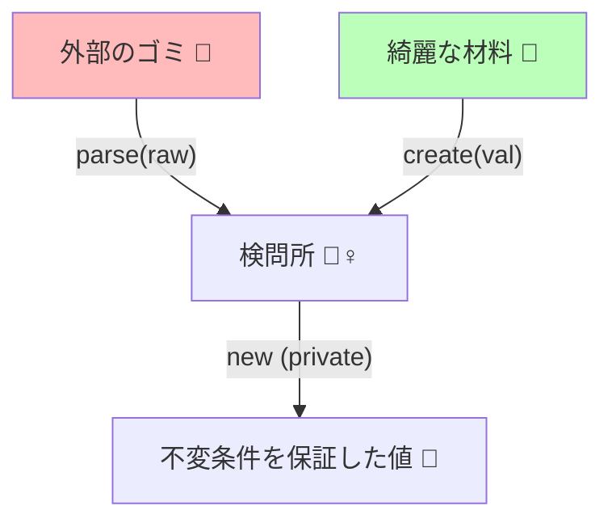

# 第13章：生成で保証：コンストラクタ隠してcreate/parseで守る🏭🔐

## この章でできるようになること🎯✨

* **「無効な値のまま、ドメインに入れない」**を作れるようになる🛡️
* `new` を禁止して、**必ず `create()` / `parse()` 経由でしか作れない**値オブジェクト（VO）を書けるようになる💎
* 「どこで `parse` して、どこで `create` するの？」が迷わなくなる🧭✨

---

## まずは“事故る設計”を1回だけ見ておこう😱💥（わざと）

例えば Email をただの `string` にして、どこでも入れられると…

* `"abc"` みたいなメールじゃない文字が入る📩❌
* `""`（空文字）も入る😵
* `user.email = "   "` みたいに途中で壊れる🌀

そしてコードのあちこちに `if (...)` が増えて、**チェック漏れ**が起きる…😭🧨

---

## 解決の中心アイデア💡✨

### ✅ ルール：VOは「作る瞬間」にしか検証させない

そのためにやることはシンプル👇

1. **コンストラクタを隠す（private）**🔒
2. **外からは `create()` / `parse()` でしか作れない**🏭
3. 作れたなら「もう中では信用してOK」💎

---

## create と parse の使い分け🧭✨（ここ超大事！）


迷ったらこのルールでOK👇

* `parse(raw)`：**外から来た“生の入力”を受ける**（境界寄り）🚪

  * 例：フォーム入力、API、JSON、DB、外部API
* `create(value)`：**もう正しいと分かってる材料から作る**（内側寄り）🏰

  * 例：自分のコードの中で組み立て済み、正規化済み、既に検証済み

> ざっくり言うと…
> **parse＝外のゴミを洗う🧼 / create＝綺麗な材料で組み立てる🧱✨**

---

## 実装例①：Email VO（class＋private constructor）📩💎

### 1) Result型（失敗を返せる箱）🎁

（第9章のタグ付きユニオンの復習にもなるよ🏷️✨）

```ts
export type Result<T, E> =
  | { ok: true; value: T }
  | { ok: false; error: E };

export const Ok = <T>(value: T): Result<T, never> => ({ ok: true, value });
export const Err = <E>(error: E): Result<never, E> => ({ ok: false, error });
```

### 2) エラー型（“何がダメか”を持てる）🧯

```ts
export type EmailError =
  | { type: "empty" }
  | { type: "invalid_format" };
```

### 3) Email本体（new禁止！）🔐

```ts
export class Email {
  // 外から直接触れない（勝手に壊されない）🧊
  private constructor(private readonly value: string) {}

  // 取り出し口だけ用意する（読み取り専用）👀
  toString(): string {
    return this.value;
  }

  // 外部入力向け：parse（rawを受ける）🚪🧼
  static parse(raw: string): Result<Email, EmailError> {
    const trimmed = raw.trim(); // 正規化の入口（本格的には次章！）🧼✨

    if (trimmed.length === 0) return Err({ type: "empty" });

    // 超シンプルなメール判定（教材用）🙂
    // ※本格運用では要件に合わせて強化するよ💪
    const ok = /^[^\s@]+@[^\s@]+\.[^\s@]+$/.test(trimmed);
    if (!ok) return Err({ type: "invalid_format" });

    return Ok(new Email(trimmed));
  }

  // 内部向け：create（材料がキレイ前提）🏰🧱
  // 例：既に parse 済み・正規化済みの値だけ渡す想定
  static create(normalized: string): Email {
    // “内部の約束”として、ここは例外で守るのもアリ（設計方針次第）🙂
    // ただし本章は「生成経由に集約」が目的！
    return new Email(normalized);
  }
}
```

### ✅ これで何が嬉しいの？😍

* `new Email("abc")` が **できない**（コンパイルで止まる）⚡
* Email を作るには **必ず `parse` を通る** → 入口が1つになる🚪✨
* `Email` 型になったら **“メールとして正しい” が保証される**💎



---

## 使い方（境界→parse、内側→Emailとして扱う）🚪➡️🏰

例えば「会員登録」の入口で👇

```ts
type RegisterRequest = {
  email: unknown; // 外から来たものは信用しない！🕵️‍♀️
};

function register(req: RegisterRequest) {
  if (typeof req.email !== "string") {
    return { status: 400, message: "email は文字列で送ってね🙏" };
  }

  const emailResult = Email.parse(req.email);
  if (!emailResult.ok) {
    return { status: 400, message: toMessage(emailResult.error) };
  }

  const email = emailResult.value; // ここからは Email として信用してOK💎
  // domain.register(email) みたいに渡せる✨
  return { status: 200 };
}

function toMessage(err: EmailError): string {
  switch (err.type) {
    case "empty":
      return "メールアドレスが空だよ🥺";
    case "invalid_format":
      return "メールの形じゃないみたい💦 例: neko@example.com";
  }
}
```

---

## 実装例②：classを使わない版（factory関数＋Brand）🏷️✨

「VOは関数で作る派」もいるので、選べるように置いとくね🙂

```ts
type Brand<T, B extends string> = T & { readonly __brand: B };
export type Email = Brand<string, "Email">;

export type EmailError =
  | { type: "empty" }
  | { type: "invalid_format" };

export function parseEmail(raw: string): Result<Email, EmailError> {
  const trimmed = raw.trim();
  if (trimmed.length === 0) return Err({ type: "empty" });

  const ok = /^[^\s@]+@[^\s@]+\.[^\s@]+$/.test(trimmed);
  if (!ok) return Err({ type: "invalid_format" });

  return Ok(trimmed as Email); // “ここだけ”で型を付けるのがポイント🔒
}
```

✅ class版の強み：**内部状態を隠せる（カプセル化）**🧊
✅ Brand版の強み：**軽い・シンプル・値がそのままstring**⚡

---

## よくある落とし穴（ここ踏むと崩れる）⚠️😵‍💫

* `as Email` をあちこちで使い始める（入口が増殖）🧟‍♀️
  → **「as は境界の“たった1箇所”だけ」**に縛ろう🔒
* `public constructor` にしちゃう（new できて終わる）💥
* VOの中身を `public value: string` にする（外から書き換えられて壊れる）🌀
  → `private readonly` ＋ `toString()` など読み取りだけにしよ🙂

---

## ミニ課題🎒✨（手を動かすと一気に腑に落ちるよ）

あなたの題材で VO を1個だけ作ってみてね👇

1. 候補を1つ選ぶ（例：`UserId` / `Tag` / `Price` / `Quantity`）🎯
2. `new` を禁止（private constructor or factory only）🔒
3. `parse()` を作る（raw入力→Result）🚪
4. 入口の1箇所で `parse` して、以降は VO 型で回す💎

---

## AI活用コーナー🤖✨（この章と相性いい！）

Copilot / Codex などにはこう聞くと強いよ👇

* 「Emailとして弾くべき入力パターンを20個出して🧠」
* 「この `parse()` の正規表現、弱いところを指摘して👀」
* 「`EmailError` をユーザー向け文言にする switch を作って🫶」
* 「“as を乱用してしまう危険ルート” をレビューして🔍」

※生成されたコードは、**“入口が1つになってるか？”**だけ必ずチェックね✅✨

---

## 最新動向メモ（本日時点）📰✨

* TypeScript は **5.9 系（5.9.3 が Latest 表記）**が確認できるよ。([GitHub][1])
* そして Microsoft は **TypeScript 6.0（橋渡し）→ 7.0（ネイティブ版）**の流れを進めているよ（早期 2026 目標）。([Microsoft for Developers][2])
* VS Code は **2026/01/08 に 1.108（December 2025 リリース）**が出てるよ。([Visual Studio Code][3])

---

## まとめ🎀

* **「無効な状態を作れない」**の中心テクは、**作り方を1本化すること**🏭🔐
* `new` を封印して、**`parse/create` のどちらかを必ず通す**🚪✨
* `parse＝外から来たもの用`、`create＝内側の材料用` 🧼🧱
* これができると、次章（正規化🧼✨）がめちゃ気持ちよくなるよ〜！🎉💎

[1]: https://github.com/microsoft/typescript/releases "Releases · microsoft/TypeScript · GitHub"
[2]: https://devblogs.microsoft.com/typescript/progress-on-typescript-7-december-2025/?utm_source=chatgpt.com "Progress on TypeScript 7 - December 2025"
[3]: https://code.visualstudio.com/updates "December 2025 (version 1.108)"
