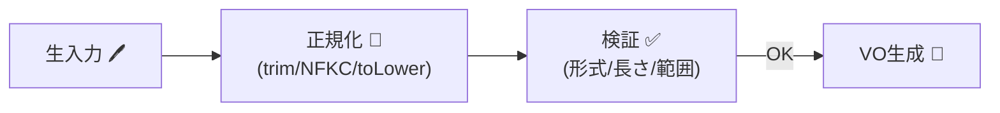

# 第14章：正規化（Normalization）：検証前に整える🧼✨


## 今日のゴール🎯💖

* 入力の「ゆれ」（空白・全角半角・大文字小文字など）を、**検証の前に**そろえられるようになる🙂✨
* 正規化ルールを「どこで」「どの順で」かけるか、迷わなくなる🚪🛡️
* TypeScriptで **正規化パイプライン**を作って、値オブジェクト（VO）につなげられる💎🔗

---

## 1) 正規化ってなに？🧽🌀


正規化（Normalization）は、ざっくり言うと…

> **同じ意味の入力なら、同じ形（canonical）にそろえる**こと✨

例👇

* `"  Alice  "` → `"Alice"`（前後の空白トリム）
* `"ＡＢＣ１２３"` → `"ABC123"`（全角→半角）
* `"Test@Example.COM"` → `"test@example.com"`（小文字化ポリシー）
* `"ﾀﾛｳ"` → `"タロウ"`（半角カナ→全角）

このへんはJavaScriptの `String.prototype.normalize()`（Unicode正規化）でも助けられるよ🫶
（NFC / NFD / NFKC / NFKD があるよ） ([MDN Web Docs][1])

---

## 2) 「検証」と「正規化」って何が違うの？🤔✅🧼


* **正規化**：入力を“整える”🧼（ゆれ吸収、表記統一）
* **検証（validation）**：ルールに合ってるか“チェックする”✅（形式・長さ・範囲など）

めっちゃ大事な順番はこれ👇
**正規化 → 検証 → VO生成（create/parse）** 💎🏭



なぜかというと…
**正規化しないまま検証すると、「本当はOKなのに弾く」事故**が起きがち😵‍💫💦
（例：全角＠「＠」入りメール、末尾スペース付きユーザー名、など）

---

## 3) どこで正規化するの？おすすめは2段構え🏰🚪

正規化は「境界」と「VO生成直前」に置くのが安定だよ🙂✨

### ✅(A) 境界（Boundary）での正規化🚪

* UI / API / フォーム入力など「外から来た文字列」は、まず軽く整える🧼
* 例：`trim`、改行統一、全角空白→半角空白、など

### ✅(B) VOの `create/parse` 内で“その値専用の正規化”💎

* EmailならEmail用、タグならタグ用、みたいに**値ごとの正規化ポリシー**を最終確定する✨
* “無効な状態を作れない”の最後の砦🛡️🔥

---

## 4) 正規化ルールは「フィールド別」に決めるのがコツ📌✨


「とりあえず全部NFKCでいいよね！」は危険⚠️😇（あとで困る）

### 代表的な分類🍱

* **識別子系（ID / email / username / code）**：揺れを減らしてOKにしがち👍
* **表示名（ニックネーム等）**：揺れを残すこともある（“見た目”が大事）🎀
* **自由文（本文/メモ）**：基本は変えすぎない（ユーザーの意図が大事）📝
* **パスワード**：勝手に変換しない（絶対）🔐😱

Unicodeの互換正規化（NFKC/NFKD）は便利だけど、**見た目や意味が変わる**ケースがあるから「どの項目に使うか」決めて使うのが安全だよ🧠✨ ([unicode.org][2])

---

## 5) よく使う正規化パターン10選🧰✨


### ① 前後の空白トリム🧹

`trim()` は超定番🙂 ([MDN Web Docs][3])

### ② 連続空白を1つにする🧼

名前や住所など「内部の空白」を整えるときに使うよ✨

### ③ 改行を統一（CRLF→LF）↩️

Windows由来の `\r\n` を `\n` にそろえるの、地味に効く🙂

### ④ Unicode正規化（NFC / NFKC）🌐

`"ｱ"` と `"ア"`、`"１２３"` と `"123"` みたいな差を吸収しやすい✨ ([MDN Web Docs][1])

### ⑤ 大文字小文字の統一🔤

ただし「どこまで小文字化するか」はポリシー！
メールは特に注意：**ドメインはDNSルールで大文字小文字を区別しない**一方、local-partは仕様上ケースセンシティブ扱い（でも運用上は区別しないことが多い）っていうややこしさがあるよ😵‍💫
RFC上は「local-partはcase-sensitiveとして扱う必要がある」が、同時に「それを利用するのは相互運用性を下げるので推奨しない」とも書かれてるよ📩⚖️ ([datatracker.ietf.org][4])

### ⑥ ハイフン・スペース除去（電話番号など）📞

`"090-1234-5678"` → `"09012345678"`

### ⑦ 数字の表記統一（全角→半角）🔢

ID・コード・郵便番号で大活躍✨

### ⑧ 先頭ゼロの扱い（仕様で決める）0️⃣

郵便番号や会員番号は「先頭ゼロが意味を持つ」ことが多いので勝手に消さない！

### ⑨ URLの正規化（できれば標準に任せる）🌍

URLは仕様が多くて沼りやすいので、できるだけ WHATWG URL など“標準実装”側に寄せるのが安全🙂 ([url.spec.whatwg.org][5])

### ⑩ セキュリティ：見た目が似てる文字（confusable）対策🛡️

「a」と「а（キリル文字）」みたいな“見た目そっくり”は詐欺にも使われるので、識別子用途では注意⚠️
Unicodeもセキュリティ向けの仕組み（confusable detection等）を出してるよ🧯 ([unicode.org][6])

---

## 6) 実装してみよう：正規化パイプライン🧪✨


### 6-1. 小さな関数を積み上げるのが最強🧱💪

ポイントはこれ👇

* **副作用なし（pure）**
* **何回かけても同じ結果（idempotent）**
* **「どの項目に適用するか」が明確**

```ts
// normalizers.ts
export const trim = (s: string) => s.trim();

export const normalizeNFC = (s: string) => s.normalize("NFC");
export const normalizeNFKC = (s: string) => s.normalize("NFKC");

export const toLower = (s: string) => s.toLowerCase();

// 連続空白を1つへ（必要な項目だけに使う）
export const collapseSpaces = (s: string) => s.replace(/\s+/g, " ");

// 改行統一（Windowsの \r\n を \n に）
export const normalizeNewlines = (s: string) => s.replace(/\r\n/g, "\n");

// 合成（上から順に適用）
export const pipe =
  (...fns: Array<(s: string) => string>) =>
  (input: string) =>
    fns.reduce((acc, fn) => fn(acc), input);
```

---

## 7) 例①：Emailの正規化（ポリシーを見える化）📩✨


### 7-1. Emailは「表示用」と「照合用」を分けると楽😌

おすすめは👇

* `display`: ユーザーが入れた見た目（軽く整える程度）
* `canonical`: 照合・検索・一意制約に使う統一形

### 7-2. Emailの正規化方針（例）🧭

* 前後空白は削る
* 全角→半角は吸収（＠、英数）
* **ドメインは必ず小文字**（OK寄り）
* local-partは「小文字化する/しない」を決める

  * ログインID用途なら小文字化しちゃうことが多い（運用寄り）
  * ただし仕様上の注意は理解しておく（上のRFCの話） ([datatracker.ietf.org][4])


### 7-3. 実装例（Result型つき）🎁

```ts
// result.ts
export type Ok<T> = { ok: true; value: T };
export type Err<E> = { ok: false; error: E };
export type Result<T, E> = Ok<T> | Err<E>;
export const ok = <T>(value: T): Ok<T> => ({ ok: true, value });
export const err = <E>(error: E): Err<E> => ({ ok: false, error });

// errors.ts
export type Issue = { code: string; message: string };

// email.ts
import { pipe, trim, normalizeNFKC } from "./normalizers";
import { Result, ok, err } from "./result";
import type { Issue } from "./errors";

export type Email = Readonly<{
  kind: "Email";
  display: string;
  canonical: string;
}>;

const normalizeEmailDisplay = pipe(
  normalizeNFKC, // 全角＠などを吸収（適用するのはEmailだけ！）
  trim
);

// 「照合用」：空白を消す、ドメインを小文字化…など
const toCanonicalEmail = (display: string) => {
  const noSpaces = display.replace(/\s+/g, "");
  const at = noSpaces.indexOf("@");
  if (at < 0) return { local: "", domain: "", raw: noSpaces };

  const local = noSpaces.slice(0, at);
  const domain = noSpaces.slice(at + 1).toLowerCase(); // ドメインは小文字
  // 👇 localを小文字化するかは“あなたの仕様”
  const canonical = `${local.toLowerCase()}@${domain}`;
  return { local, domain, raw: noSpaces, canonical };
};

export const Email = {
  create(input: string): Result<Email, Issue[]> {
    const display = normalizeEmailDisplay(input);

    const issues: Issue[] = [];
    if (display.length === 0) issues.push({ code: "empty", message: "メールアドレスが空だよ🥺" });

    const { raw, canonical } = toCanonicalEmail(display);
    if (!raw.includes("@")) issues.push({ code: "format", message: "「@」が見つからないよ📩💦" });

    // ここは“軽い形式チェック”の例（本格版は章19〜21で！）
    if (raw.includes("..")) issues.push({ code: "format", message: "「..」はちょっと怪しいかも😵‍💫" });

    if (issues.length > 0) return err(issues);

    return ok({
      kind: "Email",
      display,
      canonical,
    });
  },
} as const;
```

📝ポイント

* **正規化した後**に長さや形式をチェックしてる（順番大事！）
* `canonical` の方針（local小文字化）は、ログイン仕様と合わせて決めるのがコツだよ🙂

---

## 8) 例②：タグ（Tag）の正規化🏷️✨

タグは「同じ意味なら同じ形」にするとUIも検索も気持ちいい😍

ポリシー例👇

* `trim`
* 空白は `_` などに統一（または全部消す）
* NFKCで全角英数を吸収
* 小文字化（タグは小文字運用が多い）

```ts
import { pipe, trim, normalizeNFKC, toLower } from "./normalizers";
import { ok, err, type Result } from "./result";
import type { Issue } from "./errors";

export type Tag = Readonly<{ kind: "Tag"; value: string }>;

const normalizeTag = pipe(
  normalizeNFKC,
  trim,
  (s) => s.replace(/\s+/g, "_"),
  toLower
);

export const Tag = {
  create(input: string): Result<Tag, Issue[]> {
    const v = normalizeTag(input);

    const issues: Issue[] = [];
    if (v.length === 0) issues.push({ code: "empty", message: "タグが空だよ🥺" });
    if (v.length > 20) issues.push({ code: "too_long", message: "タグは20文字までにしよ🙂" });
    if (!/^[a-z0-9_]+$/.test(v)) issues.push({ code: "chars", message: "使えるのは英小文字・数字・_ だけだよ🧸" });

    return issues.length ? err(issues) : ok({ kind: "Tag", value: v });
  },
} as const;
```

---

## 9) テスト観点：正規化はテストが超ラク🧪😍

特にこの2つは鉄板だよ👇

### ✅(1) 同じ意味の入力が同じ canonical になる

* `" Test@Example.com "` と `"test@example.com"` が同じになる？🙂

### ✅(2) idempotent（何回かけても同じ）

* `normalize(normalize(x)) === normalize(x)` を満たす？✨
  （正規化が暴れないチェック！）

---

## 10) ミニ課題🎒✨（今日のぶん）

### 課題A🧼

あなたの題材で「入力のゆれ」を3つ書いて、正規化ルールを決めてね🙂
例：

* 前後空白
* 全角英数
* 大文字小文字

### 課題B🏗️

`pipe()` を使って「その項目専用の normalize 関数」を1つ作る✨
（EmailでもTagでもOK！）

### 課題C🧪

idempotentテストを1本書く！
`normalize(normalize(x)) === normalize(x)` ✅

---

## 11) AI活用テンプレ🤖💬✨

そのままコピペで使えるやつ置いとくね🫶

* 「この入力項目で起こりうる“表記ゆれ”を20個出して🏷️🌀」
* 「正規化の副作用（意味が変わる、セキュリティリスク）を列挙して⚠️🛡️」
* 「正規化→検証→VO生成のテストケースを成功/失敗/境界値で出して🧪✅」
* 「この正規化関数がidempotentかチェックして、反例があれば教えて👀」

---

## 12) まとめ🌸

* 正規化は「同じ意味を同じ形に」そろえる作業🧼✨
* 順番は **正規化 → 検証 → VO生成** が基本💎
* `normalize()`（Unicode正規化）は便利だけど、**使う項目を選ぶ**のが安全だよ🌐🛡️ ([MDN Web Docs][1])
* Emailは特に仕様と運用のギャップがあるから、**ポリシーを決めてcanonicalを持つ**のが安定📩✨ ([datatracker.ietf.org][4])

（ちなみに本日時点では TypeScript の安定版は 5.9.x 系が最新として案内されているよ📣） ([github.com][7])

[1]: https://developer.mozilla.org/ja/docs/Web/JavaScript/Reference/Global_Objects/String/normalize?utm_source=chatgpt.com "String.prototype.normalize() - JavaScript - MDN Web Docs"
[2]: https://unicode.org/reports/tr15/?utm_source=chatgpt.com "UAX #15: Unicode Normalization Forms"
[3]: https://developer.mozilla.org/en-US/docs/Web/JavaScript/Reference/Global_Objects/String/trim?utm_source=chatgpt.com "String.prototype.trim() - JavaScript - MDN Web Docs"
[4]: https://datatracker.ietf.org/doc/html/rfc5321?utm_source=chatgpt.com "RFC 5321 - Simple Mail Transfer Protocol - Datatracker - IETF"
[5]: https://url.spec.whatwg.org/?utm_source=chatgpt.com "URL Standard - WhatWG"
[6]: https://www.unicode.org/reports/tr39/?utm_source=chatgpt.com "UTS #39: Unicode Security Mechanisms"
[7]: https://github.com/microsoft/typescript/releases "Releases · microsoft/TypeScript · GitHub"
