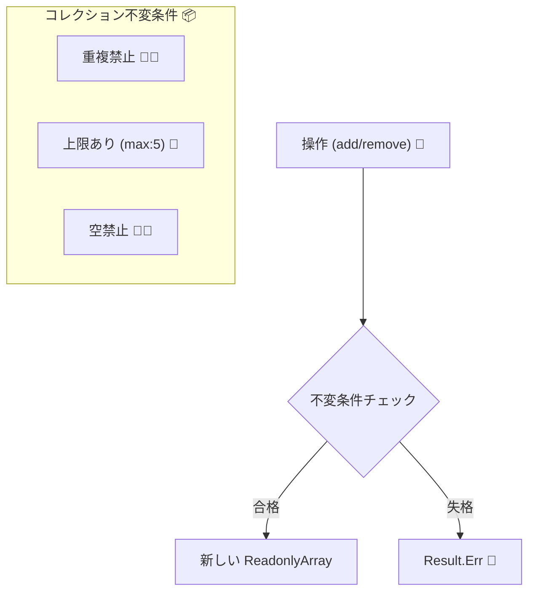

# 第15章：コレクション不変条件：空禁止・重複禁止・上限など📦🚫


この章はね、「配列（コレクション）って便利だけど、放っておくと一番バグりやすい😇」ってところを、**型＋操作API**でカッチリ守れるようにする回だよ〜！💪💎

---

## 今日のゴール🎯✨

次の“ありがちなルール”を、**途中で壊れない設計**にできるようになるよ🙂

* 空は禁止（最低1個は必要）🚫🫙
* 重複は禁止（同じタグ2回入れない）🚫🔁
* 上限あり（最大5個まで）🧢5️⃣
* ついでに：中身の形式（空白NG、長さ制限、正規化）🧼🔤

---

# 15-1. なんで配列は事故りやすいの？😵‍💫🌀


配列って、気づいたらこうなるの…👇

* いろんな場所で `if (tags.length > 5) ...` が散る🌀
* 追加するときはチェックしたのに、別の場所で `push()` して壊れる💥
* “重複なしのはず” がいつの間にか重複してる😇
* 空配列が混ざって「表示できない」「保存できない」が発生😭

**結論：配列を生で持たせない**のが超効くよ🛡️✨
（＝「壊れる操作」を封じる！）



---

# 15-2. コレクション不変条件を守る「3つの型」💎📦


## A) 非空（NonEmpty）🫙🚫

「必ず1個以上ある」って保証が欲しいとき！

* 例：注文の明細は最低1行必要🧾
* 例：ユーザーが選んだ候補は最低1つ🎯

## B) ユニーク（Unique）🚫🔁

「同じものは2回入れない」！

* 例：タグ、ロール、権限、選択肢🏷️🔐

## C) 上限（Bounded）🧢

「最大◯個まで」！

* 例：タグ最大5個、画像最大10枚📸

これらを、**“生成”と“更新”の両方**で守るのがポイントだよ😊✨
生成時だけ守っても、あとで `push()` されたら終わり😇

---

# 15-3. 守り方の基本方針🛡️✨


コレクションの理想はこれ👇

* 外からは `readonly` として見せる（勝手に変更できない）🧊
* 変更は **add/remove みたいな「意図のある操作」だけ**提供する🧰
* 操作の中で不変条件チェック✅
* 失敗は Result で返す（例外乱発しない）📦🙂

`readonly` や `ReadonlyArray` は TypeScript の定番の守り方だよ🧊✨（読み取り専用配列の型注釈） ([typescriptbook.jp][1])

---

# 15-4. 実装してみよう：タグは「最大5個・重複なし・空白NG」🏷️🧼🧢


ここからは実戦！
題材は「記事に付けるタグ」みたいなやつね🙂✨

## ① まず Result 型（超ミニ）📦✨

成功/失敗を返すための箱だよ🎁

```ts
export type Ok<T> = { ok: true; value: T };
export type Err<E> = { ok: false; error: E };
export type Result<T, E> = Ok<T> | Err<E>;

export const ok = <T>(value: T): Ok<T> => ({ ok: true, value });
export const err = <E>(error: E): Err<E> => ({ ok: false, error });
```

---

## ② Tag（値オブジェクト）を作る💎🏷️

「タグは string です」じゃなくて、**ルール込みの Tag**にするよ！

ルール例👇

* 前後空白はトリム✂️
* 空文字は禁止🚫
* 小文字に正規化（好みで）🔡
* 長すぎ禁止（例：20文字まで）📏

```ts
export type Tag = {
  readonly value: string;
};

export type TagError =
  | { type: "Tag.Empty" }
  | { type: "Tag.TooLong"; max: number }
  | { type: "Tag.InvalidChars" };

const MAX_TAG_LEN = 20;

// 超シンプル：英数とハイフンだけ許可（必要に応じて調整してね🙂）
const TAG_PATTERN = /^[a-z0-9-]+$/;

export const Tag = {
  create(raw: string): Result<Tag, TagError> {
    const normalized = raw.trim().toLowerCase();

    if (normalized.length === 0) return err({ type: "Tag.Empty" });
    if (normalized.length > MAX_TAG_LEN) return err({ type: "Tag.TooLong", max: MAX_TAG_LEN });
    if (!TAG_PATTERN.test(normalized)) return err({ type: "Tag.InvalidChars" });

    return ok({ value: normalized });
  },
} as const;
```

> これで「Tag 型の value は、必ず検証済み」って言えるようになるよ💎😊

---

## ③ TagList（コレクション不変条件の本丸）📦🔥

今回の不変条件はこれ👇

* 最大5個まで🧢5️⃣
* 重複禁止🚫🔁
* 中身は Tag（検証済み）💎
* 外からは変更不可（readonly）🧊

```ts
export type TagList = {
  readonly items: ReadonlyArray<Tag>;
};

export type TagListError =
  | { type: "TagList.TooMany"; max: number }
  | { type: "TagList.Duplicated"; value: string };

const MAX_TAGS = 5;

const isDuplicated = (tags: ReadonlyArray<Tag>): string | null => {
  const seen = new Set<string>();
  for (const t of tags) {
    if (seen.has(t.value)) return t.value;
    seen.add(t.value);
  }
  return null;
};

export const TagList = {
  // まとめて作る（例：保存データや入力変換のあとに使う）
  create(tags: ReadonlyArray<Tag>): Result<TagList, TagListError> {
    if (tags.length > MAX_TAGS) return err({ type: "TagList.TooMany", max: MAX_TAGS });

    const dup = isDuplicated(tags);
    if (dup) return err({ type: "TagList.Duplicated", value: dup });

    return ok({ items: [...tags] });
  },

  // 1個追加（意図のある操作✨）
  add(list: TagList, tag: Tag): Result<TagList, TagListError> {
    const next = [...list.items, tag];
    return TagList.create(next);
  },

  // 削除（なければそのまま返す方針でもOK🙂）
  remove(list: TagList, tag: Tag): TagList {
    const next = list.items.filter((t) => t.value !== tag.value);
    // removeは失敗させない（空許容かどうかはドメイン次第！）
    // もし「最低1個」なら、ここもResultにして NonEmpty を守る✅
    return { items: next };
  },
} as const;
```

### ここ、めっちゃ大事ポイント⚠️✨

* `items` を `ReadonlyArray<Tag>` にして、外から `push()` できないようにしてる🧊
* 変更は `add/remove` 経由にして、必ず `create()` で不変条件を再チェック✅
* 「更新しても壊れない」＝これが設計の勝ち🏆💎

---

# 15-5. “空禁止（NonEmpty）” もやるならこうする🫙🚫✨


もし「タグは最低1個必要！」なら、`remove` も失敗する可能性があるよね🙂
その場合は **NonEmptyTagList** に分けるのがキレイ✨

考え方👇

* `TagList`（0個OK）
* `NonEmptyTagList`（1個以上）🫙

こうすると、「空でもいい場面」と「空はダメな場面」が混ざらなくなるよ😊

---

# 15-6. テストで“壊れない”を固定しよう🧪😍

不変条件はテストが書きやすい！最高！🎉
テスト基盤は Vitest が今どきの定番だよ（ガイド） ([vitest.dev][2])

## テスト例（TagList）🧪

```ts
import { describe, it, expect } from "vitest";
import { Tag, TagList } from "./tag";

describe("TagList", () => {
  it("最大5個まで", () => {
    const tags = ["a","b","c","d","e"].map((s) => Tag.create(s)).map((r) => (r.ok ? r.value : null));
    expect(tags.every((t) => t !== null)).toBe(true);

    const list = TagList.create(tags as any);
    expect(list.ok).toBe(true);

    const sixth = Tag.create("f");
    expect(sixth.ok).toBe(true);

    const added = TagList.add(list.ok ? list.value : (null as any), sixth.ok ? sixth.value : (null as any));
    expect(added.ok).toBe(false);
    if (!added.ok) expect(added.error.type).toBe("TagList.TooMany");
  });

  it("重複は禁止", () => {
    const t1 = Tag.create("React");
    const t2 = Tag.create("react"); // 正規化で同じになる想定🙂
    expect(t1.ok && t2.ok).toBe(true);

    const list = TagList.create([t1.ok ? t1.value : (null as any), t2.ok ? t2.value : (null as any)]);
    expect(list.ok).toBe(false);
    if (!list.ok) expect(list.error.type).toBe("TagList.Duplicated");
  });
});
```

---

# 15-7. よくある落とし穴集⚠️😇

## ❌ `string[]` のまま頑張る

「チェックを散らす」方向に行きがちで、漏れます🌀

## ❌ `Set<string>` にすればOKと思う


ユニークにはなるけど、

* 上限
* 正規化
* 表示順
* エラー理由（何がダメ？）
  がふわっとしがち😇
  **“ドメインのルール” を表現するには、型＋APIが強い**よ💎

## ❌ `readonly` なら完全に安全？

TypeScript の `readonly` はコンパイル時の防波堤🧊
運用で `as any` しちゃうと壊せるので、**境界での運用ルール**も大事だよ🙂
（readonly配列の基本はここがまとまってるよ） ([typescriptbook.jp][1])

---

# 15-8. ミニ課題📝✨（やると一気に身につく！）

1. **NonEmptyArray** を作ってみよう🫙

* `create(items)` は空なら Err
* `head()` は必ず返る（undefined禁止）✅

2. **UniqueList<T>** を作ってみよう🚫🔁

* `create(items, keyFn)` で重複チェック
* 失敗時は「どのキーが重複したか」を返す🎯

3. **BoundedList<T>** を作ってみよう🧢

* `max` を受け取って、超えたら Err

---

# 15-9. AI活用（この章向け）🤖✨

AIは「コードを全部書かせる」より、**漏れ探し**が超得意だよ〜！🔍💕

おすすめ質問テンプレ👇

* 「この TagList の不変条件が破れる入力パターンを20個出して」🧠
* 「add/remove 以外に必要な操作ある？ replaceAll とか rename とか」🧰
* 「エラー型の粒度、初心者向けに改善案ある？」🫶
* 「テスト観点（成功/失敗/境界値）を列挙して」🧪

---

# ちょい最新情報メモ（2026っぽい空気）🗞️✨

* TypeScript は npm 上だと **5.9.3** が最新として掲載されてるよ（2025-09-30公開） ([NPM][3])
* さらに次の大きな流れとして、TypeScript 6.0 は “橋渡し” で、TypeScript 7 はネイティブ化で高速化…みたいな話が公式から出てるよ🚀 ([Microsoft for Developers][4])

（でもこの章の内容は、そういう未来が来てもずっと使える設計の基礎だよ💎🙂）

---

# まとめ🌸✨

コレクション不変条件はこう守る！👇

* **生配列をドメインに入れない**📦🚫
* **create（生成）で保証**🏭✅
* **更新は add/remove みたいな意図APIだけ**🧰✨
* **外へは readonly で見せる**🧊
* **失敗は Result で返す**📦🙂

# 次の章（第16章）は、この流れをさらに進めて「setterを減らして“意図のある操作”にする」話に入るよ〜！🧱✨

[1]: https://typescriptbook.jp/reference/values-types-variables/array/readonly-array?utm_source=chatgpt.com "読み取り専用の配列 (readonly array)"
[2]: https://vitest.dev/guide/?utm_source=chatgpt.com "Getting Started | Guide"
[3]: https://www.npmjs.com/package/typescript?utm_source=chatgpt.com "TypeScript"
[4]: https://devblogs.microsoft.com/typescript/progress-on-typescript-7-december-2025/?utm_source=chatgpt.com "Progress on TypeScript 7 - December 2025"
