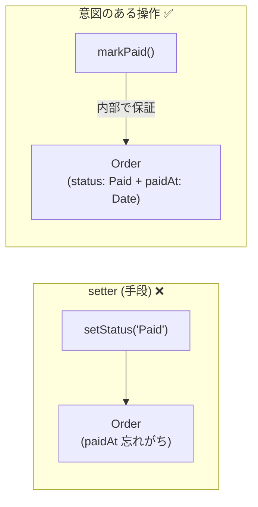

# 第16章：更新API設計：setterを減らして「意図のある操作」にする🧱✨


今日は「更新（アップデート）ってどう設計すると安全になるの？」を、ふわっと優しく＆でも実戦で使える形でやっていくよ〜☺️🌸
結論から言うと…

✅ **“プロパティを直接書き換える” をやめて**
✅ **“意味のある操作（意図）” をメソッドやコマンドで表現する**

これだけで、不変条件がめちゃ守りやすくなるよ🛡️💎

---

## 0. ちょい最新メモ（本日時点）🗓️✨

いまの TypeScript の **最新安定版は 5.9.3**（npm の “Latest version” 表記）だよ〜🧡 ([NPM][1])
5.9 では `import defer` や `--module node20` みたいな設定まわりも更新されてるよ（環境まわりの詰まりが減りやすい系）🧩 ([TypeScript][2])

（章の主役は設計だけど、「いまの前提」もちゃんと新しめでいくね✌️）

---

## 1. この章でできるようになること🎯💕

### ゴールはこれだよ👇✨

* 「更新＝setterで書き換え」から卒業できる🎓✨
* 不変条件が壊れない **更新API（更新の入口）** を作れる🛡️
* `setStatus()` より `markPaid()` が強い理由が腹落ちする😳💡
* 更新の種類が増えても破綻しにくい設計になる🧱✨

---

## 2. なぜ setter が危ないの？😱💥（あるある事故）


たとえば注文（Order）があって、状態があるとするね📦

* Draft（下書き）
* Paid（支払い済み）
* Shipped（発送済み）

ここで「支払い済み」になったら、**必ず paidAt を入れる**…みたいな不変条件があるとする💳🕒

### ❌ setter設計（事故りやすい）

```ts
type OrderStatus = "Draft" | "Paid" | "Shipped";

type Order = {
  id: string;
  status: OrderStatus;
  paidAt?: Date;
};

function setStatus(order: Order, status: OrderStatus): Order {
  // 😇 なんでも入っちゃう
  return { ...order, status };
}

const o1: Order = { id: "o-1", status: "Draft" };

// 😱 Paidにしたのに paidAt を入れ忘れた…
const o2 = setStatus(o1, "Paid");
```

これ、めっちゃ起きるの🥲
「Paid にしたなら paidAt が必要」ってルールが、**更新の呼び出し側に分散**しちゃうから。

> setterは「どう変えるか（手段）」であって
> ドメインが欲しいのは「なぜ変えるか（意図）」なんだよね🙂✨

---

## 3. 更新は「意図のある操作」で表現しよう🧠✨


### ✅ `setStatus("Paid")` より ✅ `markPaid()` 💖

* `markPaid()` の中で **paidAt を必ず入れられる**
* 「Paidにしていい状態？」も **中で判定できる**
* 呼び出し側が雑でも壊れにくい🛡️



---

## 4. 設計のコツ：更新を “コマンド化” する🎮📩


更新を “自由に書き換える” から、
更新を “許可された操作だけにする” へ✨

たとえばこんな更新だけを許す：

* `markPaid(paymentId)`
* `ship(trackingNo)`
* `cancel(reason)`

この “操作のラインナップ” が **更新API** の正体だよ🧱✨

---

## 5. パターンA：不変条件を守る「関数更新」スタイル 🧼✨


「Orderを受け取って、新しいOrderを返す」やつ！
イミュータブルで気持ちいいやつだよ〜🧊💕

まず Result 型を軽く用意（この章内で完結の簡易版ね）👇

```ts
type Ok<T> = { ok: true; value: T };
type Err<E> = { ok: false; error: E };
type Result<T, E> = Ok<T> | Err<E>;

const Ok = <T>(value: T): Ok<T> => ({ ok: true, value });
const Err = <E>(error: E): Err<E> => ({ ok: false, error });
```

### ドメインエラーも “意味のある型” にする🧯

```ts
type OrderError =
  | { type: "InvalidTransition"; message: string }
  | { type: "MissingData"; message: string };
```

### `markPaid` を “意図のある更新” として作る💳✨

```ts
type OrderStatus = "Draft" | "Paid" | "Shipped";

type Order = Readonly<{
  id: string;
  status: OrderStatus;
  paidAt?: Date;
  shippedAt?: Date;
}>;

function markPaid(order: Order): Result<Order, OrderError> {
  if (order.status !== "Draft") {
    return Err({
      type: "InvalidTransition",
      message: "Draft のときだけ支払いに進めるよ",
    });
  }

  // ✅ Paidになったら paidAt を必ず入れる
  return Ok({
    ...order,
    status: "Paid",
    paidAt: new Date(),
  });
}
```

ここがポイントだよ👇💕

* **Paid にする “手続き” を関数の中に閉じ込めた**
* 呼び出し側は `markPaid(order)` するだけでOK
* 不変条件（PaidならpaidAt必須）が壊れにくい🛡️

ちなみに `Readonly<T>` はユーティリティ型で、プロパティ再代入を防ぐ方向に寄せられるよ🙂 ([TypeScript][3])
`readonly` はあくまで型チェック上の保護で、実行時に魔法が起きるわけじゃない点もセットで覚えよ〜🧠✨ ([TypeScript][4])

---

## 6. パターンB：状態（Status）を “タグ付きユニオン” にして更新を強くする🏷️💪


「状態ごとに持ってていいデータが違う」なら、これ最強✨

```ts
type DraftOrder = Readonly<{
  kind: "Draft";
  id: string;
}>;

type PaidOrder = Readonly<{
  kind: "Paid";
  id: string;
  paidAt: Date; // ✅ Paid は必ず paidAt を持つ
}>;

type ShippedOrder = Readonly<{
  kind: "Shipped";
  id: string;
  paidAt: Date;
  shippedAt: Date; // ✅ Shipped は必ず shippedAt を持つ
}>;

type Order = DraftOrder | PaidOrder | ShippedOrder;

function markPaid(order: Order): Result<Order, OrderError> {
  if (order.kind !== "Draft") {
    return Err({ type: "InvalidTransition", message: "Draft からだけ支払いOK" });
  }

  return Ok({
    kind: "Paid",
    id: order.id,
    paidAt: new Date(),
  });
}
```

これの気持ちよさ👇😍

* 「PaidなのにpaidAtが無い」状態が **型として作れない**
* 不変条件が “更新ロジック” だけじゃなく “型” でも守られる💎

---

## 7. 「更新API」をどう切る？🧭✨（超実務の話）


更新の入口を設計するとき、よくある選択肢はこの2つ👇

### ❌ なんでも更新できる PUT/PATCH（危険になりがち）

* `{ status: "Paid" }` とかが来る
* つい `setStatus(dto.status)` したくなる
* でもそれだと不変条件が散る🥲

### ✅ “操作” をAPIにする（おすすめ）

* `/orders/{id}/pay`
* `/orders/{id}/ship`
* `/orders/{id}/cancel`

「更新＝操作」になるから、**入口の時点で意図が明確**だし、
ドメイン側も `markPaid()` / `ship()` を呼ぶだけで済むよ🎯✨

---

## 8. 更新の設計ルール（ミニチェックリスト）✅📋✨

更新メソッド（またはコマンド）を作るときは、この順で考えると超安定だよ〜🧡

1. **この更新の“意図”は何？**（名前にする）📝
2. **許可される状態は？**（Draftだけ？Paidだけ？）🚦
3. **更新後に必須になるデータは？**（paidAt等）🧾
4. **同時に更新すべき関連項目は？**（ステータス＋日時＋履歴）🔗
5. **失敗はどう返す？**（Resultで返す、メッセージは親切に）🫶

---

## 9. `satisfies` で “更新の一覧” を壊れにくくする（ちょい最新TS小技）✨🧩

「操作の一覧（コマンド表）」を作るとき、
`as` で雑に型付けすると抜け漏れに気づきにくいことがあるのね😵

`**satisfies**` は「型を満たしてるかチェックしつつ、推論は保つ」演算子だよ〜✨
TypeScript 4.9 で入ったやつ🧠 ([TypeScript][5])

（この章では “更新APIの一覧” を作るときに便利だよ、くらい覚えてOK🙆‍♀️）

---

## 10. AI活用コーナー🤖💞（この章と相性よすぎ）

更新API設計って、AIがめっちゃ得意なやつ👏✨
でも “最終判断はあなた” ね😉

### 使えるプロンプト例👇

* 「この `setXxx` を “意図のある操作メソッド” にリファクタして。候補名を10個出して」🧠✨
* 「この不変条件を守るために、更新メソッド内で同時に更新すべき項目を列挙して」🔗✅
* 「禁止遷移を洗い出して。Draft/Paid/Shippedでできる操作一覧にして」🚦📋
* 「成功/失敗のテスト観点（境界値込み）を20個出して」🧪🔥

---

## 11. ミニ課題（手を動かすやつ）🧁✨

### 課題1：危ないsetterを置き換えよう🔁

* `setStatus(order, "Paid")` を消して
* `markPaid(order)` に置き換える

チェック：Paidになったら `paidAt` が必ず入る？🕒✅

### 課題2：禁止遷移を入れよう🚫

* Shipped の注文は `markPaid` できない
* Draft の注文は `ship` できない

チェック：禁止のとき Result が Err で返る？🧯

### 課題3：テスト1本ずつ🧪💖

* 成功ケース：Draft → Paid
* 失敗ケース：Paid → Paid（または Shipped → Paid）

---

## 12. まとめ🌸✨

今日の一番大事な合言葉はこれだよ〜🧡

💎 **「更新は setter じゃなく、“意図のある操作” にする」**
🛡️ **「不変条件は、更新APIの中に閉じ込める」**

この設計にすると、更新が増えても破綻しにくいし、
バグの入り口をめっちゃ減らせるよ😊✨

---

次の章（第17章）では、いよいよ「外部入力は unknown で受ける」っていう境界の鉄則に入っていくよ〜🚪🕵️‍♀️✨

[1]: https://www.npmjs.com/package/typescript?utm_source=chatgpt.com "TypeScript"
[2]: https://www.typescriptlang.org/docs/handbook/release-notes/typescript-5-9.html?utm_source=chatgpt.com "Documentation - TypeScript 5.9"
[3]: https://www.typescriptlang.org/docs/handbook/utility-types.html?utm_source=chatgpt.com "Documentation - Utility Types"
[4]: https://www.typescriptlang.org/docs/handbook/2/objects.html?utm_source=chatgpt.com "Documentation - Object Types"
[5]: https://www.typescriptlang.org/docs/handbook/release-notes/typescript-4-9.html?utm_source=chatgpt.com "Documentation - TypeScript 4.9"
