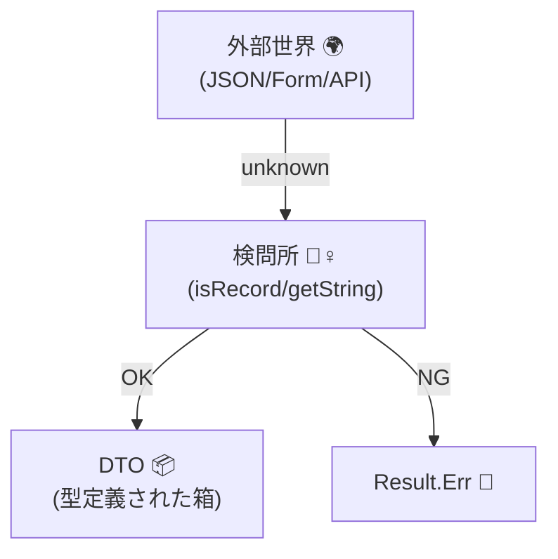

# 第17章：境界の設計①：外部入力はまず unknown で受ける🕵️‍♀️❓


## 0) この章のゴール🎯✨

この章が終わると、こんなことができるようになります🙂💎

* 外部入力（ユーザー入力・API・DB・外部APIなど）を **まず `unknown` で受ける** 理由が説明できる🧠✨
* `unknown → 検証 → DTO →（次章以降で）ドメイン型` の流れを、**コードで1本のルートに固定**できる🚪🛡️
* 「チェックが散って漏れる😱」を、**入口で止める設計**に変えられる✂️✨

ちなみに本日時点だと、TypeScriptの最新版は **5.9 系**として配布されています（npm/公式Downloadページ）。([TypeScript][1])
（そして 6.0→7.0 の“ネイティブ移行”も進行中です👀）([Microsoft for Developers][2])

---

## 1) そもそも「境界」ってどこ？🚧📍

**境界 = “外からデータが入ってくるところ”** です🌍➡️🏰
ここは基本、**信用しない** が正解😤✨

よくある境界たち👇

* HTTPリクエスト（body/query/headers）🌐📩
* フォーム入力・URLパラメータ🧾🔎
* `localStorage` / `sessionStorage`🗃️
* 環境変数（`process.env`）🌱
* DBから読み出した行（壊れた過去データもありえる）🗄️
* 外部APIレスポンス（欠損・型ズレ・仕様変更）📡😵‍💫

この章の合言葉はこれ👇✨

> **境界では unknown**
> **中（ドメイン）は信じる** 💎



---

## 2) `any` がダメで `unknown` がいい理由😱➡️😇


### `any`：なんでも通る（そして静かに爆発する）💥

`any` は “型チェックしない宣言” みたいなものです🙅‍♀️
だから、境界で `any` を受けると…事故が起きてもコンパイルが止めてくれません😇💣

```ts
// 😱 reqBody が any だとする
const reqBody: any = JSON.parse('{"age":"twenty"}');

// コンパイル通るのに…
const agePlusOne = reqBody.age + 1; 
// 実行時: "twenty1" とかになって地獄👻
```

### `unknown`：触る前に「確認してね」が強制される🛡️

`unknown` は **“安全な any”** って説明されることが多いです🙂
「型を絞り込む（narrowing）」をしないと、基本なにもできません✅
（TypeScript公式も “narrowing / type guard” を中心に説明しています）([TypeScript][3])

```ts
const reqBody: unknown = JSON.parse('{"age":"twenty"}');

// ❌ いきなり触れない（ここが最高にえらい）
/*
reqBody.age
Property 'age' does not exist on type 'unknown'.
*/
```

---

## 3) 境界の鉄板パターン：unknown → 検証 → DTO 🚪🔄📦


この章で作る“1本線”はこれです👇✨

**外部** 🌍
→ **境界関数（parse/validate）** 🚪🧪
→ **DTO（ただのプリミティブ型）** 📦
→（次章以降）**Value Object / ドメイン型** 💎🏰

ポイントは2つ💡

1. **境界関数の引数は必ず `unknown`**
2. **境界関数を通ったら、中はDTOとして信じる**（以後は散らさない）🛡️✨

---

## 4) “入口固定” のための境界関数の形🧰✨

この章では、初心者に優しい形として👇を採用します🙂

* `parseXxx(input: unknown): Result<DTO, ValidationError[]>`

「失敗」を例外で投げるより、**返して扱う**方が教材的に理解しやすいからです🫶
（Result型は後の章でも超使います🎯）

---

## 5) 実装例：会員登録の入力を unknown からDTOにする📩👤✨

### 5-1) まずは DTO を決める📦

DTOは “外の都合の形” なので、ここでは **string/number/boolean だけ**でOK🙂
（VOは次章以降で合流させます💎）

```ts
export type SignUpRequestDto = {
  email: string;      // ここではまだVOにしない
  displayName: string;
  age?: number;       // 任意
};
```

### 5-2) Result と ValidationError を用意🎁🧯

```ts
export type Ok<T> = { ok: true; value: T };
export type Err<E> = { ok: false; error: E };
export type Result<T, E> = Ok<T> | Err<E>;

export const ok = <T>(value: T): Ok<T> => ({ ok: true, value });
export const err = <E>(error: E): Err<E> => ({ ok: false, error });

export type ValidationError = {
  path: string;       // どこが
  message: string;    // なぜ
};
```

### 5-3) unknown を安全に扱う“道具”を作る🧰✨

まずは「オブジェクトっぽい？」を判定する helper を作ります🙂
（型の絞り込み＝narrowingの基本！）([TypeScript][3])

```ts
const isRecord = (v: unknown): v is Record<string, unknown> =>
  typeof v === "object" && v !== null;

const getString = (
  obj: Record<string, unknown>,
  key: string,
  errors: ValidationError[],
  path: string
): string | undefined => {
  const v = obj[key];
  if (typeof v !== "string") {
    errors.push({ path, message: "文字列で入力してね🙏" });
    return undefined;
  }
  return v;
};

const getNumberOptional = (
  obj: Record<string, unknown>,
  key: string,
  errors: ValidationError[],
  path: string
): number | undefined => {
  const v = obj[key];
  if (v === undefined) return undefined;

  if (typeof v !== "number" || Number.isNaN(v)) {
    errors.push({ path, message: "数値で入力してね🙏" });
    return undefined;
  }
  return v;
};
```

### 5-4) いよいよ境界関数：parseSignUpRequest🚪🛡️

**ここだけ**が unknown を触っていい場所です🙂✨

```ts
import { Result, ok, err, ValidationError } from "./result";
import { SignUpRequestDto } from "./dto";

export const parseSignUpRequest = (input: unknown): Result<SignUpRequestDto, ValidationError[]> => {
  const errors: ValidationError[] = [];

  if (!isRecord(input)) {
    return err([{ path: "$", message: "オブジェクト形式で送ってね🙏" }]);
  }

  // 必須
  const emailRaw = getString(input, "email", errors, "$.email");
  const displayNameRaw = getString(input, "displayName", errors, "$.displayName");

  // 任意
  const age = getNumberOptional(input, "age", errors, "$.age");

  // ここで “正規化” を少しだけ（第14章の伏線🧼✨）
  const email = emailRaw?.trim().toLowerCase();
  const displayName = displayNameRaw?.trim();

  if (email !== undefined && email.length === 0) {
    errors.push({ path: "$.email", message: "空はダメだよ🙏" });
  }
  if (displayName !== undefined && displayName.length === 0) {
    errors.push({ path: "$.displayName", message: "空はダメだよ🙏" });
  }

  if (age !== undefined && (age < 0 || age > 130)) {
    errors.push({ path: "$.age", message: "年齢っぽい数にしてね🙏" });
  }

  if (errors.length > 0) return err(errors);

  // ✅ ここまで来たら DTO を信じていい
  return ok({
    email: email!,
    displayName: displayName!,
    age,
  });
};

// --- helper（同ファイルでも別ファイルでもOK）
const isRecord = (v: unknown): v is Record<string, unknown> =>
  typeof v === "object" && v !== null;

const getString = (
  obj: Record<string, unknown>,
  key: string,
  errors: ValidationError[],
  path: string
): string | undefined => {
  const v = obj[key];
  if (typeof v !== "string") {
    errors.push({ path, message: "文字列で入力してね🙏" });
    return undefined;
  }
  return v;
};

const getNumberOptional = (
  obj: Record<string, unknown>,
  key: string,
  errors: ValidationError[],
  path: string
): number | undefined => {
  const v = obj[key];
  if (v === undefined) return undefined;

  if (typeof v !== "number" || Number.isNaN(v)) {
    errors.push({ path, message: "数値で入力してね🙏" });
    return undefined;
  }
  return v;
};
```

> ここでやってることは超シンプル🙂
> ✅ unknownを受ける → ✅ 形を確認 → ✅ DTOに変換
> この “一本線” ができるだけで、バグが一気に減ります🛡️✨

---

## 6) 入口を固定する：ハンドラ側は必ず parse を通す🚪🔒

「入口固定」っていうのはこういうこと👇🙂
ハンドラは **パースを呼ぶだけ** にして、変な if を散らさない✨

```ts
import { parseSignUpRequest } from "./parseSignUpRequest";

export const signUpHandler = (rawBody: unknown) => {
  const parsed = parseSignUpRequest(rawBody);

  if (!parsed.ok) {
    // ここが “境界”：外に返す形に変換（第24章の伏線🔄🧭）
    return {
      status: 400,
      body: {
        message: "入力にまちがいがあるよ🙏",
        details: parsed.error,
      },
    };
  }

  // ✅ ここから先は dto を信じてドメインへ
  const dto = parsed.value;

  return {
    status: 200,
    body: { message: "OK!", dto },
  };
};
```

---

## 7) よくある地雷💣（これ踏むと “境界の意味” が消える😇）

### ❌ `as Xxx` で握りつぶす

```ts
const dto = rawBody as SignUpRequestDto; // 😇（検証してない）
```

これやると、unknownの安全が全部消えます🙅‍♀️💥
**「型で黙らせる」＝「バグを未来に送る」** です📦🚚💣

### ❌ 検証が散る

* 画面側でチェック
* API側でもチェック
* DB保存前にもチェック
  …ってなると、**漏れ**が出ます😱🌀

👉 入口（境界）で一本化しよう🚪🛡️✨

---

## 8) ここでAIを使うと強い🤖🔍✨（Copilot/Codex向け）

AIは「コード生成」より **漏れ探し** が超得意です💪😊
おすすめプロンプト👇（そのまま貼ってOK）

* 「`SignUpRequestDto` の入力で想定すべき不正パターンを20個出して（型・空・桁・境界値・悪意ある入力）」🧠
* 「`parseSignUpRequest` のバリデーション漏れをレビューして、追加すべきチェックを提案して」🔍
* 「ValidationErrorの `path` 設計を改善して、UIで表示しやすい形にして」🫶
* 「このパース関数のテスト観点（成功/失敗/境界値）を列挙して」🧪

---

## 9) ミニ課題🎯✨（やると一気に身につく！）

### 課題A：あなたの題材の境界関数を1つ作ろう🚪🛡️

1. 境界入力を1つ選ぶ（例：注文作成、コメント投稿、検索条件など）🗺️
2. DTOを作る📦
3. `parseXxx(input: unknown)` を作る🧪
4. ハンドラは必ず `parseXxx` を呼ぶようにする🔒

### 課題B：不正入力を10個作って、全部エラーになるか確認🧨🙂

* 型違い（string/number/boolean）
* 空文字
* ありえない値（年齢 -1 とか）
* 余計なフィールド（あってもOKにする？弾く？方針を決める）

---

## 10) まとめ🧠✨

* 境界は信用しない😤
* 外部入力はまず `unknown` 🕵️‍♀️
* `unknown → 検証 → DTO` の一本線で、チェック漏れを消す🚪🛡️
* “中（ドメイン）を信じられる状態” を作るのが勝ち💎

次の章（第18章）では、DTOとドメインを **もっとキレイに分離**して、変換層を気持ちよく作っていきます📦↔️🏰✨

[1]: https://www.typescriptlang.org/download/?utm_source=chatgpt.com "How to set up TypeScript"
[2]: https://devblogs.microsoft.com/typescript/progress-on-typescript-7-december-2025/?utm_source=chatgpt.com "Progress on TypeScript 7 - December 2025"
[3]: https://www.typescriptlang.org/docs/handbook/2/narrowing.html?utm_source=chatgpt.com "Documentation - Narrowing"
