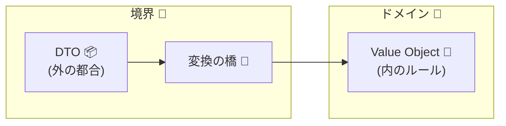

# 第18章：境界の設計②：DTOとドメインを分ける📦↔️🏰


## この章でできるようになること🎯✨

* 「外の都合（DTO）」と「中の都合（ドメイン）」を分けて考えられる🙂🧠
* 変換（マッピング）を **どこに置くと安全か** がわかる🛡️
* 「型＋境界」で不変条件を守るために、**ドメインを汚さない入口設計**ができる🚪✨
* API/画面/DBの仕様変更が来ても、**ドメインを守って改修を小さく**できる🔧🌸

---

## まずイメージ：DTOとドメインって何が違うの？🤔💡

### DTO（外側の箱）📦

* 外部とデータをやり取りするための「ただのデータ」
* たとえばHTTPのJSONの形、画面フォームの形、DBの行の形…みたいに **外部の都合**が詰まる
* もともとのDTOは「プロセス間でデータを運ぶためのオブジェクト」として説明されるよ📦🚚 ([martinfowler.com][1])

### ドメイン（城の中のルール）🏰💎

* あなたのアプリの「絶対に壊れちゃダメなルール（不変条件）」を守る世界
* `Email` はただの `string` じゃなくて、**検証済みの値**として扱いたいよね📧✅
* ドメインは「中の秩序」なので、外の揺れ（入力の欠損・命名・型のゆらぎ）を入れたくない🧼🛡️

---

## なぜ分けるの？分けないと何が起きるの？😱🌀

### 事故1：外部仕様の変更が、ドメイン全体に波及🌊💥

* APIが `snake_case` に変わった
* フロントが「空文字も送る」ようになった
* `age` が `number` じゃなく文字列 `"20"` で来た
  → こういう「外の事情」がドメインに入ると、城の中が荒れる😭🏰

### 事故2：検証が散って “どこが正しいかわからない” 迷子状態🧟‍♀️🗺️

* DTOをそのままドメインとして使うと、あちこちで `if` が増えて漏れやすい
* 「この値、検証済みだっけ？」が毎回不安になる😵‍💫

### 事故3：外に出しちゃいけない情報が漏れる🔓😱

* ドメイン内部の都合（フラグや内部ID、状態など）をそのままレスポンスに返してしまう
* 外部とのやり取りは **公開契約** だから、内部変更で壊れやすい…という話がよく出るよ🧾🧱 ([CodeOpinion][2])

---

## 重要な考え方：DTOは「外の契約」、ドメインは「内の法」📜🏰✨

DTO（リクエスト/レスポンス）は **外部向けの契約**。
ドメインは **内部のルール**。

だから間に「変換の橋」を置く🌉✨

* DTO → ドメイン（入口で検証・正規化・VO化）🚪✅
* ドメイン → DTO（外に出していい形に整形）📤🧾

ちなみに、DTOという言葉は本来「リモート呼び出しを減らすための箱」なので、ローカルで乱用すると害になるよ〜という指摘もあるよ⚠️ ([martinfowler.com][3])
でも現代のAPI開発だと、「レスポンスの形＝契約を固定する箱」って意味でDTOと呼ぶことが多い、って理解でOK🙂📦



---

## どこに置く？おすすめ配置（超大事）📍🧭

結論：**境界（アダプタ/コントローラ層）に置く**のが安全🛡️

* “外” の型（DTO）を “内” の型（ドメイン）に変えるのが境界の役目だからね🚪✨
* DTOとドメインを直結させない（依存をねじらない）って話もよく語られるよ🧶🧠 ([Stack Overflow][4])

---

## 例題：会員登録（Register）でやってみよ〜🌸📧

### やりたいこと（超シンプル）🙂

* 外から `email` と `displayName` が来る
* `Email` はルールに合わないとドメインに入れない（不変条件）🛡️
* 成功したら `id` と `email` を返す（レスポンス契約）📤✨

---

## DTO設計のコツ📦✨（外側は外側らしく！）

✅ DTOは基本「プリミティブ中心」

* `string / number / boolean / null / array / object` で表現
* ルールは “最低限” だけ（本格的なスキーマ検証は次章で強化するよ）📐✨

✅ DTOは「ゆらぐ」前提でOK

* `unknown` や `string | undefined` を受けるのが現実的😅
* “ドメインに入る瞬間” にだけ厳密にする💎

---

## ドメイン設計のコツ🏰💎（中は中らしく！）

✅ ドメインは「検証済み・意味付きの型」で持つ

* `Email`（VO）
* `UserId`（ブランド型/Opaque風）
* `User`（エンティティ）

✅ ドメインは「外部の形」を知らない

* `req.body` とか `snake_case` とか知らない🙅‍♀️
* それを知っていいのは境界だけ🚪✨

---

## 実装サンプル（DTO↔️ドメインの橋を作る）🌉✨

### 1) DTO（外側）📦

```ts
// src/adapters/http/dto/registerUser.dto.ts
export type RegisterUserRequestDto = {
  email: unknown;        // 外部入力は信用しないので unknown から！
  displayName: unknown;
};

export type RegisterUserResponseDto = {
  id: string;
  email: string;
  displayName: string;
};
```

### 2) ドメイン（内側）🏰💎

```ts
// src/domain/valueObjects/Email.ts
export type Email = string & { readonly __brand: "Email" };

type EmailError =
  | { type: "EMPTY" }
  | { type: "INVALID_FORMAT" };

export type Result<T, E> =
  | { ok: true; value: T }
  | { ok: false; error: E };

export function createEmail(input: string): Result<Email, EmailError> {
  const v = input.trim().toLowerCase();

  if (v.length === 0) return { ok: false, error: { type: "EMPTY" } };

  // 雑に見えるけど、ここでは「VOに入る入口」を表現するのが主目的✨
  // 形式検証は次章以降で強化してOK🙂
  const basic = /^[^\s@]+@[^\s@]+\.[^\s@]+$/.test(v);
  if (!basic) return { ok: false, error: { type: "INVALID_FORMAT" } };

  return { ok: true, value: v as Email };
}
```

```ts
// src/domain/User.ts
import { Email } from "./valueObjects/Email";

export type UserId = string & { readonly __brand: "UserId" };

export type User = Readonly<{
  id: UserId;
  email: Email;
  displayName: string;
}>;

export function createUser(params: {
  id: UserId;
  email: Email;
  displayName: string;
}): User {
  // ここでは displayName のルールをまだ薄めにしてるけど、
  // ルールがあるならここで「必ず守る」💎
  return Object.freeze({
    id: params.id,
    email: params.email,
    displayName: params.displayName.trim(),
  });
}
```

### 3) 変換（境界）🌉🚪

```ts
// src/adapters/http/mappers/registerUser.mapper.ts
import { RegisterUserRequestDto, RegisterUserResponseDto } from "../dto/registerUser.dto";
import { createEmail, Result } from "../../../domain/valueObjects/Email";
import { createUser, User, UserId } from "../../../domain/User";

type BadRequest =
  | { type: "INVALID_EMAIL"; message: string }
  | { type: "INVALID_DISPLAY_NAME"; message: string };

function isString(x: unknown): x is string {
  return typeof x === "string";
}

export function toDomain(dto: RegisterUserRequestDto): Result<{ email: string; displayName: string }, BadRequest> {
  if (!isString(dto.email)) {
    return { ok: false, error: { type: "INVALID_EMAIL", message: "メールアドレスが文字列じゃないよ🥺📧" } };
  }
  if (!isString(dto.displayName)) {
    return { ok: false, error: { type: "INVALID_DISPLAY_NAME", message: "表示名が文字列じゃないよ🥺🪪" } };
  }

  // 次章以降は「スキーマ」でここをもっと綺麗にできるよ✨
  return { ok: true, value: { email: dto.email, displayName: dto.displayName } };
}

export function buildUser(input: { email: string; displayName: string }, genId: () => string): Result<User, BadRequest> {
  const emailR = createEmail(input.email);
  if (!emailR.ok) {
    const msg =
      emailR.error.type === "EMPTY"
        ? "メールアドレスが空だよ🥺📧"
        : "メール形式がちがうっぽい🥺📧";
    return { ok: false, error: { type: "INVALID_EMAIL", message: msg } };
  }

  const name = input.displayName.trim();
  if (name.length === 0) {
    return { ok: false, error: { type: "INVALID_DISPLAY_NAME", message: "表示名が空だよ🥺🪪" } };
  }

  const id = genId() as UserId;
  return { ok: true, value: createUser({ id, email: emailR.value, displayName: name }) };
}

export function toResponse(user: User): RegisterUserResponseDto {
  return {
    id: user.id,
    email: user.email,
    displayName: user.displayName,
  };
}
```

> ここがポイントだよ〜！👉✨
>
> * DTOは **unknownを許す**（外は信用しない）🕵️‍♀️
> * ドメインに入る直前で **VO化して保証**💎
> * レスポンスは **外部契約の形に整える**📤🧾

---

## ミニ構成（フォルダの分け方）📁✨

* `src/domain/**`：城の中🏰（不変条件）
* `src/app/**`：ユースケース（登録する、更新する等）🎮
* `src/adapters/http/**`：境界🚪（DTO、変換、コントローラ）
* `src/shared/**`：Result型など共通🔧

こうすると「外の変更」が来ても `adapters` だけ直せば済むことが増えるよ🥰🛠️

---

## ちょい最新トピック：TypeScript側の“今”も軽く把握📰✨

* TypeScriptのリリースノートは **5.9** が公開されていて、ページ更新が **2026-01-19** になってるよ🗓️✨ ([TypeScript][5])
* それとは別に、コンパイラをネイティブ化する **TypeScript 7** プレビューの話も出てる（ビルドが速くなる系）🚀✨ ([Microsoft Developer][6])

この章の内容（DTOとドメインを分ける）は、TypeScriptのバージョンが進んでもずっと効く設計だよ💪💎

---

## よくある落とし穴と回避策🧨➡️🛡️

### 落とし穴A：DTOをドメインにそのまま流し込む🧟‍♀️

**回避**：`toDomain()`（入口変換）を必ず通す🚪✅

### 落とし穴B：ドメイン型をそのままレスポンスに返す📤😱

**回避**：`toResponse()` を作って、返す形を固定🧾🧱（外部契約は守る） ([CodeOpinion][2])

### 落とし穴C：DTOの種類を増やしすぎて「マッピング地獄」🌀

**回避**：

* “同じ形のDTOが層ごとに1:1で増殖” は要注意⚠️
* 本当に「外部契約」や「境界の都合」があるところにだけDTOを置く💡 ([CodeOpinion][2])

---

## ミニ課題（この章のゴール練習）📝✨

### 課題1：Request DTO / Response DTO を作る📦

* `RegisterUserRequestDto`（unknownで受ける）
* `RegisterUserResponseDto`（返す形を固定）

### 課題2：変換関数を3つ作る🌉

* `toDomain(dto)`：unknown → stringへ（最低条件）
* `buildUser(input)`：VO化してドメイン生成（不変条件）
* `toResponse(user)`：外に出す形へ整形

### 課題3：エラー文言を“人に優しく”する🫶🥺

* 「INVALID_EMAIL」だけじゃなく

  * 何がダメ？
  * どう直す？
    が伝わる文章にする✨

---

## AIの使いどころ（この章はここが強い！）🤖✨

### 1) “境界で漏れがちな入力” を洗い出す🔍

* 「displayName が空文字、スペースだけ、絵文字だけ…みたいなパターンを20個出して」🧠✨

### 2) “ドメインに入れちゃダメな情報” を指摘させる🚫

* 「このレスポンス設計で内部情報が漏れる可能性ある？」🔒👀

### 3) “マッピングの責務” をレビューさせる🧹

* 「この mapper にドメインルールが入りすぎてない？整理案を出して」🧺✨

---

## まとめ（ここだけ覚えれば勝ち🏆✨）

* DTO＝外の契約📦🧾（揺れる、変わる）
* ドメイン＝内の法🏰💎（不変条件を守る）
* だから **境界に変換（橋）を置く**🌉🚪
* DTO→ドメインで **検証・VO化**、ドメイン→DTOで **公開契約に整形**📤✨

---

## 次章へのつながり🔜📐

次は「スキーマ（実行時バリデーション）」で、`unknown` をもっとキレイに安全に変換できるようにするよ〜！🎉✨
この章で作った `toDomain()` が、次章でめちゃ進化する感じ🙂🚀

[1]: https://martinfowler.com/eaaCatalog/dataTransferObject.html?utm_source=chatgpt.com "Data Transfer Object"
[2]: https://codeopinion.com/dtos-mapping-the-good-the-bad-and-the-excessive/?utm_source=chatgpt.com "DTOs & Mapping : The Good, The Bad, And The Excessive"
[3]: https://martinfowler.com/bliki/LocalDTO.html?utm_source=chatgpt.com "Local D T O"
[4]: https://stackoverflow.com/questions/678217/best-practices-for-mapping-dto-to-domain-object?utm_source=chatgpt.com "Best Practices For Mapping DTO to Domain Object?"
[5]: https://www.typescriptlang.org/docs/handbook/release-notes/typescript-5-9.html?utm_source=chatgpt.com "Documentation - TypeScript 5.9"
[6]: https://developer.microsoft.com/blog/typescript-7-native-preview-in-visual-studio-2026?utm_source=chatgpt.com "TypeScript 7 native preview in Visual Studio 2026"
