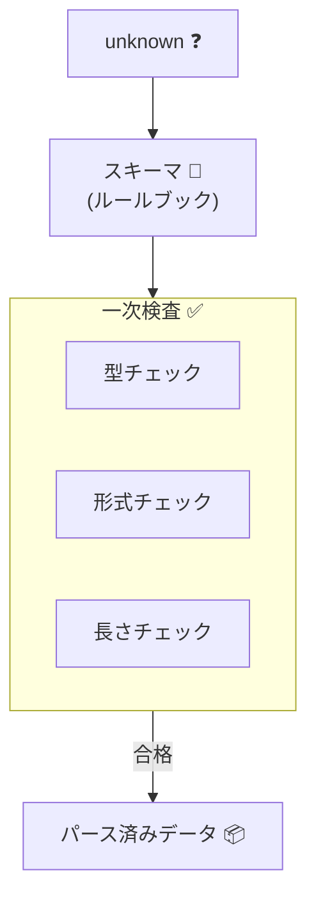

# 第19章：実行時バリデーション入門①：スキーマの役割📐✅


この章は「**外部入力（=信用できない）を、ちゃんと中に入れられる形にする**」ための超重要パートだよ〜！🚪🛡️✨
TypeScriptはコンパイル時の型チェックが得意だけど、**実行時に来るデータ**（APIリクエスト・フォーム・DB・外部API）は型なんて付いてないので、**入口でスキーマ検証**が必要になるよ🙂

---

## 1) 今日のゴール🎯✨

この章が終わると、こんなことができるようになるよ👇

* 「スキーマって何のため？」を説明できる📐🙂
* **unknown入力**を、**スキーマで最低条件チェック**してから扱える🚪✅
* エラーを「まとめて」「分かりやすく」返す形を作れる🫶🧯
* “スキーマで守れること / 守れないこと” を分けられる🧠✨

---

## 2) スキーマってなに？超ざっくり言うと📐

**スキーマ = データの「入場条件」を書いたルールブック**📘✨
「この形じゃないと入れません🙅‍♀️」を入口で判定する感じ！

たとえば会員登録なら👇

* email は文字列で、メール形式📩
* password は文字列で、8文字以上🔐
* plan は "Free" か "Pro" だけ🎫
* 余計なキー（知らない項目）は拒否したい🧹

こういう「**形・型・範囲・必須/任意**」をまず保証するのがスキーマの役割だよ🙂

---

## 3) スキーマが守るのは「最低限の安全」🛡️✨（超大事）

スキーマが得意なのは主にこれ👇

### ✅ スキーマが得意

* 必須チェック（ないとダメ）🧱
* 型チェック（string/number/boolean/array/object）🔎
* 範囲チェック（min/max/lengthなど）📏
* 形式チェック（email/uuid/date文字列など）🧾
* 配列の要素型チェック（stringの配列、など）📦
* “余計なキー” の拒否（strict）🧹

### ❌ スキーマが苦手 or 役割じゃない

* **ドメイン固有の不変条件**（例：誕生日から年齢計算して「18歳以上」など）🎂
* **複数フィールドにまたがるルール**（例：start < end、割引の整合性）🧩
* **DB参照が必要**（例：メール重複、在庫確認）🗄️
* **“意味のある値”の保証**（例：Money/Quantity/EmailみたいなVO化💎）

👉 つまり、スキーマは「入口の一次検査」ってイメージがちょうどいいよ🙂✨
（次の章以降で、スキーマ→VO→ドメインの連携が山場になるよ🏔️🔗）



---

## 4) 2026時点の定番：どのバリデータ使う？🤔✨

代表的なのはこんな感じ👇（用途で選べばOK！）

* **Zod**：TypeScript-firstで人気。スキーマ定義→検証がシンプル📐✨　([Zod][1])
* **Valibot**：モジュラー志向で軽量さも意識されたスキーマライブラリ🧩✨　([valibot.dev][2])
* **Ajv（JSON Schema）**：JSON Schemaで高速に検証、仕様・ツール連携が強い⚡📜　([ajv.js.org][3])

あと最近は、**Standard Schema**っていう「バリデータ共通インターフェース仕様」も出てきてて、ツール側が複数ライブラリ対応しやすくなってきてるよ🧠✨　([Standard Schema][4])

この章のサンプルは、分かりやすさ重視で **Zod（v4系）** を使うね（Zod 4は安定版になってるよ）🙂✨　([Zod][5])

---

## 5) ハンズオン：会員登録の「入口スキーマ」を作ろう🚪📐✨

題材：`POST /signup` のリクエストボディがこう来る想定👇

* email: string（メール形式）
* password: string（8文字以上）
* plan: "Free" | "Pro"
* marketingOptIn: boolean（任意）

### 5-1) まずはスキーマを書く📐✨

```ts
import { z } from "zod";

export const SignupSchema = z
  .object({
    email: z.string().email("メール形式じゃないかも🥺"),
    password: z.string().min(8, "パスワードは8文字以上にしてね🔐"),
    plan: z.enum(["Free", "Pro"]),
    marketingOptIn: z.boolean().optional(),
  })
  .strict(); // 👈 余計なキーを拒否（掃除大事🧹）
```

ポイント👇

* `.email()` みたいな「形式チェック」便利📩
* `.min(8)` で長さ📏
* `z.enum([...])` で選択肢固定🎫
* `.strict()` で「知らない項目」を弾く🧹（地味に事故防止すごい）

---

### 5-2) unknown入力を受けて、safeParseで検証する🕵️‍♀️✅

「外から来るやつは信用しない」ので、まず `unknown` として扱うのが安全🙂

```ts
import { SignupSchema } from "./schemas/signup";

export function validateSignup(input: unknown) {
  const result = SignupSchema.safeParse(input); // 例外を投げない版✨

  if (!result.success) {
    return {
      ok: false as const,
      // 👇 とりあえず“人間に見せやすい形”に整形
      error: result.error,
    };
  }

  return {
    ok: true as const,
    data: result.data,
  };
}
```

`parse()` は失敗時に例外を投げるけど、API入口では **safeParse** が扱いやすいこと多いよ🙂
（Zodの `parse` / `safeParse` は基本機能として紹介されてるよ）([Zod][1])

---

## 6) エラーを「まとめて返す」🫶🧯✨（ここが優しさ！）

ユーザーに返すとき、エラーを1個ずつチマチマ返すより、**まとめて返す**ほうが親切だよね🙂✨

Zodには「エラー整形」も用意されてるよ👇
`flattenError` を使うと、フォーム向けに扱いやすい形になる🧁✨　([Zod][6])

```ts
import { z } from "zod";
import { SignupSchema } from "./schemas/signup";

export function validateSignupForApi(input: unknown) {
  const result = SignupSchema.safeParse(input);

  if (!result.success) {
    const flattened = z.flattenError(result.error);

    return {
      ok: false as const,
      message: "入力にまちがいがあるよ〜🥺",
      // formErrors: 全体に関わるエラー（余計キーとか）
      formErrors: flattened.formErrors,
      // fieldErrors: 各フィールドのエラー配列
      fieldErrors: flattened.fieldErrors,
    };
  }

  return { ok: true as const, data: result.data };
}
```

返却イメージ（例）👇

* formErrors: `["Unrecognized key: \"extraKey\""]`
* fieldErrors: `{ email: ["メール形式じゃないかも🥺"], password: ["8文字以上…"] }`

「どこがダメ？」が一発で分かって優しい〜🫶✨

---

## 7) スキーマは「入口の契約書」📜✨（チームでも未来の自分でも助かる）

スキーマをちゃんと持つと、メリットがめちゃ多い👇

* **入口が1箇所にまとまる**（チェックが散らばらない）🧹✨
* バリデーションが仕様として読める📜👀
* テストが超書きやすい🧪
* “余計なキー” を弾けて、想定外入力を減らせる🧯
* しかもZodは「スキーマ = 契約」みたいに考えやすいよ🙂　([danywalls.com][7])

---

## 8) ミニ課題：自分の題材の「最低条件スキーマ」作ってみよ🧱✨

あなたの題材（アプリ/機能）で、次を満たすスキーマを作ってね🙂

### ✅ お題

1. 必須3つ以上（例：name/email/password）
2. min/max どっちかを入れる（長さ or 数値範囲）📏
3. enum（選択肢固定）を1つ入れる🎫
4. `.strict()` を付ける🧹
5. safeParseで検証 → flattenしてエラー返却🫶

「できたら勝ち」だよ〜🎉✨

---

## 9) AI活用（この章向け）🤖✨

スキーマ設計は、AIに“観点出し”させるのが超強い💪🙂

コピペ用プロンプト例👇

* 「この入力の**バリデーション観点**を20個出して（必須/範囲/形式/余計キー/境界値）」🧠
* 「ユーザーに優しい**エラーメッセージ案**を日本語で10個出して🫶」
* 「このスキーマで**漏れやすい項目**を指摘して🔍」
* 「不正入力の**テストケース（成功/失敗/境界値）**を列挙して🧪✨」

ただし！生成されたスキーマは、**“不変条件が守られてる？”視点で必ず目視レビュー**してね👀✨

---

## 10) まとめ：第19章で覚える合言葉🪄✨

* スキーマは「入口の一次検査」🚪✅
* unknown入力はまずスキーマに通す🕵️‍♀️
* エラーはまとめて返すと優しい🫶🧯
* スキーマで守れないルールは、次でVOやドメインで守る💎

---

次の第20章では、「検証したら型が付く」あの気持ちよさ😌✨（スキーマ→型推論）をガッツリ体験していくよ〜！🎉

[1]: https://zod.dev/?utm_source=chatgpt.com "Zod: Intro"
[2]: https://valibot.dev/?utm_source=chatgpt.com "Valibot: The modular and type safe schema library"
[3]: https://ajv.js.org/?utm_source=chatgpt.com "Ajv JSON schema validator"
[4]: https://standardschema.dev/?utm_source=chatgpt.com "Standard Schema"
[5]: https://zod.dev/v4?utm_source=chatgpt.com "Release notes"
[6]: https://zod.dev/error-formatting?utm_source=chatgpt.com "Formatting errors"
[7]: https://danywalls.com/stop-duplicate-logic-nextjs-zod?utm_source=chatgpt.com "Stop Duplicating Validation Logic in Next.js with Zod"
