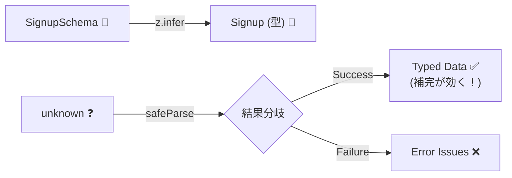

# 第20章：実行時バリデーション入門②：スキーマ→型推論の気持ちよさ😌✨


この章はね、「検証できたら、その瞬間に“型が付く”」っていう超おいしい体験をする回だよ〜🎉
いまの最新だと **TypeScript は 5.9.3 が Latest**（GitHub Releases）で、**Zod は “Zod 4 が stable”** って公式ドキュメントに出てるよ🆕✨ ([GitHub][1])

---

## 1) この章のゴール🎯✨

* `unknown` で来た入力を、**スキーマで検証 → 型が付いた値**に変える流れがわかる🛡️✨
* “型定義を二重に書かない” 感覚がつかめる（スキーマが真実）💎
* `safeParse` / `parse` の使い分けができるようになる🙂

---

## 2) まず結論：スキーマが「型の親」になると何が嬉しいの？😍


### ✅ ありがちな地獄（よくある😇）

* `type Signup = ...` を別に書く
* でもバリデーションは手書き if 文
* いつの間にかズレて、**「型はOKなのに実行時で死ぬ」** or **「実行時はOKなのに型が古い」**が発生😱

### ✅ 最高の世界（これが第20章✨）

* **スキーマを書く**
* **検証したら、その結果が型付きで返ってくる**
* 型は `infer` で自動生成（＝二重管理しない）🎉



---

## 3) 体験しよう：Zod で「検証したら型が付く」🎮✨

Zod の基本はこれ👇

* `.parse()`：成功なら **型付きデータ**を返す（失敗は例外） ([Zod][2])
* `.safeParse()`：成功/失敗を **判別できる結果**で返す（try/catch不要） ([Zod][2])

### 3.1 サンプル：unknown → safeParse → 型がつく🎉


```ts
import * as z from "zod";

// ① スキーマ（= 実行時に検証できるルール）
const SignupSchema = z.object({
  email: z.string().email(),
  password: z.string().min(8),
  age: z.number().int().min(18).optional(),
});

// ② スキーマから型を自動生成（= 二重管理しない✨）
type Signup = z.infer<typeof SignupSchema>;

// ③ 外から来るものは unknown（信用しない😤）
function parseSignup(input: unknown): Signup | null {
  const result = SignupSchema.safeParse(input);

  if (!result.success) {
    // 失敗：エラー情報がある（この章では「扱える」だけでOK）
    console.log(result.error.issues);
    return null;
  }

  // 成功：ここから先は result.data が Signup 型になる🎉
  const data = result.data;

  // 例：補完が効く💖 email, password, age が出る
  console.log(data.email.toLowerCase());

  return data;
}
```

ここが気持ちいいポイント😍
`result.success === true` の中に入った瞬間、`result.data` が **ちゃんと型付き**になるの！
Zod公式でも、`safeParse` の結果は分岐しやすい形（discriminated union）だよって説明してるよ🛡️✨ ([Zod][2])

---

## 4) 「型が付いた」ことを、わざと確かめる遊び😆🧪


VS Codeで次を試してみてね👇（エディタが怒ってくれるのが快感⚡）

```ts
const ok = parseSignup({ email: "a@b.com", password: "password123" });

if (ok) {
  ok.email.toUpperCase(); // ✅ できる（string）
  // ok.email = 123;      // ❌ ここで型エラー（気持ちいい）
  // ok.notExists;        // ❌ 存在しないプロパティも怒られる
}
```

この「怒られ方」が、**不変条件を“型”で守れてる感**につながるよ💎✨

---

## 5) もう1個の例：Valibot だと “InferOutput” が主役😌✨


Valibot は「スキーマから型推論して、unknown を parse して返す」って思想を **公式がハッキリ書いてる**よ🧠✨ ([valibot.dev][3])

```ts
import * as v from "valibot";

const LoginSchema = v.object({
  email: v.pipe(v.string(), v.email()),
  password: v.pipe(v.string(), v.minLength(8)),
});

// スキーマ → 出力型（これがだいたい欲しい型）
type LoginData = v.InferOutput<typeof LoginSchema>;

function getLoginData(input: unknown): LoginData {
  // parse は unknown を検証して、型付きで返す✨
  return v.parse(LoginSchema, input);
}
```

Valibot には `InferInput` と `InferOutput` があって、**変換（transform）や default があると output 側が変わる**、って公式で説明されてるよ📌 ([valibot.dev][4])

---

## 6) “parse と safeParse” 使い分けのコツ🔁✨


### ✅ 境界（API/フォーム入力など）では…

* まずは `safeParse` が扱いやすい🫶
  失敗時に「エラーを集めて返す」設計にしやすいからね🙂 ([Zod][2])

### ✅ 「失敗したらプログラム止めてOK」な場所では…

* `parse` でもOK（ただし例外になる） ([Zod][2])

---

## 7) よくある落とし穴⚠️😵‍💫（ここだけ注意！）

* `any` で受ける → せっかくの型推論が死ぬ😇
  **入口は unknown** が基本だよ（第17章の方針とセット）🕵️‍♀️❓
* “型推論できる＝実行時も安全” ではない
  **安全になるのは「スキーマで検証した後」だけ**だよ🛡️✨
* transform / default を使うと「入力型」と「出力型」がズレることがある
  そのときは **output 側（InferOutput）** を信じるのがコツ🙂 ([valibot.dev][4])

---

## 8) ミニ課題📝✨（第20章のゴール確認）

### 課題A：型が付く一本道を作る🧵💎

1. `ProfileUpdateSchema` を作る（例：`displayName`、`bio?`、`twitterUrl?`）
2. `safeParse` して、成功なら `result.data` を返す
3. `type ProfileUpdate = z.infer<typeof ProfileUpdateSchema>` を作って、返り値に使う

### 課題B：VS Codeに怒らせる⚡😆

* 成功後の `data.displayName = 123` を書いてみる（怒られたら勝ち🎉）

---

## 9) AI活用テンプレ🤖✨（この章と相性バツグン）

* 「このスキーマを破る入力例を20個出して」🧠💥
* 「ユーザー向けに優しいエラー文言案を出して」🫶✍️
* 「optional/nullable/default の設計ミスりやすい点を列挙して」📌🔍
* 「この safeParse の分岐で漏れが出るパターンある？」🧯👀

---

次の第21章で、いよいよ **「スキーマOK でも ドメインOK とは限らない」**をつなげて、`値オブジェクト生成`まで一本線にするよ🏔️🔗✨

[1]: https://github.com/microsoft/typescript/releases "Releases · microsoft/TypeScript · GitHub"
[2]: https://zod.dev/basics "Basic usage | Zod"
[3]: https://valibot.dev/guides/quick-start/ "Quick start | Valibot"
[4]: https://valibot.dev/guides/infer-types/ "Infer types | Valibot"
