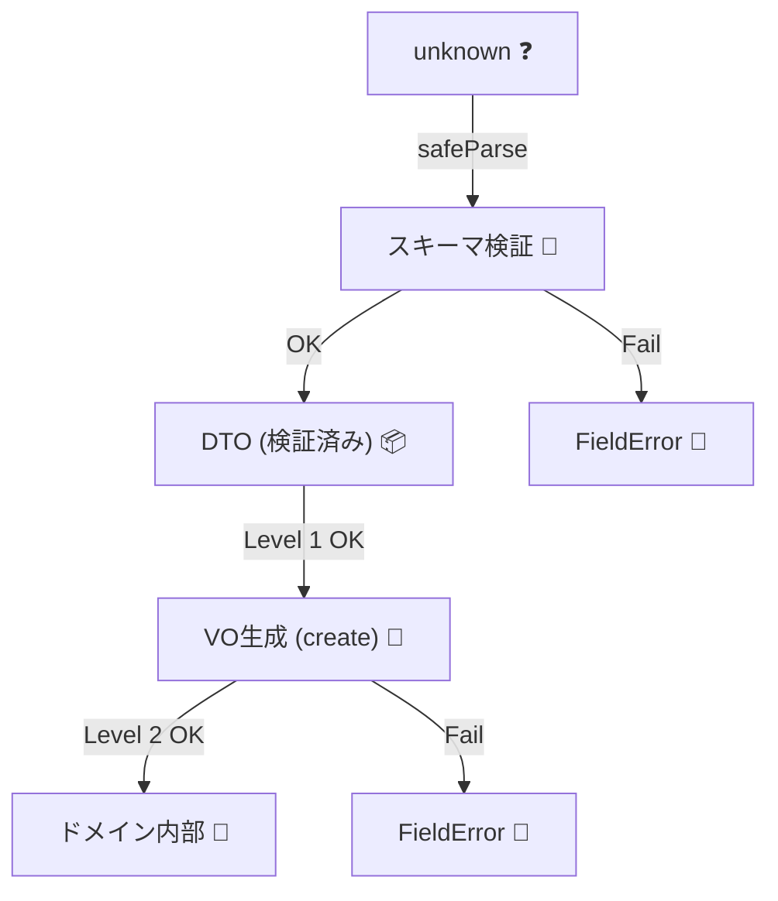

# 第21章：接続が山場：スキーマ→値オブジェクト生成の流れ🏔️🔗


この章はね、**「境界でスキーマ検証した結果」から「ドメインの値オブジェクト（VO）」へ安全に“つなぐ”**ところをやるよ〜！🥰✨
ここができると、**入力→検証→VO→ドメイン**が一本線になって、バグがめっちゃ減るよ🛡️💎

---

## 1) まず大事な事実：「スキーマOK」≠「ドメインOK」😅⚠️


スキーマ（Zod/Valibotとか）は主に **“形（structure）”** を守るのが得意！✅
でもドメイン（業務ルール）は **“意味（semantics）”** が山ほどあるよね〜😵‍💫

たとえば👇

* スキーマ: `email` は `string` で、`@` が入ってる ✅
* ドメイン:

  * 前後スペースは許さない🧼
  * 小文字に正規化する🔤
  * 最大長がある📏
  * 「このサービスでは社内ドメインだけOK」などの業務ルール🏢
  * …などなど💥

なので方針はこれ！👇

> **スキーマ＝入力の最低条件**
> **VO＝ドメインの絶対条件（不変条件）**
> **境界で両方やって、ドメイン内は信じる**🛡️✨

---

## 2) 今日時点の定番ライブラリ感（情報アップデート🆕🤖）

* **TypeScript** は npm 上だと `5.9.3` が最新として掲載（2026/01時点の確認） ([NPM][1])
* **Zod** は npm 上だと `4.3.5` が最新として掲載（2026/01時点） ([NPM][2])
* **Zod 4** は「stable」になって、性能/体験の改善が明記されてるよ ([Zod][3])
* **Valibot** も npm 上で継続更新されてて、最新 `1.2.0` 表示（2026/01時点） ([NPM][4])

この章では、例は **Zod** をメインにするね（型推論＋実行時検証の流れが分かりやすい☺️） ([Zod][5])
（最後に Valibot の置き換えイメージも軽く出すよ🫶）

---

## 3) ゴールの完成形（一本線🧵✨）

やりたいのはこの“パイプ”👇

```text
unknown入力
   ↓
スキーマで「形」を検証（safeParse）
   ↓
DTO（検証済みプリミティブ）
   ↓
VOで「意味」を検証＆正規化（create/parse）
   ↓
ドメインコマンド / ドメインモデル
   ↓
ユースケース実行
```



ポイントは2つ！💡

1. **スキーマのエラー**と**VOのエラー**を、同じ形式で返せると最高😍
2. **ドメインはスキーマに依存しない**（境界側に閉じ込める）🏰🚧

---

## 4) 例題：会員登録の「入力→VO→コマンド」📝✨

### 4-1) 入力（外から来るもの）

* `email`
* `password`
* `displayName`
* `plan`（"Free" | "Pro"）

---

## 5) 実装：最小構成でいくよ〜💻✨

### 5-1) Result型（失敗を集めやすくする📦）

```ts
// src/shared/result.ts
export type Ok<T> = { ok: true; value: T };
export type Err<E> = { ok: false; error: E };
export type Result<T, E> = Ok<T> | Err<E>;

export const ok = <T>(value: T): Ok<T> => ({ ok: true, value });
export const err = <E>(error: E): Err<E> => ({ ok: false, error });
```

### 5-2) 返すエラーの形を統一（UIが嬉しい🫶）

```ts
// src/shared/fieldError.ts
export type FieldError = {
  path: string[];     // ["email"] とか ["user","email"] とか
  message: string;    // ユーザー向けメッセージ
  code: string;       // "invalid_email" みたいな識別子
};
```

---

## 6) スキーマ（Zod）で「形」を守る📐✅

```ts
// src/boundary/register/registerSchema.ts
import * as z from "zod";

export const RegisterDtoSchema = z.object({
  email: z.string().trim().min(1, "メールは必須だよ📩").max(254),
  password: z.string().min(8, "パスワード短いよ〜🔑").max(72),
  displayName: z.string().trim().min(1, "名前入れてね🙂").max(30),
  plan: z.union([z.literal("Free"), z.literal("Pro")]),
});

export type RegisterDto = z.infer<typeof RegisterDtoSchema>;
```

Zodは「検証したら型が付く」体験が得意だよね〜🎉 ([Zod][5])

---

## 7) VO（値オブジェクト）で「意味」を守る💎🛡️

### 7-1) Email VO（正規化＋不変条件）

```ts
// src/domain/email.ts
import { Result, ok, err } from "../shared/result";
import { FieldError } from "../shared/fieldError";

const EMAIL_MAX = 254;

// ※完璧なメールRFCチェックは難しいので、ここは「最低限＋運用で補う」想定にしてるよ🙂
// （厳密にしすぎると“正しいメール”を弾いちゃうこともあるの…😢）
const SIMPLE_EMAIL_REGEX = /^[^\s@]+@[^\s@]+\.[^\s@]+$/;

export class Email {
  private constructor(public readonly value: string) {}

  static create(raw: string, path: string[] = ["email"]): Result<Email, FieldError> {
    const normalized = raw.trim().toLowerCase();

    if (normalized.length === 0) {
      return err({ path, code: "email_required", message: "メールは必須だよ📩" });
    }
    if (normalized.length > EMAIL_MAX) {
      return err({ path, code: "email_too_long", message: "メールが長すぎるよ📏" });
    }
    if (!SIMPLE_EMAIL_REGEX.test(normalized)) {
      return err({ path, code: "invalid_email", message: "メールの形が変かも…🤔" });
    }

    return ok(new Email(normalized));
  }
}
```

### 7-2) Password VO（ドメイン側のルールはここ！🔒）

```ts
// src/domain/password.ts
import { Result, ok, err } from "../shared/result";
import { FieldError } from "../shared/fieldError";

export class Password {
  private constructor(public readonly value: string) {}

  static create(raw: string, path: string[] = ["password"]): Result<Password, FieldError> {
    // 正規化は「やりすぎ注意」：パスワードは勝手に変形しないほうが安全なこと多いよ🙂
    if (raw.length < 12) {
      return err({ path, code: "password_too_short", message: "パスワードは12文字以上が安心だよ🔐" });
    }
    if (raw.length > 72) {
      return err({ path, code: "password_too_long", message: "パスワード長すぎるよ〜😵" });
    }
    if (/\s/.test(raw)) {
      return err({ path, code: "password_has_space", message: "空白は入れないでね🙅‍♀️" });
    }
    // 例：最低限の強度（好みで調整OK）
    if (!/[a-zA-Z]/.test(raw) || !/[0-9]/.test(raw)) {
      return err({ path, code: "password_weak", message: "英字と数字を混ぜると強いよ💪" });
    }

    return ok(new Password(raw));
  }
}
```

### 7-3) DisplayName VO

```ts
// src/domain/displayName.ts
import { Result, ok, err } from "../shared/result";
import { FieldError } from "../shared/fieldError";

export class DisplayName {
  private constructor(public readonly value: string) {}

  static create(raw: string, path: string[] = ["displayName"]): Result<DisplayName, FieldError> {
    const normalized = raw.trim();

    if (normalized.length === 0) {
      return err({ path, code: "name_required", message: "表示名は必須だよ🙂" });
    }
    if (normalized.length > 30) {
      return err({ path, code: "name_too_long", message: "表示名は30文字までだよ📏" });
    }
    // 制御文字とかは弾く（最低限）
    if (/[\u0000-\u001F\u007F]/.test(normalized)) {
      return err({ path, code: "name_invalid_chars", message: "使えない文字が混ざってるかも…😅" });
    }

    return ok(new DisplayName(normalized));
  }
}
```

---

## 8) つなぐ関数：DTO → ドメインコマンド🏗️✨

「VO作成の失敗を集める」ための小道具を作るよ🧰

```ts
// src/shared/collect.ts
import { Result, ok, err } from "./result";

export function collect<T, E>(results: Result<T, E>[]): Result<T[], E[]> {
  const values: T[] = [];
  const errors: E[] = [];

  for (const r of results) {
    if (r.ok) values.push(r.value);
    else errors.push(r.error);
  }

  return errors.length > 0 ? err(errors) : ok(values);
}
```

次に、登録コマンドを作る👇

```ts
// src/domain/registerUserCommand.ts
import { Email } from "./email";
import { Password } from "./password";
import { DisplayName } from "./displayName";

export type Plan = "Free" | "Pro";

export type RegisterUserCommand = {
  email: Email;
  password: Password;
  displayName: DisplayName;
  plan: Plan;
};
```

DTOから変換する“接続部”がここ！🏔️🔗

```ts
// src/boundary/register/toDomain.ts
import { RegisterDto } from "./registerSchema";
import { Result, ok, err } from "../../shared/result";
import { FieldError } from "../../shared/fieldError";
import { Email } from "../../domain/email";
import { Password } from "../../domain/password";
import { DisplayName } from "../../domain/displayName";
import { RegisterUserCommand } from "../../domain/registerUserCommand";

export function toRegisterUserCommand(dto: RegisterDto): Result<RegisterUserCommand, FieldError[]> {
  const emailR = Email.create(dto.email, ["email"]);
  const passwordR = Password.create(dto.password, ["password"]);
  const nameR = DisplayName.create(dto.displayName, ["displayName"]);

  const errors: FieldError[] = [];
  if (!emailR.ok) errors.push(emailR.error);
  if (!passwordR.ok) errors.push(passwordR.error);
  if (!nameR.ok) errors.push(nameR.error);

  // 例：フィールド横断のルールもここで足せるよ✨
  // 「passwordにemailを含めない」とか（ここでは超ざっくり例）
  if (emailR.ok && passwordR.ok) {
    const localPart = emailR.value.value.split("@")[0];
    if (localPart && dto.password.toLowerCase().includes(localPart.toLowerCase())) {
      errors.push({
        path: ["password"],
        code: "password_contains_email",
        message: "パスワードにメールっぽい文字が入ってるよ〜😳（危険！）",
      });
    }
  }

  if (errors.length > 0) return err(errors);

  // plan はスキーマで union 済みだからここでは信じてOK🙂
  return ok({
    email: emailR.value,
    password: passwordR.value,
    displayName: nameR.value,
    plan: dto.plan,
  });
}
```

---

## 9) 境界の入口：unknown → スキーマ → VO（完成！🎉）

Zod の `safeParse` で「例外を投げずに」扱うのが超おすすめだよ🫶
（Zod自体の基本は公式にも載ってるよ） ([Zod][5])

```ts
// src/boundary/register/handleRegister.ts
import { RegisterDtoSchema } from "./registerSchema";
import { FieldError } from "../../shared/fieldError";
import { toRegisterUserCommand } from "./toDomain";

function zodIssuesToFieldErrors(issues: { path: (string | number)[]; message: string; code: string }[]): FieldError[] {
  return issues.map((i) => ({
    path: i.path.map(String),
    message: i.message,
    code: `schema_${i.code}`,
  }));
}

export function handleRegister(input: unknown) {
  // 1) 形を検証
  const parsed = RegisterDtoSchema.safeParse(input);
  if (!parsed.success) {
    return { ok: false as const, errors: zodIssuesToFieldErrors(parsed.error.issues) };
  }

  // 2) 意味を検証（VO生成）
  const cmdR = toRegisterUserCommand(parsed.data);
  if (!cmdR.ok) {
    return { ok: false as const, errors: cmdR.error };
  }

  // 3) ここから先はドメインを信じてOK🙂
  return { ok: true as const, command: cmdR.value };
}
```

---

## 10) よくある事故と対策😱🧯

### 事故①：スキーマで全部やろうとして、境界がゴチャゴチャ🌀

✅ 対策：**スキーマは最低限にして、VOに寄せる**
「業務ルールの中心はVO」って決めると迷子になりにくいよ🙂💎

### 事故②：VOのエラーがUIで扱いづらい😵

✅ 対策：この章みたいに **`FieldError { path, message, code }`** に統一！🫶✨

### 事故③：Zodの `superRefine` に全部詰めてしまう💥

`superRefine` は相関チェックに便利だけど、やりすぎると「ドメインがスキーマに寄る」感じになるよ〜⚠️
相関チェック例としてはこういう形（path指定できる）🧷 ([Zenn][6])

---

## 11) もう1段うまいやり方（お好みで🍰）

### パターンA：**二段階（おすすめ）** ✅

* スキーマ → DTO
* DTO → VO/ドメイン（エラー統一）

→ **層がキレイ**だし、テストもしやすい😍

### パターンB：スキーマ内でVO化（transform/superRefine）🧪

境界フォルダ内だけで完結するならアリ！
ただし「VOがZodに寄って見える」構造になりやすいので、**プロジェクト方針で統一**してね🙂✨

---

## 12) Valibot だとどうなる？（イメージだけ👀）

Valibotも「unknownをスキーマで検証」するのが得意な方向性だよ🫶 ([valibot.dev][7])
基本は同じで、**検証→DTO→VO** の“接続”を境界でやればOK！

---

## 13) ミニ課題（やってみよ〜🧁✨）

### 課題A（基本）✅

あなたの題材で👇を1本線にしてね🧵✨

* `unknown入力 → スキーマ → DTO → VO → ドメイン`

### 課題B（エラー統一）🫶

スキーマエラーもVOエラーも、同じ `FieldError[]` で返せるようにする🙂

### 課題C（相関ルール）🚦

2フィールド以上のルールを1個入れる！
例：`startDate <= endDate` / `password !== email` など✨

---

## 14) AI活用プロンプト（この章向け🤖💞）

* 「この入力フォームで想定すべき“変な入力”を30個出して」🧠
* 「スキーマで弾くべき最低条件と、VOで守るべき不変条件を分けて提案して」🧩
* 「FieldErrorのmessageを女子大生向けに優しくして」🫶
* 「このVOのテストケース（成功/失敗/境界値）を列挙して」🧪✨

---

## まとめ（ここができると一気に強くなる💪💎）

* **スキーマOKでもドメインOKとは限らない**😅
* **DTO→VO の接続が山場**🏔️🔗
* エラーを **同じ形（FieldError）** に統一すると、UIもAPIも超ラク🫶✨
* ドメインはスキーマに依存しないように、境界に閉じ込める🏰🚧

---

次は第22章「エラー設計①：分かりやすいメッセージにする🫶🧯」に行くと、**今作った `FieldError` を“もっと親切にする技”**が育つよ〜🌸😊

[1]: https://www.npmjs.com/package/typescript?utm_source=chatgpt.com "TypeScript"
[2]: https://www.npmjs.com/package/zod?utm_source=chatgpt.com "Zod"
[3]: https://zod.dev/v4?utm_source=chatgpt.com "Release notes"
[4]: https://www.npmjs.com/package/valibot?utm_source=chatgpt.com "valibot"
[5]: https://zod.dev/?utm_source=chatgpt.com "Zod: Intro"
[6]: https://zenn.dev/pepabo/articles/b61931ca6820ef?utm_source=chatgpt.com "TypeScriptのas型アサーションをZodで型安全に置き換える"
[7]: https://valibot.dev/?utm_source=chatgpt.com "Valibot: The modular and type safe schema library"
