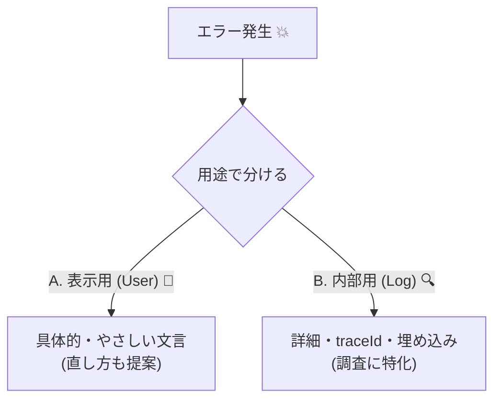

# 第22章：エラー設計①：分かりやすいメッセージにする🫶🧯


この章は「エラーの出し方」を **“ユーザーに優しい言葉” と “開発に役立つ情報” に分けて設計する** 回だよ〜🙂✨
エラーって、実は **仕様の一部** なんだよね💡（雑だと、ユーザーも開発者もつらい😵‍💫）

※この章の内容は、最近の実務トレンド（TypeScript 5.9系、Problem Details / RFC 9457、Zod v4 など）も踏まえて組み立ててるよ🧠✨ ([GitHub][1])

---

## 22.0 この章でできるようになること🎯✨

* 「分かりにくいエラー」を「直せるエラー」に言い換えできる✍️😊
* **表示用メッセージ** と **ログ用情報** を分離して設計できる🗂️🔍
* 入力エラーを **“どこが/なぜ/どう直す”** で返せるようになる🫶✅
* APIなら **RFC 9457（Problem Details）** っぽい形で返す設計がわかる📦🌐 ([datatracker.ietf.org][2])

---

## 22.1 そもそも「良いエラー」ってなに？🤔✨

ユーザーが困るエラーの典型はこれ👇😇

* 「エラーが発生しました」→ え、何をすれば…？😇
* 「Invalid request」→ どの項目が？😇
* 「500」→ いや、私は何を…😇

“良いエラー” は、ざっくり **この3点セット** が入ってるのが強い💪✨

1. **やさしい言葉**（専門用語・謎コードを出しすぎない）
2. **問題がハッキリ**（どこが/何がダメ）
3. **解決の道**（どう直せばいい）

これはUXの定番指針としても有名だよ🫶 ([Nielsen Norman Group][3])

---

## 22.2 エラーは「2種類」あると思うと一気に楽になる🪄🗂️


ここ超重要〜！💡

### A. 表示用（ユーザー向け）🫶

* 丁寧・短い・次の行動がわかる
* 例：

  * 「メールアドレスの形式が違うみたい🙏 例：[name@example.com](mailto:name@example.com)」
  * 「パスワードは8文字以上にしてね🔐」

### B. 内部用（ログ/調査向け）🔍

* 開発者が原因を追える情報
* 例：

  * エラーコード、どのレイヤで失敗したか、stack、traceId、入力の要約…など

**同じ失敗でも、AとBは “出す内容が違う”** のが自然なんだよね🙂✨
（Aに内部情報を混ぜると、怖い＆読めない＆セキュリティ的にも危ない😱🔒）



---

## 22.3 「言い方」の鉄板ルール🫶📌


### ルール1：責めない・怖がらせない😖➡️🙂

Windows系の文章ガイドでも「ユーザーのせいっぽく書かない」が大事って言われてるよ🫶 ([Microsoft Learn][4])

* ❌「あなたの入力が間違っています」
* ✅「この項目は “数字だけ” で入力してね🙂」

### ルール2：短く、具体的に🎯

* ❌「入力内容が不正です」
* ✅「年齢は0〜120の範囲で入力してね🎂」

### ルール3：「次に何をすればいいか」を入れる🧭✨

* ✅「もう一度送信してね」
* ✅「形式を確認してね（例あり）」
* ✅「時間をおいて試してね」
* ✅「サポートに連絡するならこの番号を伝えてね（問い合わせID）」

Googleの技術文書ガイドでも、読みやすいエラーメッセージの書き方が整理されてるよ📚✨ ([Google for Developers][5])

---

## 22.4 まず “エラーの分類” を決めると設計がラク😆🧩


おすすめはこの4分類👇（迷ったらこれでOK！）

1. **入力エラー（Validation）** ✍️

   * 例：必須、形式、範囲、桁数
2. **ドメインエラー（不変条件違反）** 💎

   * 例：「在庫0未満はダメ」「支払い済みに戻せない」
3. **権限/認可エラー** 🔑

   * 例：「管理者だけ可能」
4. **システムエラー** ⚠️

   * 例：通信失敗、DB障害、タイムアウト

👉 この章（第22章）は特に **1と2を “わかりやすい言葉” にする** のが主役だよ🫶✨

---

## 22.5 UIでの出し方のコツ（いつ・どこに出す？）🧁🧭


フォーム周りの鉄板👇（Material Designでも近い考え方だよ） ([Material Design][6])

* **基本は項目の近く**：どこが悪いか一瞬でわかる👀✨
* **入力してないのに怒らない**：触ってから出す（いきなり赤はビビる😱）
* **送信時にまとめて出す**：未入力が多い時は上部に要約＋各項目にも表示🧾
* **修正したら消える**：直したのに残ると混乱🌀

---

## 22.6 実装の形：エラーは「構造化」して持つ📦✨

“文字列だけ” で持つと後で詰む😇
おすすめは **コード＋場所＋表示用の材料** を持つこと！

### 例：ドメインエラー型（Union）🏷️🧠

```ts
// どのVO/ルールで落ちたかを “型” で持つイメージ
export type DomainError =
  | { kind: "EmailInvalid"; input: string }
  | { kind: "PasswordTooShort"; min: number }
  | { kind: "AgeOutOfRange"; min: number; max: number; input: number }
  | { kind: "InventoryWouldBeNegative"; current: number; requested: number };

// UI表示向けの変換（ユーザーに見せるのはここ！）
export function toUserMessage(e: DomainError): string {
  switch (e.kind) {
    case "EmailInvalid":
      return "メールアドレスの形式が違うみたい🙏 例：name@example.com";
    case "PasswordTooShort":
      return `パスワードは${e.min}文字以上にしてね🔐`;
    case "AgeOutOfRange":
      return `年齢は${e.min}〜${e.max}の範囲で入力してね🎂`;
    case "InventoryWouldBeNegative":
      return "在庫が足りないみたい📦💦 数量を減らしてね";
  }
}
```

ポイントはこれ👇🙂✨

* **ドメイン層のエラーは、表示文章を直接持たない**（翻訳・文言変更がつらい）
* 表示文章は **UI寄りの場所** で作る（= 今回の章のテーマ！）🫶

---

## 22.7 「項目ごとエラー」を作ると、めちゃ親切になる🫶📌

入力画面だと、こんな形が気持ちいいよ👇

```ts
export type FieldError = {
  field: "email" | "password" | "age";
  message: string;        // 表示用（やさしい）
};

export type FormErrorSummary = {
  title: string;          // 上に出す要約
  fieldErrors: FieldError[];
};
```

たとえば「登録できない」をこう返す👇

* 上：`入力に問題があるみたい🙏 赤いところを直してね`
* 近く：`メール形式が違うよ` / `8文字以上だよ` みたいにピンポイント🎯✨

---

## 22.8 APIなら：RFC 9457（Problem Details）で返すのが今どき📦🌐✨


HTTP APIのエラー形式を標準化する仕様が **RFC 9457**（RFC 7807を置き換え）だよ〜！ ([datatracker.ietf.org][2])
Content-Type は `application/problem+json` を使うのが定番🧾✨ ([Qiita][7])

### 例（ざっくり）

```json
{
  "type": "https://example.com/problems/validation-error",
  "title": "入力に問題があります",
  "status": 400,
  "detail": "いくつかの項目を確認してください",
  "instance": "/signup",
  "errors": [
    { "field": "email", "message": "メール形式が違うみたい🙏" },
    { "field": "password", "message": "8文字以上にしてね🔐" }
  ],
  "traceId": "01J...（ログ突合用）"
}
```

* `errors` や `traceId` は **拡張フィールド** として足してOK（実務でよくやる）🙂✨ ([Qiita][7])
* ユーザーには `traceId` を「問い合わせ用番号」として見せると優しい📞🫶（ログ側でも検索できて最高）

---

## 22.9 Zod（スキーマ）→ 項目エラーへの変換例🧪➡️🫶

スキーマ検証ライブラリは最近だと **Zod v4** が安定版で、npmの最新は **4.3.5（2026-01-04時点）** になってるよ📦✨ ([NPM][8])

Zodのエラーを “項目エラー” に整形する感じ👇

```ts
import { z } from "zod";

const SignupSchema = z.object({
  email: z.string().email(),
  password: z.string().min(8),
  age: z.coerce.number().int().min(0).max(120),
});

export function validateSignup(input: unknown) {
  const r = SignupSchema.safeParse(input);
  if (r.success) return { ok: true as const, value: r.data };

  const fieldErrors = r.error.issues.map((iss) => ({
    field: iss.path[0] as "email" | "password" | "age",
    message: issueToMessage(iss),
  }));

  return {
    ok: false as const,
    value: {
      title: "入力に問題があるみたい🙏 赤いところを直してね",
      fieldErrors,
    },
  };
}

function issueToMessage(iss: z.ZodIssue): string {
  // ここで “初心者に分かる言葉” にするのが第22章の腕の見せ所🫶✨
  if (iss.path[0] === "email") return "メールアドレスの形式が違うみたい🙏 例：name@example.com";
  if (iss.path[0] === "password") return "パスワードは8文字以上にしてね🔐";
  if (iss.path[0] === "age") return "年齢は0〜120の範囲で入力してね🎂";
  return "入力を確認してね🙏";
}
```

---

## 22.10 ミニ課題（手を動かそ〜！）🧪✍️✨

### 課題1：悪い文言を直す🙂➡️😍

次の文言を、**“どこが/なぜ/どう直す”** にしてね🫶

* 「不正な値です」
* 「登録に失敗しました」
* 「入力が間違っています」

### 課題2：表示用とログ用を分ける🗂️🔍

* 表示：短い・優しい・直し方がわかる
* ログ：kind、path、入力の要約、traceId など（ただし個人情報は扱い注意⚠️）

### 課題3：項目エラーを3つ作る🎯

* email / password / age のどれかで落として
* 画面の近くに出す文章を作る🫶✨

---

## 22.11 AI活用コーナー（この章と相性いい！）🤖💞

AIは **「文言の改善」「言い換え」「不足観点の洗い出し」** が得意だよ〜！✨
おすすめプロンプト👇

* 「このエラーメッセージを、初心者に優しく短く直して。原因と直し方も入れて」🫶
* 「入力フォームのエラーメッセージ例を、email/password/age で10個ずつ出して」🧠
* 「ユーザーを責めない言い回しにして。トーンは明るめで」🙂
* 「このエラー分類（入力/ドメイン/権限/システム）で、見落としがちなケースある？」🔍✨

---

## まとめ🧁✨

* エラーは **“仕様”** だよ📌
* **表示用** と **ログ用** を分けると設計が一気にキレイになる🫶
* 良いメッセージは「やさしい言葉」「具体的」「直し方」💪✨ ([Nielsen Norman Group][3])
* APIなら **RFC 9457（Problem Details）** が今の標準寄り📦🌐 ([datatracker.ietf.org][2])

---

次の第23章は、このエラーたちを **Result型（Ok/Err）で“仕様として扱う”** 方向に進むよ〜🎯📦✨

[1]: https://github.com/microsoft/typescript/releases "Releases · microsoft/TypeScript · GitHub"
[2]: https://datatracker.ietf.org/doc/rfc9457/?utm_source=chatgpt.com "RFC 9457 - Problem Details for HTTP APIs"
[3]: https://www.nngroup.com/articles/ten-usability-heuristics/?utm_source=chatgpt.com "10 Usability Heuristics for User Interface Design"
[4]: https://learn.microsoft.com/en-us/previous-versions/windows/desktop/bb226825%28v%3Dvs.85%29?utm_source=chatgpt.com "Messages: UI Text Guidelines"
[5]: https://developers.google.com/tech-writing/error-messages/format-for-readability?utm_source=chatgpt.com "Format error messages to enhance readability"
[6]: https://m1.material.io/patterns/errors.html?utm_source=chatgpt.com "Errors - Patterns"
[7]: https://qiita.com/horin0211/items/38ece47b8465763c25a7?utm_source=chatgpt.com "APIエラーレスポンスを標準化する - RFC9457移行で得られる5 ..."
[8]: https://www.npmjs.com/package/zod?utm_source=chatgpt.com "Zod"
