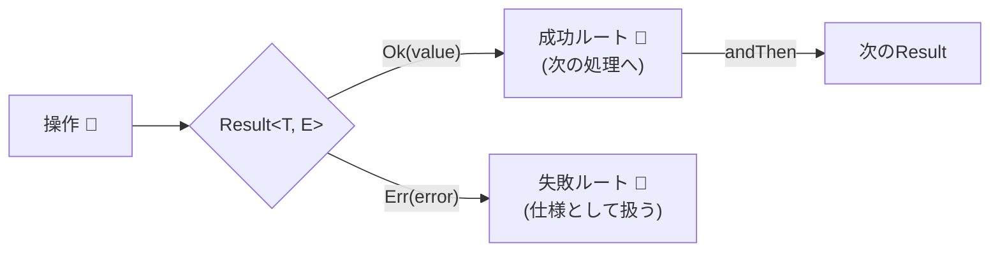

# 第23章：エラー設計②：Result型で失敗も仕様にする🎯📦


この章は、「失敗が起きてもパニックにならない」ための章だよ〜🙂✨
ポイントはこれ👇

* **例外（throw）に頼りすぎず**、予想できる失敗は **Resultで返す** 🧯
* 失敗の種類（エラー型）を **型で固定**して、**扱い漏れを減らす** 🧠🔒
* 「VOの `create()` が Result を返す」までを完成させる 🧪💎

※2026-01-20 時点では TypeScript の npm 最新は 5.9.3 で、6.0/7.0 へ向けた動き（ネイティブ化など）も進行中だよ〜🚀 ([NPM][1])

---

## 1) そもそも「例外だけ」だと何が困るの？😵‍💫💥


### 例外（throw）のつらいところ

* **関数の型だけ見ても失敗が分からない**（戻り値に出てこない）😶‍🌫️
* どこで throw されるか追いにくくて、**try/catch が散らばりがち**🌀
* 「本当は予想できる失敗」まで例外にすると、**制御フローが読みにくい**😇➡️😵

もちろん例外が悪いわけじゃなくてね👇

* **“普通に起こりうる失敗”**（入力が変、在庫不足、権限なし、など）は Result で返す
* **“想定外”**（バグ、壊れた状態、到達しちゃダメ）は例外で落とす
  この “住み分け” が超大事〜🙂🧭✨



---

## 2) Result型ってなに？（超ざっくり）📦✨

Result は「成功 or 失敗」を**戻り値で表現する型**だよ🙂
Rust の `Result<T, E>` と同じノリで、TypeScript でもよく使われるよ〜🦀➡️🟦

たとえば `neverthrow` ってライブラリだと、成功は `Ok`、失敗は `Err` を使って表すよ（非同期用の `ResultAsync` もある）🤖✨ ([GitHub][2])

---

## 3) まずは「最小Result」を自作して感覚をつかもう🧪🧱

最初は自作でOK！超ミニ版を作ろう🙂✨

```ts
// ✅ 最小 Result（discriminated union）
export type Ok<T> = { readonly ok: true; readonly value: T };
export type Err<E> = { readonly ok: false; readonly error: E };
export type Result<T, E> = Ok<T> | Err<E>;

export const ok = <T>(value: T): Ok<T> => ({ ok: true, value });
export const err = <E>(error: E): Err<E> => ({ ok: false, error });

// ✅ 分岐を強制するための match
export const match = <T, E, R>(
  r: Result<T, E>,
  onOk: (v: T) => R,
  onErr: (e: E) => R
): R => (r.ok ? onOk(r.value) : onErr(r.error));
```

### ここが気持ちいいポイント😍✨


* `r.ok` で分岐すると、**成功/失敗の中身が型的に確定**する
* 「失敗ケースを書き忘れる」事故が減る🎯

---

## 4) エラーも「型」で固定しよう🧠🔒


Result を使うなら、エラーも「なんでもError」じゃなくて、**ドメインに沿った型**にしよ🙂✨
（第22章で “分かりやすいメッセージ” を作ったけど、この章は “失敗の種類を型にする” だよ🫶）

### 例：Email用のドメインエラー

```ts
export type EmailError =
  | { readonly type: "Empty" }
  | { readonly type: "TooLong"; readonly max: number }
  | { readonly type: "InvalidFormat" };

const MAX_EMAIL_LEN = 254 as const;
```

* `type` をタグにする（Discriminated Union）と分岐が安全🏷️✅
* UI向け文言は “別レイヤー” で変換してOK（第24章でやるよ）🔄🧭

---

## 5) VOの `create()` を Result にする（この章の主役）💎🛠️

### Email VO（Branded/Opaque風のやつ）

```ts
declare const EmailBrand: unique symbol;

export type Email = string & { readonly [EmailBrand]: "Email" };

const normalizeEmail = (s: string) => s.trim().toLowerCase();

const isEmailFormat = (s: string) => {
  // 超シンプル版（本気のRFCは重いので、境界でほどほどにね🙂）
  return /^[^\s@]+@[^\s@]+\.[^\s@]+$/.test(s);
};

export const Email = {
  create(input: string): Result<Email, EmailError> {
    const v = normalizeEmail(input);

    if (v.length === 0) return err({ type: "Empty" });
    if (v.length > MAX_EMAIL_LEN) return err({ type: "TooLong", max: MAX_EMAIL_LEN });
    if (!isEmailFormat(v)) return err({ type: "InvalidFormat" });

    return ok(v as Email);
  },
} as const;
```

### 使う側：try/catch じゃなく、分岐が “見える” 😌✨

```ts
const r = Email.create("  TEST@EXAMPLE.COM  ");

if (r.ok) {
  // r.value は Email 型✨
  console.log("email:", r.value);
} else {
  // r.error は EmailError 型✨
  console.log("error type:", r.error.type);
}
```

---

## 6) Result を「つなげる」ための道具（map / andThen）🧰🔗


Result が便利になるのは、**連結できる**からだよ🙂✨
（neverthrow でも `map` / `andThen` が重要って書かれてるよ）([GitHub][2])

### まずは自作ヘルパー（超よく使う）

```ts
export const map = <T, E, U>(
  r: Result<T, E>,
  f: (v: T) => U
): Result<U, E> => (r.ok ? ok(f(r.value)) : r);

export const andThen = <T, E, U, F>(
  r: Result<T, E>,
  f: (v: T) => Result<U, F>
): Result<U, E | F> => (r.ok ? f(r.value) : r);
```

### 例：Email → User を作る（途中で失敗したら止まる）🚦🙂

```ts
type UserError = { readonly type: "EmailInvalid"; readonly detail: EmailError };

type User = {
  readonly email: Email;
};

const createUser = (rawEmail: string): Result<User, UserError> =>
  andThen(Email.create(rawEmail), (email) =>
    ok({ email }) // 本当は他VOもまとめて作るよね🙂
  );
```

「成功だけ次へ進む」っていう読みやすさが出るのが、Resultの強み😍✨

---

## 7) 失敗を “ためて返す” パターン（軽く触れる）🧺🧾

Result の基本は「失敗したらそこで止まる」だけど、フォーム入力みたいに
**全部のエラーを集めたい**こともあるよね🙂🫶

ここは設計方針で変わるけど、初心者向けにはまず👇でOK！

* **VOの create は 1つの失敗で Err を返す**（単体の責務が明確）💎
* 複数項目の入力は **境界（スキーマ）側でエラーを集める**（第19〜21章の流れ）📐✅

---

## 8) 非同期（Promise）で Result を使うときの型🕒⚡


非同期は「例外が混ざりやすい」から、Result がさらに効くよ🙂✨
`neverthrow` だと `ResultAsync` が用意されてるよ〜([GitHub][2])

自作派なら “try/catch を境界で吸う” だけでも十分👍

```ts
export const fromThrowable = async <T>(
  f: () => Promise<T>
): Promise<Result<T, unknown>> => {
  try {
    return ok(await f());
  } catch (e) {
    return err(e);
  }
};
```

* **throw を外に漏らさない**のがコツ🧯
* 返すエラー型は `unknown` のままでもいいけど、できれば境界で自前エラーに変換（次章！）🔄✨

---

## 9) ライブラリを使う？自作する？ざっくり指針🧭✨

### ✅ 初学者におすすめ

* **最小Resultを自作**（この章のコード）
  → 仕組みが分かるし、必要な機能だけにできる🙂🧪

### ✅ すぐ実戦で使いたい

* `neverthrow`：Result/ResultAsync があり、`andThen` などが揃ってる ([GitHub][2])

### ✅ FPの世界も込みでやりたい（上級寄り）

* `fp-ts` の `Either`（Left/Right） ([gcanti.github.io][3])
* `Effect` も `Either` はあるけど、ドキュメントでは「詳細な失敗にはメイン用途として推奨しない」ニュアンスもあるよ（Effect では別の結果表現が推されてる）([effect.website][4])

---

## 10) AI活用テンプレ（この章向け）🤖🧠✨

コピペで使えるやつ置いとくね👇😊

* 「この `Email.create` が失敗する入力パターンを20個出して」🧪
* 「`EmailError` の設計が雑になりがちな点をレビューして」🔍
* 「Result を使った `map/andThen` の実装の落とし穴ある？」🧯
* 「境界値テスト（空/最大長/不正形式）を Vitest で書いて」🧪📝

AIは “生成” より “漏れ探し” で強いよ〜💪✨

---

## 11) ミニ課題（手を動かすやつ）📝✨

### 課題1：VOの create を Result 化する💎

* 何でもいいからVOを1個選ぶ（例：`UserId` / `Quantity` / `Money`）🙂
* `create(input)` を `Result<VO, ErrorType>` にする✅

### 課題2：andThen で “一本線” を作る🧵✨

* `Email.create` → `User.create` みたいに、成功だけ進む流れを作る

### 課題3：match で UI 用メッセージにする🫶

* `EmailError` を受け取って、初心者でも分かる文言に変換する
  （第22章の復習にもなるよ〜🙂✨）

---

## 12) まとめ（この章で持ち帰ること）🎁🌸

* **予想できる失敗は Result で返す**と、設計が落ち着く🙂🛡️
* **エラー型を Union で固定**すると、扱い漏れが減る🏷️✅
* **VOの `create()` を Result 化**できれば、ドメインが一気に強くなる💎🔥
* 次の第24章で、Resultの失敗を **境界で“層に合わせて変換”**して完成度を上げるよ〜🔄🧭✨

[1]: https://www.npmjs.com/package/typescript?activeTab=versions&utm_source=chatgpt.com "typescript"
[2]: https://github.com/supermacro/neverthrow?utm_source=chatgpt.com "supermacro/neverthrow: Type-Safe Errors for JS & TypeScript"
[3]: https://gcanti.github.io/fp-ts/modules/Either.ts.html?utm_source=chatgpt.com "Either.ts | fp-ts"
[4]: https://effect.website/docs/data-types/either/?utm_source=chatgpt.com "Either"
