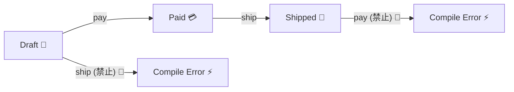

# 第25章：状態による不変条件：できる/できないは状態で決まる🚦🙂


ここからは「**値そのもののルール**」に加えて、**“いまの状態だからOK / ダメ”** みたいな **状態ルール** を扱うよ〜！🫶✨
（例：下書きなら編集OK、支払い後は編集NG、発送後はキャンセルNG…みたいなやつ！📦💳🚚）

---

## この章でできるようになること🎯✨

* 「状態が変わると、許可される操作が変わる」を説明できる🙂🚦
* `Draft → Paid → Shipped` の **禁止遷移** を “散らさず” 守れる🛡️
* TypeScriptの **タグ付きユニオン（Discriminated Union）** で
  **“できない操作はコンパイルで怒られる”** を体験できる⚡😆
* 状態遷移の失敗を、前の章の `Result` と相性よく扱える🎁✨

---

## まず結論：状態不変条件ってなに？🧠💡

**状態不変条件**＝「いまの状態だと、この操作は絶対しちゃダメ！」っていうルールだよ🚫🙂

たとえば注文（Order）なら…

* `Draft（下書き）`：編集OK📝✨ / 支払いOK💳✨
* `Paid（支払い済み）`：編集NG🚫 / 発送OK🚚✨
* `Shipped（発送済み）`：キャンセルNG🙅‍♀️ / 追跡番号は必須🎫✨

こういう “状態で変わるルール” を、**型で守る** のがこの章のテーマだよ〜！💎🛡️

---

## よくある事故：ifチェックが散ってバグる😱🌀

「発送は支払い後だけね！」ってルールがあるのに…

* A画面ではチェックした✅
* B画面ではチェックし忘れた❌
* バッチ処理でも忘れた❌

みたいに、**ifが散ると漏れる** のがあるある😭

だから方針はこれ👇

✅ **状態遷移は“専用の関数/メソッド”に集める**
✅ **状態ごとに型を分けて“できない操作”を型で止める**

---

## 今回の題材：注文のミニ状態機械📦🚦

イメージこんな感じ👇

`Draft` →（pay）→ `Paid` →（ship）→ `Shipped`
`Shipped` から `Paid` に戻るのはダメ🙅‍♀️
`Paid` から `Draft` に戻るのもダメ🙅‍♀️
（＝禁止遷移🚫✨）



---

## 実装方針：タグ付きユニオンで「状態＝別の型」にする🏷️🧠

ポイントはこれ👇

* `status: "Draft" | "Paid" | "Shipped"` みたいに **1つの型に詰めない**🙅‍♀️
* 代わりに **状態ごとに型を分ける**💎

### 1) 状態ごとの型を作る（ここが核心！）✨

```ts
// ざっくり（本当は第10章のBranded型を使うともっと強い💎）
type OrderId = string;
type PaymentId = string;
type TrackingNo = string;

type OrderItem = {
  sku: string;
  qty: number;
};

type DraftOrder = {
  kind: "Draft";
  id: OrderId;
  items: OrderItem[];
};

type PaidOrder = {
  kind: "Paid";
  id: OrderId;
  items: OrderItem[];
  paymentId: PaymentId;
  paidAt: Date;
};

type ShippedOrder = {
  kind: "Shipped";
  id: OrderId;
  items: OrderItem[];
  paymentId: PaymentId;
  paidAt: Date;
  trackingNo: TrackingNo;
  shippedAt: Date;
};

type Order = DraftOrder | PaidOrder | ShippedOrder;
```

ここで起きてる嬉しさ👇😍

* `PaidOrder` には `paymentId` と `paidAt` が必ずある（**状態の不変条件が型に埋まった**）💳✨
* `ShippedOrder` には `trackingNo` と `shippedAt` が必ずある🚚✨
* `DraftOrder` にはそれらが “存在しない”＝支払い情報が混ざらない🧼✨

---

## 2) 遷移関数を書く：Draftだけがpayできる💳✨

```ts
type DomainError =
  | { type: "InvalidTransition"; from: Order["kind"]; to: Order["kind"]; message: string };

type Result<T> =
  | { ok: true; value: T }
  | { ok: false; error: DomainError };

const Ok = <T>(value: T): Result<T> => ({ ok: true, value });
const Err = (error: DomainError): Result<never> => ({ ok: false, error });

// ✅ Draft → Paid
function pay(order: DraftOrder, paymentId: PaymentId, paidAt: Date): PaidOrder {
  return {
    kind: "Paid",
    id: order.id,
    items: order.items,
    paymentId,
    paidAt,
  };
}

// ✅ Paid → Shipped
function ship(order: PaidOrder, trackingNo: TrackingNo, shippedAt: Date): ShippedOrder {
  return {
    kind: "Shipped",
    id: order.id,
    items: order.items,
    paymentId: order.paymentId,
    paidAt: order.paidAt,
    trackingNo,
    shippedAt,
  };
}
```

ここ超大事！👀✨
`pay` の引数が `DraftOrder` だから、`PaidOrder` を渡すと **コンパイルで怒られる**⚡
`ship` の引数が `PaidOrder` だから、`DraftOrder` を渡すと **コンパイルで怒られる**⚡

つまり…

🎉 **「できない操作」が “実行する前” に止まる** 🎉

---

## 3) でも現実は `Order` を受け取るよね？（分岐で安全に）🔀🛡️

たとえば API や DB から取った注文は `Order`（どれか分からん）になりがち🙂
そのときは **switchで状態を絞ってから** 遷移させるよ！

```ts
function shipIfPossible(order: Order, trackingNo: TrackingNo, shippedAt: Date): Result<ShippedOrder> {
  switch (order.kind) {
    case "Paid":
      return Ok(ship(order, trackingNo, shippedAt));

    case "Draft":
    case "Shipped":
      return Err({
        type: "InvalidTransition",
        from: order.kind,
        to: "Shipped",
        message: "発送は支払い後だけだよ📦→💳→🚚",
      });
  }
}
```

✅ これで「発送できるのはPaidだけ」が1か所に集約される🧱✨

---

## 4) “漏れ防止”の小技：assertNeverでswitchを完璧にする🧯✨

状態が増えたとき（例：`Cancelled` 追加！）に、switchの更新漏れを防げるよ😍

```ts
function assertNever(x: never): never {
  throw new Error("Unexpected object: " + x);
}

function canEdit(order: Order): boolean {
  switch (order.kind) {
    case "Draft":
      return true;
    case "Paid":
    case "Shipped":
      return false;
    default:
      return assertNever(order); // 状態が増えたらここでコンパイルが怒る⚡
  }
}
```

---

## 状態による不変条件の“設計コツ”まとめ🧩✨

### コツ1：状態ごとに「持てるデータ」を変える🎁

* `Paid` になったら `paymentId` が必須
* `Shipped` になったら `trackingNo` が必須
  → **型がドキュメントになって、実装もブレにくい**📚✨

### コツ2：状態遷移は “専用関数” に閉じ込める🔒

* `pay()` `ship()` みたいに、意図が分かる名前にする🙂
* 画面やAPIごとに if を書かない（散ると漏れる）🌀😱

### コツ3：失敗は `Result` と相性最高🎯

「状態が違うから失敗」は **仕様として返す** のがめちゃキレイ🫶✨

---

## ミニ課題🎲✨：禁止遷移を作る（Draft→Paid→Shipped）📦🚫

やることはこれだけ👇

1. `DraftOrder / PaidOrder / ShippedOrder` を作る🏷️
2. `pay(draft)` と `ship(paid)` を作る💳🚚
3. 次を実装する👇

   * `shipIfPossible(order: Order, ...)`（Paid以外はエラーにする）🧯
4. おまけ：`Draft` のときだけ `addItem(draft, item)` を許可してみて🛒✨

   * `Paid` に `addItem` しようとするとコンパイルで怒られるのが理想⚡😆

---

## よくある質問（つまずきポイント）🙋‍♀️💭

### Q. 状態が増えると型が増えて大変じゃない？😵‍💫

A. うん、増える！でもね…
✅ **増えたときにコンパイルが「直す場所」を教えてくれる** のが超強い😍
（`assertNever` や switch の網羅性が効く！）

### Q. もっと複雑な状態（並行・タイマー・非同期）は？⏳🌀

A. そのレベルになると、状態機械ライブラリ（例：XState）が選択肢になるよ〜🙂✨
XStateは TypeScript でも使える “状態管理＆オーケストレーション” の有名どころだよ📌 ([GitHub][1])
（でもこの章では “超ライト” でOK🙆‍♀️）

---

## AIの使いどころ（この章向け）🤖💡

コピペで聞けるやつ置いとくね👇😍

* 「`Draft→Paid→Shipped` の禁止遷移を全部列挙して、理由もつけて」🚫🧠
* 「状態ごとに必須になるフィールドを表にして」📋✨
* 「`InvalidTransition` のエラー文言を、初心者に優しくして」🫶💬
* 「状態が増えたときにswitch漏れを防ぐTypeScriptの書き方は？」🧯⚡
* 「この状態遷移のテスト観点（成功/失敗/境界）を10個出して」🧪✨

---

## ちょい最新メモ（2026のTypeScriptまわり）📌✨

* TypeScript 5.9 は公式ブログで告知されていて、リリースノートも整備されてるよ🧠 ([Microsoft for Developers][2])
* TypeScript は 7.0 に向けた “ネイティブ化（高速化）” の進捗を継続的に公開してるよ（6.0は橋渡しの位置づけ）🚀 ([Microsoft for Developers][3])
* Node.js 側も LTS / Current のラインが明確に管理されてて、セキュリティリリースも定期的に出てるよ🔒 ([Node.js][4])

---

## チェックリスト✅✨（できたら勝ち！）

* [ ] `Draft` 以外に `pay()` しようとすると、型で止まる⚡
* [ ] `Paid` 以外に `ship()` しようとすると、型で止まる⚡
* [ ] `Order` を受け取る関数は `switch(order.kind)` で分岐してる🔀
* [ ] 禁止遷移は `Result` で分かりやすく返してる🧯
* [ ] 状態が増えたらコンパイルが直す場所を教えてくれる（網羅性）😍

---

次の章では、DBから読み込んだ値が壊れてる可能性もあるから、**永続化境界（DB→ドメイン）でどう守るか** に進むよ〜！🗄️🛡️✨

[1]: https://github.com/statelyai/xstate?utm_source=chatgpt.com "statelyai/xstate: Actor-based state management & ..."
[2]: https://devblogs.microsoft.com/typescript/announcing-typescript-5-9/?utm_source=chatgpt.com "Announcing TypeScript 5.9"
[3]: https://devblogs.microsoft.com/typescript/progress-on-typescript-7-december-2025/?utm_source=chatgpt.com "Progress on TypeScript 7 - December 2025"
[4]: https://nodejs.org/en/about/previous-releases?utm_source=chatgpt.com "Node.js Releases"
