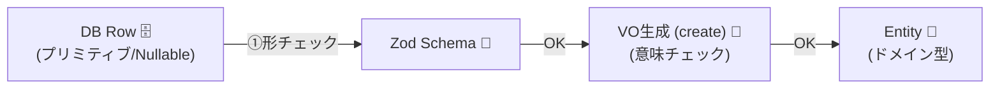

# 第26章：永続化境界①：DB→ドメイン（読み込み時に守る）🗄️🔄


## この章でできるようになること🎯✨

* 「DBから読んだ値を、**そのままドメインに入れない**」理由が腹落ちする🙂💡
* **DBの行（Row）→ドメイン型（VO/Entity）**への変換レイヤを、迷わず置ける🏗️✨
* 壊れた/古い/想定外データを読んだときに、**安全に失敗して原因が追える**設計ができる🧯🔍

---

## 1) なんでDBも信用しないの？😅🌀

「DBって自分で管理してるんだから安全でしょ？」って思いがちだけど…**意外と壊れる**のがDBなんだよね🥹🗄️

よくある事故👇

* 昔のデータが残ってる（仕様変更前の値）🕰️
* マイグレーション途中で変な値が入った🧩
* 手動UPDATEで想定外の値が入った（運用あるある）🛠️😇
* NULLが混ざる（必須のはずが…）😱
* 列は合ってるけど「意味」が違う（例：メール形式は文字列としてはOK）📧➡️😵‍💫

なので方針はこれ💎
**DBは外部入力と同じ扱い**にして、読み込み時に “境界” で検証＆変換する🚧✅

---

## 2) 「DBの形」と「ドメインの形」は別物だよ📦↔️🏰

ここがコツ！🪄

* **DBモデル（Persistence / Row）**：保存しやすい形（プリミティブ中心）📦
* **ドメインモデル（Domain）**：ルールを守れる形（VO・Union・状態制約など）🏰💎

つまり：
**Row（プリミティブ） → 検証/正規化 → VO生成 → Entity生成**
この一本線を、読み込みでもやる！って感じ🙂✨



---

## 3) 例題：UserをDBから読む（壊れてたら安全に落とす）👤🧯

ここでは「DBから取れた1行」を `unknown` 扱いにして、**Zodで形チェック → VOで意味チェック**までやるよ✅
（Zod v4 が stable で、最近も v4.3.x が出てる流れだよ〜）([Zod][1])

> 2026-01-21 時点の TypeScript は npm の latest が **5.9.3**（ページ表示上）だよ🧠✨ ([npm][2])
> TypeScript 6/7（ネイティブ移植含む）のロードマップ更新も出てるので、ビルド体験は今後さらに速くなっていく見込みだね🏎️💨 ([Microsoft for Developers][3])

---

### 3-1) ドメイン側（VOたち）💎

（VOは「無効な状態を作れない」の主役🎯）

```ts
// domain/valueObjects.ts
export type Result<T, E> = { ok: true; value: T } | { ok: false; error: E };

export class DomainError extends Error {
  readonly kind = "DomainError";
}

export class InvalidEmailError extends DomainError {
  readonly kind = "InvalidEmailError";
  constructor(readonly input: string) {
    super(`Invalid email: ${input}`);
  }
}

export type Email = string & { readonly __brand: "Email" };

export const EmailVO = {
  create(input: string): Result<Email, InvalidEmailError> {
    const normalized = input.trim().toLowerCase();
    // 超ざっくり：教材用。実務ではもう少し丁寧にね🙂
    const ok = /^[^\s@]+@[^\s@]+\.[^\s@]+$/.test(normalized);
    return ok
      ? { ok: true, value: normalized as Email }
      : { ok: false, error: new InvalidEmailError(input) };
  },
};

export type Plan = "Free" | "Pro";
```

---

### 3-2) DB Row 側（まず「形」を検証する）📐✅

Rowは **DBの都合**（null/文字列/数値/日付文字列…）が混ざりやすいよね🗄️

```ts
// infra/dbRowSchema.ts
import { z } from "zod";

export const userRowSchema = z.object({
  id: z.string(),               // UUID文字列など
  email: z.string(),            // 形だけOK。意味はVOへ
  plan: z.enum(["Free", "Pro"]),// DBのenum想定
  created_at: z.string(),       // ISO文字列想定（DBによりDate型のことも）
});

export type UserRow = z.infer<typeof userRowSchema>;
```

---

### 3-3) 「Row → Domain」変換（この章の主役）🧵✨

ここで **検証 → 正規化 → VO生成 → Entity生成** をやるよ🙂💕

```ts
// app/userMapper.ts
import { userRowSchema, type UserRow } from "../infra/dbRowSchema";
import { EmailVO, type Email, type Plan, Result } from "../domain/valueObjects";

export class DataCorruptionError extends Error {
  readonly kind = "DataCorruptionError";
  constructor(message: string, readonly cause?: unknown) {
    super(message);
  }
}

export type User = {
  id: string;
  email: Email;
  plan: Plan;
  createdAt: Date;
};

export function mapUserRowToDomain(rowUnknown: unknown): Result<User, DataCorruptionError> {
  // 1) まず「形」チェック（DBの行を信用しない）🕵️‍♀️
  const parsed = userRowSchema.safeParse(rowUnknown);
  if (!parsed.success) {
    return {
      ok: false,
      error: new DataCorruptionError("UserRow shape is invalid", parsed.error),
    };
  }
  const row: UserRow = parsed.data;

  // 2) 日付の読み込み（ここも壊れがち）🕰️
  const createdAt = new Date(row.created_at);
  if (Number.isNaN(createdAt.getTime())) {
    return {
      ok: false,
      error: new DataCorruptionError(`created_at is invalid: ${row.created_at}`),
    };
  }

  // 3) 「意味」チェック（VO生成）💎
  const emailR = EmailVO.create(row.email);
  if (!emailR.ok) {
    return {
      ok: false,
      error: new DataCorruptionError(`email is invalid in DB: ${row.email}`, emailR.error),
    };
  }

  // 4) Domain完成🏰✨
  return {
    ok: true,
    value: {
      id: row.id,
      email: emailR.value,
      plan: row.plan,
      createdAt,
    },
  };
}
```

ポイントまとめ📌✨

* **safeParse** で落ちてもOK（落ち方が “説明できる” のが大事）🙂🧯
* 「スキーマで弾けない意味ルール」を **VOで弾く**💎
* DBに壊れデータがあったら、**ドメイン内に持ち込まずに失敗**させる🚫🏰

---

## 4) Repositoryでは「境界っぽさ」を隠して、呼び出し側を楽にする😌✨

アプリ側は「Userください」で呼びたいよね🙂
でも内部ではちゃんと守る🛡️

```ts
// app/userRepository.ts
import { Result } from "../domain/valueObjects";
import { mapUserRowToDomain, type User, DataCorruptionError } from "./userMapper";

export class NotFoundError extends Error {
  readonly kind = "NotFoundError";
}

export type LoadUserError = NotFoundError | DataCorruptionError;

export async function loadUserById(
  userId: string,
  db: { findUserRowById(id: string): Promise<unknown | null> }
): Promise<Result<User, LoadUserError>> {
  const row = await db.findUserRowById(userId);
  if (row === null) return { ok: false, error: new NotFoundError() };

  return mapUserRowToDomain(row);
}
```

これで呼び出し側は👇みたいにシンプル😍

```ts
const r = await loadUserById("...", db);
if (!r.ok) {
  // NotFound と DB壊れ を分けて対応できる🧯
  console.error(r.error);
} else {
  // ここから先は「Userは正しい」前提で書ける🏰✨
  console.log(r.value.email);
}
```

---

## 5) ありがちなNG集（ここ踏む人めっちゃ多い🥹）🚫

* DBの型が付いてるからって **変換せずにそのまま使う**
  → “壊れデータ” が入った瞬間に地獄😇🔥
* 変換はするけど **例外throwで雑に落とす**
  → どのデータが壊れてたか追えない😵‍💫
* 変換に成功したのに **VOをプリミティブに戻して渡す**
  → せっかく守ったのに、また混ざる🧟‍♀️

---

## 6) ミニ課題🎒✨（30〜60分）

あなたの題材で、DB→ドメイン変換を1本作ってみよ〜！😆💕

### お題（どれでもOK）🎯

* Order（注文）：`status` / `totalAmount` / `items` 🧾
* Product（商品）：`price` / `stock` / `name` 🏷️
* Member（会員）：`email` / `birthday` / `plan` 👤

### やること🧵

1. DB Row のスキーマを作る（形チェック）📐✅
2. VO を1つ以上使って「意味チェック」💎
3. `mapXRowToDomain()` を作る🔄
4. 壊れデータのときに **説明できるエラー**で落とす🧯

---

## 7) AIに頼むと強い聞き方テンプレ🤖✨

そのままコピペでOKだよ〜🙂💕

* 「この `mapUserRowToDomain` で見落としやすい壊れデータパターンを20個出して」🔍
* 「DBが壊れてたときに、ログに残すべき情報の最小セットを提案して」🧾
* 「この変換関数のテストケース（成功/失敗/境界値）を列挙して」🧪
* 「ZodのスキーマとVOの責務分担がズレてないかレビューして」👀

---

## 8) 今日のまとめ🌸

* **DBは外部入力**！読み込み時も “境界” で守る🛡️
* まず **スキーマで形**、次に **VOで意味** を保証する📐➡️💎
* 変換が通ったら、ドメイン内は安心して進める🏰✨

次章（第27章）では、逆向きの **ドメイン→DB（書き込み）** で「保存フォーマットを外側に閉じ込める」やつをやるよ〜🗄️🧾💖

[1]: https://zod.dev/v4?utm_source=chatgpt.com "Release notes"
[2]: https://www.npmjs.com/package/typescript?utm_source=chatgpt.com "TypeScript"
[3]: https://devblogs.microsoft.com/typescript/progress-on-typescript-7-december-2025/?utm_source=chatgpt.com "Progress on TypeScript 7 - December 2025"
