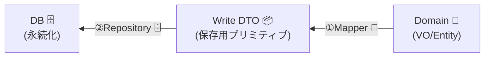

# 第27章：永続化境界②：ドメイン→DB（書き込み時に整形）🗄️🧾


## この章のゴール🎯💖

* ドメイン（VO/エンティティ）を **DBに保存できる形（プリミティブ）へ安全に変換**できるようになる🙆‍♀️✨
* **DB都合（カラム名・型・正規化・ID生成など）をドメインに漏らさない**で書けるようになる🛡️🏰
* 「保存処理が太る問題」を **Write DTO＋Mapper＋Repository** でスッキリ整理できるようになる✂️😊

> ちなみに最新動向として、PrismaはORM v7が出ていて（2025/11頃）、Rust-freeクライアントなどが既定になってきています。([Prisma][1])
> TypeScriptの最新安定版は 5.9 系（2025/10にタグ/リリースが並んでます）で、6.0は2026年早期を目標に進行中です。([GitHub][2])
> Node.jsは v24 がActive LTS（2026/1時点）なので、開発環境の更新も意識すると安心です🔐([nodejs.org][3]) reminder: ここは「知っておくと安心」くらいでOKだよ〜🙂

---

## 今日の主役：なぜ「ドメイン→DB」がむずいの？😵‍💫🌀


DBに保存するときって、こういう“ズレ”が起きがち👇

* ドメイン：`Money`（通貨＋金額）💰 → DB：`amount_cents INT` とかにしたい
* ドメイン：`Email`（検証済みVO）📧 → DB：`VARCHAR`
* ドメイン：`OrderStatus`（ユニオン型）🚦 → DB：`ENUM` or `TEXT`
* ドメイン：`DateRange`（開始<=終了）📅 → DB：`start_at`, `end_at`
* ドメイン：`readonly`で守ってる🧊 → DB保存時は“ただの値”として吐き出す必要がある

だから方針はこれ💡✨
**「ドメインをいじらず、外側で“保存用の形”に整形してからDBへ」** 🧼🧾



---

## まずは型の置き場を分けよう🧩🏷️


この章のおすすめ3点セット👇✨

### 1) Write DTO（保存用の型）📦

DBへ渡す“保存形”を **プリミティブで定義**するよ🙂

* 文字列 / 数値 / boolean / ISO文字列 / 配列 / JSON など

### 2) Mapper（変換）🔄

* `Domain → WriteDTO` を **1箇所に閉じ込める**🧠✨
* “変換が正しい”＝“境界が守れてる”だから超大事！

### 3) Repository（永続化）🗄️

* `save(domain)` だけ見せて、内部で Mapper→DB を呼ぶ
* ドメイン層はDBを忘れてOK😊🌸

---

## 例題：注文（Order）を保存する📦💳

### ドメイン側（すでに検証済みの世界）🏰✨

* `OrderId`（混ざらない）🏷️
* `Email`（形式OK）📧
* `Money`（負にならない・単位は cents）💰
* `status`（`"Draft" | "Paid" | "Shipped"`）🚦
* `items`（空禁止、など）🧺

---

## 実装ステップ（これだけ覚えれば勝ち）💪✨

### Step 1：Write DTOを作る📦🧾


「DBに入る形」を **型で固定**するよ🙂
（※ここではカラム名も“DB寄り”にしてOK。ドメインに漏らさないのが目的！）

```ts
// persistence/write-dto.ts
export type OrderWriteDTO = {
  id: string;
  customer_email: string;
  total_cents: number;
  status: "draft" | "paid" | "shipped";
  created_at: string; // ISO
  updated_at: string; // ISO
  items: Array<{
    sku: string;
    qty: number;
    price_cents: number;
  }>;
};
```

ポイント😍

* `Date` をそのまま渡さず `ISO文字列` にする（保存表現を固定）📌
* `status` はDB都合の表現に寄せてもOK（`Draft`→`draft`）🙂

---

### Step 2：Mapper（Domain→DTO）を作る🔄🧠


「変換はここ！」って場所を決めて、そこ以外で変換しない🙅‍♀️✨

```ts
// persistence/order-mapper.ts
import { OrderWriteDTO } from "./write-dto";

// 例：ドメイン型（雰囲気）
// Order.id.value: string
// Order.customerEmail.value: string
// Order.total.cents: number
// Order.status: "Draft" | "Paid" | "Shipped"
// Order.items: { sku: Sku, qty: Quantity, price: Money }[]

export function toOrderWriteDTO(order: any): OrderWriteDTO {
  const nowIso = new Date().toISOString();

  return {
    id: order.id.value,
    customer_email: order.customerEmail.value,
    total_cents: order.total.cents,
    status: toDbStatus(order.status),
    created_at: order.createdAt.toISOString(),
    updated_at: order.updatedAt?.toISOString() ?? nowIso,
    items: order.items.map((it: any) => ({
      sku: it.sku.value,
      qty: it.qty.value,
      price_cents: it.price.cents,
    })),
  };
}

function toDbStatus(s: "Draft" | "Paid" | "Shipped"): OrderWriteDTO["status"] {
  switch (s) {
    case "Draft": return "draft";
    case "Paid": return "paid";
    case "Shipped": return "shipped";
  }
}
```

ここで守りたいこと🛡️✨

* **「変換ロジックの散らばり」をゼロにする**
* 「DB表現の決定」はドメインじゃなく **Mapperが引き受ける**😊

---

### Step 3：Repositoryインターフェースをドメイン側に置く🧩📌

ドメインから見えるのはこれだけ🙂

```ts
// domain/order-repository.ts
export interface OrderRepository {
  save(order: any): Promise<void>;
}
```

---

### Step 4：Repository実装（DB/ORM側）🗄️✨


ここで `toOrderWriteDTO()` を呼んで保存するよ！

#### パターンA：Prismaで“素直に保存”🧾✨

PrismaはORM v7 が出ているので、採用するならアップグレードガイドも一応チェックしておくと安心〜📚✨([Prisma][4])

```ts
// persistence/prisma-order-repository.ts
import { OrderRepository } from "../domain/order-repository";
import { toOrderWriteDTO } from "./order-mapper";

export class PrismaOrderRepository implements OrderRepository {
  constructor(private readonly prisma: any) {}

  async save(order: any): Promise<void> {
    const dto = toOrderWriteDTO(order);

    await this.prisma.$transaction(async (tx: any) => {
      // 親（Order）
      await tx.order.upsert({
        where: { id: dto.id },
        create: {
          id: dto.id,
          customerEmail: dto.customer_email,
          totalCents: dto.total_cents,
          status: dto.status,
          createdAt: new Date(dto.created_at),
          updatedAt: new Date(dto.updated_at),
        },
        update: {
          customerEmail: dto.customer_email,
          totalCents: dto.total_cents,
          status: dto.status,
          updatedAt: new Date(dto.updated_at),
        },
      });

      // 子（Items）: まず全削除→作り直し（初心者に分かりやすい作戦）🧹✨
      await tx.orderItem.deleteMany({ where: { orderId: dto.id } });
      await tx.orderItem.createMany({
        data: dto.items.map((it) => ({
          orderId: dto.id,
          sku: it.sku,
          qty: it.qty,
          priceCents: it.price_cents,
        })),
      });
    });
  }
}
```

“全削除→作り直し”は雑に見えるけど、最初はすごく堅い🙆‍♀️✨
（後で最適化したくなったら「差分更新」に進めばOK！🌱）

#### パターンB：Drizzleも選択肢（2026/1時点で1.0 betaラインが動いてる）🧪✨

Drizzleは活発にリリースが回ってるので、採用時は“今のバージョン帯”を見てから選ぶのが安心だよ〜🔍([Yarn][5])
（この章の本筋は“境界の分け方”なので、ORMは好みでOK😊）

---

## よくある落とし穴ベスト7⚠️😭（超大事）


1. **Moneyを小数で保存**して誤差る💥 → `cents`（整数）推奨💰
2. `Date` をローカル時刻で文字列化して事故る🕒 → **UTC ISO固定**にする🌍
3. `status` の文字がDBとズレる😇 → **Mapperで一元変換**
4. Repositoryの中でドメインの整合性チェックを始める😵‍💫 → **ドメインはドメインで守る**
5. カラム名の都合がドメインに侵入する🧟‍♀️ → `customer_email` はDTOに閉じ込める
6. 子テーブル更新が部分失敗して壊れる💔 → **トランザクション必須**
7. DBの自動生成値（updatedAt等）と二重管理で混乱😵 → “どっちが真実か”を決める（最初はアプリ側で統一が楽）🙂

---

## ミニ課題📝🌸（手を動かすやつ）

### 課題1：Write DTOを自分の題材で作る📦✨

* “保存したい形”を **プリミティブだけ**で定義してみよ🙂
* できれば `created_at / updated_at` も含めてみてね📌

### 課題2：Mapperを書く🔄

* `Domain → DTO` 変換を1ファイルに集約✨
* `status` や `Date` の変換を必ず入れる🙂

### 課題3：Repositoryのsaveを薄くする✂️

* `save()` の中で **やることは3つだけ**にしてね👇

  1. `dto = mapper()`
  2. `transaction()`
  3. `upsert + items更新`

---

## AI活用（この章向け）🤖💡✨

コピペで使える質問テンプレだよ〜😍

* 「この `Domain→WriteDTO` 変換で、漏れやすい項目・事故ポイントを列挙して！⚠️」
* 「Order保存で“全削除→作り直し”以外の更新方法（差分更新）も案だけ教えて🙂」
* 「このRepository実装、テスト観点（成功/失敗/境界値）を15個出して🧪✨」
* 「DB型（int/decimal/timestamp/json）選びで注意点をまとめて📌」

---

## 章のまとめ🌟😊


* **ドメイン→DB** は「変換が仕事」🧾✨
* **Write DTO** を作って、**Mapperに閉じ込めて**、**Repositoryは薄く**🗄️✂️
* これができると「ドメインがキレイなまま」成長できる🌱🏰💖

次の章（第28章）では、外部APIの“歪み”を中に入れないACL（翻訳層）に進むよ〜📡🧼✨

[1]: https://www.prisma.io/blog/announcing-prisma-orm-7-0-0?utm_source=chatgpt.com "Prisma 7 Release: Rust-Free, Faster, and More Compatible"
[2]: https://github.com/microsoft/typescript/releases?utm_source=chatgpt.com "Releases · microsoft/TypeScript"
[3]: https://nodejs.org/en/about/previous-releases?utm_source=chatgpt.com "Node.js Releases"
[4]: https://www.prisma.io/docs/orm/more/upgrade-guides/upgrading-versions/upgrading-to-prisma-7?utm_source=chatgpt.com "Upgrade to Prisma ORM 7"
[5]: https://classic.yarnpkg.com/en/package/drizzle-orm?utm_source=chatgpt.com "drizzle-orm"
