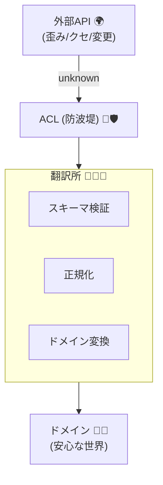

# 第28章：外部API境界（ACLの入門）：外の歪みを中に入れない📡🧼


外部APIって、便利なんだけど……だいたい“クセ”が強いです😵‍💫

* 命名が `snake_case` だったり🐍
* 数字が文字列で来たり `"1200"` とか😇
* 単位が違ったり（円？銭？秒？ミリ秒？）💸⏱️
* 仕様にない値が急に混ざったり（新しいステータス追加！）🚨

そこで登場するのが **ACL（Anti-Corruption Layer）** です✨
ざっくり言うと **「外部のクセを“翻訳”して、ドメイン（自分の中心）に入れない防波堤🌊🏰」** です！

---

## この章でできるようになること🎯✨

* 外部APIのレスポンスを **unknown扱い** から安全に取り込める🙂🛡️
* **スキーマ検証 → 正規化 → 翻訳（マッピング）** の流れを作れる🔄✨
* 外部の変化（項目追加/仕様変更）を **ACL内に閉じ込めて** 影響範囲を最小化できる✂️🏰
* エラーを「外→中」で扱いやすい形にして返せる🧯🫶

---

## ACLってどこに置くの？（超ざっくり地図）🗺️✨

イメージはこんな感じ👇

* 外部API 🌍
  ↓（ネットワーク・不確実・壊れやすい）
* **ACL（翻訳所）🧑‍💼📘**

  * 受信: unknown → スキーマ検証
  * 正規化: 単位/型/命名のゆれを整える
  * 翻訳: ドメイン型へ変換（VO/Entity）
    ↓（ここから先は信じる）
* ドメイン 🏰💎

この「翻訳所」に **外部の歪みを全部押し込める** のが勝ち筋です😆🛡️



---

## 最新ツール小ネタ（2026年1月時点）🧰✨

* TypeScript は **5.9 系が安定版として提供**され、5.9 のアナウンスも公式に出ています。([Microsoft for Developers][1])
* さらに TypeScript チームは **ネイティブ版（`@typescript/native-preview`）** のプレビューを出していて、VS Code拡張も案内されています。([Microsoft for Developers][2])
* Node.js は **Active LTS / Maintenance LTS** の考え方が明記されていて、運用はその範囲が推奨です。([nodejs.org][3])
* スキーマ検証ライブラリは、たとえば **Zod 4 が stable** として案内されています（Zod 4系は継続的に更新）。([Zod][4])
* ほかに **Valibot** みたいな軽量系もあります。([valibot.dev][5])

この章の例は **Zod** でいきます（人気・情報多めで学びやすいので）🙂✨

---

## ACLの基本レシピ（まずこれだけ覚えよ🍳✨）

外部APIの取り込みは、毎回この順番にすると安定します👇

1. **受け取った生データは unknown 扱い**🕵️‍♀️❓
2. **スキーマ検証**（形・型・必須/任意）📐✅
3. **正規化**（単位、大小文字、トリム、秒→ms、文字列→数値…）🧼✨
4. **翻訳（マッピング）**：外部DTO → ドメインVO/Entity 🏰💎
5. **エラー変換**：外のエラー → 中のエラー（層に合わせる）🧯🔄

これで「外が荒れても、中は平和」になります🕊️✨

---

## 例題：決済プロバイダAPIの“クセ”を封じ込める💳😵‍💫➡️🛡️

### 外部APIが返してくるレスポンス（例）📨

* 金額が文字列 `"1200"`
* 時刻が **秒**
* 命名が `snake_case`
* ステータスが謎の文字列（将来増えるかも）

こんな JSON が来るとします👇

```json
{
  "payment_id": "pay_9f8a",
  "amount": "1200",
  "currency": "jpy",
  "status": "paid",
  "created_at": 1737000000,
  "customer_email": "  Alice@Example.com "
}
```

---

## 実装の置き場所（おすすめ構成）📁✨

```text
src/
  domain/
    money.ts
    email.ts
    payment.ts
  acl/
    payfriend/
      schema.ts
      normalize.ts
      mapper.ts
      client.ts
      errors.ts
  boundary/
    checkout.ts
```

ポイントは **`acl/payfriend` の中だけで外部の歪みを完結** させること🙂🏰

---

## 1) ドメイン側（きれいな世界）🏰💎

### `Money`（例：マイナス禁止）💰🚫

```ts
// src/domain/money.ts
export type Currency = "JPY" | "USD";

export class Money {
  private constructor(
    public readonly amount: number,
    public readonly currency: Currency
  ) {}

  static create(amount: number, currency: Currency): Money {
    if (!Number.isFinite(amount)) throw new Error("Money.amount must be finite");
    if (amount < 0) throw new Error("Money.amount must be >= 0");
    return new Money(amount, currency);
  }
}
```

### `Email`（正規化込み：trim + 小文字化）📧🧼

```ts
// src/domain/email.ts
export class Email {
  private constructor(public readonly value: string) {}

  static create(raw: string): Email {
    const normalized = raw.trim().toLowerCase();
    if (!normalized.includes("@")) throw new Error("Invalid email");
    return new Email(normalized);
  }
}
```

### `PaymentStatus`（外部の値をそのまま使わない）🚦✨

```ts
// src/domain/payment.ts
import { Money } from "./money";
import { Email } from "./email";

export type PaymentStatus = "Pending" | "Succeeded" | "Failed" | "Refunded";

export class Payment {
  private constructor(
    public readonly id: string,
    public readonly money: Money,
    public readonly status: PaymentStatus,
    public readonly createdAt: Date,
    public readonly customerEmail: Email
  ) {}

  static create(args: {
    id: string;
    money: Money;
    status: PaymentStatus;
    createdAt: Date;
    customerEmail: Email;
  }): Payment {
    // ここにドメイン不変条件を追加していく
    return new Payment(
      args.id,
      args.money,
      args.status,
      args.createdAt,
      args.customerEmail
    );
  }
}
```

ドメインは **“自分ルールが通る世界”** にしてOKです🙂💎

---

## 2) ACL側：スキーマ検証（Zod）📐✅

```ts
// src/acl/payfriend/schema.ts
import { z } from "zod";

export const PayfriendPaymentSchema = z.object({
  payment_id: z.string(),
  amount: z.union([z.string(), z.number()]), // 文字列で来るかも！
  currency: z.string(),
  status: z.string(),
  created_at: z.number(), // 秒で来る想定
  customer_email: z.string()
});

export type PayfriendPaymentDTO = z.infer<typeof PayfriendPaymentSchema>;
```

ここが超大事👇
**外部の型は “ドメインに入れる前の一時型”**。永住させない😤🏠🚫

---

## 3) ACL側：正規化（汚れを落とす🧼✨）

```ts
// src/acl/payfriend/normalize.ts
import type { PayfriendPaymentDTO } from "./schema";

export type NormalizedPayfriendPayment = {
  paymentId: string;
  amount: number;          // numberへ
  currency: string;        // 大文字へ
  status: string;          // そのまま（次で翻訳）
  createdAtMs: number;     // msへ
  customerEmail: string;   // trim + lower はドメインEmailでもやるけど、ここでもOK
};

export function normalizePayfriend(dto: PayfriendPaymentDTO): NormalizedPayfriendPayment {
  const amount =
    typeof dto.amount === "string" ? Number(dto.amount) : dto.amount;

  return {
    paymentId: dto.payment_id,
    amount,
    currency: dto.currency.trim().toUpperCase(),
    status: dto.status.trim().toLowerCase(),
    createdAtMs: dto.created_at * 1000,
    customerEmail: dto.customer_email
  };
}
```

“秒→ms” とか “文字列→数値” とか、こういう事故ポイントは **ACLが全部背負う**💪😆

---

## 4) ACL側：翻訳（外→中のマッピング）🧑‍💼📘➡️🏰

```ts
// src/acl/payfriend/mapper.ts
import { Money, type Currency } from "../../domain/money";
import { Email } from "../../domain/email";
import { Payment, type PaymentStatus } from "../../domain/payment";
import type { NormalizedPayfriendPayment } from "./normalize";

function mapCurrency(cur: string): Currency {
  if (cur === "JPY" || cur === "USD") return cur;
  throw new Error(`Unsupported currency from provider: ${cur}`);
}

function mapStatus(st: string): PaymentStatus {
  // 外部の paid / pending / failed ... をドメイン語彙に翻訳する✨
  switch (st) {
    case "paid":
    case "succeeded":
      return "Succeeded";
    case "pending":
      return "Pending";
    case "failed":
      return "Failed";
    case "refunded":
      return "Refunded";
    default:
      // ここが“外部の仕様追加”に強くなるポイント💡
      throw new Error(`Unknown payment status from provider: ${st}`);
  }
}

export function toDomainPayment(n: NormalizedPayfriendPayment): Payment {
  const money = Money.create(n.amount, mapCurrency(n.currency));
  const email = Email.create(n.customerEmail);
  const createdAt = new Date(n.createdAtMs);

  return Payment.create({
    id: n.paymentId,
    money,
    status: mapStatus(n.status),
    createdAt,
    customerEmail: email
  });
}
```

✅ **外部の値（status/currency）をドメインに直通させない**
✅ **翻訳できない値は“ここで落とす”**（ログ/監視しやすい）

これで「変な値が内部を汚染する事故」が激減します🥹🛡️

---

## 5) ACL側：HTTPクライアント（fetch + タイムアウト）📡⏱️

外部APIは **遅い/落ちる/たまに壊れる** が前提😇
最低限、タイムアウトは付けよ〜！って感じです🙂

```ts
// src/acl/payfriend/client.ts
import { PayfriendPaymentSchema } from "./schema";
import { normalizePayfriend } from "./normalize";
import { toDomainPayment } from "./mapper";
import { ExternalApiError, ExternalSchemaError, ExternalMappingError } from "./errors";
import type { Payment } from "../../domain/payment";

export async function fetchPayment(paymentId: string): Promise<Payment> {
  const controller = new AbortController();
  const timeoutId = setTimeout(() => controller.abort(), 8_000);

  try {
    const res = await fetch(`https://api.payfriend.example/payments/${paymentId}`, {
      signal: controller.signal,
      headers: { "Accept": "application/json" }
    });

    if (!res.ok) {
      throw new ExternalApiError(`HTTP ${res.status}`);
    }

    const raw: unknown = await res.json();

    const parsed = PayfriendPaymentSchema.safeParse(raw);
    if (!parsed.success) {
      throw new ExternalSchemaError(parsed.error);
    }

    try {
      const normalized = normalizePayfriend(parsed.data);
      return toDomainPayment(normalized);
    } catch (e) {
      throw new ExternalMappingError(e);
    }
  } catch (e) {
    // AbortError もここに来る
    if (e instanceof ExternalApiError || e instanceof ExternalSchemaError || e instanceof ExternalMappingError) {
      throw e;
    }
    throw new ExternalApiError("Network/Timeout", e);
  } finally {
    clearTimeout(timeoutId);
  }
}
```

---

## 6) ACL側：エラー型（“どこで壊れたか”が一瞬で分かる🧯✨）

```ts
// src/acl/payfriend/errors.ts
import type { ZodError } from "zod";

export class ExternalApiError extends Error {
  constructor(message: string, public readonly cause?: unknown) {
    super(message);
    this.name = "ExternalApiError";
  }
}

export class ExternalSchemaError extends Error {
  constructor(public readonly zodError: ZodError) {
    super("External response schema mismatch");
    this.name = "ExternalSchemaError";
  }
}

export class ExternalMappingError extends Error {
  constructor(public readonly cause: unknown) {
    super("External response cannot be mapped to domain");
    this.name = "ExternalMappingError";
  }
}
```

これをやると、運用で

* 「通信が死んだ」📡💥
* 「外部レスポンスの形が変わった」📨🔧
* 「値はあるけど翻訳できない（未知ステータス等）」🌀
  がすぐ切り分けできます😆✨

---

## 7) 境界（Boundary）では“層に合わせて”返す🌉🧭

たとえばAPIハンドラ側では👇

* `ExternalSchemaError` → 502（相手の仕様変更っぽい）
* `ExternalApiError` → 504（タイムアウト）
* `ExternalMappingError` → 502（未知の値が来た）

みたいに変換すると、ユーザーにも優しいし運用もしやすいです🫶✨

---

## よくある外部APIの“歪み”チェックリスト✅😵‍💫

ACLに入れる前に、これを眺めると事故が減ります👇

* 数字が `"123"` で来る？🔢➡️🧾
* 日付が 秒/ミリ秒/ISO文字列？⏱️📅
* 通貨が小文字？空白混入？💴🧼
* enum（status）が増える可能性ある？🚦➕
* optional が突然 null になったりしない？🤹‍♀️
* 配列が空/重複/上限超えの時どうする？📦🚫
* 仕様にないキーが増える？（無視してOK？）🗝️➕

---

## ミニ課題（この章のゴール🎯✨）📝😊

### 課題1：未知ステータス耐性を上げる🚦🛡️

`mapStatus()` の default で落とす代わりに、次のどっちかにしてみてね👇

* A) `Result` で返して、境界で 502 にする
* B) `Unknown` ステータスをドメインに入れず、ACL内でログして落とす（ドメインは絶対に汚さない）

### 課題2：単位変換を1つ追加💱✨

例：amount が「銭（cents）」で来る想定にして、`Money` には「円」で入るように変換！

### 課題3：テスト（ゴールデンデータ方式）🧪✨

上の JSON を fixtures として置いて、

* 正常系（paid）
* 異常系（status="mystery"）
* 異常系（amount="not-a-number"）
  を3本テストにしてみよ🙂🎉

---

## AI活用（この章向けプロンプト集🤖✨）

* 「この外部APIレスポンスで起きがちな変換ミスを20個出して」🧠
* 「status の未知値が来たときの設計案を3パターン提案して。メリデメ付きで」⚖️
* 「この mapper のテストケース（境界値含む）を列挙して」🧪
* 「“単位ズレ”の例を10個作って、正規化関数の仕様に落として」📏

---

## まとめ：ACLは“翻訳所”。ドメインを守る最強の壁🏰🛡️✨

* 外部APIは変わる、壊れる、クセがある😇
* だから **ACLで unknown → 検証 → 正規化 → 翻訳** を徹底する🔄✨
* ドメインには **自分の言葉（型）だけ** を入れる💎🙂

次の章（テスト設計🧪😍）に繋がる最高の準備になりました〜！🎉✨

[1]: https://devblogs.microsoft.com/typescript/announcing-typescript-5-9/ "Announcing TypeScript 5.9 - TypeScript"
[2]: https://devblogs.microsoft.com/typescript/progress-on-typescript-7-december-2025/ "Progress on TypeScript 7 - December 2025 - TypeScript"
[3]: https://nodejs.org/en/about/previous-releases "Node.js — Node.js Releases"
[4]: https://zod.dev/v4 "Release notes | Zod"
[5]: https://valibot.dev/?utm_source=chatgpt.com "Valibot: The modular and type safe schema library"
