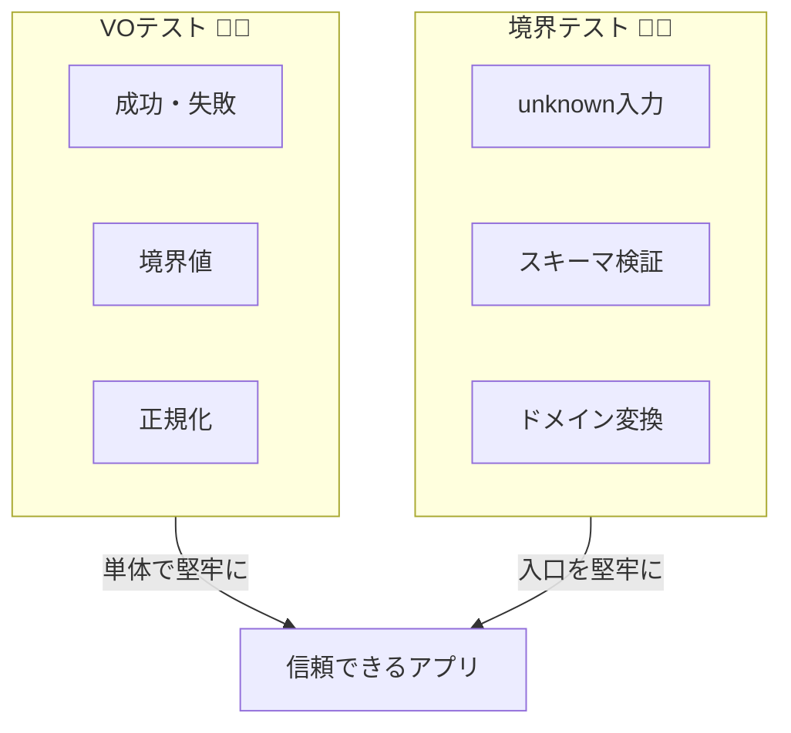

# 第29章：テスト設計：不変条件はテストが超やりやすい🧪😍


この章は「**不変条件（絶対に壊れちゃダメなルール）**」を、テストで**気持ちよく守り切る**回だよ〜！🎀✨
型＋境界で守れてると、テストって **むしろ簡単**になるの☺️💡

---

## 29-1. 今日のゴール🎯✨

* 値オブジェクト（VO）のテストが「短いのに強い💪」って分かる
* 境界（unknown→検証→変換）のテストを「最小本数」で固められる
* 「どこをテストする？」「どこはしない？」の線引きができる🙂🧭

---

## 29-2. 2026年のテスト道具ざっくり🧰✨

今どきTSテストはだいたいこのへんの選択になるよ〜👇

### ✅ ユニットテストのランナー

* **Vitest**：Viteネイティブで高速＆軽い✨（Vitest 4.0 が 2025-10-22 にリリース）([vitest.dev][1])
* **Jest**：定番。現在の安定版は **Jest 30.0** ([jestjs.io][2])

### ✅ 境界の実行時バリデーション（スキーマ）

* **Zod 4**：安定版になって、軽量＆高速方向に強化✨ ([Zod][3])
  `.safeParse()` で例外なし分岐できるのがテストと相性よすぎる🫶 ([GitHub][4])

（ちなみにTypeScript自体は 5.9 のリリースノートが 2026-01-19 更新になってるよ📌）([TypeScript][5])

---

## 29-3. 不変条件テストがラクになる理由🧠✨


不変条件を「型＋境界」で守ってる世界では、こうなる👇

### 💎 VO（値オブジェクト）

* `Email.parse(string)` みたいな **純粋関数に近い入口**になる
* 成功/失敗がはっきりして、テストが **表形式に並べやすい**🎉

### 🚧 境界（Boundary）

* `unknown` を受けて、`safeParse` → VO生成 → ドメイン型
* テストは「入力→結果（Ok/Err）」を確認するだけでOK🙂✨

つまり…
**「バグが起きやすい場所が“関数として切り出されてる”」＝テストしやすい** ってこと😍🧪



---

## 29-4. テストの設計図（まずこれだけ覚えて！）🗺️✨


### ① VOは “成功/失敗/境界値/正規化” の4点セット🎁

* ✅ 成功：普通に通る
* ❌ 失敗：空、形式不正、範囲外
* 📏 境界値：最小/最大ちょうど（例：長さ1、長さ50）
* 🧼 正規化：trim、大小文字、全角半角など（第14章のやつ！）

### ② 境界は “壊れた入力を安全に処理できるか” を見る🛡️

* input が `number` とか `null` とかでも **落ちずに**エラーになる
* スキーマOKでも、VOで弾くルールはちゃんと弾ける

### ③ テスト本数は「少なく、強く」🔥

* 同じ種類のテストを50本書くより
  **“落とし穴を塞ぐ10本”** のほうが価値あるよ〜🙂✨

---

## 29-5. まずはVOの例：Email💌（不変条件の代表）

### ✅ 仕様（不変条件）

* 空はダメ🙅‍♀️
* メール形式じゃないのもダメ🙅‍♀️
* 前後空白は削る🧼
* 大文字は小文字に正規化🔡

### 実装例（Resultで返すやつ）🧪

```ts
// src/result.ts
export type Ok<T> = { ok: true; value: T };
export type Err<E> = { ok: false; error: E };
export type Result<T, E> = Ok<T> | Err<E>;

export const ok = <T>(value: T): Ok<T> => ({ ok: true, value });
export const err = <E>(error: E): Err<E> => ({ ok: false, error });
```

```ts
// src/domain/email.ts
import { Result, ok, err } from "../result";

const EMAIL_RE = /^[^\s@]+@[^\s@]+\.[^\s@]+$/;

export class Email {
  private constructor(private readonly raw: string) {}

  static parse(input: string): Result<Email, "EMPTY" | "INVALID_FORMAT"> {
    const normalized = input.trim().toLowerCase();

    if (normalized.length === 0) return err("EMPTY");
    if (!EMAIL_RE.test(normalized)) return err("INVALID_FORMAT");

    return ok(new Email(normalized));
  }

  value(): string {
    return this.raw;
  }
}
```

---

## 29-6. VOテスト：短いのに強い😍🧪


```ts
// test/email.test.ts
import { describe, it, expect } from "vitest";
import { Email } from "../src/domain/email";

describe("Email.parse 💌", () => {
  it("空文字は EMPTY ❌", () => {
    const r = Email.parse("");
    expect(r.ok).toBe(false);
    if (r.ok) throw new Error("unreachable");
    expect(r.error).toBe("EMPTY");
  });

  it("形式が変なら INVALID_FORMAT ❌", () => {
    const r = Email.parse("not-mail");
    expect(r.ok).toBe(false);
    if (r.ok) throw new Error("unreachable");
    expect(r.error).toBe("INVALID_FORMAT");
  });

  it("前後空白＆大文字が正規化される 🧼🔡", () => {
    const r = Email.parse("  Taro@Example.COM  ");
    expect(r.ok).toBe(true);
    if (!r.ok) throw new Error("unreachable");
    expect(r.value.value()).toBe("taro@example.com");
  });
});
```

### ここがポイント💡✨

* 「成功」と「失敗」を **Resultで分岐**できるから
  テストが読みやすくて、事故りにくい🙂🫶

---

## 29-7. 境界テスト：unknown→スキーマ→VO（ここが“最強の防波堤”🌊🏰）


Zod 4 は安定化してるし、`safeParse()` がほんとに便利✨ ([Zod][3])
（例外投げない＝テストも書きやすい！）

```ts
// src/boundary/register.ts
import { z } from "zod";
import { Email } from "../domain/email";
import { Result, ok, err } from "../result";

const RegisterDto = z.object({
  email: z.string(),
  name: z.string().min(1),
});

export type RegisterError =
  | { type: "BAD_REQUEST"; issues: string[] }
  | { type: "DOMAIN_ERROR"; field: "email"; reason: string };

export function parseRegisterRequest(
  input: unknown
): Result<{ email: Email; name: string }, RegisterError> {
  const dto = RegisterDto.safeParse(input);
  if (!dto.success) {
    return err({
      type: "BAD_REQUEST",
      issues: dto.error.issues.map((i) => `${i.path.join(".")}:${i.message}`),
    });
  }

  const emailRes = Email.parse(dto.data.email);
  if (!emailRes.ok) {
    return err({ type: "DOMAIN_ERROR", field: "email", reason: emailRes.error });
  }

  return ok({
    email: emailRes.value,
    name: dto.data.name.trim(),
  });
}
```

### 境界テストは「2〜4本」で強くなる🧱✨

```ts
// test/register-boundary.test.ts
import { describe, it, expect } from "vitest";
import { parseRegisterRequest } from "../src/boundary/register";

describe("parseRegisterRequest 🚪", () => {
  it("入力が変でも落ちずに BAD_REQUEST ❌", () => {
    const r = parseRegisterRequest(123 as unknown);
    expect(r.ok).toBe(false);
    if (r.ok) throw new Error("unreachable");
    expect(r.error.type).toBe("BAD_REQUEST");
  });

  it("スキーマOKでもドメインNGなら DOMAIN_ERROR ❌", () => {
    const r = parseRegisterRequest({ email: "not-mail", name: "A" });
    expect(r.ok).toBe(false);
    if (r.ok) throw new Error("unreachable");
    expect(r.error).toMatchObject({ type: "DOMAIN_ERROR", field: "email" });
  });

  it("全部OKなら Ok ✅", () => {
    const r = parseRegisterRequest({ email: "a@b.com", name: "  hana  " });
    expect(r.ok).toBe(true);
    if (!r.ok) throw new Error("unreachable");
    expect(r.value.name).toBe("hana");
    expect(r.value.email.value()).toBe("a@b.com");
  });
});
```

---

## 29-8. カバレッジ（Coverage）は“使い方”が大事📊✨


Vitest 4 のカバレッジは設定がけっこう明確になってて、
`--coverage.enabled` みたいな指定がポイントになるよ〜🧠 ([vitest.dev][6])

例（npm scripts のイメージ）👇

```json
{
  "scripts": {
    "test": "vitest",
    "test:run": "vitest --run",
    "test:cov": "vitest --run --coverage.enabled --coverage.reporter=html"
  }
}
```

### でもね…😌

* **100%を目的にしない**（しんどくなるだけ）
* 狙うのは「不変条件が壊れるルートが全部塞がれてるか」🔒✨

---

## 29-9. よくある失敗パターン集😵‍💫（回避しよ！）


* ❌ 実装の内部をテストしすぎ（private変数とか）
  → ✅ **公開API（parse / create / boundary関数）だけ見る**
* ❌ モックだらけで現実とズレる
  → ✅ VOは基本モック不要、境界も薄いからモック少なめでOK
* ❌ エラーメッセージが毎回変わってテストが壊れる
  → ✅ メッセージ全文より **error code / type** を見る（Result型の勝ち🎉）

---

## 29-10. AI活用コーナー🤖✨（テスト観点のブースター🚀）


AIは「コード生成」より、ここが強いよ👇😍

* 「この不変条件が破れる入力パターンを20個出して」🧠
* 「境界値（最小/最大/ちょうど）を列挙して」📏
* 「正規化の揺れ（空白・大小・全角半角）を洗い出して」🧼
* 「このVOのテストを“最小本数で最大効果”にする案を出して」🧪✨

---

## 29-11. ミニ課題（章のゴール達成チェック）🎒🌸

### ✅ 課題A：VOテストを1本追加🧪

* Email以外のVOを1つ選んで

  * 成功1本
  * 失敗1本
  * 正規化1本
    を書く💪✨

### ✅ 課題B：境界テストを1本追加🚪

* `unknown` で “変な形” を入れても落ちないテストを書く
  （例：配列、null、フィールド欠落、型違い）

### ✅ できたら最高ボーナス🎁✨

* 「スキーマOKだけどVOでNG」パターンをもう1本追加（ここが事故りやすい！）

---

次の第30章は、ここまで作った「型＋境界＋テスト」を**小さく完成**させる卒業制作だよ〜🎓🌸
この章のテストが揃ってると、完成まで一気に楽になる☺️🫶

[1]: https://vitest.dev/blog/vitest-4?utm_source=chatgpt.com "Vitest 4.0 is out!"
[2]: https://jestjs.io/versions?utm_source=chatgpt.com "Jest Versions"
[3]: https://zod.dev/v4?utm_source=chatgpt.com "Release notes"
[4]: https://github.com/colinhacks/zod?utm_source=chatgpt.com "colinhacks/zod: TypeScript-first schema validation with ..."
[5]: https://www.typescriptlang.org/docs/handbook/release-notes/typescript-5-9.html?utm_source=chatgpt.com "Documentation - TypeScript 5.9"
[6]: https://vitest.dev/guide/coverage.html?utm_source=chatgpt.com "Coverage | Guide"
