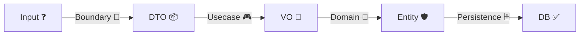

# 第30章：卒業制作：小さな題材で「型＋境界」を完成させる🎓🌸


やった〜！ついに卒業制作だよ〜！🎉🥳
この章は「これまでの全部を、1本の線につなげる」回です🧵✨
**“無効な状態が作れない”** を、ちゃんと動く形で完成させようね💎🛡️



---

## 0) 今日の“最新版メモ”🆕📌（作る時の目安）

* TypeScript の npm 最新は **5.9.3**（本日時点）だよ🟦✨ ([npm][1])
* Zod は **v4 が stable**、npm 最新は **4.3.5**（本日時点）だよ📐✨ ([Zod][2])
* Node.js は **v24 系が Active LTS**、直近だと **24.13.0 (LTS)** みたいな感じ（本日時点）🟩([nodejs.org][3])
* VS Code は **v1.108**（リリースノート上の Release date: 2026-01-08）🧠✨ ([code.visualstudio.com][4])

※ ついでに⚠️：npm は「似た名前の偽パッケージ」も現実にあるので、**スペルの確認**めっちゃ大事だよ…！😵‍💫（例：typescrip*t* っぽい別名など） ([Socket][5])

---

## 1) 今回作るもの：ミニ「注文」ドメイン🧾📦✨

### 作る機能は “2つだけ” 😊✌️

1. **注文を作る**（Create Order）🧾
2. **支払いにする**（Mark as Paid）💳

たったこれだけで、ちゃんと「型＋境界」の全部が入るよ🎯✨

---

## 2) 仕様（＝守る不変条件リスト）🛡️💎

### 入力（外から来るもの）

* customerId は文字列（でも中では “CustomerId” として扱いたい）🪪
* items は配列（最低1件）📦
* quantity は **1以上の整数** ➕
* price は **0以上** 💰
* 支払いは **Draft のときだけ** できる（Paid にしたらもう一回は無理）🚦

### ドメインの不変条件（中で絶対守る）

* `Quantity` は 1〜99（例）🧮
* `Money` は 0 以上💴
* `Items` は空禁止＆同じ productId の重複禁止（例）🚫
* `Order.status` は `"Draft" | "Paid"` のどちらか🏷️
* `"Paid"` にできるのは `"Draft"` からだけ🔁

---

## 3) プロジェクト構成（迷子防止マップ）🗺️✨

こんなフォルダにすると、境界がスッキリするよ〜😊

```text
src/
  domain/
    result.ts
    errors.ts
    valueObjects/
      CustomerId.ts
      ProductId.ts
      Quantity.ts
      Money.ts
    Order.ts
  boundary/
    createOrderBoundary.ts
  app/
    usecases.ts
test/
  domain.test.ts
  boundary.test.ts
```

* **domain/**：不変条件の城🏰💎（ここは一番大事）
* **boundary/**：外から来たものを整える関所🚪✅
* **app/**：ユースケース（操作の流れ）🎮

---

## 4) 実装ステップ（順番この通りでOK）🧑‍🍳✨

### Step A) Result 型を用意する📦🎯（例外を乱発しない）

**“失敗も仕様”** にするための基本セットだよ😊

```ts
// src/domain/result.ts
export type Result<T, E> =
  | { ok: true; value: T }
  | { ok: false; error: E };

export const Ok = <T>(value: T): Result<T, never> => ({ ok: true, value });
export const Err = <E>(error: E): Result<never, E> => ({ ok: false, error });
```

---

### Step B) ドメインエラーを「型」で固定する🧯🏷️

```ts
// src/domain/errors.ts
export type DomainError =
  | { type: "InvalidCustomerId"; message: string }
  | { type: "InvalidProductId"; message: string }
  | { type: "InvalidQuantity"; message: string }
  | { type: "InvalidMoney"; message: string }
  | { type: "EmptyItems"; message: string }
  | { type: "DuplicateItems"; message: string }
  | { type: "InvalidTransition"; message: string };
```

ポイント：**文字列メッセージを “最後に作る”** のがコツだよ🫶✨
（型の情報があると、UI用に変換しやすい！）

---

### Step C) 値オブジェクト（VO）を作る🎁💎

#### Quantity（1〜99）

```ts
// src/domain/valueObjects/Quantity.ts
import { Err, Ok, Result } from "../result";
import { DomainError } from "../errors";

export type Quantity = number & { readonly __brand: "Quantity" };

export const Quantity = {
  create(n: number): Result<Quantity, DomainError> {
    if (!Number.isInteger(n)) {
      return Err({ type: "InvalidQuantity", message: "数量は整数でね🙏" });
    }
    if (n < 1 || n > 99) {
      return Err({ type: "InvalidQuantity", message: "数量は1〜99だよ🙏" });
    }
    return Ok(n as Quantity);
  },
};
```

#### Money（0以上）

```ts
// src/domain/valueObjects/Money.ts
import { Err, Ok, Result } from "../result";
import { DomainError } from "../errors";

export type Money = number & { readonly __brand: "Money" };

export const Money = {
  create(n: number): Result<Money, DomainError> {
    if (typeof n !== "number" || Number.isNaN(n)) {
      return Err({ type: "InvalidMoney", message: "金額はnumberでね🙏" });
    }
    if (n < 0) {
      return Err({ type: "InvalidMoney", message: "金額はマイナス不可だよ🙏" });
    }
    return Ok(n as Money);
  },
};
```

※ Brand は “混ぜない” ための簡易テクだよ🏷️😎
（本格的にやるなら branded/opaque いろいろあるけど、卒業制作はこれで十分！）

---

### Step D) Entity：Order を作る🏰📦

```ts
// src/domain/Order.ts
import { Result, Ok, Err } from "./result";
import { DomainError } from "./errors";
import { Quantity } from "./valueObjects/Quantity";
import { Money } from "./valueObjects/Money";

export type CustomerId = string & { readonly __brand: "CustomerId" };
export type ProductId = string & { readonly __brand: "ProductId" };

export type OrderStatus = "Draft" | "Paid";

export type OrderItem = Readonly<{
  productId: ProductId;
  quantity: ReturnType<typeof Quantity.create> extends { ok: true; value: infer T } ? T : never;
  price: ReturnType<typeof Money.create> extends { ok: true; value: infer T } ? T : never;
}>;

export type Order = Readonly<{
  id: string; // 今回は簡単に string（本気なら OrderId VO）
  customerId: CustomerId;
  items: readonly OrderItem[];
  status: OrderStatus;
}>;

const isNonEmpty = <T>(xs: readonly T[]) => xs.length > 0;

const hasDuplicateProduct = (items: readonly OrderItem[]) => {
  const set = new Set(items.map(i => i.productId));
  return set.size !== items.length;
};

export const Order = {
  create(args: {
    id: string;
    customerId: CustomerId;
    items: readonly OrderItem[];
  }): Result<Order, DomainError> {
    if (!isNonEmpty(args.items)) {
      return Err({ type: "EmptyItems", message: "商品が1つ以上必要だよ🙏" });
    }
    if (hasDuplicateProduct(args.items)) {
      return Err({ type: "DuplicateItems", message: "同じ商品が重複してるよ🙏" });
    }
    return Ok({
      id: args.id,
      customerId: args.customerId,
      items: args.items,
      status: "Draft",
    });
  },

  markPaid(order: Order): Result<Order, DomainError> {
    if (order.status !== "Draft") {
      return Err({ type: "InvalidTransition", message: "支払いはDraftのときだけだよ🙏" });
    }
    return Ok({ ...order, status: "Paid" });
  },
};
```

ここ超大事💡

* **Order の中に if がいてOK**（むしろここが “最後の砦” 🛡️）
* 外からの入力チェックは boundary がやるけど、**domain でも必ず守る**（二段構え✨）

---

### Step E) 境界：unknown を Zod で “形” にする🚪📐✅

Zod v4 は stable で、現時点の最新版も npm にあるよ〜📐✨ ([Zod][2])

```ts
// src/boundary/createOrderBoundary.ts
import { z } from "zod";

export const CreateOrderSchema = z.object({
  customerId: z.string().min(1),
  items: z.array(
    z.object({
      productId: z.string().min(1),
      quantity: z.number().int(),
      price: z.number(),
    })
  ).min(1),
});

export type CreateOrderDTO = z.infer<typeof CreateOrderSchema>;

export const parseCreateOrder = (input: unknown) => {
  // safeParseで例外を出さない😊
  return CreateOrderSchema.safeParse(input);
};
```

---

### Step F) DTO → ドメイン変換（ここが“山場”🏔️🔗）

```ts
// src/app/usecases.ts
import { parseCreateOrder } from "../boundary/createOrderBoundary";
import { Err, Ok, Result } from "../domain/result";
import { DomainError } from "../domain/errors";
import { Quantity } from "../domain/valueObjects/Quantity";
import { Money } from "../domain/valueObjects/Money";
import { Order } from "../domain/Order";

type ApiError =
  | { status: 400; message: string; details?: unknown }
  | { status: 500; message: string };

type ApiResponse<T> = { status: 200 | 201; body: T } | ApiError;

const toBadRequest = (message: string, details?: unknown): ApiError =>
  ({ status: 400, message, details });

const domainErrorToMessage = (e: DomainError) => e.message;

export const createOrderUsecase = (input: unknown): ApiResponse<{ orderId: string }> => {
  const parsed = parseCreateOrder(input);
  if (!parsed.success) {
    return toBadRequest("入力が変だよ🙏（項目を確認してね）", parsed.error.flatten());
  }

  const dto = parsed.data;

  // ここから“ドメインOK”にする💎
  const customerId = dto.customerId as any; // 卒業制作なので簡略（本気ならCustomerId VO）
  const items: any[] = [];

  for (const it of dto.items) {
    const q = Quantity.create(it.quantity);
    if (!q.ok) return toBadRequest(domainErrorToMessage(q.error));

    const p = Money.create(it.price);
    if (!p.ok) return toBadRequest(domainErrorToMessage(p.error));

    items.push({
      productId: it.productId as any,
      quantity: q.value,
      price: p.value,
    });
  }

  const created = Order.create({
    id: crypto.randomUUID(),
    customerId,
    items,
  });

  if (!created.ok) return toBadRequest(domainErrorToMessage(created.error));

  return { status: 201, body: { orderId: created.value.id } };
};

export const markPaidUsecase = (order: any): ApiResponse<{ status: string }> => {
  // 本当は order は domain の Order を受ける想定だよ😊
  const paid = Order.markPaid(order);
  if (!paid.ok) return toBadRequest(domainErrorToMessage(paid.error));
  return { status: 200, body: { status: paid.value.status } };
};
```

> 💡ポイント
>
> * Schema OK = “形がOK”
> * VO OK = “ルールがOK”
> * Entity OK = “全体としてOK”
>   この3段階が揃うと、めっちゃ堅いよ🛡️✨

---

## 5) テスト（卒業制作の得点源🧪😍）

### ドメインのテスト：成功/失敗が書きやすい🎉

```ts
// test/domain.test.ts
import { describe, expect, test } from "vitest";
import { Quantity } from "../src/domain/valueObjects/Quantity";
import { Money } from "../src/domain/valueObjects/Money";
import { Order } from "../src/domain/Order";

describe("ValueObjects", () => {
  test("Quantity: 0 is NG", () => {
    const r = Quantity.create(0);
    expect(r.ok).toBe(false);
  });

  test("Money: -1 is NG", () => {
    const r = Money.create(-1);
    expect(r.ok).toBe(false);
  });
});

describe("Order", () => {
  test("cannot markPaid twice", () => {
    const q = Quantity.create(1);
    const p = Money.create(100);
    if (!q.ok || !p.ok) throw new Error("setup failed");

    const created = Order.create({
      id: "o1",
      customerId: "c1" as any,
      items: [{ productId: "p1" as any, quantity: q.value, price: p.value }],
    });
    if (!created.ok) throw new Error("setup failed");

    const paid1 = Order.markPaid(created.value);
    expect(paid1.ok).toBe(true);

    const paid2 = Order.markPaid(paid1.ok ? paid1.value : created.value);
    expect(paid2.ok).toBe(false);
  });
});
```

---

### 境界のテスト：unknown → エラーが親切か確認🫶

```ts
// test/boundary.test.ts
import { describe, expect, test } from "vitest";
import { createOrderUsecase } from "../src/app/usecases";

describe("Boundary", () => {
  test("invalid input returns 400", () => {
    const res = createOrderUsecase({ customerId: "", items: [] });
    expect("status" in res && res.status).toBe(400);
  });

  test("valid input returns 201", () => {
    const res = createOrderUsecase({
      customerId: "c1",
      items: [{ productId: "p1", quantity: 1, price: 100 }],
    });
    expect(res.status).toBe(201);
  });
});
```

---

## 6) AI 活用：卒業制作で一番効く使い方🤖🔍✨

### 使う場所はここ！💡

* ✅ **不変条件が破れるルート探し**（レビュー）
* ✅ **テストケース増やし**
* ✅ **境界値（0/1/最大/空/重複）洗い出し**

### そのまま投げてOKなプロンプト例🗣️✨

* 「このドメインの不変条件を10個に増やして、優先度も付けて」🧠📋
* 「Quantity/Money/items の境界値テストを追加して」🧪➕
* 「Order.markPaid が破れる経路がないかレビューして」🔍
* 「ユーザー向けエラーメッセージをもっと優しくして」🫶🌸

---

## 7) 卒業チェックリスト（これ全部YESなら合格💮）✅✅✅

* [ ] **無効な状態を “作れない”**（Quantity/Money/items）🔒
* [ ] **unknown は境界で止めている**🚪🛑
* [ ] **Schema OK と Domain OK を分けている**📐💎
* [ ] **更新は “状態遷移” として守れている**🚦
* [ ] **エラーが親切（どこがダメか分かる）**🫶
* [ ] **テストがある（成功/失敗）**🧪✨

---

## 8) 仕上げの一言（ここまで来たら最強🌟）

この卒業制作が完成したら、もうあなたは
**「型＋境界で、不変条件を守る設計」** を “実装で説明できる人” だよ🎓💎✨

次に進むなら（おすすめ順）👇😆

* 永続化（DB読み書き変換）を足す🗄️🔄
* 外部APIの変換（ACL）を足す📡🧼
* 状態を増やして軽い状態機械にする🚦✨

必要なら、この卒業制作を **もう少しだけ実戦っぽい形（API/DB/React UI）** に育てる版も作れるよ〜！🥳🌸

[1]: https://www.npmjs.com/package/typescript?utm_source=chatgpt.com "TypeScript"
[2]: https://zod.dev/v4?utm_source=chatgpt.com "Release notes"
[3]: https://nodejs.org/en/about/previous-releases?utm_source=chatgpt.com "Node.js Releases"
[4]: https://code.visualstudio.com/updates?utm_source=chatgpt.com "December 2025 (version 1.108)"
[5]: https://socket.dev/blog/10-npm-typosquatted-packages-deploy-credential-harvester?utm_source=chatgpt.com "10 npm Typosquatted Packages Deploy Multi-Stage ..."
