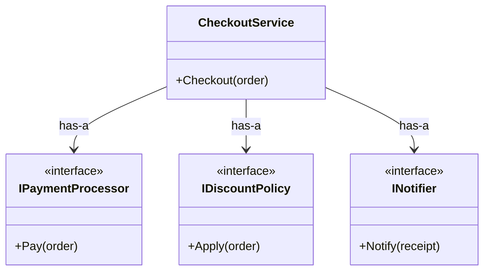

# 第01章：この講座のゴールと“合成”のイメージ作り🧠🧩

---

## 0) まず最初に：いまの「最新」だけサクッと押さえる📌✨

* **C# の最新は C# 14**で、**.NET 10**でサポートされています。([Microsoft Learn][1])
* **.NET 10 は LTS（長期サポート）**として提供されていて、2025-11-11 にリリースされています。([Microsoft for Developers][2])
  （この講座のサンプルや考え方も、この世代の前提で「今っぽく」進めるね😊🪄）

---

## 1) この章のゴール🎯（終わる頃にできるようになること）


この章が終わったら、次の3つができればOKだよ〜！🙆‍♀️✨

1. 「合成」ってなに？を **説明できる（ふわっとでOK）**🧩
2. 仕様を見て「ここ変わりそう…！」を **嗅ぎ分けられる**👃💥
3. “部品で組み立てる”イメージで **簡単な設計メモが書ける**📝✨

---

## 2) 合成優先って、ひとことで言うと？🧠🧩


**「クラスを“血筋”で増やす前に、機能を“部品”として組み合わせよう」**って考え方だよ〜😊🧱

* 継承：**is-a（〜は〜である）**の関係になりやすい
* 合成：**has-a（〜を持っている）**の関係で、部品を差し替えやすい🔁✨

「継承より合成」って、継承を否定する呪文じゃなくて
**“まず合成を検討すると壊れにくいことが多い”**っていう「設計のクセづけ」だよ🙂🧩
（一般に “Composition over inheritance” として紹介される考え方だね📚）([ウィキペディア][3])

---

## 3) 超わかる例え：継承＝血縁、合成＝LEGO🧱👨‍👩‍👧‍👦


ここめっちゃ大事だから、最初に“感覚”を作っちゃおう😄✨

### 継承のイメージ👨‍👩‍👧‍👦

「親の特徴を子が引き継ぐ」

* 良いところ：共通の仕組みをまとめやすい🙆‍♀️
* つらいところ：親をいじると子が巻き添えになりがち💥😱

### 1) 「継承（is-a）」と「合成（has-a）」の直感イメージ🖼️


継承は **「親のマネをする（遺伝）」** 🧬
合成は **「道具を持つ（装備）」** 🛠️

この違いが、のちのち **「変更のしやすさ」** に巨大な影響を与えます⚠️

---

## 2) 継承（Inheritance）のおさらい🤖
### 合成のイメージ🧱

「必要な部品を組み合わせる」

* 良いところ：部品を差し替えやすい🔁✨（変更に強い）
* つらいところ：最初は部品分けに慣れが必要🙂💦

---

## 4) “壊れにくい設計”って、結局なに？🛡️✨


超シンプルに言うとこれ👇

✅ **変更が来ても、直す場所が少ない**
✅ **影響範囲が読みやすい（事故りにくい）**
✅ **追加の要望が来ても、既存コードを壊しにくい**

そして、その第一歩がこの章のテーマ👇
👉 **「変わりそうなところを先に見つける」**👀📝

---

## 5) 章のメイン：変更が来そうな場所を“メモる”練習📝🌪️

ここからハンズオンだよ〜！🧪✨
今日のゴールは「コードを書く」より **“設計の下ごしらえ”**🍳みたいな感じ！

### 題材（ミニ仕様）📦

ECっぽい処理を想像してね🛒✨

* 支払い：クレカ / コンビニ / Pay系 …増えそう💳🏪📱
* 割引：新規割 / 学割 / 期間限定 …増えそう🎟️📆
* 通知：メール / SMS / アプリ通知 …増えそう📧📱🔔

---

## 6) ハンズオン🧪（合計20〜25分）


「通知機能をメールからSlackに変えたい」
「割引ロジックをGW限定に変えたい」

こういう変更が来たとき、**継承だと「親クラス」を直す羽目になりがち** ですが、
合成なら **「LEGOブロックを付け替えるだけ」** で済みます🧱✨

では、実際にコードを書いて「その感覚」を掴みましょう！👩‍💻👨‍💻

---

### Step1（5分）「変化点メモ」を作る📝🌪️

紙でもOK！テキストでもOK！
次の問いに答えて、箇条書きしてね😊✨

* どこが増えそう？（種類が増える）🌱
* どこが頻繁に変わりそう？（ルール変更が多い）🔁
* どこが外部に依存しそう？（API/サービス/DBなど）🌍

例👇

* 支払い方法：増える🌱
* 割引ルール：増える＆変わる🔁
* 通知手段：増える🌱
* 税率や手数料：変わる🔁

---

### Step2（7分）「部品候補リスト」を作る🧩📝

次は、「変わりそうなもの」を **部品（コンポーネント）**として切り出すイメージ！

例👇

* `支払い` は部品：`IPaymentProcessor`
* `割引` は部品：`IDiscountPolicy`
* `通知` は部品：`INotifier`

ポイントはこれ👇
✅ “1つの部品＝1つの役割” くらいの感覚でOK🙆‍♀️✨

---

### Step3（10分）LEGO設計スケッチを描く🧱✨

「本体（司令塔）」があって、そこに部品を挿す感じ！

* 司令塔：`CheckoutService`（例）
* 部品：支払い・割引・通知

イメージ👇（超ざっくりでOK）

* CheckoutService

  * has-a Payment
  * has-a Discount
  * has-a Notifier

---

## 7) “合成ってこういうコード”の最小サンプル👀🧩


まだ深掘りしないけど、「合成っぽさ」をチラ見せするね😊✨
（次の章以降でちゃんと作り込むよ〜🔧）

```csharp
public interface IPaymentProcessor
{
    Receipt Pay(Order order);
}

public interface IDiscountPolicy
{
    Order Apply(Order order);
}

public interface INotifier
{
    void Notify(Receipt receipt);
}

public sealed class CheckoutService
{
    private readonly IPaymentProcessor _payment;
    private readonly IDiscountPolicy _discount;
    private readonly INotifier _notifier;

    public CheckoutService(IPaymentProcessor payment, IDiscountPolicy discount, INotifier notifier)
    {
        _payment = payment;
        _discount = discount;
        _notifier = notifier;
    }

    public Receipt Checkout(Order order)
    {
        var discounted = _discount.Apply(order);
        var receipt = _payment.Pay(discounted);
        _notifier.Notify(receipt);
        return receipt;
    }
}
```
<!-- めちゃくちゃ大事な図なので、コードの下に追加します！ -->


ここでの“合成の気持ち”はこれだけ覚えればOK！🙆‍♀️✨

* `CheckoutService` は **部品に仕事を頼む**（自分で全部やらない）💁‍♀️📦
* 依存（支払い/割引/通知）を **差し替えできる形**にしておく🔁🧩

---

## 8) AI活用🤖💬（この章で使う“ちょうどいい”使い方）

「答えを写す」じゃなくて、**予想・案出し・レビュー**に使うと強いよ〜🫶✨

### ① 変わりそうポイント予測🌪️

* 「この仕様、将来変更されそうな点を10個あげて。理由も短く」
* 「増えそうな“種類”と、変わりそうな“ルール”を分けて」

### ② 部品分けの提案🧩

* 「この仕様を“部品”に分けるなら、責務の切り方を3案」
* 「部品のインターフェース名を分かりやすく提案して」

### ③ 継承でやると辛くなるポイント👻

* 「この仕様を継承で作った場合に起きやすい事故を具体例で」

---

## 9) 3分ミニチェック✅✨（超かんたん）


次のうち「合成の考え方っぽい」のはどれ？（複数OK）🙂

1. 支払いが増えたら、`CheckoutService` に `if` を足し続ける
2. 支払いを `IPaymentProcessor` として差し替え可能にする
3. “学割”追加のたびに `DiscountBase` を継承したクラスを量産する
4. 通知を `INotifier` にして、メール/SMS を差し替えにする

👉 正解は **2 と 4** だよ〜！🎉🧩

---

## 10) 今日のまとめ📦✨（持ち帰り成果物）

この章の成果物は「コード」じゃなくて、これ！👜💕

* ✅ 変化点メモ📝🌪️
* ✅ 部品候補リスト🧩
* ✅ LEGO設計スケッチ🧱✨

これがあるだけで、次章からの理解が爆速になるよ⚡😆

---

## 11) 宿題（5分でOK）📮😊

自分の過去コード（小さめでOK）を1つ選んで👇

* 「増えそう／変わりそう」を **3つだけ**メモ📝
* 「部品にできそう」を **1つだけ**書く🧩

---

## 次章予告📣✨

次は「継承って実際どこが辛くなるの？」を、**悪者にせず**ちゃんと体験する章だよ🙂🧪
（親を1行変えたら子がズレる、みたいな“あるある”を安全に味わう🍿😱）

[1]: https://learn.microsoft.com/en-us/dotnet/csharp/whats-new/csharp-14?utm_source=chatgpt.com "What's new in C# 14"
[2]: https://devblogs.microsoft.com/dotnet/announcing-dotnet-10/?utm_source=chatgpt.com "Announcing .NET 10"
[3]: https://en.wikipedia.org/wiki/Composition_over_inheritance?utm_source=chatgpt.com "Composition over inheritance"
