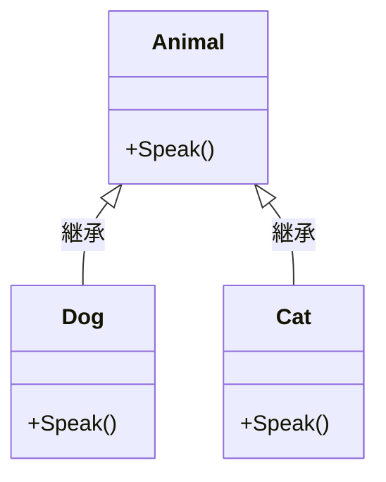

# 第02章：超ミニ復習：継承でできること／できないこと

## 0. この章のゴール🎯

継承を「悪者」にしないで、**性質（得意・苦手）**をちゃんと知る回だよ🙂
このあと合成（Composition）を学ぶときに、
「どこまで継承で粘ってOK？」「ここから先は合成がラク！」が見分けられるようになる👀✨

---

## 1. 継承って、結局なにが嬉しいの？🙂🧬


継承はひとことで言うと **is-a（〜は〜の一種）** の関係で、共通の土台を共有する仕組みだよ📦

### 継承が得意なこと✅

* **共通のデータ・共通の処理をまとめられる**（コードの重複を減らせる）🧹
* **ポリモーフィズム（多態性）**で、呼び出し側が「同じように扱える」🔁
  例：`List<Animal>` に `Dog` と `Cat` が混ざってても、`Speak()` を呼ぶだけでOK🐶🐱
  （この仕組み自体が C# のオブジェクト指向の大事な柱だよ） ([Microsoft Learn][1])

### 継承が苦手になりやすいこと⚠️

* 親の変更が、子に “思わぬ副作用” を飛ばす（**壊れやすい**）💥
* 派生が増えると、修正の影響範囲が読みづらくなる（次章でやるやつ🌲）👻

---

## 2. 4つのキーワードを“超ざっくり”復習🔧✨

この章で触るのはこの4つ👇（C#の継承を語る基本セット！）

### `virtual`（親）🧡

「このメソッド、子が上書きしていいよ〜」の印🪄
([Microsoft Learn][2])

### `override`（子）💛

「親の `virtual` / `abstract` を、私は上書きします！」の宣言✍️
([Microsoft Learn][3])

### `abstract`（親）💚

「ここは未完成！子が必ず作ってね！」という強制🧩
抽象クラスは `new` できないよ〜🙅‍♀️
([Microsoft Learn][4])

### `sealed`（親 or 子）💙

「これ以上の継承（or 上書き）を止めます！」🛑
クラスを `sealed` にすると継承禁止、`sealed override` にすると“ここで上書き打ち止め”になるよ。 ([Microsoft Learn][5])

---

## 3. ハンズオン①：`virtual/override` の挙動を体で覚える🧪😺


### 3-1. まずは普通の継承（上書きできる）✅

```csharp
using System;

class Animal
{
    public virtual void Speak()
    {
        Console.WriteLine("..."); // 親のデフォルト
    }
}

class Dog : Animal
{
    public override void Speak()
    {
        Console.WriteLine("わん！🐶");
    }
}

class Cat : Animal
{
    public override void Speak()
    {
        Console.WriteLine("にゃー🐱");
    }
}

class Program
{
    static void Main()
    {
        Animal[] animals = { new Dog(), new Cat(), new Animal() };
        foreach (var a in animals)
            a.Speak();
    }
}
```



**ポイント**📝

* 呼び出し側は `Animal` として扱ってるのに、実際は `Dog/Cat` の `Speak()` が動くよ🔁
* これがポリモーフィズム（多態性）だよ〜✨ ([Microsoft Learn][1])

---

## 4. ハンズオン②：`abstract` で「必ず実装」を強制する🧪🔧


「土台は共通だけど、ここだけは必ず子が作る」みたいなときに使うよ🧩

```csharp
using System;

abstract class Shape
{
    public abstract double Area(); // 未完成！子が必ず作る
}

class Circle : Shape
{
    public double Radius { get; }
    public Circle(double radius) => Radius = radius;

    public override double Area() => Math.PI * Radius * Radius;
}

class Program
{
    static void Main()
    {
        Shape s = new Circle(2);
        Console.WriteLine(s.Area());
    }
}
```

**ポイント**📝

* `abstract class` は `new Shape()` できない🙅‍♀️
* `abstract` メソッドは、非 `abstract` の子が必ず `override` しないとコンパイルエラーになるよ🔥 ([Microsoft Learn][4])

---

## 5. ハンズオン③：`sealed` で「ここで止める」🛑✨


### 5-1. クラスを `sealed`（もう継承させない）

```csharp
sealed class FinalLogger
{
    public void Log(string message) => Console.WriteLine(message);
}
```

### 5-2. `sealed override`（この上書きで打ち止め）

```csharp
class A
{
    public virtual void DoWork() => Console.WriteLine("A");
}

class B : A
{
    public override void DoWork() => Console.WriteLine("B");
}

class C : B
{
    public sealed override void DoWork() => Console.WriteLine("C (ここで打ち止め)");
}
```

**ポイント**📝

* `sealed override` は「これ以上ここは変えさせない」って意思表示になるよ🧷
* C# の公式説明でもこの形が紹介されてるよ。 ([Microsoft Learn][1])

---

## 6. いよいよ本題：「親をちょっと変えたら子が死ぬ」ってなに？💥😱

継承は “強い結びつき” になりやすい。だから親の変更が子へ波及しがち😵‍💫

ここでは **ありがちな事故パターン**を2つだけ体験するよ（超重要！）🔥

---

## 7. ハンズオン（本命）🧪：親に1行足しただけで、子が壊れる😱💥


### 事故パターンA：親のコンストラクタで `virtual` を呼ぶ（超危険）☠️

「親の初期化中に、子の上書きメソッドが先に動く」事故だよ😭

#### 7-1. 壊れるコード（わざと）

```csharp
using System;

class BaseReport
{
    public BaseReport()
    {
        // 親のつもり：初期化のついでに1行ログ出すか〜🙂（←これが地雷）
        Print(); // ★ virtual 呼び出し（危険）
    }

    public virtual void Print()
    {
        Console.WriteLine("BaseReport");
    }
}

class FancyReport : BaseReport
{
    private readonly string _title;

    public FancyReport(string title)
    {
        _title = title; // ← ここは「子のコンストラクタ」なので後で実行される
    }

    public override void Print()
    {
        // _title がまだ入ってないタイミングで呼ばれる可能性がある😱
        Console.WriteLine($"FancyReport: {_title.ToUpper()}");
    }
}

class Program
{
    static void Main()
    {
        var r = new FancyReport("hello");
    }
}
```

**何が起きる？😱**

* `BaseReport()` の途中で `Print()` が呼ばれる
* その `Print()` は **子の override** が呼ばれちゃう
* でも子のフィールド `_title` はまだ初期化前 → 例外や想定外挙動のもと💥

#### 7-2. 安全な直し方（基本）

✅ **コンストラクタでは virtual を呼ばない**
初期化が終わってから呼ぶ（`Init()` を明示的に呼ぶ / Factory を使う、など）🧯

```csharp
using System;

class BaseReport
{
    public void PrintAfterConstructed()
    {
        // ここなら子のコンストラクタが終わってる✨
        PrintCore();
    }

    protected virtual void PrintCore()
    {
        Console.WriteLine("BaseReport");
    }
}

class FancyReport : BaseReport
{
    private readonly string _title;
    public FancyReport(string title) => _title = title;

    protected override void PrintCore()
    {
        Console.WriteLine($"FancyReport: {_title.ToUpper()}");
    }
}

class Program
{
    static void Main()
    {
        var r = new FancyReport("hello");
        r.PrintAfterConstructed();
    }
}
```

---

### 事故パターンB：親の「たった1行変更」で、子の結果が変わる😵‍💫

「子は親の内部ロジックに依存してしまう」パターン。

#### 7-3. まずは動く版

```csharp
using System;

class PriceCalculator
{
    public virtual decimal Calc(decimal price)
    {
        return price; // 親：そのまま返す
    }
}

class MemberPriceCalculator : PriceCalculator
{
    public override decimal Calc(decimal price)
    {
        var basePrice = base.Calc(price);
        return basePrice * 0.9m; // 10%引き
    }
}

class Program
{
    static void Main()
    {
        var calc = new MemberPriceCalculator();
        Console.WriteLine(calc.Calc(101m)); // 90.9
    }
}
```

#### 7-4. 親に「丸め」を1行足す（よくある変更）

```csharp
class PriceCalculator
{
    public virtual decimal Calc(decimal price)
    {
        price = Math.Round(price); // ★たった1行
        return price;
    }
}
```

**はい、子の結果も変わる😱**

* 101 → 101（Roundしても同じ）ならまだ平和
* 101.4 とかが来た瞬間、子の割引結果が変わってテストが落ちる💥
* 「子は何も変えてないのに…」が起きるのが継承の怖いところ😵‍💫

> こういう「親の変更が子に波及する」性質が、継承が“変更に弱い”と言われる理由だよ🙂

---

## 8. `override` と `new` の超ミニ注意（事故りやすい）⚠️🌀


同名メソッドがあるとき、**上書き（override）**なのか **隠す（new）**なのかで挙動が変わるよ😱
公式にも “使い分け” の説明があるくらい事故りやすい分野！ ([Microsoft Learn][6])

* `override`：親の仮想呼び出しを差し替える（多態性が効く）✅
* `new`：親のメソッドを“隠す”（型が親だと親が呼ばれる）😵‍💫

このへんは「合成優先」に行くと遭遇率が減るから、今日は“注意だけ”でOK🙆‍♀️

---

## 9. AI活用コーナー🤖🕵️‍♀️（この章のおすすめプロンプト）

そのまま貼って使ってOKだよ📋✨

### 2) 継承の「ここが危ない」💀

匂いを嗅いでもらう👃💥

* 「この継承設計で、変更に弱いポイントを3つ指摘して。理由も短く」
* 「親クラスの変更が子に波及しそうな箇所を列挙して」

### 9-2. “親を変えたら子が死ぬ” をレビューしてもらう🔍

* 「このコードで、親の変更が子を壊す可能性があるパターンを教えて（例：virtual呼び出し、事前条件の変更など）」

### 9-3. テスト案を出してもらう✅

* 「この `Calc` の仕様変更（丸め追加）で壊れそうなテストケースを10個出して」

---

## 10. まとめ：継承は悪じゃない。でも“強い結びつき”🙂🧬

* 継承は **is-a** と **多態性** を自然に作れるのが強み🔁 ([Microsoft Learn][1])
* でも親子がガッチリ結びつくから、**親の小変更が子に波及**しやすい💥
* `virtual/override/abstract/sealed` は “継承をコントロールするレバー”🔧 ([Microsoft Learn][2])

---

## 11. 次章へのつなぎ🧩🌲

次は **「派生クラスが増え続ける地獄」**を観察するよ👻🌳
今日の“継承の性質”が分かってると、
「あ、これ増殖フラグだ…！」って一発で気づけるようになるはず🙂✨

---

### おまけ：いまどきC#の“拡張”の話（チラ見せ）👀✨

最近の C# 14 では **拡張メンバー（extension members）** が追加されて、拡張プロパティ等も書ける方向が進んでるよ（継承以外で“機能を足す”選択肢が増えてる感じ）🧩✨ ([Microsoft Learn][7])

[1]: https://learn.microsoft.com/en-us/dotnet/csharp/fundamentals/object-oriented/polymorphism?utm_source=chatgpt.com "Polymorphism - C# | Microsoft Learn"
[2]: https://learn.microsoft.com/en-us/dotnet/csharp/language-reference/keywords/virtual?utm_source=chatgpt.com "virtual keyword - C# reference"
[3]: https://learn.microsoft.com/en-us/dotnet/csharp/language-reference/keywords/override?utm_source=chatgpt.com "override modifier - C# reference"
[4]: https://learn.microsoft.com/en-us/dotnet/csharp/language-reference/keywords/abstract?utm_source=chatgpt.com "abstract keyword - C# reference"
[5]: https://learn.microsoft.com/en-us/dotnet/csharp/programming-guide/classes-and-structs/abstract-and-sealed-classes-and-class-members?utm_source=chatgpt.com "Abstract and Sealed Classes and Class Members - C#"
[6]: https://learn.microsoft.com/en-us/dotnet/csharp/programming-guide/classes-and-structs/knowing-when-to-use-override-and-new-keywords?utm_source=chatgpt.com "Knowing When to Use Override and New Keywords - C#"
[7]: https://learn.microsoft.com/en-us/dotnet/csharp/whats-new/csharp-14?utm_source=chatgpt.com "What's new in C# 14"
