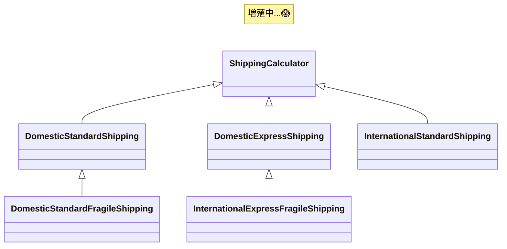

# 第03章：継承でハマる典型：派生クラス増殖🌱➡️🌳➡️🌲

## この章のゴール🎯✨

この章が終わるころには…

* 「あ、これ派生クラス増殖パターンだ…！」って早めに気づける👀💡
* “例外的な子”が出た瞬間に、継承ツリーが崩れやすい理由を説明できる🧠
* 「何が“変化の軸”なのか？」を見つけて、次章以降の“合成”に繋げられる🧩🔗

ちなみに今の最新環境だと、.NET 10（2025/11/11）＋ C# 14 が前提で学べるよ〜🚀（サポートもLTSで2028年まで）([Microsoft][1])
Visual Studioも 17.14 系が現役で更新されてるのが分かる（2026/1/13に更新あり）🛠️([Microsoft Learn][2])

---

## 1) 「変更の軸」が増えると、継承は爆発する💥


継承は「親を1つだけ持てる」仕組みだよね（C#は単一継承）👶➡️👩
だから、**変化の軸が1本**なら継承でも耐えやすいけど、**軸が2本3本…って増えると、組み合わせ爆発**しがち💣
（C#の継承の基本：派生クラスは1つの直接の基底クラスだけ、みたいな話）([Microsoft Learn][3])

---

## 1. “派生クラス増殖”ってどんな状態？🌳😵


## よくある増殖の流れ（あるある）😂

最初は平和🕊️

* `StandardShipping`
* `ExpressShipping`

次に「国内/海外」も分かれます！

* `DomesticStandardShipping`
* `DomesticExpressShipping`
* `InternationalStandardShipping`
* `InternationalExpressShipping`

さらに「壊れ物/通常」も追加！

* `DomesticExpressFragileShipping`
* `InternationalStandardFragileShipping`
* …（え、これ永遠に増えるやつ😇）

## ✅ 地獄のサイン（早期発見チェック）👀🚨


1つでも当てはまったら黄色信号💛

* クラス名がどんどん長くなる（条件が名前に混ざってる）📛💦
* “ちょっと違うだけの子”が増えてる（コピペ率上昇）📄➡️📄
* 基底クラスに `if (this is Xxx)` みたいなのが出現😱
* `override` が「親をちょっと無効化するだけ」になってる（例：`throw new NotSupportedException()`）🧨
* 新しい仕様が来るたびに「新クラス作るしかない」になってる🏭

---

## 2. ハンズオン🧪：まずは増殖を“体験”してみる（15〜20分）🎮


## お題：送料計算📦💰

送料はこの3軸で決まるよ、って仕様にするね🧩

* 地域：国内 / 海外🌏
* 速度：通常 / 速達⚡
* 荷物：通常 / 壊れ物💎

最初は継承でやってみよう🙂

## Step1：基底クラス＋派生クラス（まず2軸だけ）

```csharp
public abstract class ShippingCalculator
{
    public abstract int Calculate(int basePrice);
}

public sealed class DomesticStandardShipping : ShippingCalculator
{
    public override int Calculate(int basePrice) => basePrice + 500;
}

public sealed class DomesticExpressShipping : ShippingCalculator
{
    public override int Calculate(int basePrice) => basePrice + 900;
}

public sealed class InternationalStandardShipping : ShippingCalculator
{
    public override int Calculate(int basePrice) => basePrice + 1500;
}

public sealed class InternationalExpressShipping : ShippingCalculator
{
    public override int Calculate(int basePrice) => basePrice + 2600;
}
```

ここまでは「まあ…いけそう」って感じ🙂✨

---

## Step2：「壊れ物」追加で爆発開始💥（増殖を実感）

壊れ物は **+400円** の追加料金ね！って言われた瞬間…

* `DomesticStandardFragileShipping`
* `DomesticExpressFragileShipping`
* `InternationalStandardFragileShipping`
* `InternationalExpressFragileShipping`

…4クラス増える😇


さらに「冷蔵」「大型」「クーポン」「離島」…って増えたら、**掛け算で増える**よね🧮💣

---

## 3. “例外的な子”が出た瞬間に崩れる👻（10〜15分）


増殖よりヤバいのがこれ😱

## 例外仕様

「海外・速達・壊れ物」だけは、追加料金が **+1200円**（特別梱包が必要）にして！

この瞬間、選択肢がキツくなる👇

## 悪い方向A：その派生クラスだけ特殊計算にする

* まあ動く。でも **“例外が増えるほど派生が増える”** は止まらない🏭💦

## 悪い方向B：基底クラスに条件分岐が生える

```csharp
public abstract class ShippingCalculator
{
    public virtual int Calculate(int basePrice)
    {
        // そのうちこうなる…
        if (this is InternationalExpressFragileShipping)
            return basePrice + 1500 + 1200;

        return basePrice + 999; // 何かのデフォルト…
    }
}
```

これ、読み手が泣くやつ😭
「継承で分けた意味どこいった…？」になる。

---

## 4. なぜ増殖するの？→「継承は“1本の軸”は得意、複数軸は苦手」🎡🧩


継承って

* “AはBの一種” の関係（is-a）で
* 「差分は派生で表す」

のが得意🙂

でも今回の送料は、

* 地域（ルール）
* 速度（ルール）
* 荷物（ルール）

が **独立したルールの組み合わせ** だよね？
このとき継承でやると、だいたい **組み合わせ（直積）＝掛け算** で増える💥

---

## 5. じゃあどう考えればいい？「変化の軸」を見つけるコツ🧠🔍（5分）


次の質問を自分にしてみてね🙂💕

* その仕様は「別々に増える」？（独立してる？）🔀
* 組み合わせ可能？（A+B みたいに混ざる？）🧩
* 今後、新しい種類がそれぞれ増えそう？📈

YESが多いほど、継承より **合成（部品化）** が向いてるサイン✨
（Microsoftのガイドでも「継承より合成を好む」系の考え方は推されがちだよ）([Microsoft Learn][4])

---

## 6. ちょい見せ：合成だと“足し算”にできる🍀（次章へのワクワク）🧩✨


継承だと掛け算で増えたけど、合成はこうできる👇

* 地域ルール：2個
* 速度ルール：2個
* 荷物ルール：2個

必要なクラスは「2+2+2（足し算）」寄りになる💡
（組み合わせは“オブジェクトの組み立て”でやる）

次章以降で、ここをちゃんと作っていくよ〜🔧🎁

---

## 7. AI活用コーナー🤖✨（Copilot / Codex向け）

## ① 破綻ポイントをレビューさせる🕵️‍♀️

**プロンプト例**💬

* 「このクラス階層が将来破綻する理由を3つ、具体例つきで教えて」
* 「この設計の“変化の軸”を列挙して」

## ② “組み合わせ爆発”の兆候を検出🔍

* 「クラス名が条件の組み合わせになってる箇所を指摘して」
* 「重複ロジックがある派生クラスを見つけて」

## ③ 合成（Strategy/Decorator）への第一歩提案🧩

* 「この送料計算を、地域・速度・荷物の3つのStrategyに分ける案を出して」

> コツ：AIのコードをそのまま採用じゃなくて、**“分け方の案出し”**に使うとめちゃ相性いいよ🤝💕

---

## 8. ミニ課題📮（5分）

1. 自分の過去コード（小さめでOK）を1つ思い出して🧠
2. 「条件が増えるたびに class / if / switch が増える場所」を探して👀
3. そこにある“変化の軸”を3つ書き出してみて📝✨

---

## まとめ🌈

* 派生クラス増殖は **“変化の軸が複数ある”** のに継承で組み合わせようとすると起きる💥
* “例外的な子”が出た瞬間に、基底クラスが汚れたり破綻しやすい👻
* 次章からは、軸を部品にして **合成で組み立てる** 側に進むよ🧩🚀

[1]: https://dotnet.microsoft.com/ja-jp/platform/support/policy/dotnet-core?utm_source=chatgpt.com ".NET および .NET Core の公式サポート ポリシー"
[2]: https://learn.microsoft.com/ja-jp/visualstudio/releases/2022/release-history?utm_source=chatgpt.com "Visual Studio 2022 リリース履歴"
[3]: https://learn.microsoft.com/en-us/dotnet/csharp/fundamentals/object-oriented/inheritance?utm_source=chatgpt.com "Objected oriented programming - inheritance - C#"
[4]: https://learn.microsoft.com/en-us/dotnet/fsharp/style-guide/conventions?utm_source=chatgpt.com "F# coding conventions - .NET"
