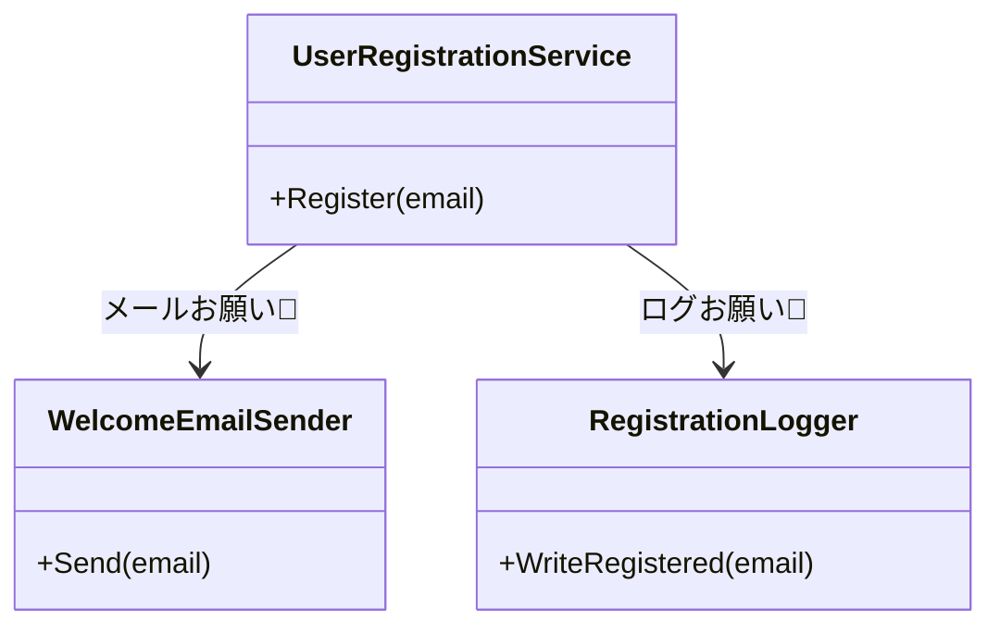

# 第04章：合成の第一歩：has-a（部品を持つ）🧳✨

ねらい🎯：**「継承しないで再利用する」**感覚を、まず手触りでつかむよ〜🧩😊

---

## 0) 2026年の“いま”の前提だけ、先に超ミニ共有🗓️✨

この章のコード自体は新機能に依存しないけど、**いまの最新の土台**はこうなってるよ👇

* **.NET 10 は LTS**（2025-11-11 リリース、2028-11-14 までサポート）([Microsoft][1])
* **C# 14** は **.NET 10 SDK / Visual Studio 2026** で試せるよ ([Microsoft Learn][2])

---

## 1) 「is-a」と「has-a」って何？🧠🧩

## 継承（is-a）🐣➡️🦅

* 例：`Eagle is-a Bird`（ワシは鳥である）
* 親の機能を“引き継ぐ”ことで再利用しやすい反面、**親の変更の影響**を子がまともに受けやすい💥

## 1) 合成（has-a）の基本形🧩

🧳✨

* 例：`Car has-a Engine`（車はエンジンを持つ）
* **部品（パーツ）を持って**、必要な仕事を**お願い（委譲）**する💁‍♀️📦
* 「部品差し替え」「部品だけ変更」がしやすくなる未来がくる🌈（この先の章でどんどん効いてくる！）

---

## 2) “責務（役割）”で分けると一気にスッキリ🧼✨


合成がうまくいくコツは、分割の基準をこれにすること👇

## 責務が混ざってるサイン🚨

* 1クラスが **「計算」も「保存」も「通知」も** やってる😵‍💫
* メソッド名が「なんでも屋」っぽい：`ProcessAll()`, `DoEverything()` みたいな雰囲気😇
* 変更理由が複数ある：

  * 「通知文面変えたい」
  * 「保存先変えたい」
  * 「計算ルール変えたい」
    → これが同じクラスに詰まってると地獄の入口👻

**合成の第一歩**は、ここから✨

> 「変更理由ごとに部品に分ける」🧩🧳

---

## 3) ハンズオン🧪：1クラス全部入り → “2部品”に分割✂️✨

題材は、ありがちな「ユーザー登録」📮🙂

* 登録処理をして
* ウェルカムメールを送って
* ログも書いてる
  …みたいな“全部盛り”を分けるよ🍱💦

---

## Step 1：まずは“全部盛り”を用意😇

（Console App でOK！）

```csharp
using System;

public class UserRegistrationService
{
    public void Register(string email)
    {
        // 1) 入力チェック
        if (string.IsNullOrWhiteSpace(email))
            throw new ArgumentException("email is required");

        if (!email.Contains("@"))
            throw new ArgumentException("email format is invalid");

        // 2) 登録（仮：DBの代わりに出力）
        Console.WriteLine($"[DB] Insert user: {email}");

        // 3) メール送信（仮）
        Console.WriteLine($"[MAIL] Welcome mail sent to: {email}");

        // 4) ログ
        Console.WriteLine($"[LOG] Registered at {DateTimeOffset.Now}");
    }
}
```

✅ 動くけど…
このクラス、**やってること多すぎ**だよね😂🌀

* バリデーション
* 登録（永続化）
* メール
* ログ

---

## Step 2：まず“メール送信”を部品にする📦📮

「メール文面変える」「将来SMSにしたい」みたいな変更が来がちなので、ここを切る✂️

```csharp
using System;

public class WelcomeEmailSender
{
    public void Send(string email)
    {
        Console.WriteLine($"[MAIL] Welcome mail sent to: {email}");
    }
}
```

---

## Step 3：サービス側は部品を“持つ”（has-a）🧳✨

ポイントはここ👇

* サービスはメールを「自分でやらない」
* **部品にお願いする（委譲）**💁‍♀️

```csharp
using System;

public class UserRegistrationService
{
    private readonly WelcomeEmailSender _emailSender = new();

    public void Register(string email)
    {
        if (string.IsNullOrWhiteSpace(email))
            throw new ArgumentException("email is required");

        if (!email.Contains("@"))
            throw new ArgumentException("email format is invalid");

        Console.WriteLine($"[DB] Insert user: {email}");

        // ✅ 委譲：メール送信は部品に任せる
        _emailSender.Send(email);

        Console.WriteLine($"[LOG] Registered at {DateTimeOffset.Now}");
    }
}
```

🎉 これが **has-a の超基本**！
`UserRegistrationService has-a WelcomeEmailSender` になったよ🧳✨

---

## Step 4：もう1つだけ分割して“2部品”完成✂️🧩

次に、ログも別部品にしちゃおう📝✨（ログ仕様って地味に変わるよね〜😂）

```csharp
using System;

public class RegistrationLogger
{
    public void WriteRegistered(string email)
    {
        Console.WriteLine($"[LOG] Registered {email} at {DateTimeOffset.Now}");
    }
}
```

サービスはこう👇

```csharp
using System;

public class UserRegistrationService
{
    private readonly WelcomeEmailSender _emailSender = new();
    private readonly RegistrationLogger _logger = new();

    public void Register(string email)
    {
        if (string.IsNullOrWhiteSpace(email))
            throw new ArgumentException("email is required");

        if (!email.Contains("@"))
            throw new ArgumentException("email format is invalid");

        Console.WriteLine($"[DB] Insert user: {email}");

        _emailSender.Send(email);
        _logger.WriteRegistered(email);
    }
}
```



✅ “全部盛り”が、だいぶ読みやすくなったね😊🫶
しかも、変更が来た時に「触る場所」が減る✨

---

## 4) 合成のコツ：分け方の判断メモ📝✨

## ✅ まず分ける候補になりやすいもの

* **外部っぽいもの**：メール、HTTP、DB、ファイル、時計（時刻）、乱数など🌪️
* **ルールが増えそうなもの**：料金計算、割引、判定ロジック📈
* **横断関心**：ログ、リトライ、計測（後の章でDecoratorが効く🎂）

## ✅ 分けた後に良くなる感覚

* サービスが「何をしているか」だけが残る（読みやすい）📖✨
* 部品単体で修正できる（影響範囲が小さい）🛡️
* 後で差し替えやすい（次章の interface につながる🔌🙂）

---

## 5) よくあるミスあるある😇⚠️

* **分けたのに、サービスが部品の中身まで知りすぎ**（内部構造に踏み込み）🙅‍♀️
* **“なんでもUtil”を作って逆にカオス**（責務が広すぎ）🌀
* **分割が目的化**して、読む人が迷う（小さすぎ問題）🐜

目安はこれ👇

> 「その部品、変更理由が1個に寄ってる？」✅

---

## 6) AI活用🤖：この章で効く使い方（写経防止スタイル✨）

## ① 責務混在チェック🔍

* プロンプト例💬

  * 「このクラスの責務が混ざってる箇所を箇条書きで指摘して。変更理由ごとに分類して」

## ② 分割案の提案🧩

* 「2部品に分けるなら、どの切り方が自然？“変更が来そう”を根拠に案を3つ」

## ③ 命名の相談📝

* 「`RegistrationLogger` より意図が伝わる名前候補を10個。短くて意味が明確なもの優先」

（Copilotなら、分割後の呼び出しコードもサクッと出るけど、**採用するかは“責務”で判断**ね😉✅）

---

## 7) ミニ課題📮✨（10〜15分）

次のどれか1つをやってみて〜😊🎯

1. `UserRegistrationService` から **DB出力**部分も部品に分ける（例：`UserRepository`）🗄️
2. ログを「登録成功」「登録失敗」で分けて出せるようにする📝
3. メール送信の文面を部品側に閉じ込めて、サービスから文字列を消す✉️✨

---

## 8) この章のまとめ🎁✨

* 合成の第一歩は **has-a（部品を持つ）**🧳
* コツは **責務（変更理由）で分ける**🧼
* サービスは薄くして、仕事は部品に**委譲**する💁‍♀️📦
* 次章（interface）で「差し替え可能」へ進化するよ🔌🙂

---

次は「第5章：インターフェース入門（差し替えの土台）」に行くと、いま作った部品がさらに気持ちよくなるよ〜🧩🌈

[1]: https://dotnet.microsoft.com/en-us/platform/support/policy/dotnet-core?utm_source=chatgpt.com "NET and .NET Core official support policy"
[2]: https://learn.microsoft.com/ja-jp/dotnet/csharp/whats-new/csharp-14?utm_source=chatgpt.com "C# 14 の新機能"
