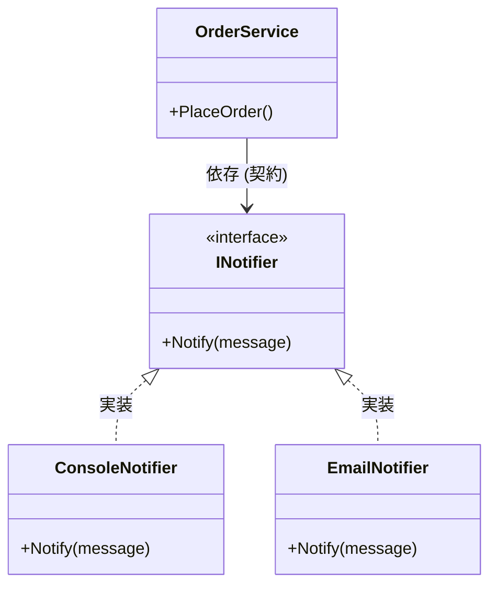

# 第05章：インターフェース入門：差し替えの土台🔌🙂

この章は「合成＝部品を差し替えられる🧩🔁」を実現するための“土台づくり”だよ〜！✨
ポイントは、**実装（具体）じゃなくて、契約（interface）に依存する**って感覚😊📜

---

## 0. 今日のゴール🎯✨

この章が終わると、こんなことができるようになるよ🫶

* `interface` を「契約📜」として説明できる🙂
* 1つの機能を **実装2種類** 用意して、切り替えできる🔁
* “利用側”が実装の違いを知らなくていい状態にできる（＝合成しやすい）🧩

---

## 1. interfaceってなに？（ざっくりでOK）🧠💡


## interface＝「これができるって約束してね📜」

* クラスの中身（どうやるか）じゃなくて、**外から見える振る舞い（何ができるか）**を決めるよ🙂
* だから、**実装が変わっても利用側が困らない**のが強い💪✨

たとえば…

* `INotifier`：通知できる📣
* `IPaymentGateway`：支払いできる💳
* `IClock`：現在時刻が取れる⌚

みたいに「できること」に名前をつけるイメージ😊

---

## 2. 合成とinterfaceの関係🧩🔌


合成優先で嬉しいことの1つがこれ👇
**“部品を差し替えられる”＝変更に強い🛡️**

でも、差し替えするには「差し替え口」が必要なのね🔌
その差し替え口が **interface** だよ〜！✨

* 利用側：`interface` に依存（＝契約だけ知ってる）🙂
* 実装側：契約を満たすクラスを作る（＝中身は自由）🧑‍🔧

---

## 3. ハンズオン🧪：通知を差し替えできるようにする📣🔁

題材：**注文が確定したら通知する**📦✨
通知方法を後から増やしたい（Console通知→メール通知…みたいな）って、めちゃ現場あるある😇

## 3-1. まずは “差し替え不可” な例（つらさ体験😱）


```csharp
public class OrderService
{
    public void PlaceOrder()
    {
        // 注文処理...
        var notifier = new ConsoleNotifier(); // ← ここで具体クラスに直依存😇
        notifier.Notify("注文が確定しました！");
    }
}

public class ConsoleNotifier
{
    public void Notify(string message)
        => Console.WriteLine($"[Console] {message}");
}
```

これ、通知をメールにしたくなったら…？
`OrderService` を編集することになるよね😵‍💫
「変更が利用側まで波及する」のが痛いポイント💥

---

## 3-2. interfaceで“差し替え口”を作る🔌✨


まず契約を作るよ📜

```csharp
public interface INotifier
{
    void Notify(string message);
}
```

次に実装を2種類作るよ〜🔁
（Console通知と、テスト用の擬似通知でもOK！ここでは Email 風にしてみる📧）

```csharp
public class ConsoleNotifier : INotifier
{
    public void Notify(string message)
        => Console.WriteLine($"[Console] {message}");
}

public class EmailNotifier : INotifier
{
    public void Notify(string message)
        => Console.WriteLine($"[Email] {message}"); // 今は雰囲気だけ📧
}
```

---

## 3-3. 利用側は「契約だけ」知る🙂📜（ここが本題！）


`OrderService` は `INotifier` にだけ依存するよ🧩

```csharp
public class OrderService
{
    private readonly INotifier _notifier;

    public OrderService(INotifier notifier) // ← 差し替え口から受け取る🎁
    {
        _notifier = notifier;
    }

    public void PlaceOrder()
    {
        // 注文処理...
        _notifier.Notify("注文が確定しました！");
    }
}
```



---

## 3-4. “組み立て場所”で差し替える🔧🔁（newする場所を寄せる）

```csharp
// Program.cs（起動地点）
INotifier notifier = new ConsoleNotifier();
// INotifier notifier = new EmailNotifier();  // ← 差し替えはここだけ！✨

var orderService = new OrderService(notifier);
orderService.PlaceOrder();
```

✅ 結果：通知方法を変えても、`OrderService` は一切変更しないでOK🎉
これが「合成しやすい形」だよ🧩✨

---

## 4. 命名のコツ（ここ超大事📝✨）


## interface名は「できること」にする🙂

* ✅ `INotifier`, `IClock`, `IFileStorage`
* ❌ `INotificationManager`, `IService`, `IUtil`（ふわっとしすぎ🥺）

## メソッド名は「動詞＋目的語」っぽく🧠

* ✅ `Notify(message)`
* ✅ `Save(text)` / `Load(id)`
* ❌ `Do()` / `Exec()`（何するの〜！？😇）

---

## 5. ありがちなミス集（先に潰そ💣😂）

## ❌ 「とりあえずinterface作っとこ」病

* まだ差し替えないのに、無限に `IXXX` を増やすと逆に読みにくい😵‍💫
  👉 **“変わりやすいところ”だけ** に作るのが気持ちいい✨

## ❌ interfaceにデータを詰め込みたくなる

interfaceは「振る舞いの契約」向き🙂
データなら `record` や普通のクラスでOKだよ📦

## ❌ 利用側が実装クラスを知っちゃう

* `if (notifier is EmailNotifier)` とか書き始めたら危険信号🚨
  👉 “差し替え口”の意味が消えちゃうよ〜😭

---

## 6. ちょい最新メモ（でも今は深追い不要🧁）

最近のC#では、interfaceも進化しててね…！

* interfaceに**デフォルト実装**を書ける（既存の実装を壊さず拡張しやすい）🧩✨ ([Microsoft Learn][1])
* interfaceに **static abstract メンバー**を定義できる（ジェネリック数値計算などで活躍）🧮✨ ([Microsoft Learn][2])

ただし！この章ではまず **「差し替え口＝interface」** が体に入ればOK😊🫶

（あと、いまの .NET は **.NET 10（LTS）** が現行の軸になってるよ〜📌 ([Microsoft][3])）

---

## 7. ミニ課題（10分）🎒✨


できそうなやつからでOKだよ〜🧸💕

1. `SmsNotifier` を追加して、Programで差し替え🔁📱
2. “何もしない通知” `NullNotifier` を作る（通知不要な場面で便利）🫥
3. `CompositeNotifier`（複数通知をまとめて実行）を作る📣📣📣

---

## 8. AI活用🤖💬（そのままコピペでOK）

* 「`INotifier` と実装2種類、命名をもっと分かりやすく改善案ちょうだい📝」
* 「この `OrderService` の依存を interface に寄せる最小手順を教えて🪜」
* 「差し替え前提で、interfaceを小さく保つ設計レビューして🔍」

---

## 9. まとめ✅✨（ここだけ覚えれば勝ち🥇）

* interfaceは **契約📜**、合成の **差し替え口🔌**
* 利用側は **具体クラスじゃなく interface に依存**🙂
* 差し替えは **組み立て場所（起動地点）** でやる🔧🔁

次の章では、この差し替えをもっと気持ちよくする **「委譲（Delegation）」** に進むよ〜💁‍♀️📦✨

[1]: https://learn.microsoft.com/en-us/dotnet/csharp/fundamentals/types/interfaces?utm_source=chatgpt.com "Interfaces - define behavior for multiple types - C#"
[2]: https://learn.microsoft.com/en-us/dotnet/csharp/language-reference/proposals/csharp-11.0/static-abstracts-in-interfaces?utm_source=chatgpt.com "Static abstract members in interfaces - C#"
[3]: https://dotnet.microsoft.com/en-us/platform/support/policy/dotnet-core?utm_source=chatgpt.com "NET and .NET Core official support policy"
